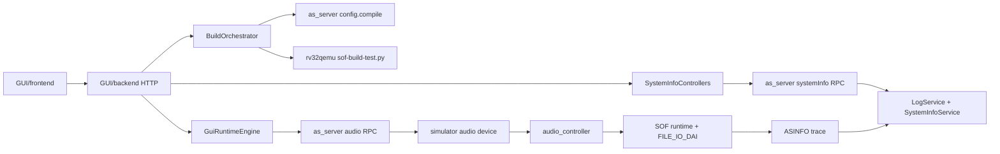

# Audio Studio Architecture

Audio Studio 当前是一个四层系统：

```text
Frontend HTML
  -> GUI Backend HTTP/stream API
    -> as_server JSON-RPC framework
      -> simulator/audio_controller/SOF
```

## Component Map



## Source Ownership

| Area | Owner | Notes |
|---|---|---|
| UI layout and Inspector | `GUI/frontend` | standalone HTML; no frontend build step |
| HTTP API and workspace JSON | `GUI/backend` | browser-friendly adapter, not a second as_server |
| Topology compile | `server/framework/config` | product JSON -> tplg via `as_server config.compile` |
| Audio stream RPC | `server/framework/audio` | playback/capture sessions |
| Log and telemetry | `server/framework/log`, `server/framework/system_info` | ASINFO intercept and snapshot |
| Simulator devices | `server/platform/simulator` | audio/log/datalink driver implementations |
| C runtime endpoint | `audio_controller` | driver ops only; no direct malloc/free in audio slots |
| Firmware telemetry | `sof/src/audio_studio` | 100ms ll task ASINFO producer |

## Product JSON

`pipelines[]` describes SOF graph nodes and edges. Each node owns its `module_type` and `params`; `module_instances` is intentionally gone.

`frontend_connections[]` describes GUI-only File Input/File Output nodes and their edges to HOST external ports. It is saved in platform JSON but ignored by `as_config`.

`audio_studio_gui` may appear only in temporary workspace JSON. It is stripped on project save.

## Runtime Flow

Build:

1. frontend sends full layout snapshot.
2. backend regenerates workspace JSON.
3. backend calls `as_server --rpc-once config.compile`.
4. backend launches rv32qemu keep-alive validation.
5. all pipelines become `PIPE_LOADED` only after pipeinstall succeeds.

Playback:

1. frontend selects WAV in File Input.
2. `/api/runtime/run` creates playback session.
3. binary PCM frames go to `/api/runtime/audio/playback/stream`.
4. metadata goes to `/api/runtime/audio/playback/frame`.
5. backend worker writes to as_server/audio_controller/SOF.
6. EOS drains queue and closes session.

Record:

1. frontend selects output WAV path in File Output.
2. `/api/runtime/run` creates capture session.
3. frontend polls `/api/runtime/audio/capture/frame`.
4. backend reads directly from as_server capture stream.
5. frontend writes final WAV.

System Info:

1. SOF outputs `ASINFO|...` every 100ms.
2. as_server log service decodes trace and intercepts ASINFO.
3. SystemInfoService updates modules, buffers, cores, heap and health.
4. GUI backend live controllers expose frontend panel data.
5. missing heartbeat for 1s clears runtime state.

## State Model

```text
PIPE_UNLOADED -> PIPE_LOADED -> PIPE_RUNNING
```

Build is all-pipeline. RUN/STOP is per selected working group.

## Debug Model

Root `.vscode` owns the full-stack debug setup:

- GUI1 frontend Chrome
- GUI backend
- as_server
- rv32qemu simulator keep-alive
- QEMU gdbstub with RISC-V gdb

The debug path uses the same backend argv fields as normal runtime, including validation datalink, gdb port and gdb wait.
