# Audio Studio Framework 设计文档

版本：0.8
日期：2026-06-16
文档状态：正式设计基线，按当前 `handsomeleeshu/Audio-Studio` 仓库继续演进  
适用范围：Audio Studio GUI、GUI Web Backend、CLI、as_server、Framework、Driver Abstraction Layer、Platform Adapter、Audio Controller Peer、Build System、as_config、as_control、as_play/as_record、as_log/as_dump、HTML GUI 与 Audio Studio Server JSON-RPC 部署设计。

> 本文档不是讨论结论摘要，而是后续工程实现、代码组织、模块拆分、接口定义和调用关系设计的基线文档。  
> Audio Studio 是通用 PC 端音频配置、控制、调试、观测框架；A2 是第一个平台 profile 和验证平台。  
> GUI 已基本开发完成，后续不重新设计 GUI 内部 UI、UML 或核心源码结构，只在现有 GUI 工程下补充与 `as_server` 通信所需的轻量 RPC 适配层。  
> **重要修正：`frontend` / `backend` 是 GUI 子工程内部概念，不是 Audio Studio 正式 server 架构。正式 `as_server` 必须是独立顶层 `server/` 子工程，不能放到 GUI 的 `backend/` 目录下。**
> **重要修正：Audio Studio 不定义独立发布的正式 Client SDK 层。GUI、GUI/backend、CLI 都通过 JSON-RPC 与 `as_server` 通信；工程内部必须提供 typed RPC facade 和 remote handle，让业务代码像调用本地 API 一样调用远端能力，但这些 facade 属于 `rpc/` 的轻量适配层，不形成独立 SDK 架构层。**

---

## 0. 文档约定

### 0.1 仓库与命名约定

当前开发仓库：

```text
https://github.com/handsomeleeshu/Audio-Studio
```

当前仓库已有 GUI demo 和 mock backend runtime。为了和后续正式框架分层保持一致，当前 GUI 相关前后端代码已统一归入 `GUI/` 逻辑域：

```text
Audio-Studio/
  GUI/
    frontend/                 # 当前 HTML GUI 前端代码的逻辑归属
    backend/                  # 当前 GUI Web Backend / mock runtime 的逻辑归属
  cli/                        # 后续新增 CLI 前端，包含 as_config/as_control/as_play/as_record/as_log/as_dump
  rpc/                        # 顶层 JSON-RPC codec/client/server/transport helper
  drivers/                    # 顶层 driver interface、registry 与 host/platform 实现
  server/                     # 后续新增正式 as_server，组合 framework/platform，并链接 rpc/drivers
  audio_controller/            # 后续新增 Audio Studio 对端 controller 参考实现，主要用 C 实现
  scripts/                    # 构建、Kconfig、CMake、toolchain、代码生成、打包脚本
  configs/                    # built-in catalog、平台 JSON、platform/profile defconfig
  docs/                       # 设计文档、开发说明、调试说明
  tests/                      # 当前 GUI 测试与后续 RPC/server/driver 测试
  third_party/                # 可控第三方依赖
  CMakeLists.txt
  CMakePresets.json
  README.md
```

历史根目录 `frontend/` 和 `backend/` 已迁移为 `GUI/frontend/` 和 `GUI/backend/`。后续提交不得重新在根目录创建正式 frontend/backend 子工程。

必须避免以下错误演进：

```text
错误：
Audio-Studio/GUI/backend/server/framework/...
Audio-Studio/backend/framework/...
Audio-Studio/backend/drivers/...
Audio-Studio/backend/platform/...
```

正确演进是：

```text
正确：
Audio-Studio/GUI/backend/              # GUI Web Backend，仅做页面托管、GUI REST 兼容、RPC 编排
Audio-Studio/rpc/                      # 共享 JSON-RPC core、client/server transport
Audio-Studio/drivers/                  # 共享 driver interface、registry、默认实现
Audio-Studio/server/                   # 正式 as_server，承载 framework/platform，并链接 rpc/drivers
Audio-Studio/cli/                      # 命令行前端
Audio-Studio/audio_controller/          # Audio Controller peer 参考实现
```

通用层禁止使用 `a2_` 前缀作为类型、文件、接口的默认命名。A2 相关命名只允许出现在：

```text
server/platform/a2/                    # 正式 as_server 的 A2 platform 目录
configs/platform/a2/A2.json          # 当前 A2 示例 project
configs/platform/a2/a2_defconfig                 # 后续新增 defconfig 时使用
Misc/sof_test/platform/a2/             # 后续 A2 sof_test/controller driver ops 适配目录
文档中 A2 平台说明章节
```

### 0.2 当前 GUI 代码与正式 server 的关系

当前 GUI 已有如下实际能力：

```text
GUI/frontend/index.html
  standalone GUI 主体。

GUI/frontend/assets/js/configParser.js
  产品 JSON 解析逻辑。

GUI/backend/include/audio_studio.hpp
  当前 GUI mock backend 的 controller interface 与 HttpServer 声明。

GUI/backend/src/http_server.cpp
  当前 GUI 静态资源 server + GUI REST API route。

GUI/backend/src/mock_runtime.cpp
  当前 fake runtime/controller 实现。

GUI/backend/src/main.cpp
  当前 GUI mock backend 入口。
```

这部分代码不需要推倒重写。后续演进策略是：

```text
1. GUI/frontend/ 保持现有 standalone GUI 结构。
2. 原 Audio-Studio/backend/ 已迁移为 GUI/backend/。
3. GUI/backend/ 不承载正式 framework/drivers/platform，不作为 as_server 的实现目录。
4. GUI/backend/ 继续保留当前 GUI REST API、页面托管、mock runtime 与 GUI session。
5. 正式 as_server 位于顶层 server/，负责 framework service、platform、TransportManager，并通过顶层 rpc/drivers 组合通信与硬件抽象。
6. GUI/backend/ 只通过 JSON-RPC 调用 audio_studio_server，不链接、不编译、不拥有 server/framework。
7. GUI/frontend/ 只增加轻量 JSON-RPC action executor、target registry、probe stream client 等适配代码。
8. CLI 新增到顶层 cli/，通过 JSON-RPC 直接调用 audio_studio_server，不经过 GUI/backend/。
9. audio_controller/ 新增为对端参考实现，用于 simulator 或 A2 直连场景。
```

### 0.3 关键边界

```text
GUI/frontend:
  用户界面、工程显示、pipeline canvas、参数面板、probe/log 可视化。
  所有业务请求仍然先访问 GUI/backend。
  当前不直接决定 Audio Studio Server 部署位置。

GUI/backend:
  GUI 的 Web Backend / Orchestrator。
  负责托管 GUI 静态资源、兼容现有 /api/*、维护 GUI session、GUI 工程状态和 GUI 操作审计。
  根据 Audio Studio Server placement 决定：后端直连 RPC 或返回 client_rpc_action。
  不承载 framework/drivers/platform，不直接操作真实 A2 transport，不负责 as_server session 生命周期。

cli:
  as_config/as_control/as_play/as_record/as_log/as_dump。
  轻量前端，只负责参数解析、JSON-RPC 调用、本地文件 IO、结果输出。

server/as_server:
  正式 Audio Studio Server。
  唯一运行 framework service、driver implementation、platform backend、TransportManager 的进程。
  对外提供 JSON-RPC，维护 server-side RPC session、device session、stream session 和权限策略。
  不演进成复杂 REST Web Server。

framework:
  放通用业务逻辑，不直接调用 OS API，不直接依赖 platform，不直接绕过 driver interface。

drivers:
  同时提供 interface 与默认 implementation。platform 可通过 Kconfig 直接 select 默认实现。

platform:
  选择 profile、注册平台特定 backend/driver、定义平台默认配置。

audio_controller:
  Audio Studio 对端 controller 参考实现，承接 controller 协议。A2 直连和 simulator 都可复用 controller 类协议，差异在 data-link driver。
```

---

## 1. GUI 子工程源码路径与保留原则

### 1.1 GUI 目标路径

GUI 已基本开发完成，本文不重新设计 GUI 的 UI 组件路径、UML 或内部页面结构。后续只把当前 GUI 代码归入明确的逻辑子工程：

```text
Audio-Studio/GUI/
  frontend/
    index.html
    assets/
      css/
      js/
        configParser.js
        utils.js
        ... existing GUI JS files ...
  backend/
    include/
      audio_studio.hpp
    src/
      main.cpp
      http_server.cpp
      mock_runtime.cpp
      ... existing GUI backend files ...
```

历史根目录 `frontend/` 和 `backend/` 只作为兼容 URL 或迁移说明出现；源码目录以 `GUI/frontend/`、`GUI/backend/` 为准。

### 1.2 GUI/backend 的定位

`GUI/backend` 是 HTML GUI 的 Web Backend / Orchestrator，不是 Audio Studio Server。它可以保留当前 mock runtime，也可以逐步扩展以下能力：

```text
1. 托管 GUI 静态资源。
2. 保持现有 /api/* REST API 兼容。
3. 维护 GUI 用户 session、工程状态、GUI 操作审计日志。
4. 维护 Audio Studio Server target 列表。
5. 新增 AudioStudioRpcOrchestrator，把 GUI REST 操作翻译为 JSON-RPC 请求。
6. 当 Audio Studio Server 在后端可达网络时，由 GUI/backend 直接 JSON-RPC 调用。
7. 当 Audio Studio Server 只在浏览器本机/前端局域网可达时，由 GUI/backend 返回声明式 client_rpc_action。
8. 接收 GUI/frontend 回传的 client_rpc_result/client_rpc_error 和 client_telemetry，但以 as_server 状态为最终事实来源。
```

它不应该包含：

```text
framework/audio
framework/control
framework/log
framework/dump
drivers/audio
drivers/control
drivers/log
drivers/dump
platform/a2
TransportManager
Audio Controller protocol implementation
A2 physical data-link driver
as_server session registry
```

这些正式运行时能力都放在顶层 `server/`。

### 1.3 GUI/frontend 最小新增适配代码

基于附件 `audio_studio_html_gui_rpc_deployment_design.md` 的结论，GUI/frontend 只需要在现有 backend API wrapper 周围增加轻量适配层，不要求页面组件大改。

建议逻辑文件如下，具体文件名可按当前 GUI JS 风格落地：

```text
GUI/frontend/assets/js/rpc/
  backendApi.js                  # 统一调用 GUI/backend 的 API wrapper
  clientRpcActionExecutor.js      # 执行后端返回的声明式 client_rpc_action
  jsonRpcHttpExecutor.js          # POST /rpc 执行器
  jsonRpcWsExecutor.js            # WS /ws 执行器，可选
  rpcTargetRegistry.js            # 本地 target_id -> endpoint 映射
  clientRpcContinuation.js        # 回传 client_rpc_result
  clientTelemetryReporter.js      # 回传统计摘要

GUI/frontend/assets/js/probe/
  probeStreamClient.js            # 连接 probe WebSocket binary stream
  probeStatsCalculator.js         # RMS/peak/clipping/dropped/latency 统计
  probeWorker.js                  # Web Worker 处理高频数据，可选
  probeRenderer.js                # waveform/meter/spectrum 展示适配
```

页面组件仍然调用现有业务 API，例如：

```text
audio.start
control.set
probe.start
dump.start
audio.createPlaybackSession
```

是否最终由 GUI/backend 代执行，还是由 GUI/frontend 根据 `client_rpc_action` 调用前端局域网 Audio Studio Server，由统一 API wrapper 处理，页面组件不关心。

---

## 2. HTML GUI 与 Audio Studio Server JSON-RPC 部署设计

### 2.1 总体原则

产品化集成后，mock runtime 需要替换或扩展为真实运行时能力。无论是 GUI、GUI/backend，还是 `as_log / as_dump / as_play / as_control` 等工具，都需要通过 JSON-RPC 与真正的 Audio Studio Server 交互。

Audio Studio Server 的部署位置有两类：

```text
1. 后端局域网内：
   GUI/backend 可以直接访问 Audio Studio Server。
   HTML GUI 不直接访问该 Server。

2. 前端局域网内：
   Audio Studio Server 运行在用户 PC、本地调试机、实验室局域网机器或连接 A2 板卡的主机上。
   GUI/backend 可能无法直接访问该 Server，但用户浏览器所在机器可以访问。
```

最终原则：

```text
1. HTML GUI 所有业务请求仍然先到 GUI/backend。
2. GUI/backend 是 GUI 编排中心，不是设备/session 权威。
3. Audio Studio Server 位于后端局域网时，由 GUI/backend 直接 JSON-RPC 调用。
4. Audio Studio Server 位于前端局域网时，由 GUI/backend 返回 client_rpc_action。
5. HTML GUI 按 client_rpc_action 调用本地/局域网 Audio Studio Server。
6. 前端执行控制类 RPC 后，把 RPC result 回传 GUI/backend。
7. DSP probe / dump 等大数据流不回传 GUI/backend。
8. 大数据流只在前端本地消费，用于 waveform、meter、spectrum 等实时显示。
9. 前端周期性回传统计摘要给 GUI/backend。
10. Audio Studio Server 保持 JSON-RPC Server 定位，只增加轻量 HTTP/HTTPS/WS transport 支持。
11. Audio Studio Server 不需要演进成复杂 REST Web Server。
12. 浏览器访问前端局域网 Server 时，需要处理 CORS、mixed content、Local Network Access、token、origin、action nonce 和过期时间等问题。
13. as_server 才是设备状态、server-side session、stream lifecycle 和权限校验的权威。
```

一句话总结：

> **GUI/backend 管 GUI 编排和审计；GUI/frontend 可执行声明式本地 RPC 和实时大数据消费；Audio Studio Server 管真实设备、权限、session、DSP 数据源和 JSON-RPC 方法执行。**

### 2.2 Audio Studio Server 的定位

Audio Studio Server 的核心职责仍然是远程函数调用，不应演进成 GUI 的 REST 业务后端。

Audio Studio Server 主要提供：

```text
JSON-RPC method registry
device / control / audio / record / log / dump / probe / config 等 RPC 方法
framework service
driver interface 与默认 driver implementation
TransportManager
与 audio_controller、7870、A2 设备或直连模式通信
```

Audio Studio Server 不提供大量 REST API，例如不建议提供：

```text
/api/device/list
/api/pipeline/start
/api/log/start
/api/dump/start
```

统一保留：

```text
POST /rpc
```

请求体是标准 JSON-RPC：

```json
{
  "jsonrpc": "2.0",
  "id": "req-001",
  "method": "audio.start",
  "params": {
    "session_id": 1001
  }
}
```

### 2.3 轻量 HTTP/HTTPS/WS transport adapter

当 HTML GUI 需要直接访问前端局域网内的 Audio Studio Server 时，调用方是浏览器，因此 Audio Studio Server 必须具备最小浏览器兼容能力。

这不是增加复杂 Web 服务，而是给 JSON-RPC 增加轻量 transport adapter：

```text
HttpJsonRpcTransport:
  POST /rpc
  OPTIONS /rpc
  CORS header
  token 鉴权
  allowed-origin 白名单

WebSocketJsonRpcTransport:
  WS /ws
  WSS /ws，可选
  用于 log / status / probe / dump 等实时事件和流控制
```

建议源码位置：

```text
Audio-Studio/rpc/
  http_jsonrpc_transport.hpp
  http_jsonrpc_transport.cpp
  websocket_jsonrpc_transport.hpp
  websocket_jsonrpc_transport.cpp
  cors_policy.hpp
  cors_policy.cpp
  browser_access_policy.hpp
  browser_access_policy.cpp
  rpc_method_allowlist.hpp
  rpc_method_allowlist.cpp
```

这部分属于顶层 `rpc/`，由正式 `server/`、`cli/` 和 `GUI/backend/` 按 Kconfig 选择性链接，不属于 `GUI/backend/` 私有实现。

当前 RPC 基础设施已收敛为以下目标结构：

```text
rpc/Kconfig
rpc/CMakeLists.txt
rpc/api/audio_studio_rpc_api.cpp
rpc/include/rpc_api_registry.hpp
rpc/include/rpc_runtime_context.hpp
rpc/include/json_value.hpp
rpc/include/json_rpc.hpp
rpc/include/audio_rpc.hpp
rpc/include/audio_rpc_client.hpp
rpc/include/rpc_stream_transport.hpp
rpc/include/rpc_framing.hpp
rpc/include/rpc_socket_transport.hpp
rpc/include/rpc_pipe_transport.hpp
rpc/include/rpc_server.hpp
rpc/src/rpc_api_registry.cpp
rpc/src/rpc_runtime_context.cpp
rpc/src/json_value.cpp
rpc/src/json_rpc.cpp
rpc/src/audio_rpc.cpp
rpc/src/audio_rpc_client.cpp
rpc/src/rpc_framing.cpp
rpc/src/rpc_socket_transport.cpp
rpc/src/rpc_pipe_transport.cpp
rpc/src/rpc_socket_server.cpp
rpc/src/rpc_pipe_server.cpp
rpc/src/rpc_server.cpp
```

该阶段提供完整 JSON-RPC 2.0 单请求、notification、batch、result/error response、method registry、client helper，以及基于 `Content-Length: <n>\r\n\r\n<payload>` 的通用 framing。socket 与 pipe 两种 transport 均通过 `DriverManager` 使用 `drivers/socket` 或 `drivers/pipe` interface，不在 RPC 层直接访问 OS API。socket client transport 必须复用同一条 TCP connection 承载同一个 CLI/client 生命周期内的多次 JSON-RPC control call，不能每个 call open/close；socket server 必须按 accepted connection 并发处理请求，避免两个 `as_play`/`as_record` 客户端互相阻塞；pipe transport 保持单 FIFO/单连接语义，用于受限或脚本化场景。

RPC public header 直接放在 `rpc/include/` 下，不使用 `rpc/include/audio_studio/rpc/` 这种深层路径。工程内 include 统一使用短路径：

```cpp
#include "json_rpc.hpp"
#include "audio_rpc_client.hpp"
#include "rpc_socket_transport.hpp"
```

命令行统一格式：

```bash
as_server
as_server --rpc
as_server --rpc --host <host> --port <port> [--max-requests N]
as_server --rpc socket --host <host> --port <port> [--max-requests N]
as_server --rpc pipe <request-fifo> <response-fifo> [--max-requests N]

as_control --host <host> --port <port> --action get-health
as_control --rpc socket --host <host> --port <port> --action get-health
as_control --rpc pipe --request-pipe <request-fifo> --response-pipe <response-fifo> --action get-health
```

`--rpc socket`、`--host 127.0.0.1`、`--port 9900` 均可省略。CLI 与 `as_server` 的正式通信任何时候都走 RPC；`--target dummy` 只保留为显式 host-alone 测试模式。

`as_server` 与所有 `as_*` CLI 工具统一使用 CLI11 解析命令行。工具入口只允许声明工具名和默认 action，然后调用 common 层解析/执行函数；不能在各工具 main 或 server main 中继续手写散落的 `argv` 扫描逻辑。

构建 profile 选择 transport：

```text
configs/profile/rpc_socket_defconfig -> CONFIG_RPC_TRANSPORT_SOCKET=y
configs/profile/rpc_pipe_defconfig   -> CONFIG_RPC_TRANSPORT_PIPE=y
```

#### 2.3.1 RPC API 单点定义原则

RPC transport、JSON codec、server endpoint、CLI、GUI/backend、GUI/frontend 都不能各自硬编码业务 method。业务 RPC API 的唯一手写 contract 文件是：

```text
rpc/api/audio_studio_rpc_api.cpp
```

新增或修改一个 RPC API 时，只允许在该文件中新增或修改一个 API block。该 block 必须同时定义：

```text
method name
summary / service / version
request params schema 或 typed request struct
result schema 或 typed result struct
server handler
typed C++ facade method
HTML/JS facade method
CLI tool/action 映射
smoke test params
权限 / allowlist / placement 策略
文档描述信息
```

通用代码从该 registry 派生以下行为：

```text
as_server endpoint registration
rpc.describe / rpc.listMethods
C++ typed facade
HTML/JS typed facade
CLI --method / tool default action mapping
in-process / socket / pipe smoke tests
API 文档快照
```

禁止再次出现以下散点：

```text
CLI 源码硬编码业务 method name
server main 逐个 include/register 业务 method
测试脚本硬编码每个业务 API 的 JSON params
文档手写一份和代码分离的 API 参数表
CMake/Kconfig 为每个新增 API 单独改 source/target
```

如果一个新 RPC API 需要底层新能力，可以修改对应 `framework/` service 或 `drivers/` implementation；但“把该能力暴露为 RPC API”的 contract、默认参数、typed facade、smoke test 和文档描述必须仍然只改 `rpc/api/audio_studio_rpc_api.cpp` 中的一处 API block。

示例 API block 形态：

```cpp
RPC_METHOD({
  .method = "audio.createPlaybackSession",
  .summary = "Create an audio playback session",
  .service = "audio",
  .params_example = R"({
    "sample_rate": 48000,
    "channels": 2,
    "bytes_per_sample": 2
  })",
  .cli = {
    .tools = {"as_play"},
    .default_action = "play"
  },
  .handler = [](RpcRuntimeContext& ctx, const JsonValue& params) {
    return ctx.audio().createPlaybackSessionRpc(params);
  },
  .smoke_test = {
    .enabled = true,
    .params = R"({
      "sample_rate": 48000,
      "channels": 2,
      "bytes_per_sample": 2
    })"
  }
})
```

验收规则：

```bash
rg "audio.createPlaybackSession"
```

除 `rpc/api/audio_studio_rpc_api.cpp`、生成产物和必要文档快照外，不应在 CLI、server main、测试脚本中出现散落的业务 method 字符串。

#### 2.3.2 Typed RPC facade 与 remote handle

业务代码不能直接拼 JSON-RPC method 和 `session_id`。C++ 调用必须接近本地 API：

```cpp
AudioRpcClient audio(rpc_client);

auto audio_playback = audio.createPlaybackSession({
  .sample_rate = 48000,
  .channels = 2,
  .bytes_per_sample = 2,
});

audio_playback.start();
audio_playback.writeFrames(pcm_bytes, {.timeout_ms = 1000});
audio_playback.drain();
audio_playback.stop();
audio_playback.close();
```

`audio_playback` 是 typed remote handle，内部持有 RPC client 和 server 返回的 session handle。普通业务代码不直接读写 `session_id`；`session_id` 只允许存在于 JSON-RPC contract、facade 内部、CLI 显式 `--session` 场景和调试日志中。

HTML/JS 调用也必须是对象式 facade：

```js
const audio = new AudioRpcClient(rpcClient);

const audioPlayback = await audio.createPlaybackSession({
  sampleRate: 48000,
  channels: 2,
  bytesPerSample: 2,
});

await audioPlayback.start();
await audioPlayback.writeFrames(arrayBuffer, { timeoutMs: 1000 });
await audioPlayback.drain();
await audioPlayback.stop();
await audioPlayback.close();
```

HTML 页面组件不能直接调用：

```js
jsonRpcCall('audio.start', { session_id: '...' })
```

这种裸 JSON-RPC 调用只允许出现在 `jsonRpcClient`、transport、typed facade 或底层测试中。

CLI 用户态命令应保持工具语义。socket 是默认 RPC transport，`--rpc socket` 可以省略；pipe 必须显式指定 FIFO：

```bash
as_play --host 127.0.0.1 --port 9900 --file demo.wav --device plughw:2,0
as_record --host 127.0.0.1 --port 9900 --output capture.wav --duration-ms 1000
as_play --rpc pipe --request-pipe /tmp/as.req --response-pipe /tmp/as.rsp --file demo.wav
```

同时保留通用调试命令：

```bash
as_rpc --rpc socket --host 127.0.0.1 --port 9900 \
  --method audio.createPlaybackSession \
  --params-json '{"sample_rate":48000,"channels":2,"bytes_per_sample":2}'
```

#### 2.3.3 Stream Descriptor 与大块数据面

`open/create session` 这类 JSON-RPC control API 必须返回 stream descriptor。JSON-RPC 只负责控制面，大块 audio/probe/dump/log 数据通过 descriptor 指向的数据面 endpoint 传输。

示例返回：

```json
{
  "session": {
    "session_id": "playback_1",
    "numeric_session_id": 1,
    "direction": "playback",
    "prepared": false,
    "running": false
  },
  "format": {
    "sample_rate": 48000,
    "channels": 2,
    "bytes_per_sample": 2,
    "sample_format": "s16le"
  },
  "stream": {
    "stream_id": "stream_playback_1",
    "numeric_stream_id": 2,
    "uri": "tcp://127.0.0.1:9900/streams/stream_playback_1",
    "direction": "write",
    "framing": "asrp-v1",
    "payload": "audio/pcm",
    "max_chunk_bytes": 65536,
    "default_timeout_ms": 5000,
    "blocking": true,
    "token_usage": "first_frame"
  }
}
```

字段要求：

```text
uri:
  数据面 endpoint，不限定为 ws://。可为 tcp://、pipe://、unix://、ws://、wss://。

framing:
  当前为 asrp-v1，即 RpcFrameHeader/RpcBinaryFrame。

direction:
  playback/write 类 stream 使用 write；record/probe/dump 类 stream 使用 read；双向控制流可扩展为 duplex。

payload:
  audio/pcm、probe/raw、dump/raw、log/raw 等。
```

Audio 数据面不提供 `audio.writeFrames` / `audio.readFrames` JSON-RPC method。正式用户 API 是 typed facade 的本地式调用，`AudioPlayback::writeFrames(buffer)` / `AudioCapture::readFrames(max_bytes)` 内部必须走 `stream.uri` 对应的 binary stream transport：

```text
1. createPlaybackSession 返回 AudioPlayback remote handle + stream descriptor。
2. audio_playback.writeFrames(buffer) 按 max_chunk_bytes 切块。
3. 每块发送 RpcMessageType::StreamData / RpcPayloadType::Binary。
4. server 调用对应 AudioPlaybackSession::writeFrames -> driver.writeFrame。
5. driver.writeFrame 返回后，server 才返回 RpcMessageType::StreamAck / RpcPayloadType::Json。
6. facade 根据 accepted_bytes、queued_bytes、credit_bytes 实现阻塞写入和 backpressure。
7. socket stream transport 必须复用同一条 TCP connection 传输同一 remote handle 后续 chunk，不能每个 chunk open/close；drain/stop/close 或 facade 析构时关闭数据面连接。
```

默认阻塞语义：

```text
writeFrames(buffer, timeout):
  阻塞到 server 调用底层 driver.writeFrame 完成当前 block，或超时/出错。
  对 ALSA 这类 host driver，writeFrame 必须等待 snd_pcm_writei 写完整个 block 后返回。
  不表示后续 drain 已经完成，也不表示声卡已播放完所有历史数据。

drain(timeout):
  等待 server/driver 已接收数据播放或处理完成。
```

`blocking_write` 是 createPlaybackSession/createCaptureSession 的 open 参数，RPC 层、AudioService、driver factory 必须原样透传到 `AudioOpenParams`；具体设备实现可以忽略该能力，但必须能读到这个 flag。

record/probe/dump 使用同一套 stream descriptor 和 ASRP binary frame，只是方向变为 read，server 发送 StreamData，client 通过下一次 read 请求或后续 ACK 承担 flow-control。

### 2.4 Backend-Orchestrated RPC / Client RPC Action Delegation

该方案命名为：

```text
Backend-Orchestrated RPC
后端编排式 RPC
```

或：

```text
Client RPC Action Delegation
前端 RPC 动作委派
```

核心思想：

> HTML GUI 永远先请求 GUI/backend。GUI/backend 根据 Audio Studio Server 部署位置决定：要么后端直接发 JSON-RPC，要么返回一个前端可执行的声明式 RPC Action。前端执行后，将控制结果回传后端；GUI/backend 记录 GUI 审计和 pending action 状态，设备状态最终仍以 as_server 的 JSON-RPC 查询结果为准。

#### 2.4.1 Server 在后端局域网

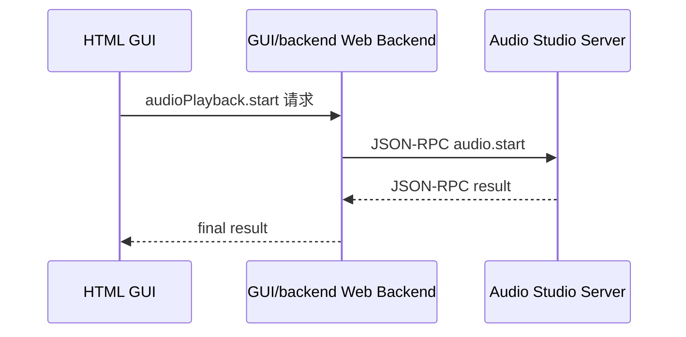

特点：

```text
HTML GUI 只访问 GUI/backend。
GUI/backend 能访问 Audio Studio Server。
Audio Studio Server 不需要暴露给浏览器。
不涉及浏览器 CORS、mixed content、Local Network Access 等问题。
GUI/backend 是 GUI 控制入口，便于 GUI 权限、审计和页面 session 管理。
as_server 仍然负责设备权限、server-side session 管理和 stream lifecycle。
```

#### 2.4.2 Server 在前端局域网

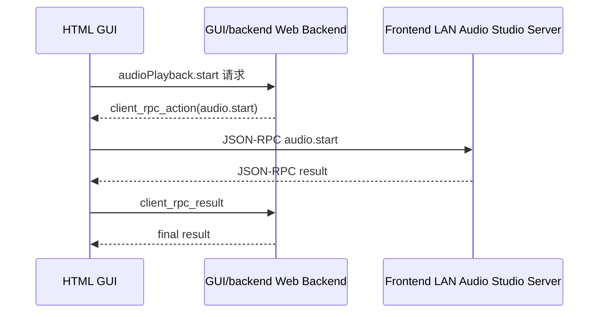

特点：

```text
GUI 请求仍然先到 GUI/backend。
GUI/backend 不直接访问前端局域网 Audio Studio Server。
GUI/backend 返回声明式 client_rpc_action。
前端在统一 executor 中执行本地 RPC。
前端把控制类 RPC result 回传 GUI/backend。
GUI/backend 维护 GUI session、pending action、审计和页面状态。
as_server 维护 RPC client、device session、stream session、权限与最终设备状态。
GUI/backend 如果需要强一致状态，应通过后续 JSON-RPC status/query 或前端 action reconciliation 获取。
```

### 2.5 GUI/backend 响应协议

GUI/backend 面向 HTML GUI 的响应统一为三类。

#### 2.5.1 BackendResultResponse

```json
{
  "type": "result",
  "request_id": "req_001",
  "result": {
    "session_id": 1001,
    "state": "started"
  }
}
```

#### 2.5.2 ClientRpcActionResponse

```json
{
  "type": "client_rpc_action",
  "request_id": "req_002",
  "action": {
    "action_id": "act_001",
    "kind": "json_rpc",
    "target": {
      "target_id": "local_audio_studio_server",
      "placement": "client",
      "endpoint": "http://127.0.0.1:9900/rpc",
      "transport": "http_jsonrpc"
    },
    "auth": {
      "action_nonce": "nonce_001",
      "expires_at_ms": 1790000000000,
      "token_ref": "audio_studio_local_token"
    },
    "rpc": {
      "method": "audio.start",
      "params": {
        "session_id": 1001
      }
    },
    "timeout_ms": 5000,
    "complete_url": "/api/audio-studio/client-rpc-actions/act_001/complete",
    "continuation": {
      "required": true,
      "report_control_result": true,
      "url": "/api/audio-studio/client-rpc-actions/act_001/complete"
    }
  }
}
```

字段约束：

```text
kind:
  当前只允许 json_rpc；后续 stream/control action 可扩展但不能复用裸 JSON-RPC 字段。

target:
  描述前端可访问的 as_server endpoint。浏览器不能直接使用 raw socket/pipe，因此 HTML 侧 target transport 只能是 http_jsonrpc 或 websocket。

rpc:
  后端生成的声明式 RPC 调用。前端不能自由改 method 或 params，只能按 action 执行。

complete_url:
  前端执行完成后回传控制面结果的 URL。该 URL 必须绑定 action_id、request_id、nonce 和过期时间。
```

#### 2.5.3 BackendErrorResponse

```json
{
  "type": "error",
  "request_id": "req_003",
  "error": {
    "code": "AUDIO_STUDIO_TARGET_UNREACHABLE",
    "message": "Audio Studio Server is not reachable from backend or frontend",
    "detail": {
      "target_id": "local_audio_studio_server"
    }
  }
}
```

#### 2.5.4 HTML typed API wrapper 行为

HTML 页面组件永远调用 GUI typed API，不直接判断 as_server placement，也不直接拼 `client_rpc_action`。

推荐调用形态：

```js
const audioPlayback = await audioApi.createPlaybackSession({
  sampleRate: 48000,
  channels: 2,
  bytesPerSample: 2,
});

await audioPlayback.start();
```

内部流程：

```text
audioApi.createPlaybackSession()
  -> POST /api/audio/playback-sessions
  -> GUI/backend 返回 result 或 client_rpc_action
  -> 如果是 result:
       直接构造 AudioPlayback remote handle
  -> 如果是 client_rpc_action:
       clientRpcActionExecutor 执行 action.rpc
       POST action.complete_url 回传 rpc_result 或 rpc_error
       GUI/backend 校验 action 后返回 final result
       前端构造 AudioPlayback remote handle
```

`AudioPlayback` remote handle 隐藏 `session_id`：

```js
class AudioPlayback {
  async start() {}
  async writeFrames(arrayBuffer, { timeoutMs = 1000 } = {}) {}
  async drain() {}
  async stop() {}
  async close() {}
}
```

页面组件不能直接调用：

```js
await jsonRpcCall('audio.start', { session_id });
```

### 2.6 GUI/backend Orchestrator

GUI/backend 新增轻量编排模块，不承载正式 framework service：

```text
Audio-Studio/GUI/backend/include/
  audio_studio_rpc_orchestrator.hpp
  client_rpc_action.hpp
  client_rpc_action_store.hpp
  audio_studio_target_registry.hpp
  client_telemetry.hpp

Audio-Studio/GUI/backend/src/
  audio_studio_rpc_orchestrator.cpp
  client_rpc_action.cpp
  client_rpc_action_store.cpp
  audio_studio_target_registry.cpp
  client_telemetry.cpp
```

主要职责：

```text
1. 接收 HTML GUI 的所有业务请求。
2. 根据 session / target_id / deployment 配置解析 Audio Studio Server placement。
3. 如果 Audio Studio Server 在后端局域网：直接 JSON-RPC 调用 server/ 产物。
4. 如果 Audio Studio Server 在前端局域网：生成 client_rpc_action。
5. 校验 action_id、request_id、action_nonce、过期时间和 target。
6. 接收前端回传的 client_rpc_result 或 client_rpc_error。
7. 更新 GUI/backend session 状态、操作审计和页面状态。
8. 返回最终结果给 HTML GUI。
```

### 2.7 client_rpc_result 校验

前端执行后回传成功结果：

```json
{
  "request_id": "req_002",
  "action_id": "act_001",
  "rpc_result": {
    "session_id": 1001,
    "state": "started"
  }
}
```

前端执行失败时回传：

```json
{
  "request_id": "req_002",
  "action_id": "act_001",
  "rpc_error": {
    "code": -32603,
    "message": "as_server not reachable"
  }
}
```

GUI/backend 必须校验：

```text
action_id 是否存在
action_id 是否属于当前 session
action_id 是否未过期
action_nonce 是否匹配且未被重复使用
method 是否与后端生成的 pending action 一致
params hash 是否与后端生成的 pending action 一致
target_id 是否一致
complete_url 是否匹配 action_id
result/error 是否符合预期 schema
```

约束：

```text
1. client_rpc_result 是浏览器回传结果，不能作为设备状态的唯一事实来源。
2. 对 start/stop/config 等关键操作，GUI/backend 应记录 operation_id，并在需要时触发 status/query reconciliation。
3. as_server 必须独立完成 token、origin、method allowlist、session ownership 和权限校验。
4. 如果 as_server 支持 action token 校验，action_nonce/operation_id 应透传给 as_server，用于审计和防重放。
```

### 2.8 DSP 实时 probe / dump 的控制面、数据面、统计面

`as_dump` / GUI probe 能力以 SOF `sof/tools/probes` 的协议和 demux 逻辑为基础。当前 `sof-probes` 的确定能力包括：

```text
1. 从文件或 stdin 读取 probe DMA extract stream。
2. 按 probe packet sync word 重新同步。
3. 解析 probe_data_packet header：buffer_id、format、timestamp_high/low、data_size_bytes。
4. 校验 packet data 后附带的 checksum。
5. 按 buffer_id demux 多个 probe point。
6. 根据 format 判断 audio/non-audio，audio 写 WAV，非 audio 写 bin 或 stdout。
7. 对不完整/错位数据具备基本 resync 能力。
```

Audio Studio 的 dump/probe 设计应先把这些能力服务化，再逐步扩展实时控制能力。因此必须区分：

```text
Control Plane 控制面：
  listPoints / openSession / addPoint / removePoint / start / stop / status 等控制 RPC
  控制结果需要回传 GUI/backend 或 CLI

Data Plane 数据面：
  raw probe packet stream / demuxed PCM / WAV / bin chunks
  原始大数据由 CLI 本地保存，或由 GUI/frontend 直接消费，不回传 GUI/backend

Telemetry Plane 统计面：
  packet_count / bytes / checksum_error / resync_count / dropped frame / RMS / peak / clipping / latency 等统计摘要
  GUI/frontend 周期性回传 GUI/backend
```

第一阶段建议能力：

```text
1. as_server 读取 platform dump device 或 controller dump device 的 raw probe stream。
2. framework/dump 复用 SOF probe demux 思路，按 stream_id/buffer_id 拆分。
3. CLI as_dump 可保存 raw stream、demux 后 WAV、demux 后 bin、统计报告。
4. GUI 可通过 WebSocket/WSS 直接接收 demuxed frame 或轻量 waveform frame。
5. GUI/backend 只保存 session 元数据和统计摘要，不保存原始音频。
```

后续可扩展能力：

```text
1. live probe point attach/detach。
2. 多 probe point 同时采集。
3. 基于 timestamp 的跨 point 对齐。
4. 采集窗口、最大字节数、持续时间 watchdog。
5. 实时 waveform/meter/spectrum。
6. raw stream 回放和离线 demux。
7. probe packet 校验错误定位和重同步统计。
8. 注入类 probe 如果底层平台支持，可作为独立 inject capability 暴露，不能和 extract/dump 混为一谈。
```

#### 2.8.1 probe.start 流程

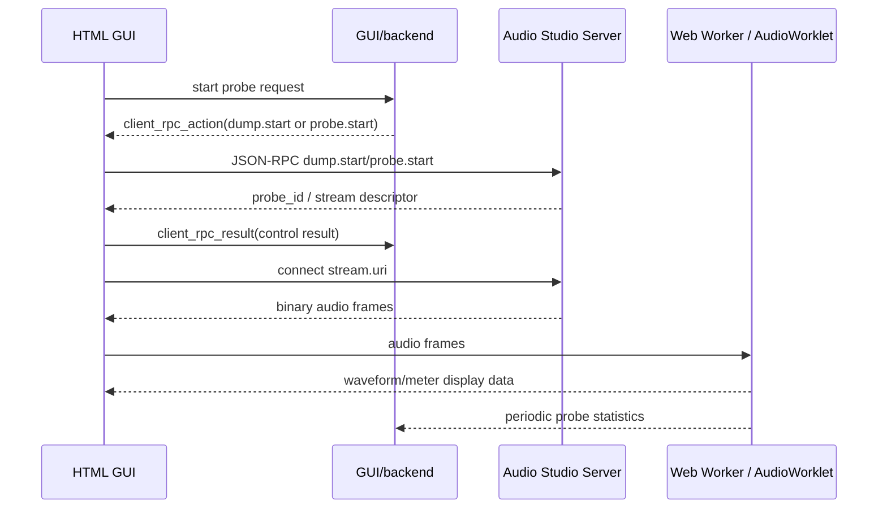

#### 2.8.2 probe.start client_rpc_action 示例

```json
{
  "type": "client_rpc_action",
  "request_id": "req_1001",
  "action": {
    "action_id": "act_probe_start_001",
    "kind": "json_rpc",
    "target": {
      "target_id": "local_audio_studio_server",
      "placement": "client",
      "endpoint": "http://127.0.0.1:9900/rpc",
      "transport": "http_jsonrpc"
    },
    "rpc": {
      "method": "dump.start",
      "params": {
        "session_id": 3001,
        "points": [
          {
            "point_id": 101,
            "output_name": "pipeline0_node3_out"
          }
        ],
        "output_mode": "live_demux"
      }
    },
    "complete_url": "/api/audio-studio/client-rpc-actions/act_probe_start_001/complete",
    "continuation": {
      "required": true,
      "report_control_result": true,
      "url": "/api/audio-studio/client-rpc-actions/act_probe_start_001/complete"
    },
    "stream_policy": {
      "has_stream": true,
      "raw_data_to_backend": false,
      "stats_to_backend": true,
      "stats_interval_ms": 1000,
      "allowed_stats": [
        "rms_dbfs",
        "peak_dbfs",
        "clipping_count",
        "checksum_errors",
        "resync_count",
        "dropped_frames",
        "latency_ms"
      ]
    }
  }
}
```

#### 2.8.3 前端统计摘要

建议 GUI/frontend 周期性上报：

```json
{
  "probe_id": "probe_001",
  "stream_id": "stream_probe_001",
  "timestamp_ms": 123456789,
  "duration_ms": 1000,
  "sample_rate": 48000,
  "channels": 2,
  "frames_received": 48000,
  "dropped_frames": 0,
  "packets_received": 188,
  "checksum_errors": 0,
  "resync_count": 0,
  "rms_dbfs": [-32.5, -31.9],
  "peak_dbfs": [-6.2, -5.8],
  "clipping_count": [0, 0],
  "dc_offset": [0.0001, -0.0002],
  "estimated_latency_ms": 18.5
}
```

上报接口可设计为：

```text
POST /api/audio-studio/probe/stats
```

或复用统一事件接口：

```text
POST /api/audio-studio/client-telemetry
```

GUI/backend 需要知道：

```text
谁启动了 probe
目标 Audio Studio Server 是哪个
probe source 是什么
当前 probe 是否 running
probe_id / stream_id
最近一次统计信息
是否发生 xrun / dropped frames / clipping / stream disconnect
```

GUI/backend 不需要保存原始音频数据。

### 2.9 as_log / as_dump / as_play / as_control 的影响

`as_log / as_dump / as_play / as_record / as_control` 是 CLI JSON-RPC client，它们不走 GUI/backend，而是直接调用 Audio Studio Server。当前实现支持 socket 与 pipe 两种 transport；socket 为默认值，`--rpc socket` 可省略，pipe 使用 `--rpc pipe`。通用 `as_rpc` 只作为调试入口，正式工具命令应通过 registry 映射默认 API，不要求用户手写 method name。

```text
as_rpc    --rpc socket/pipe --method ... --params-json ... -> audio_studio_server
as_log    --rpc socket/pipe -> audio_studio_server
as_dump   --rpc socket/pipe -> audio_studio_server
as_play   --rpc socket/pipe -> audio_studio_server
as_record --rpc socket/pipe -> audio_studio_server
as_control --rpc socket/pipe -> audio_studio_server
```

数据策略与 GUI 一致：

```text
as_log:
  少量 log event 可显示/保存；大量 log stream 由 CLI 本地消费或落盘。

as_dump:
  控制类 RPC 为 dump.createSession/dump.start/dump.stop/dump.getStats/dump.closeSession。
  原始 dump 数据通常很大，不自动回传 GUI/backend。

as_play:
  CLI 只负责打开 WAV/PCM 文件、解析格式、分块读文件和打印结果。
  CLI 内部通过 AudioRpcClient 创建 AudioPlayback remote handle，后续调用 audio_playback.start/writeFrames/drain/stop/close。
  大块 PCM 经 createPlaybackSession 返回的 stream.uri，以 asrp-v1 binary frame 发送。

as_record:
  CLI 只负责创建本地 WAV 输出、计算 duration/chunk、分块写文件和打印结果。
  CLI 内部通过 AudioRpcClient 创建 AudioCapture remote handle，后续调用 audio_capture.start/readFrames/stop/close。
  大块 PCM 经 createCaptureSession 返回的 stream.uri，以 asrp-v1 binary frame 接收。

as_control:
  通过 control.openSession/control.list/control.get/control.set/control.closeSession 等 JSON-RPC method 控制参数。
```

### 2.10 浏览器安全要求

GUI/frontend 执行 `client_rpc_action` 时必须满足：

```text
1. 不执行 GUI/backend 返回的 JavaScript 代码。
2. 不使用 eval。
3. 只执行声明式 JSON RPC Action。
4. 只允许访问用户确认过的 target_id。
5. 只允许白名单 transport。
6. 只允许白名单 RPC method。
7. 对本地网络访问失败给出明确提示。
```

Audio Studio Server Browser Access Mode 要求：

```text
1. 默认不无鉴权开放到 0.0.0.0。
2. Browser Access Mode 默认关闭。
3. 开启 Browser Access Mode 后必须配置 allowed origin 或允许本地开发 origin。
4. 支持 token 鉴权。
5. WebSocket 校验 Origin。
6. RPC method 做 allowlist 或权限分级，allowlist 默认由 `rpc/api/audio_studio_rpc_api.cpp` registry 派生。
7. probe/dump/play 等高风险操作可要求更高权限。
8. 限制单 session 最大 stream 数量和带宽。
9. 限制 dump/probe 持续时间或提供 watchdog。
```

### 2.11 配置建议

GUI/frontend runtime 配置：

```json
{
  "runtime": "backend_orchestrated_rpc",
  "targets": {
    "local_audio_studio_server": {
      "name": "Local Audio Studio Server",
      "httpRpc": "http://127.0.0.1:8080/rpc",
      "wsRpc": "ws://127.0.0.1:8080/ws",
      "tokenStorageKey": "audio_studio_local_token"
    }
  },
  "clientRpc": {
    "allowMethodsSource": "rpc_api_registry",
    "allowMethods": [
      "system.ping",
      "system.getInfo",
      "audio.createPlaybackSession",
      "audio.createCaptureSession",
      "audio.start",
      "audio.stop",
      "control.openSession",
      "control.closeSession",
      "control.list",
      "control.get",
      "control.set",
      "probe.start",
      "probe.stop",
      "dump.createSession",
      "dump.start",
      "dump.stop",
      "dump.readStream"
    ],
    "defaultTimeoutMs": 5000
  },
  "probe": {
    "rawDataToBackend": false,
    "statsToBackend": true,
    "statsIntervalMs": 1000
  }
}
```

GUI/backend target 配置：

```json
{
  "audioStudioTargets": [
    {
      "id": "backend_lab_server_01",
      "name": "Backend Lab Audio Studio Server 01",
      "placement": "backend_reachable",
      "httpRpc": "http://10.10.20.15:8080/rpc",
      "wsRpc": "ws://10.10.20.15:8080/ws"
    },
    {
      "id": "local_audio_studio_server",
      "name": "Frontend Local Audio Studio Server",
      "placement": "frontend_reachable"
    }
  ]
}
```

---

## 3. Audio Studio 顶层工程目录

### 3.1 目标顶层目录

正式目标目录如下：

```text
Audio-Studio/
  GUI/
    frontend/
    backend/
  cli/
  rpc/
  server/
  drivers/
  audio_controller/
  scripts/
  configs/
  plugins/
  examples/
  docs/
  third_party/
  tests/
  CMakeLists.txt
  Kconfig
  README.md
```

### 3.2 顶层目录职责

| 目录 | 职责 | 主要语言 | 是否包含正式平台特化 |
|---|---|---:|---:|
| `GUI/frontend/` | 已实现 HTML GUI，负责工程管理、pipeline UI、参数面板、probe/log 可视化 | HTML/CSS/JavaScript | 不直接包含平台驱动 |
| `GUI/backend/` | GUI Web Backend / mock runtime / REST 兼容 / RPC 编排 | C++/可选 Node/Python | 不包含正式 platform driver |
| `cli/` | 命令行前端，包含 `as_config/as_control/as_play/as_record/as_log/as_dump` | C++ | 不直接包含平台驱动 |
| `rpc/` | JSON-RPC codec、单点 API registry、typed facade、client/server helper、socket/pipe/http/ws transport adapter | C++/JavaScript facade | 不包含平台特化 |
| `drivers/` | Driver interface、singleton registry、默认 Linux host 实现、后续平台实现入口 | C++ | 可包含 platform/host driver implementation |
| `server/` | 正式 as_server、framework、platform adapter，并链接 rpc/drivers | C++ | `server/platform/*` 包含 |
| `audio_controller/` | Audio Studio 对端 controller 参考实现，只接收初始化传入的 driver ops | C | 不包含 platform 目录 |
| `scripts/` | Kconfig、build_all.sh、cmake、toolchain、代码生成、打包脚本 | Python/Shell/CMake | 不直接包含业务逻辑 |
| `configs/` | built-in module catalog、platform JSON、platform/profile defconfig | JSON/Kconfig defconfig | 可包含平台配置 |
| `plugins/` | Audio Studio Host Plugin SDK 示例和三方插件目录 | C/C++ | 插件可平台无关 |
| `examples/` | 示例 pipeline、preset、测试音频、脚本 | JSON/WAV/Shell | 可包含平台示例 |
| `docs/` | 设计文档、接口文档、开发者指南 | Markdown | 平台说明可放子章节 |
| `third_party/` | 受控第三方依赖 | 多语言 | 只放可复用依赖 |
| `tests/` | 单元测试、集成测试、mock driver 测试、RPC 回归测试 | C++/Python/JS | 可包含 platform test |

### 3.3 server 目标内部目录

`server/` 是 Audio Studio 的核心运行时工程，负责 as_server main、framework service、platform adapter 和运行期组合。`rpc/` 与 `drivers/` 提升为顶层共享目录，便于 server、CLI、GUI/backend、测试目标按 Kconfig 链接同一套 JSON-RPC 与 driver abstraction。Audio Studio 不设置独立发布的正式 `client_sdk/` 架构层；CLI 和 GUI/backend/GUI frontend 使用顶层 `rpc/` 内部提供的 JSON-RPC core、transport helper、typed facade 和 remote handle。

```text
Audio-Studio/server/
  CMakeLists.txt
  include/studio/
    version.hpp
    build_config.hpp
  main/
    as_server_main.cpp
    server_app.hpp
    server_app.cpp
  framework/
    common/
    session/
    scheduler/
    server/
    config/
    control/
    audio/
    log/
    dump/
    plugin/
    transport/
    protocol/
  platform/
    a2/
    simulator/
    customer_x/
```

共享目录：

```text
Audio-Studio/rpc/
  api/
  include/
  src/
  Kconfig
  CMakeLists.txt

Audio-Studio/drivers/
  include/
  src/
  os/ socket/ filesystem/ pipe/ dynlib/ datalink/ audio/ control/ log/ dump/
  Kconfig
  CMakeLists.txt
```

`server/` 采用和顶层 `drivers/` 相同的分散式构建管理：`server/CMakeLists.txt` 只组合 `main/`、`framework/`、`platform/` 等上层 target；`server/framework/CMakeLists.txt` 与 `server/platform/CMakeLists.txt` 只做子目录聚合；每个 framework/platform 子模块在自己的 `CMakeLists.txt` 和 `Kconfig` 内声明 source、include、feature switch 和依赖。新增 `framework/log`、`framework/transport` 或 `platform/simulator` 能力时，不允许继续把 source list 堆进 `server/CMakeLists.txt`。

### 3.4 GUI/backend 不等于 server

必须在工程层面保持下列边界：

```text
GUI/backend 可以链接一个很薄的 JSON-RPC client，用于调用 server。
GUI/backend 可以维护 target/session/action/telemetry 状态。
GUI/backend 可以继续保留 mock runtime 供 GUI demo 使用。

GUI/backend 不编译 server/framework。
GUI/backend 不注册 drivers。
GUI/backend 不包含 platform/a2。
GUI/backend 不拥有 TransportManager。
GUI/backend 不直接和 A2 physical transport、7870 tinymix、audio_controller peer 通信。
```

---

## 4. 推荐源码目录与文件清单

### 4.1 GUI 子工程

```text
Audio-Studio/GUI/
  frontend/
    index.html
    assets/
      js/
        configParser.js
        utils.js
        rpc/
          backendApi.js
          clientRpcActionExecutor.js
          jsonRpcClient.js
          jsonRpcHttpExecutor.js
          jsonRpcWsExecutor.js
          audioRpcClient.js
          audioPlayback.js
          rpcTargetRegistry.js
          clientRpcContinuation.js
          clientTelemetryReporter.js
        probe/
          probeStreamClient.js
          probeStatsCalculator.js
          probeWorker.js
          probeRenderer.js
      css/
        ... existing css files ...
  backend/
    include/
      audio_studio.hpp
      audio_studio_rpc_orchestrator.hpp
      audio_studio_json_rpc_client.hpp
      client_rpc_action.hpp
      client_rpc_action_store.hpp
      audio_studio_target_registry.hpp
      client_telemetry.hpp
    src/
      main.cpp
      http_server.cpp
      mock_runtime.cpp
      audio_studio_rpc_orchestrator.cpp
      audio_studio_json_rpc_client.cpp
      client_rpc_action.cpp
      client_rpc_action_store.cpp
      audio_studio_target_registry.cpp
      client_telemetry.cpp
```

上述新增文件只是 GUI 与正式 `server/` 的适配层，不是 framework 实现。

### 4.2 CLI 新增目录

`cli/` 放原先讨论中的 `apps/` 下的命令行工具。CLI 是轻量前端，只做参数解析、RPC 调用、本地文件 IO、stdout/stderr 输出。

```text
Audio-Studio/cli/
  CMakeLists.txt
  common/
    cli_common.hpp
    cli_common.cpp
    cli_option_parser.hpp
    cli_option_parser.cpp
    cli_signal_handler.hpp
    cli_signal_handler.cpp
    cli_output.hpp
    cli_output.cpp
    cli_file_io.hpp
    cli_file_io.cpp
    server_connection_options.hpp
    server_connection_options.cpp
    json_rpc_client.hpp
    json_rpc_client.cpp
    json_rpc_codec.hpp
    json_rpc_codec.cpp
  as_config/
    as_config_main.cpp
    as_config_options.hpp
    as_config_options.cpp
  as_control/
    as_control_main.cpp
    as_control_options.hpp
    as_control_options.cpp
  as_play/
    as_play_main.cpp
    as_play_options.hpp
    as_play_options.cpp
  as_record/
    as_record_main.cpp
    as_record_options.hpp
    as_record_options.cpp
  as_log/
    as_log_main.cpp
    as_log_options.hpp
    as_log_options.cpp
  as_dump/
    as_dump_main.cpp
    as_dump_options.hpp
    as_dump_options.cpp
```

当前已实现首批 host-alone CLI 骨架，下一阶段增加通用 `as_rpc` 调试入口：

```text
cli/common/include/cli_common.hpp
cli/common/src/cli_common.cpp
cli/tools/as_rpc.cpp
cli/tools/as_control.cpp
cli/tools/as_play.cpp
cli/tools/as_record.cpp
cli/tools/as_log.cpp
cli/tools/as_dump.cpp
```

该阶段 CLI 保留 `--target dummy` host-alone 模式，同时支持默认 socket RPC 与 `--rpc pipe` 调用 as_server。`as_control --action get-health` 走 JSON-RPC；`as_play` 已通过 `AudioRpcClient` 创建 `AudioPlayback` remote handle，并以 `audio_playback.start/writeFrames/drain/stop/close` 语义执行播放流程；`as_record` 已通过 `AudioCapture` remote handle 执行 `start/readFrames/stop/close` 并写 WAV。`as_config` 暂不实现。

CLI public header 直接放在模块 `include/` 根目录，例如 `cli/common/include/cli_common.hpp`。server/framework 与 server/platform public header 同样直接放在对应模块 `include/` 根目录，例如 `server/framework/audio/include/audio_service.hpp`、`server/framework/common/include/status.hpp`。工程内 include 统一使用短路径，避免 `include/audio_studio/...` 多层嵌套。

CLI 不应包含：

```text
TransportManager
AudioControllerProtocol
A2 platform driver
tinyalsa/tinymix 细节
ALSA topology pack 细节，除非 standalone/offline as_config 显式启用
```

### 4.3 server/framework/common

```text
Audio-Studio/server/framework/common/
  include/studio/common/
    result.hpp
    error_code.hpp
    byte_buffer.hpp
    ring_buffer.hpp
    fixed_string.hpp
    uuid.hpp
    endian.hpp
    crc32.hpp
    intrusive_list.hpp
    ref_count.hpp
    status.hpp
    time_types.hpp
  src/
    result.cpp
    error_code.cpp
    byte_buffer.cpp
    ring_buffer.cpp
    uuid.cpp
    endian.cpp
    crc32.cpp
```

当前已实现首批 host-alone common 模块：

```text
server/framework/common/include/status.hpp
server/framework/common/include/service_registry.hpp
server/framework/common/src/status.cpp
server/framework/common/src/service_registry.cpp
```

该阶段只承载通用 `Status` 和 `ServiceRegistry`，用于后续 RPC service、framework service 和 dummy driver 测试共享；不包含平台逻辑。

### 4.4 server/framework/session

```text
Audio-Studio/server/framework/session/
  include/studio/session/
    session_id.hpp
    session_owner.hpp
    session_registry.hpp
    session_lifecycle.hpp
  src/
    session_registry.cpp
    session_lifecycle.cpp
```

当前已实现首批 host-alone session 模块：

```text
server/framework/session/include/session_registry.hpp
server/framework/session/src/session_registry.cpp
```

该阶段提供 session create/close/list/activeCount 基础生命周期能力，供后续 as_server RPC session、device session 和 stream session 复用。

### 4.5 server/framework/config

`framework/config` 是 `as_config` 的主体能力所在。它负责解析 project JSON，生成 Audio Studio IR、Config Binary、ALSA topology、private section、编译报告等。

```text
Audio-Studio/server/framework/config/
  include/studio/config/
    config_service.hpp
    config_compiler.hpp
    project_schema.hpp
    project_parser.hpp
    schema_validator.hpp
    symbol_table.hpp
    topology_ir.hpp
    topology_ir_builder.hpp
    target_generator.hpp
    target_generator_registry.hpp
    alsa_topology_generator.hpp
    alsa_topology_packer.hpp
    alsa_widget_mapper.hpp
    alsa_kcontrol_mapper.hpp
    private_data_packer.hpp
    config_binary_packer.hpp
    preset_compiler.hpp
    scene_compiler.hpp
    compile_report.hpp
    config_rpc_types.hpp
  src/
    config_service.cpp
    config_compiler.cpp
    project_parser.cpp
    schema_validator.cpp
    symbol_table.cpp
    topology_ir_builder.cpp
    target_generator_registry.cpp
    alsa_topology_generator.cpp
    alsa_topology_packer.cpp
    alsa_widget_mapper.cpp
    alsa_kcontrol_mapper.cpp
    private_data_packer.cpp
    config_binary_packer.cpp
    preset_compiler.cpp
    scene_compiler.cpp
    compile_report.cpp
  alsa_port/
    tplg_binary_writer.cpp
    tplg_binary_writer.hpp
    tplg_section_builder.cpp
    tplg_section_builder.hpp
    tplg_vendor_tokens.hpp
    tplg_vendor_tokens.cpp
```

> `alsa_port/` 用于承载从 Linux ALSA lib、Linux kernel ALSA topology、Sound Open Firmware tools/tplg_parser 相关代码阅读后必要 porting 的内容。该部分只能形成 Audio Studio 自己的 topology pack/parse 适配层，不能让 `as_config` 直接散落依赖第三方工具源码结构。

`as_config` 的输入 JSON 是 Audio Studio 语义配置，不是 SOF topology `.conf` 的逐字段转写。`resource_catalog` 描述 host/DAI/计算资源，pipeline port 通过 `resource_ref` 绑定资源；module/node/pipeline 使用 Audio Studio 的 type、parameter、port、edge 语义表达链路。`configs/platform/a2/A2.json` 当前覆盖 playback、capture 与 dsp_filter coverage 三条 FILE_IO pipeline，并通过显式 `imports[]` 导入 `configs/built-in-algorithm.json` 作为共享 module catalog；`channel_remap`、`delay`、`fader_balance`、`dsp_filter` 等 SOF 基础 audio component 不再重复声明在 A2 项目 JSON 内。rv32qemu 仅声明 FILEIO0/FILEIO1，因此 dsp_filter coverage pipeline 绑定 FILEIO1。

module 的 `parameters` 扩展方式保持在 Audio Studio schema 层：`plugins/builtin_module_configs` 内置 `SofBasicModuleConfigHandler`，负责把 `channel_remap`、`delay.line`、`fader_balance`、`dsp_filter` 等 SOF 基础 component 的 UI 友好参数打包为 SOF IPC3 bytes，并生成标准 `SectionControlBytes`；第三方 module config handler 继续通过插件返回 binary payload；未知或通用参数仍进入 Audio Studio private payload。`framework/config` 只负责 IR、topology 和 plugin registry，不内置 SOF 基础 component 的参数 packer，也不要求前端或产品 JSON 暴露 SOF widget name、buffer size、ALSA hw 字符串等低层字段，这些由 IR builder 和 topology generator 根据资源、端口和 module category 推导。

`as_config --build-tplg` 会同时输出 `.conf`、`.tplg`、private binary、controls csv、compile report 与可选 decode 结果。Linux 构建和 CI 不再源码编译 `third_party/alsa-lib` / `third_party/alsa-utils`，而是直接使用仓库内预编译的 `third_party/alsatplg/bin/alsatplg`。`alsatplg` decode 是环境能力：decode 成功时输出 `<project>_decode.conf`，decode 不可用或当前 topology 无法被 host decode 时编译仍然成功，并在 result warnings 与 `<project>_decode.log` 中记录原因。

### 4.6 server/framework/control

```text
Audio-Studio/server/framework/control/
  include/studio/control/
    control_service.hpp
    control_session.hpp
    control_types.hpp
    control_value.hpp
    control_filter.hpp
    control_rpc_types.hpp
  src/
    control_service.cpp
    control_session.cpp
    control_value.cpp
```

当前已实现首批 host-alone control 模块：

```text
server/framework/control/include/control_service.hpp
server/framework/control/src/control_service.cpp
```

该阶段提供参数 set/get/list 的通用状态层，不直接访问 tinymix、A2 transport 或物理 driver；后续由 driver/control 或 platform/control 负责真实下发。

### 4.7 server/framework/audio

```text
Audio-Studio/server/framework/audio/
  include/studio/audio/
    audio_service.hpp
    audio_session.hpp
    audio_stream_controller.hpp
    audio_format.hpp
    audio_frame.hpp
    audio_file.hpp
    wav_reader.hpp
    wav_writer.hpp
    pcm_reader.hpp
    pcm_writer.hpp
    audio_stats.hpp
    audio_rpc_types.hpp
  src/
    audio_service.cpp
    audio_session.cpp
    audio_stream_controller.cpp
    audio_format.cpp
    wav_reader.cpp
    wav_writer.cpp
    pcm_reader.cpp
    pcm_writer.cpp
    audio_stats.cpp
```

当前已实现首批 host-alone audio 模块：

```text
server/framework/audio/include/audio_service.hpp
server/framework/audio/src/audio_service.cpp
```

该阶段只维护 playback/capture stream 的 create/start/stop/get/list 状态，不直接访问 ALSA、浏览器音频或 Audio Controller；真实设备访问由后续 drivers/audio 承担。

### 4.8 server/framework/log

```text
Audio-Studio/server/framework/log/
  include/studio/log/
    log_service.hpp
    log_session.hpp
    log_types.hpp
    log_decoder.hpp
    ldc_dictionary.hpp
    log_formatter.hpp
    log_filter.hpp
    log_sink.hpp
    log_rpc_types.hpp
  src/
    log_service.cpp
    log_session.cpp
    log_decoder.cpp
    ldc_dictionary.cpp
    log_formatter.cpp
    log_filter.cpp
    log_sink.cpp
  sof_port/
    sof_logger_decoder.cpp
    sof_logger_decoder.hpp
    sof_ldc_parser.cpp
    sof_ldc_parser.hpp
```

当前已实现首批 host-alone log 模块：

```text
server/framework/log/include/log_service.hpp
server/framework/log/src/log_service.cpp
```

该阶段提供 append/tail/clear/size 内存日志缓冲能力，不读取 firmware trace 或 `.ldc` 字典；真实日志设备与解码由后续 drivers/log 和 log decoder 模块接入。

### 4.9 server/framework/dump

```text
Audio-Studio/server/framework/dump/
  include/studio/dump/
    dump_service.hpp
    dump_session.hpp
    dump_types.hpp
    probe_point_manager.hpp
    dump_parser.hpp
    dump_demuxer.hpp
    dump_sink.hpp
    dump_rpc_types.hpp
  src/
    dump_service.cpp
    dump_session.cpp
    probe_point_manager.cpp
    dump_parser.cpp
    dump_demuxer.cpp
    dump_sink.cpp
  sof_port/
    sof_probe_parser.cpp
    sof_probe_parser.hpp
    sof_probe_packet.hpp
```

当前已实现首批 host-alone dump 模块：

```text
server/framework/dump/include/dump_service.hpp
server/framework/dump/src/dump_service.cpp
```

该阶段提供 dump session start/write/stop/get/list 的内存统计能力，用于先打通 as_server、CTest 和构建配置；不解析 SOF probe packet，不操作真实 dump point，也不写 PCM/WAV 文件。真实 probe demux、dump sink 和 IDumpDevice 接入仍由后续 drivers/dump 与 framework/dump 扩展完成。

### 4.10 server/framework/plugin

```text
Audio-Studio/server/framework/plugin/
  include/studio/plugin/
    plugin_manager.hpp
    plugin_registry.hpp
    plugin_descriptor.hpp
    plugin_abi.hpp
    plugin_scanner.hpp
    iaudio_studio_plugin.hpp
  src/
    plugin_manager.cpp
    plugin_registry.cpp
    plugin_descriptor.cpp
    plugin_scanner.cpp
```

当前已实现首批 host-alone plugin 模块：

```text
server/framework/plugin/include/plugin_manager.hpp
server/framework/plugin/src/plugin_manager.cpp
```

该阶段提供 plugin descriptor register/unregister/get/list/findByCapability 和 active 状态管理，用于先打通 framework/plugin 的构建配置与 CTest；不扫描插件目录，不调用 dlopen/LoadLibrary，也不执行插件 ABI。真实插件发现和动态库加载必须通过后续 drivers/filesystem 与 drivers/dynlib 接入。

### 4.11 server/framework/transport

```text
Audio-Studio/server/framework/transport/
  include/studio/transport/
    transport_manager.hpp
    transport_frame.hpp
    logical_channel.hpp
    logical_channel_manager.hpp
    request_scheduler.hpp
    request_tracker.hpp
    frame_codec.hpp
    transport_session.hpp
  src/
    transport_manager.cpp
    logical_channel_manager.cpp
    request_scheduler.cpp
    request_tracker.cpp
    frame_codec.cpp
    transport_session.cpp
```

当前已实现首批 host-alone transport 模块：

```text
server/framework/transport/include/transport_frame.hpp
server/framework/transport/include/frame_codec.hpp
server/framework/transport/include/transport_manager.hpp
server/framework/transport/src/frame_codec.cpp
server/framework/transport/src/transport_manager.cpp
```

该阶段提供 frame encode/decode、logical channel 状态统计、每 channel worker、同步/异步发送 API，以及基于 DataLinkManager 的可靠 data-link 搬运。TransportManager 不直接访问 socket/pipe/USB/PCIe/semihost OS API；真实 IO 必须通过 `IDataLinkDevice` 接入。

本阶段补齐 TransportManager 与 Audio Controller 对端的双层传输模型：

```text
framework/log、framework/dump、framework/audio、framework/control
  -> controller 类 I*Device driver
    -> TransportManager
      -> DataLinkManager
        -> IDataLinkDevice
          -> platform data-link implementation
            -> Audio Controller transport controller
              -> ac_datalink
              -> ac_transport
              -> log/dump/audio/control/config service
```

#### 4.11.1 IDataLinkDevice

`IDataLinkDevice` 是 Audio Studio host 侧最小数据链路设备接口。它只维护链路打开/关闭、MTU 能力和基础数据块读写，不理解 TransportManager channel、log/dump/audio 业务语义，也不负责传输层 ACK。平台或 driver implementation 负责实现它：

```cpp
struct DataLinkDeviceCaps {
    size_t mtu = 256;
    bool reliable = false;
    bool ordered = true;
};

class IDataLinkDevice {
public:
    virtual ~IDataLinkDevice() = default;
    virtual Status open(const DataLinkDeviceConfig& config) = 0;
    virtual void close() = 0;
    virtual Status writeBlock(const uint8_t* data, size_t size, uint32_t timeout_ms) = 0;
    virtual Status readBlock(uint8_t* buffer, size_t capacity, size_t& actual_size,
                             uint32_t timeout_ms) = 0;
    virtual Status flush() = 0;
    virtual bool isConnected() const = 0;
    virtual DataLinkDeviceCaps caps() const = 0;
    virtual std::string name() const = 0;
};
```

`drivers/datalink` 中的 linux-host/macos 默认实现只实现 `IDataLinkDevice` 的基础块读写能力，方便 host 测试和工具链回归；rv32qemu/simulator host 侧实现放在 `server/platform/simulator/`，controller 侧 rv32qemu 文件链路 ops 放在 `Misc/sof_test/platform/rv32qemu/`，由 `ac_run` 初始化 audio controller 时传入。

#### 4.11.2 Data link frame

Data link 层只负责可靠搬运一段 transport payload，不解释业务 channel。所有多字节字段使用 little-endian：

```text
magic              32  "ASDL"
version            8   当前为 1
header_size        8   当前为 36
flags              16  DATA/ACK/NAK/END
link_seq           32  data-link sequence
transport_len      32  完整 transport payload 长度
fragment_offset    32  当前切片在 transport payload 内的偏移
fragment_len       32  当前切片长度
fragment_index     16
fragment_count     16
payload_crc32      32  当前切片 CRC32
header_crc32       32  header_crc32 字段置零后的 header CRC32
```

规则：

1. DataLinkManager 根据 `IDataLinkDevice::caps().mtu` 自动切片，切片 payload 不超过 `mtu - header_size`。
2. 每个 DATA frame 必须收到同 `link_seq`、同 `fragment_index` 的 ACK。收到 NAK、CRC 错误、超时或 read/write 错误时重传该切片。
3. 超过 `max_retries` 后，DataLinkManager 才把错误上报给 TransportManager。
4. 接收端校验 header CRC 与 payload CRC，错误时返回 NAK；完整收齐所有切片后重组为一个 transport payload。
5. Data link ACK 只确认链路切片已可靠到达，不等价于 TransportManager 同步请求 ACK。

#### 4.11.3 Transport frame

Transport 层负责业务 channel、同步/异步请求、传输层 ACK 和 channel 生命周期。Transport frame 仍由 DataLinkManager 作为不透明 payload 搬运：

```text
magic          32  "ASTM"
version        16  当前为 1
header_size    16  当前为 36
channel_id     16  Log=1，Audio control=3，Audio data=4..19
command_id     16  service 私有命令
flags          32  REQUEST/RESPONSE/ACK/ASYNC/OPEN/CLOSE/ERROR
seq_id         32  TransportManager sequence
session_id     32  framework session 或 controller session
payload_len    32
payload_crc32  32
header_crc32   32
```

同步发送 `sendSync()` 会阻塞到收到同 `channel_id + seq_id` 的 transport ACK/RESPONSE。异步发送 `sendAsync()` 把请求放入 channel worker 队列后立即返回；收到 ACK/RESPONSE 时由 channel worker 调用注册回调。一个 channel 对应一个 worker thread，channel 内按 sequence 有序，channel 间互不阻塞。

Audio Controller 侧遵循同一分层：`ac_transport` 只负责 channel 注册、监听、排队、线程和 transport response，不包含 log/dump/audio/control 业务逻辑；业务 handler 放在对应模块，例如 log 使用 `ac_log_transport_handler()`，audio 使用 `ac_audio_control_transport_handler()` 和 `ac_audio_data_transport_handler()`。`ac_transport_init()` 启动的 worker 只服务唯一 data-link 上下行轮询，业务 channel 线程发送 response 时必须能及时获得 data-link IO 权限，data-link worker 不得长时间持有 IO mutex 或连续抢占，避免业务 channel ACK 被饿住并导致 host 侧 read timeout。

TransportManager 本身只被 controller 类 driver implementation 使用；`framework/log`、`framework/dump`、`framework/audio`、`framework/control` 仍只依赖各自的 `I*Device` interface。

#### 4.11.4 Simulator audio controller channel

Simulator audio controller 使用一个固定 control channel 和最多 16 个独立 data channel，保证多路 stream 的音频数据互不串流：

```text
AC_TRANSPORT_CHANNEL_AUDIO_CONTROL = 3
AC_TRANSPORT_AUDIO_MAX_STREAMS = 16
AC_TRANSPORT_AUDIO_DATA_CHANNEL_FIRST = 4
AC_TRANSPORT_AUDIO_DATA_CHANNEL_LAST = 19
AC_TRANSPORT_MAX_CHANNELS >= 20
```

`ac_transport.c` 仍保持通用 transport 实现；音频业务逻辑只放在 `ac_audio.c/h`。每路 stream 保存独立的 `sof_stream*`、stream name、direction、sample rate、sample bits、channel map、data channel、running 状态和帧统计。control handler 只处理生命周期命令：

```text
OPEN    分配 stream slot，记录 stream name 和 direction
CONFIG  配置 sample rate / channels / bytes per sample / 默认 chmap，并打开/config sof_stream
START   创建或打开该 stream 对应的 data transport channel，触发 sof_stream START，并返回 data channel id
STOP    触发 sof_stream STOP，并关闭该 stream 的 data transport channel
CLOSE   关闭 data transport channel、sof_stream，并释放 slot
```

音频帧命令全部走该 stream 的 data channel：

```text
WRITE   playback 数据写入对应 sof_stream
READ    capture 数据从对应 sof_stream 读取
DRAIN   playback drain/poll position
```

Playback `WRITE` 必须使用 blocking write 语义：根据 `sof_stream_get_free_size()` 选择整帧倍数写入，允许 `sof_stream_write()` partial write，并循环直到当前 transport payload 完整写入；没有进展时只能基于 `sof_stream_poll_position()` 和有界等待推进，不能在未知位置随意 `yield` 或裸 sleep。Capture `READ` 同理只允许基于 `sof_stream_get_avail_size()`、poll position 和明确 timeout 的有界等待策略。

simulator pipe data-link 的文件是一个 `ac_run` session 内共享的 request/response append log。controller 启动时可以清空自己的输出文件来建立新 session；host 端 log/audio device 重复打开同一个 endpoint 时只能创建缺失文件，不能 truncate 既有 `.rx/.tx`，否则 controller 侧读偏移会落到文件末尾之外，导致后续 `LOG_OPEN`、audio control 或 data command 超时。多 fragment packet 在首片 ACK 后，后续 fragment 必须使用明确的 fragment timeout 等待，不能沿用 transport worker 的 1ms poll timeout。

当前落地文件：

```text
server/framework/transport/include/datalink_frame.hpp
server/framework/transport/include/datalink_manager.hpp
server/framework/transport/include/transport_checksum.hpp
server/platform/simulator/include/simulator_pipe_datalink_device.hpp
server/platform/simulator/src/simulator_pipe_datalink_device.cpp
server/platform/simulator/src/rv32qemu_log_device.cpp
server/platform/simulator/src/rv32qemu_audio_device.cpp
audio_controller/src/ac_transport_channel.h
audio_controller/src/ac_datalink.c
audio_controller/src/ac_transport.c
audio_controller/src/ac_log.c
audio_controller/src/ac_audio.c
Misc/sof_test/ac-run-cmds.c
Misc/sof_test/platform/rv32qemu/ac_platform.c
```

### 4.12 顶层 drivers

Driver 层同时提供 interface 和默认 implementation。每个默认实现均有 Kconfig 开关，platform 可以选择使用、禁用或替换。

```text
Audio-Studio/drivers/
  include/
    driver_manager.hpp
  src/
    driver_manager.cpp
    CMakeLists.txt
  os/
  socket/
  filesystem/
  pipe/
  dynlib/
  transport/
  audio/
  control/
  log/
  dump/
```

后续 driver 子目录详见本文 Driver 章节。

当前 driver 层按 interface-first 方式重构，公共头文件直接放在各模块 `include/` 下，每个公共头只暴露 `I*` interface、Factory interface 和该模块自己的 singleton Registry。host 测试/默认实现头与源文件均放在各模块 `src/` 下，不出现在 public include 路径中。每个 `drivers/<module>/` 都有自己的 `CMakeLists.txt` 和 `Kconfig`，由对应 `CONFIG_DRIVER_*` 与 implementation 开关选择 `src/` 下的实现源文件。

```text
drivers/include/driver_manager.hpp
drivers/src/driver_manager.cpp

drivers/os/include/os_driver.hpp
drivers/os/src/linux_host_os_driver.hpp
drivers/os/src/linux_host_os_driver.cpp
drivers/os/src/macos_os_driver.hpp
drivers/os/src/macos_os_driver.cpp

drivers/socket/include/socket_driver.hpp
drivers/socket/src/linux_host_socket_driver.hpp
drivers/socket/src/linux_host_socket_driver.cpp
drivers/socket/src/windows_host_socket_driver.hpp
drivers/socket/src/windows_host_socket_driver.cpp
drivers/socket/src/macos_socket_driver.hpp
drivers/socket/src/macos_socket_driver.cpp

drivers/filesystem/include/filesystem_driver.hpp
drivers/filesystem/src/linux_host_filesystem_driver.hpp
drivers/filesystem/src/linux_host_filesystem_driver.cpp
drivers/filesystem/src/macos_filesystem_driver.hpp
drivers/filesystem/src/macos_filesystem_driver.cpp

drivers/pipe/include/pipe_driver.hpp
drivers/pipe/src/linux_host_pipe_driver.hpp
drivers/pipe/src/linux_host_pipe_driver.cpp
drivers/pipe/src/macos_pipe_driver.hpp
drivers/pipe/src/macos_pipe_driver.cpp

drivers/dynlib/include/dynlib_driver.hpp
drivers/dynlib/src/linux_host_dynlib_driver.hpp
drivers/dynlib/src/linux_host_dynlib_driver.cpp
drivers/dynlib/src/macos_dynlib_driver.hpp
drivers/dynlib/src/macos_dynlib_driver.cpp

drivers/datalink/include/datalink_device.hpp
drivers/datalink/src/linux_host_datalink_device.hpp
drivers/datalink/src/linux_host_datalink_device.cpp
drivers/datalink/src/macos_datalink_device.hpp
drivers/datalink/src/macos_datalink_device.cpp

drivers/audio/include/audio_device.hpp
drivers/audio/src/alsa_audio_device.hpp
drivers/audio/src/alsa_audio_device.cpp
drivers/audio/src/pulse_audio_device.hpp
drivers/audio/src/pulse_audio_device.cpp
drivers/audio/src/wasapi_audio_device.hpp
drivers/audio/src/wasapi_audio_device.cpp
drivers/audio/src/macos_core_audio_device.hpp
drivers/audio/src/macos_core_audio_device.cpp

drivers/control/include/control_device.hpp
drivers/control/src/linux_host_control_device.hpp
drivers/control/src/linux_host_control_device.cpp
drivers/control/src/macos_control_device.hpp
drivers/control/src/macos_control_device.cpp

drivers/log/include/log_device.hpp
drivers/log/src/linux_host_log_device.hpp
drivers/log/src/linux_host_log_device.cpp
drivers/log/src/macos_log_device.hpp
drivers/log/src/macos_log_device.cpp

drivers/dump/include/dump_device.hpp
drivers/dump/src/linux_host_dump_device.hpp
drivers/dump/src/linux_host_dump_device.cpp
drivers/dump/src/macos_dump_device.hpp
drivers/dump/src/macos_dump_device.cpp

drivers/dummy/include/dummy_driver.hpp
drivers/dummy/src/dummy_driver.cpp
```

`CONFIG_DRIVERS_CORE=y` 时构建 `DriverManager`。`CONFIG_DRIVER_OS=y`、`CONFIG_DRIVER_SOCKET=y` 等基础开关表示 framework 需要对应 driver interface；具体实现由 `CONFIG_DRIVER_OS_LINUX_HOST=y`、`CONFIG_DRIVER_OS_MACOS=y`、`CONFIG_DRIVER_SOCKET_LINUX_HOST=y`、`CONFIG_DRIVER_SOCKET_WINDOWS_HOST=y`、`CONFIG_DRIVER_SOCKET_MACOS=y`、`CONFIG_DRIVER_AUDIO_ALSA=y`、`CONFIG_DRIVER_AUDIO_PULSE=y`、`CONFIG_DRIVER_AUDIO_WASAPI=y`、`CONFIG_DRIVER_AUDIO_MACOS=y` 等 implementation 开关选择。`drivers/CMakeLists.txt` 进入各模块目录，模块根 `CMakeLists.txt` 构建被 Kconfig 选中的 implementation OBJECT target 并引用本模块 `src/` 源文件；`DriverManager` target 直接在 `drivers/CMakeLists.txt` 中定义。最终 executable 直接链接这些 OBJECT target，保证各实现 `.cpp` 内部的静态 registrar 一定进入链接并完成 factory 注册。`configs/profile/driver_interface_tests_defconfig` 在 Linux host 上打开 Linux host 基础 driver、ALSA 与 PulseAudio 音频实现；`configs/profile/driver_interface_tests_macos_defconfig` 在 macOS 上打开所有 macOS driver 与 CoreAudio 实现。两者均通过 `server/tests/driver_interface_tests.cpp` 只经由 `DriverManager` API、各模块 Registry 和 `I*` interface 验证 OS、socket、filesystem、pipe、dynlib、transport、audio、control、log、dump 的全部驱动层功能。

### 4.13 server/platform

```text
Audio-Studio/server/platform/
  a2/
    Kconfig
    a2_platform.hpp
    a2_platform.cpp
    a2_profile.hpp
    a2_profile.cpp
    transport/
      a2_physical_datalink_device.cpp
      a2_physical_datalink_factory.cpp
      a2_transport_profile.cpp
    audio/
      a2_7870_tinyalsa_fifo_playback_device.cpp
      a2_7870_tinyalsa_fifo_capture_device.cpp
      a2_7870_audio_factory.cpp
    control/
      a2_7870_tinymix_control_device.cpp
      a2_7870_tinymix_control_factory.cpp
    log/
      a2_7870_debugfs_log_device.cpp
      a2_7870_log_factory.cpp
    dump/
      a2_7870_probe_dump_device.cpp
      a2_7870_dump_factory.cpp
    remote/
      a2_7870_remote_command.cpp
      a2_7870_remote_process.cpp
  simulator/
    Kconfig
    simulator_platform.hpp
    simulator_platform.cpp
    transport/
      simulator_fifo_transport_profile.cpp
      simulator_tcp_transport_profile.cpp
  customer_x/
    Kconfig
    customer_x_platform.cpp
```

当前已实现首批 host-alone platform core：

```text
server/platform/core/include/platform_registry.hpp
server/platform/core/src/platform_registry.cpp
server/platform/a2/include/a2_platform.hpp
server/platform/a2/src/a2_platform.cpp
```

`CONFIG_PLATFORM_CORE=y` 时构建 `PlatformRegistry`，用于注册 platform id/name/transport/capabilities/available 状态，先打通 platform adapter 的选择和能力发现边界；不访问 A2 设备、simulator 进程或 customer platform。`CONFIG_PLATFORM_A2=y` 时构建 A2 platform profile skeleton，只声明 A2 的 audio/control/log/dump/transport 能力和 transport profile 名称，不实现 7870 tinyalsa、tinymix、debugfs、probe 或物理 transport。

### 4.14 audio_controller 对端 C 工程

`audio_controller/` 是 Audio Studio 在 A2 直连或 DSP simulator 模式下的对端参考实现。它不是 PC server 的一部分，主要用 C 实现，后续可以移植到 RISC-V Audio Controller 或 DSP simulator 进程。

```text
Audio-Studio/audio_controller/
  CMakeLists.txt
  include/
    ac_config.h
    ac_result.h
    ac_protocol.h
    ac_transport.h
    ac_service.h
    ac_audio_service.h
    ac_control_service.h
    ac_log_service.h
    ac_dump_service.h
    ac_config_service.h
  common/
    ac_main.c
    ac_dispatcher.c
    ac_protocol.c
    ac_frame_codec.c
    ac_session.c
    ac_ring_buffer.c
    ac_command_table.c
    ac_audio_service.c
    ac_control_service.c
    ac_log_service.c
    ac_dump_service.c
    ac_config_service.c
  transport/
    ac_transport_if.c
    ac_fifo_transport.c
    ac_tcp_transport.c
    ac_physical_transport_stub.c
  platform/
    simulator/
      ac_simulator_main.c
      ac_simulator_audio_io.c
      ac_simulator_pipeline_stub.c
    a2/
      ac_a2_main.c
      ac_a2_vass_client.c
      ac_a2_pipeline_manager.c
      ac_a2_log_dump.c
  tests/
    test_ac_protocol.c
    test_ac_audio_service.c
```

`audio_controller` 对端需要提供以下服务能力：

```text
Audio Service:   open/start/stop/readFrame/writeFrame/queryStats
Control Service: list/get/set controls
Log Service:     start/stop/read raw log chunk
Dump Service:    list/add/remove/start/stop/read dump packet
Config Service:  receive/install config binary/query topology/capability
Heartbeat:       ping/status/version/capability
```

`audio_controller_create()` 必须像初始化 topology 子模块一样初始化 transport controller 子模块。平台层通过 `audio_controller_driver_ops_t` 注册最小 data-link device ops，common code 中的 `ac_transport.c` 管理业务 channel，`ac_datalink.c` 管理 data-link frame 收发、CRC、ACK/NAK、重传、切片和重组。平台层只提供基础 open/close/read/write/caps 能力，不写 log/dump/audio/control 业务逻辑。

当前 C 参考实现中，`audio_controller_driver_ops_t::datalink` 注册 `open/close/read/write/mtu`。如果平台同时提供 `thread_create/thread_join`，`ac_transport_init()` 会启动 transport worker，循环调用 `ac_datalink_poll()` 等待 host 侧 TransportManager 发起 channel/数据交互；如果平台不提供线程能力，则仍完成 data-link 初始化，供 sof_test 或平台主循环显式轮询。

controller 侧线程模型：

```text
audio_controller_create
  -> ac_topology_init
  -> ac_transport_init
     -> ac_datalink_init
     -> optional transport worker thread

transport worker thread
  -> ac_datalink_receive_packet
  -> ac_transport_dispatch(channel_id, payload)
  -> channel service thread / callback
```

每个业务 channel 由 `ac_transport_open_channel()` 建立。Log channel 对应 Audio Studio host 侧 `ControllerLogDevice`，启动后持续把 raw SOF log chunk 作为异步 transport frame 上行；host 侧 `framework/log` 只通过 `ILogDevice` 读取 raw chunk，再由 LogDecoder/Formatter 输出明文。sof_test 中创建 audio controller 后不主动退出 transport worker，而是等待 host TransportManager 发起 channel open/start/read/stop/close。


## 5. UML：整体组件调用关系

### 5.1 GUI/CLI 与 server 关系

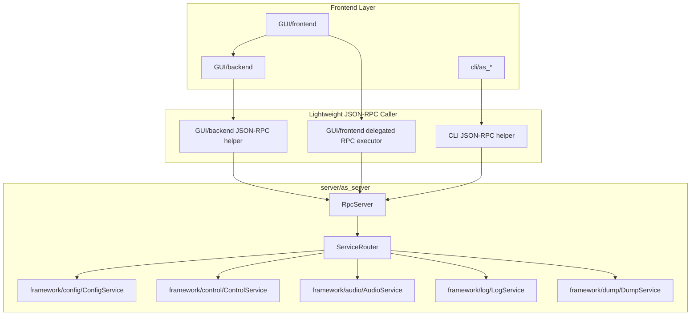

### 5.2 server 内部分层

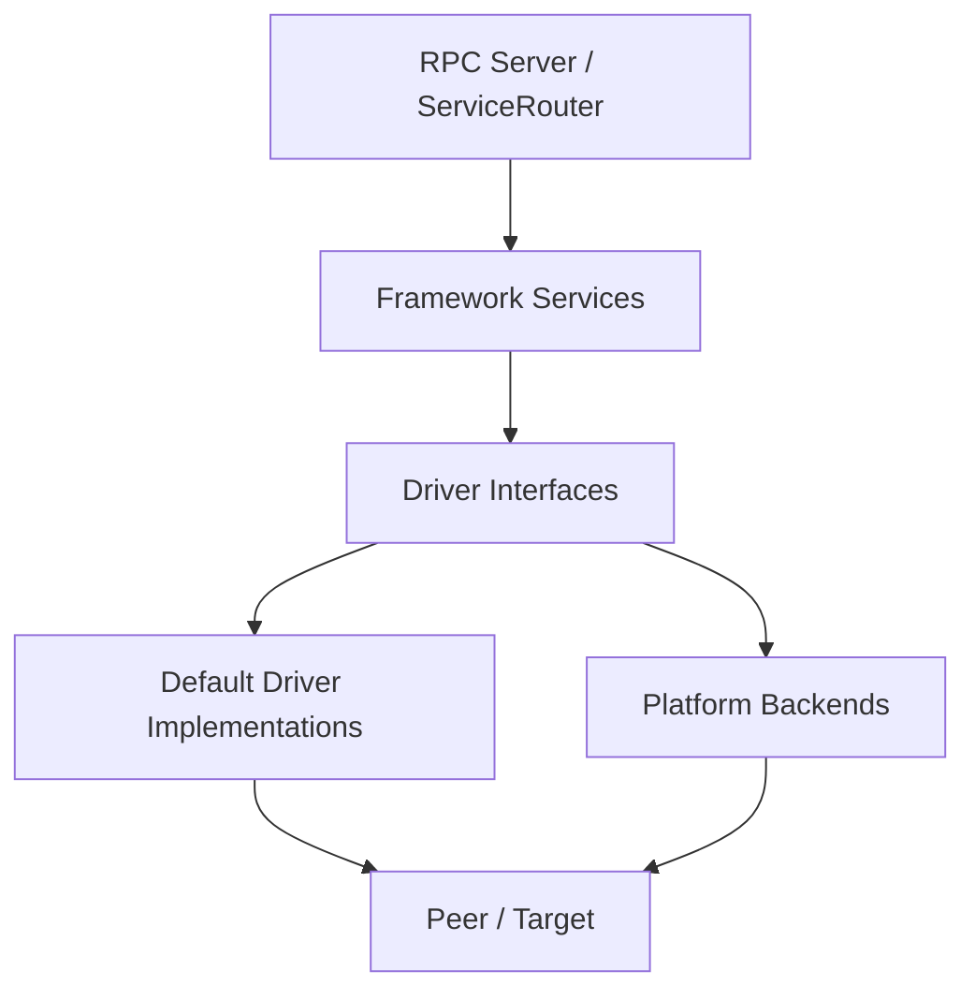

### 5.3 framework 不直接调用 platform/transport 的边界

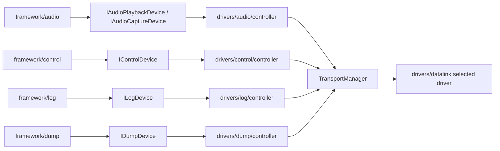

重点：

```text
framework/audio、framework/control、framework/log、framework/dump 都不直接调用 TransportManager。
TransportManager 是 controller 类 driver implementation 的内部依赖。
```

---

## 6. UML：关键类关系

### 6.1 DriverManager 与 Registry

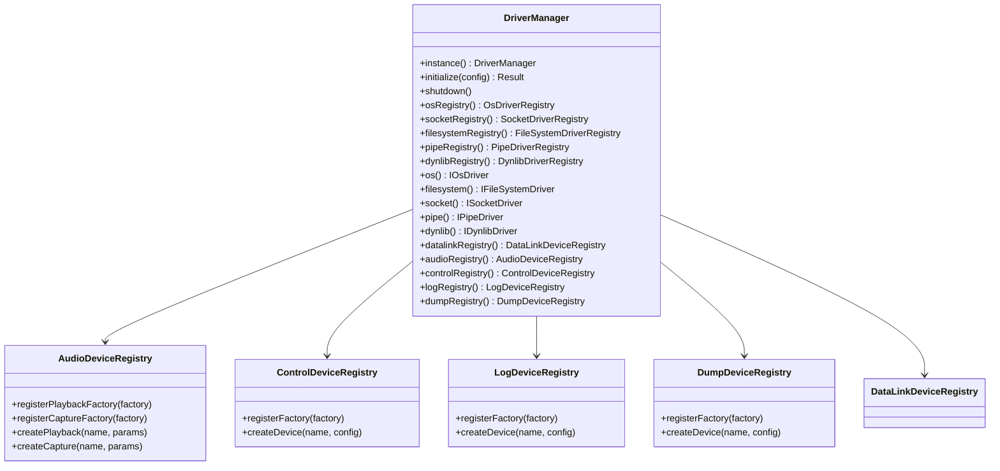

### 6.2 Audio / Control / Log / Dump Service 与 Device Interface

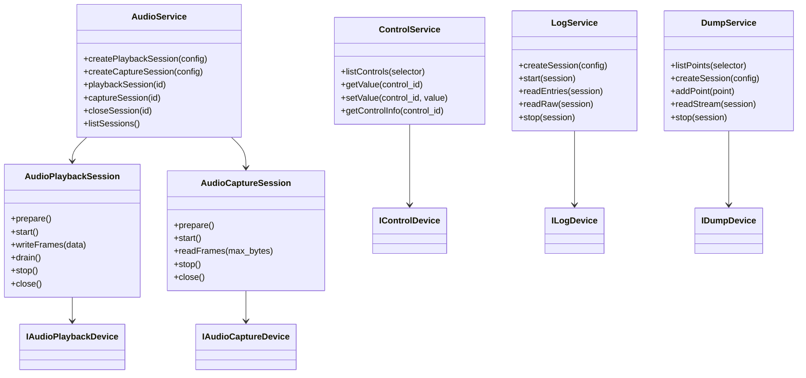

`AudioService` 是 audio framework 的 session factory 和 registry，不直接在所有读写路径上持有全局大锁。每个 `AudioPlaybackSession` / `AudioCaptureSession` 持有一个 driver instance 和自己的状态锁；不同 session 使用不同 device 时可以并发执行。RPC wire 上的 `numeric_session_id` 只属于 `RpcRuntimeContext` 与 stream frame，不能泄漏进 framework service API。

### 6.3 Controller 类默认实现

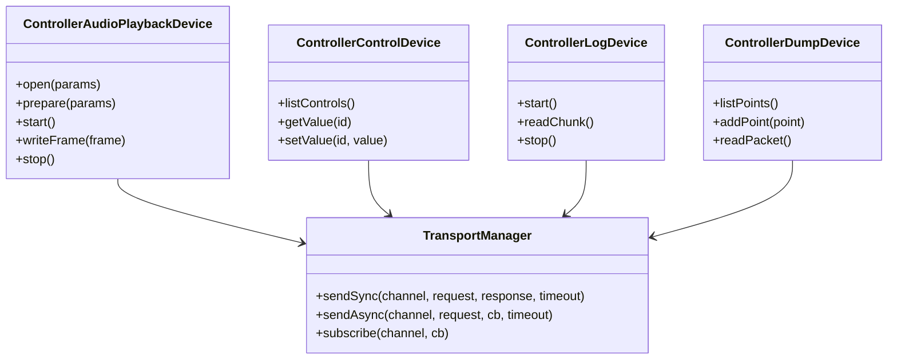

---

## 7. UML：典型时序

### 7.1 as_play：A2 直连 / Simulator Controller 模式

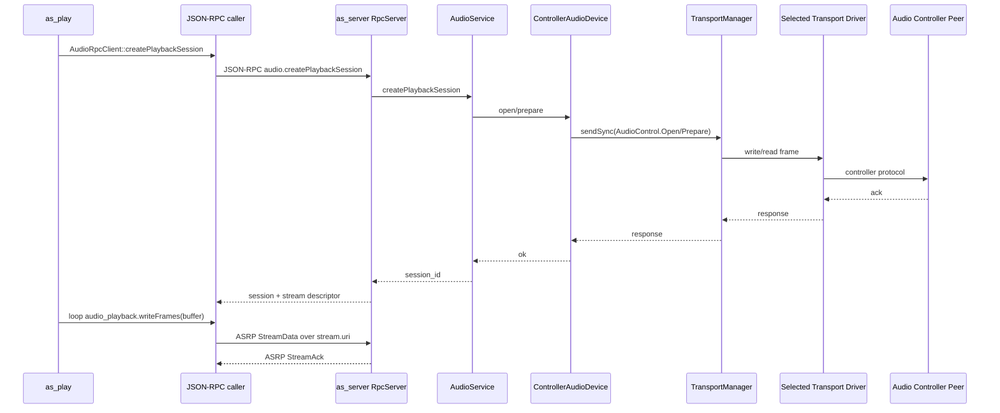

Linux host profile 当前落地路径为：

```text
as_play/as_record
  -> AudioRpcClient typed facade
  -> JSON-RPC control plane + ASRP binary stream plane
  -> as_server AudioService
  -> DriverManager::audioRegistry()
  -> drivers/audio AlsaAudioPlaybackDevice / AlsaAudioCaptureDevice
  -> ALSA device, e.g. default/null/plughw:2,0
```

A2/controller profile 后续沿用同一 `IAudioPlaybackDevice` / `IAudioCaptureDevice` interface，只替换 registry 中的 factory implementation。

Simulator profile 当前注册 `rv32qemu` 与 `rv32qemu-simulator` playback/capture factory。`as_server --audio-driver-factory rv32qemu --audio-datalink-endpoint <endpoint>` 提供默认 driver 与 data-link 配置；CLI 不再强制写死 ALSA/WASAPI/Pulse。`as_play <file.wav>` 会自动解析 PCM WAV header，并用文件中的 sample rate、channel count、bytes per sample 覆盖 CLI 默认值；`--device` 仍作为 SOF stream name，例如 playback 常用 `pcm_playback`。`as_record <out.wav>` 使用命令行显式参数生成 WAV，例如 `--sample-rate 48000 --channels 2 --bytes-per-sample 2 --duration-ms 1000 --device stream_0`。

### 7.2 as_control：A2 直连 Controller 模式

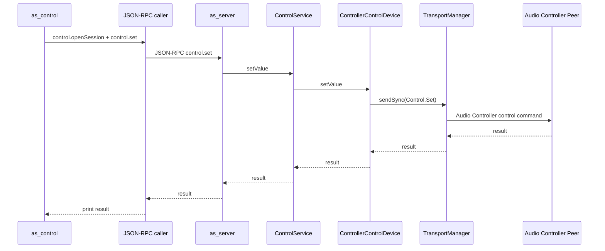

### 7.3 as_control：7870 互联 tinymix 模式

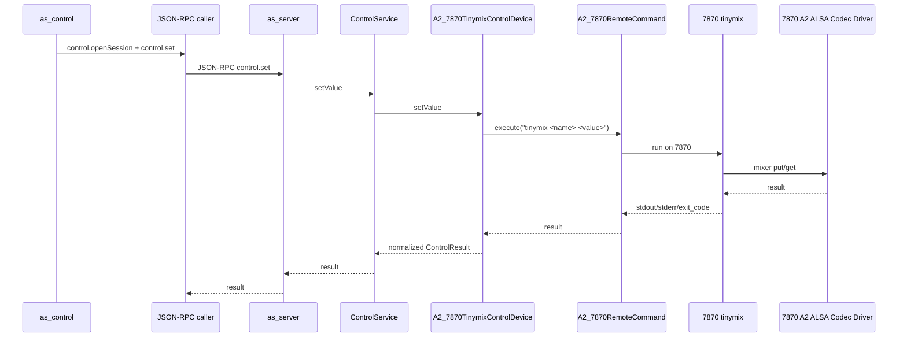

### 7.4 as_log

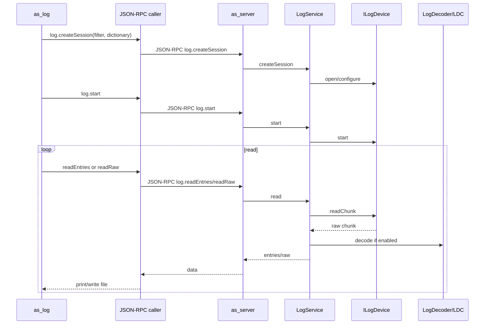

SOF logger follow 模式只把真实 SOF log entry 计入 session cursor。decoder 的 table header、EOF/footer 诊断、`Skipped ... after the last statement`、`Potential mailbox wrap`、`Found valid LDC address...` 和 resync 诊断行必须被过滤，不作为 `as_log` entry 输出，也不能计入已读 entry 数。有限 raw file 解码不启用 SOF converter trace mode，因为 trace mode 在 EOF 后会 reopen 循环，可能导致 follow 卡住。

### 7.5 as_dump

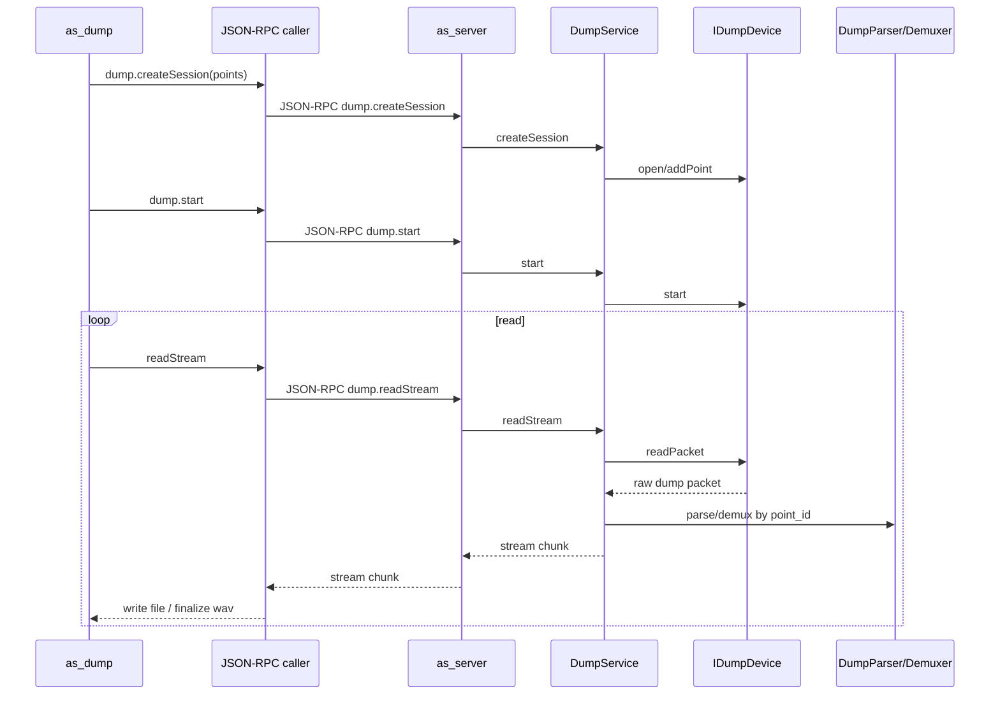

### 7.6 as_config 编译流程

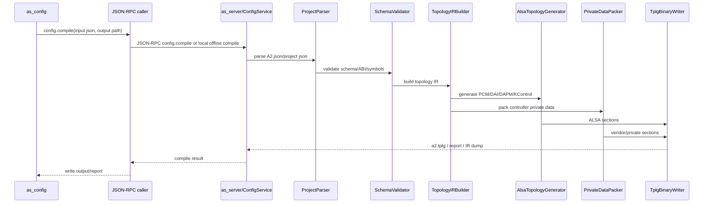

当前 rv32qemu 验证路径使用同一个 `A2.json` 生成 `as-config-a2-fileio.tplg`，再由 `audio_controller` 的 pipeinstall 安装指定 pipeline。验证点包括：

- playback pipeline：FILEIO0 -> channel_remap -> delay -> fader_balance -> host，使用生成的 stereo 1 kHz tone，验证 play 链路有非零输出。
- capture pipeline：host -> channel_remap -> FILEIO0，使用 file input，验证 srecord 链路有非零 capture WAV。
- dsp_filter coverage pipeline：FILEIO1 -> dsp_filter -> host，使用 rv32qemu generic C dsp_filter，验证 DAI1 输出 WAV 的频率与 THD+N 指标。

这条链路要求 as_config 输出的 tplg 与传统 m4 FILE_IO topology 在 audio_controller 安装和 splay/srecord 行为上等价；差异只应来自 Audio Studio private payload、control bytes 以及项目命名。

---

## 8. as_control 架构补充

`as_control` 的架构层次必须和 `as_play/as_record` 一致。CLI 前端只负责参数解析、RPC 调用和结果展示，真正控制设备访问由 as_server 内的 `framework/control` 与 `drivers/control` 完成。

### 8.1 通用调用链

```text
cli/as_control
  -> cli/common/json_rpc_client
  -> JSON-RPC control.*
  -> server/framework/control/ControlService
  -> drivers/control/include/IControlDevice
  -> selected control device implementation
```

### 8.2 A2 direct / Simulator Controller 模式

A2 直连模式和 DSP simulator 模式默认使用通用 controller control driver：

```text
ControlService
  -> ControllerControlDevice
  -> TransportManager
  -> selected data-link driver
  -> Audio Controller peer
```

因此所有基于 Audio Controller 的平台都不需要重复实现 control driver，只需要选择：

```text
CONFIG_DRIVER_CONTROL_CONTROLLER=y
CONFIG_FRAMEWORK_TRANSPORT=y
CONFIG_TRANSPORT_xxx=y
```

### 8.3 7870 互联 tinymix 模式

7870 互联模式的 runtime control 不是直接走 Audio Controller，而是远程调用 7870 用户态 `tinymix`，再由 7870 ALSA Codec Driver 完成 KControl get/put。

```text
ControlService
  -> A2_7870TinymixControlDevice
  -> A2_7870RemoteCommand
  -> tinymix on 7870
  -> 7870 A2 ALSA Codec Driver
  -> A2 control command
```

该模式实现位于：

```text
Audio-Studio/server/platform/a2/control/
  a2_7870_tinymix_control_device.cpp
  a2_7870_tinymix_control_factory.cpp
```

### 8.4 ControlDevice interface

```cpp
class IControlDevice {
public:
    virtual ~IControlDevice() = default;

    virtual ControlResult open(const ControlDeviceConfig& config) = 0;
    virtual ControlResult listControls(std::vector<ControlInfo>& controls) = 0;
    virtual ControlResult getControlInfo(const ControlId& id, ControlInfo& info) = 0;
    virtual ControlResult getValue(const ControlId& id,
                                   ControlValue& value,
                                   uint32_t timeout_ms) = 0;
    virtual ControlResult setValue(const ControlId& id,
                                   const ControlValue& value,
                                   uint32_t timeout_ms) = 0;
    virtual ControlResult getStats(ControlDeviceStats& stats) = 0;
    virtual void close() = 0;
};
```

---

## 9. as_config 正式实现设计入口

`as_config` 的完整设计以 `as_config_design.md` 为准，并已完整吸收到本文档后续章节。这里先固定工程层面的实现落点。

### 9.1 as_config 代码归属

```text
cli/as_config:
  命令行前端。负责解析参数、连接 server、调用 config RPC、写输出文件。

server/framework/config:
  as_config 编译核心。负责 JSON 解析、schema 校验、通用 IR 构建、target generator 调度、private data pack。
  禁止出现以平台命名的数据结构和接口。

server/framework/config/alsa_port:
  参考 Linux ALSA lib、Linux kernel ALSA topology、SOF tools/tplg_parser 后 porting 的 topology pack/parse 适配代码。
  仅作为 target generator 使用的 ALSA 写出适配层，不把 A2 语义泄漏进 framework/config。
```

### 9.2 as_config 支持模式

建议支持两种运行模式：

```text
Server RPC 模式：
  as_config -> cli/common/json_rpc_client -> as_server ConfigService
  用于产品化工具链，与 GUI/CLI 统一。

Standalone/offline 模式：
  as_config 直接链接 config_compiler_core 静态库。
  用于 CI、无 server 环境、构建时生成 topology。
```

两种模式必须共用同一套 `ConfigCompiler` 实现，禁止出现两套编译逻辑。

---

## 10. 新顶层工程目录下的构建目标

```text
Audio-Studio/GUI/frontend:
  当前为 standalone HTML/CSS/JS 前端，无 npm/Vite 构建要求；由 GUI/backend 托管静态资源。
  GUI/frontend/assets/js 下被 Node 单元测试直接 import 的纯逻辑模块必须保持 Node 12 可解析语法；
  不使用 node: builtin import、optional chaining、nullish coalescing 等会破坏当前 host-alone 测试入口的语法。

Audio-Studio/GUI/backend:
  构建 GUI Web Backend、GUI REST 兼容层、mock runtime、JSON-RPC orchestrator。
  不构建 as_server、framework、driver implementation、platform backend。

Audio-Studio/cli:
  构建 as_config/as_rpc/as_control/as_play/as_record/as_log/as_dump。
  当前阶段支持 host-alone dummy CLI、默认 socket RPC，以及 --rpc pipe 两种 as_server RPC 调用；
  as_config 按当前任务边界暂不实现。

Audio-Studio/rpc:
  构建 JSON-RPC core、单点 API registry、typed facade、client transport、server transport。
  CONFIG_RPC_CLIENT 与 CONFIG_RPC_SERVER 分开控制；CONFIG_RPC_TRANSPORT_SOCKET/PIPE 由 profile 决定。

Audio-Studio/drivers:
  构建 DriverManager、driver interface registry、Linux host socket/pipe/os/filesystem/dynlib/audio/control/log/dump 等默认实现。
  每个模块自己的 CMakeLists.txt 和 Kconfig 由顶层 drivers/CMakeLists.txt、drivers/Kconfig 递归接入。

Audio-Studio/server:
  构建 as_server、framework 静态库/动态库、platform backend，并按 profile 链接 rpc/drivers。

Audio-Studio/audio_controller:
  构建 simulator audio_controller 或 A2 侧可移植 controller reference。

Audio-Studio/scripts:
  build_all.sh、Kconfig resolve、CMake configure、toolchain 管理、生成 autoconf。
  scripts/run_tests.sh 是 host-alone 统一回归入口，必须先运行可执行的 GUI 逻辑测试，再构建 C++ 目标并运行 CTest。
```

构建输出建议：

```text
out/<profile>/<host-os>/<build-type>/
  bin/
    as_server
    as_config
    as_control
    as_play
    as_record
    as_log
    as_dump
  lib/
    libstudio_framework.a
    libstudio_drivers.a
    libstudio_rpc.a
  plugins/
  config/
  reports/
```

---

## 11. Kconfig 与目录映射

示例：

```kconfig
config APP_AS_CONFIG
    bool "Build as_config CLI"
    depends on FRAMEWORK_CONFIG
    default y

config GUI_ENABLE
    bool "Enable GUI build target"
    default y

config SERVER_AS_SERVER
    bool "Build as_server"
    default y

config AUDIO_CONTROLLER_SIMULATOR
    bool "Build simulator audio_controller peer"
    default y if PLATFORM_SIMULATOR
```

Controller 类默认实现：

```kconfig
config DRIVER_AUDIO_CONTROLLER
    bool "Enable Audio Controller audio device"
    depends on DRIVER_AUDIO && FRAMEWORK_TRANSPORT
    default y

config DRIVER_CONTROL_CONTROLLER
    bool "Enable Audio Controller control device"
    depends on DRIVER_CONTROL && FRAMEWORK_TRANSPORT
    default y

config DRIVER_LOG_CONTROLLER
    bool "Enable Audio Controller log device"
    depends on DRIVER_LOG && FRAMEWORK_TRANSPORT
    default y

config DRIVER_DUMP_CONTROLLER
    bool "Enable Audio Controller dump device"
    depends on DRIVER_DUMP && FRAMEWORK_TRANSPORT
    default y
```

7870 互联模式：

```kconfig
config PLATFORM_A2_7870_AUDIO_TINYALSA_FIFO
    bool "Enable A2 7870 tinyalsa FIFO audio device"
    depends on PLATFORM_A2 && DRIVER_AUDIO && DRIVER_PIPE && DRIVER_FILESYSTEM

config PLATFORM_A2_7870_CONTROL_TINYMIX
    bool "Enable A2 7870 tinymix control device"
    depends on PLATFORM_A2 && DRIVER_CONTROL && DRIVER_OS_PROCESS
```

---

## 12. 详细设计正文

以下章节承接此前已确认的完整设计结论，并在本版文档中作为正式设计基线。

本节为 0.7 版详细设计参考，已按 GUI/backend、JSON-RPC 直接通信、server session、通用 as_config、SOF logger/probes 基线重新收敛。

---

### 12.1 文档目标

本文档汇总此前关于 Audio Studio 工程化、框架分层、驱动抽象、平台适配、音频读写、Log/Dump、RPC 前端、插件扩展、构建配置系统等方面的讨论结论。

本文档目标是形成一个稳定的软件架构基线，使后续可以在此基础上继续细化：

- `framework/audio`
- `framework/log`
- `framework/dump`
- `framework/transport`
- `framework/config`
- `framework/plugin`
- `framework/server`
- `drivers/*`
- `platform/a2`
- `platform/simulator`
- `apps/as_*`
- `scripts/build_all.sh` 与 Kconfig 风格配置系统

本文档中的 Audio Studio 是一个通用 PC 端音频调试、配置、控制、观测框架，不是 A2 专用工具。A2 只是第一个验证平台和平台实现示例。后续客户平台、DSP simulator 或其他音频控制器平台都应能够复用 Audio Studio 的 common framework。

---

### 12.2 核心设计原则

#### 2.1 Audio Studio 不是 A2 专用框架

Audio Studio 的通用层命名、目录、接口、协议、构建系统不应带 A2 前缀。A2 相关内容只允许出现在：

```text
platform/a2/
configs/platform/a2/a2_defconfig
A2 相关 profile
A2 相关文档章节
```

通用 framework 中应使用如下中性命名：

```text
Audio Studio
TransportManager
DriverManager
AudioDeviceRegistry
LogDeviceRegistry
DumpDeviceRegistry
AudioControllerDevice
ControllerLogDevice
ControllerDumpDevice
```

不推荐在通用层使用：

```text
A2TransportManager
A2AudioBackend
A2LogDevice
A2PluginSDK
```

#### 2.2 framework 不直接调用系统 API

Audio Studio framework 层禁止直接调用 OS-specific API，包括但不限于：

```cpp
#include <windows.h>
#include <winsock2.h>
#include <sys/socket.h>
#include <unistd.h>
#include <pthread.h>
#include <dlfcn.h>
#include <fcntl.h>
```

framework 只能依赖 driver abstraction interface：

```cpp
#include "studio/drivers/os/..."
#include "studio/drivers/socket/..."
#include "studio/drivers/filesystem/..."
#include "studio/drivers/pipe/..."
#include "studio/drivers/dynlib/..."
#include "studio/drivers/audio/..."
#include "studio/drivers/log/..."
#include "studio/drivers/dump/..."
```

#### 2.3 framework 不直接依赖 platform

`framework/*` 不能包含：

```cpp
#include "platform/a2/..."
#include "platform/simulator/..."
```

framework 通过 driver interface、registry、profile、config 与平台实现解耦。

#### 2.4 Driver 层同时提供 interface 与默认实现

Driver 层不是单纯 interface 层。它需要同时提供：

1. 稳定 interface；
2. 可复用默认 driver implementation；
3. registry/factory；
4. CONFIG 开关；
5. platform override 能力。

目标是减少 platform 层开发压力。例如 Linux simulator 可以直接 select POSIX OS、POSIX FIFO、TCP transport，不需要 platform 自己重新实现这些基础驱动。

#### 2.5 Platform 层负责选择、组合、适配

Platform 层主要职责是：

```text
选择默认 profile
注册平台特定 backend
注册平台特定 data-link driver
定义平台默认配置
定义平台能力查询、握手、remote command 等平台策略
```

Platform 层不应该重复实现已有通用 driver，除非默认实现无法满足平台需求。

#### 2.6 TransportManager 不是所有 framework 的直接依赖

TransportManager 是 framework/core 的底层通信管理类，主要服务于需要和对端 controller 通信的 driver implementation 或 service。重要边界：

```text
framework/audio 不直接调用 TransportManager
framework/control 不直接调用 TransportManager
framework/log 不直接调用 TransportManager
framework/dump 不直接调用 TransportManager
```

它们只调用对应的设备抽象接口：

```text
framework/audio   -> IAudioPlaybackDevice / IAudioCaptureDevice
framework/control -> IControlDevice
framework/log     -> ILogDevice
framework/dump    -> IDumpDevice / IProbeDevice
```

如果某个设备实现基于 Audio Controller，则由该 driver implementation 内部调用 TransportManager。

#### 2.7 CLI app 前端必须轻量

`as_log`、`as_dump`、`as_play`、`as_record`、`as_config`、`as_control` 等 app 命令行前端主要负责：

```text
命令行参数解析
RPC 调用 as_server service API
本地文件 IO
stdout/stderr 输出
Ctrl+C 清理
```

真正的 service 生命周期、设备打开、target 连接、session 管理、数据读取、decode/demux、平台驱动访问都应放在 `as_server` 进程内。

---

### 12.3 Audio Studio 整体分层

新版整体分层如下：

```text
Audio Studio
│
├── 0. Build & Config System
│     scripts/build_all.sh
│     scripts/cmake/
│     Kconfig / defconfig / generated config
│
├── 1. Apps / CLI Layer
│     as_server / as_config / as_control / as_log / as_dump / as_play / as_record
│
├── 2. JSON-RPC Caller Layer
│     cli/common/json_rpc_client
│     GUI/backend/audio_studio_json_rpc_client
│     GUI/frontend delegated RPC executor
│
├── 3. Framework Service Layer
│     server / config / control / log / dump / audio / plugin
│
├── 4. Framework Core Layer
│     transport / protocol / ipc / scheduler / session / common
│
├── 5. Driver Abstraction Interface Layer
│     os / socket / filesystem / pipe / dynlib / transport / audio / log / dump
│
├── 6. Driver & Backend Implementation Layer
│     posix / win32 / tcp / fifo / host-alsa / controller-device / null / loopback
│
├── 7. Platform Layer
│     a2 / simulator / customer_x
│
└── 8. Peer Side / Target Side
      A2 RISC-V Audio Controller
      DSP Simulator Audio Controller
      7870 Android tinyalsa + FIFO
```

#### 3.1 推荐源码目录

```text
audio_studio/
  Kconfig

  scripts/
    build_all.sh
    kconfig/
      menuconfig
      genconfig.py
    cmake/
      common.cmake
      config.cmake
      toolchain/
        linux-gcc.cmake
        linux-clang.cmake
        windows-mingw.cmake
        macos-clang.cmake
      modules/
        audio_studio_library.cmake
        audio_studio_app.cmake
        audio_studio_driver.cmake
        audio_studio_platform.cmake

  configs/
    a2_linux_defconfig
    a2_windows_defconfig
    simulator_linux_defconfig
    simulator_windows_defconfig
    simulator_macos_defconfig

  apps/
    as_server/
    as_config/
    as_control/
    as_log/
    as_dump/
    as_play/
    as_record/

  client/
    rpc/
      rpc_client.cpp
      rpc_connection.cpp
      rpc_frame_codec.cpp
    services/
      system_client.cpp
      log_client.cpp
      dump_client.cpp
      audio_client.cpp
      config_client.cpp
      control_client.cpp

  framework/
    common/
    server/
    session/
    config/
    control/
    log/
    dump/
    audio/
    plugin/
    protocol/
    transport/

  drivers/
    os/
    socket/
    filesystem/
    pipe/
    dynlib/
    transport/
    audio/
    log/
    dump/

  platform/
    a2/
    simulator/
    customer_x/
```

---

### 12.4 Build & Config System

#### 4.1 CONFIG 系统属于整个 Audio Studio

CONFIG 系统不是 Transport 的配置系统，而是整个 Audio Studio 工程的配置系统。

它决定：

```text
是否编译 as_server
是否编译 as_log / as_dump / as_play / as_record
是否启用 Plugin SDK
是否启用 TCP data-link driver
是否启用 FIFO / pipe driver
是否启用 Audio Controller audio/log/dump driver
是否启用 A2 platform
是否启用 simulator platform
是否编译 shared library / static library / CLI tools
```

#### 4.2 Kconfig/defconfig 风格设计

Audio Studio 使用类似 SOF 的 Kconfig/defconfig 配置方式。CMake 不是配置系统，只是后端构建生成器。当前实现已引入 `scripts/kconfig` Kconfig 工具链，并通过 `scripts/cmake/kconfig.cmake` 在 configure 阶段从 `configs/*_defconfig` 生成 `.config` 和 C/C++ 可消费的 `autoconfig.h`。

```text
Kconfig -> defconfig -> generated/.config -> generated/include/autoconfig.h -> CMake/Ninja
```

当前生成文件：

```text
out/<os>/<platform>/<profile>/<build-type>/generated/.config
out/<os>/<platform>/<profile>/<build-type>/generated/include/autoconfig.h
out/<os>/<platform>/<profile>/<build-type>/CMakeCache.txt
```

当前 CONFIG 依赖关系以 target platform choice 和模块开关为核心，Kconfig choice 保证同一组 platform choice 中只有一个 `CONFIG_TARGET_PLATFORM_*` 为 `y`。Kconfig tree 采用 SOF 风格的 source 分层，根 `Kconfig` 只保留顶层入口并 source 子目录：

```text
Kconfig
GUI/Kconfig
tests/Kconfig
server/Kconfig
server/framework/Kconfig
drivers/Kconfig
drivers/<module>/Kconfig
server/platform/Kconfig
server/platform/a2/Kconfig
server/tests/Kconfig
cli/Kconfig
```

模块开关按目录消费，例如 `CONFIG_GUI_BACKEND` 控制 `GUI/backend` 是否加入构建，`CONFIG_SERVER`、`CONFIG_CLI`、`CONFIG_FRAMEWORK_*`、`CONFIG_DRIVER_*` 继续沿用同一模式。每个 driver 模块自己维护 interface 和 implementation Kconfig，例如 `drivers/audio/Kconfig` 定义 `CONFIG_DRIVER_AUDIO`、`CONFIG_DRIVER_AUDIO_ALSA`、`CONFIG_DRIVER_AUDIO_PULSE`、`CONFIG_DRIVER_AUDIO_WASAPI`。PC OS 和 toolchain 不写入 `configs/`，只由 `build_all.sh` 选择对应 `scripts/cmake/toolchain/*.cmake`，并在生成 initial config 时按 host OS 选择 socket/audio 默认 implementation。

#### 4.3 build_all.sh 是推荐唯一入口

示例：

```bash
./scripts/build_all.sh linux a2
./scripts/build_all.sh windows a2
./scripts/build_all.sh --dry-run windows a2
./scripts/build_all.sh --profile gui_backend -r linux a2
```

`build_all.sh` 是 shell 脚本入口，风格和职责对齐 SOF/codec 的多平台脚本。第一个位置参数是 PC OS，用来选择 toolchain 文件和输出目录；后续位置参数是 target platform，用来选择 platform defconfig。命令行不传 `--toolchain`，toolchain 由 OS 映射决定；`configs/` 不包含 OS defconfig。

内部流程：

```text
1. 根据 OS 选择 scripts/cmake/toolchain/<target>.cmake
2. 根据 target platform 选择 configs/platform/<platform>_defconfig
3. 拼接 profile defconfig 与 platform defconfig，生成 build-local initial.config
4. 创建 out/<os>/<platform>/<profile>/<Debug|Release>/
5. CMake configure
6. Kconfig 生成 generated/.config 和 generated/include/autoconfig.h
7. 可选 menuconfig
8. CMake build
9. 输出 bin/lib/test 产物到 build directory
```

当前第一阶段只要求打通最小 `server/as_server/main.cpp`：

```text
linux/a2   -> configs/profile/as_server_minimal_defconfig + configs/platform/a2/a2_defconfig -> scripts/cmake/toolchain/linux-gcc.cmake    -> out/linux/a2/as_server_minimal/Debug/as_server
windows/a2 -> configs/profile/as_server_minimal_defconfig + configs/platform/a2/a2_defconfig -> scripts/cmake/toolchain/windows-mingw.cmake -> out/windows/a2/as_server_minimal/Debug/as_server.exe
macos/a2   -> configs/profile/as_server_minimal_defconfig + configs/platform/a2/a2_defconfig -> scripts/cmake/toolchain/macos-clang.cmake -> out/macos/a2/as_server_minimal/Debug/as_server
linux/a2 gui_backend -> configs/profile/gui_backend_defconfig + configs/platform/a2/a2_defconfig -> scripts/cmake/toolchain/linux-gcc.cmake -> out/linux/a2/gui_backend/Release/audio_studio_server
```

macOS 构建支持使用 native Clang 工具链，通过 `scripts/cmake/toolchain/macos-clang.cmake` 配置。CI 在 `macos-latest` runner 上验证 macOS driver tests。

#### 4.4 Linux 构建环境与多目标产物

当前设计要求：

```text
构建环境优先只要求 Linux。
当前阶段验证 Linux host、Windows/MinGW 映射以及 macOS native Clang 构建。
```

示例 toolchain：

```text
linux   -> scripts/cmake/toolchain/linux-gcc.cmake
windows -> scripts/cmake/toolchain/windows-mingw.cmake
macos   -> scripts/cmake/toolchain/macos-clang.cmake
```

Windows/macOS toolchain 文件是结构化入口，实际编译依赖调用环境提供 MinGW 或 osxcross。当前 host-alone CI 强制验证 Linux/GCC 配置生成与 `as_server` 编译，并在缺少 MinGW 时只验证 Windows 平台映射。

#### 4.5 CMake 的职责

CMake 只消费 CONFIG：

```cmake
include(scripts/cmake/kconfig.cmake)
read_kconfig_config("${DOT_CONFIG_PATH}")

if(CONFIG_GUI_BACKEND)
  add_subdirectory(GUI/backend)
endif()

if(CONFIG_SERVER)
  add_subdirectory(server)
endif()

if(CONFIG_CLI)
  add_subdirectory(cli)
endif()
```

CMake 不负责判断：

```text
Linux 该用 POSIX
Windows 该用 Win32
某平台默认该用什么 driver
```

这些由 Kconfig 决定。

---

### 12.5 as_config 设计：以 A2.json 为示例的配置编译映射

章节版本：0.7 同步版  
输入配置：`A2.json`，schema `1.3.0`  
目标产物：ALSA topology binary，建议命名为 `a2.tplg`  
适用对象：`as_config` 开发者、A2 ASoC Codec 驱动开发者、A2 Controller 配置解析开发者

---

#### 1. 设计目标

`as_config` 的目标是把 Audio Studio project JSON 编译为目标平台可消费的配置产物。`A2.json` 是 Audio Studio 第一个测试平台配置和贯穿本文的完整示例，不代表 `as_config` 是 A2 专用工具。

第一阶段示例目标是把 `A2.json` 编译为 Linux ALSA/ASoC 可加载的 topology binary，同时保留 A2 Controller / DSP 需要的 private config。

生成的 `a2.tplg` 必须同时满足两类消费者：

1. **ALSA/ASoC 标准框架**
   - 创建 PCM 设备；
   - 创建 Codec DAI / AIF / DAPM widget；
   - 创建 DAPM route；
   - 创建 ALSA KControl；
   - 提供 bool/int/enum、range/TLV 等用户空间可见控制能力。

SOF 基础 component 的 bytes 型 runtime parameter 由 `plugins/builtin_module_configs` 生成标准 `SectionControlBytes`，随 `.conf` 一起进入 `alsatplg` 编译出的 `.tplg`。未知或 Audio Studio 专用参数仍进入 `AS_PRIVATE`，由 A2 ASoC Codec 驱动按 private metadata 自动暴露自定义 KControl；标准 Linux + SOF 方案可忽略这些 A2 private bytes 控件，但仍能正确解析和创建 pipeline/PCM。

2. **A2 ASoC Codec 驱动与 A2 Controller**
   - 从 topology private data 中解析 A2 pipeline graph；
   - 解析 node、module instance、module type 关系；
   - 解析 parameter 元信息；
   - 建立 KControl 到 A2 parameter 的映射；
   - 编码参数 wire format；
   - 支持 preset、scene、pipeline install/config 等 A2 私有语义。

因此，`a2.tplg` 不是简单的 ALSA 声卡描述文件，而是：

```text
A2.json
  -> as_config
      -> ALSA 标准 topology section
      -> A2 private topology/config section
```

通用命名约束：

```text
framework/config 代码中禁止出现以平台命名的数据结构、接口和默认文件名，例如 a2_config_ir、a2_parser。
通用层使用 StudioProject、StudioConfigIr、TargetGenerator、PrivateDataPacker 等命名。
A2 相关命名只允许出现在 platform/a2/config、target/a2_alsa_topology、A2 private data layout、测试数据和文档示例中。
```

---

#### 2. 总体设计原则

##### 2.1 A2.json 是配置源

`A2.json` 是平台音频配置的 source of truth。  
ALSA topology binary 是从 `A2.json` 派生出的 Linux/ASoC 侧产物。

```text
A2.json 描述完整平台配置；
imports[] 可导入共享 module catalog，项目 JSON 不重复声明通用内置算法；
a2.tplg 描述 Linux ALSA/ASoC 可见的声卡拓扑；
a2.tplg private data 保留 A2 Controller / DSP 需要的私有配置；
A2 ASoC Codec driver 负责把 ALSA 控件和 route 行为转成 A2 控制命令。
```

##### 2.2 parameter 统一建模

新版 `A2.json` 已经取消静态参数/动态参数两套概念。  
所有算法配置统一使用：

```text
module_types[].parameters[]
```

每个 parameter 的语义由以下字段共同决定：

```text
parameter.type/value_type:
  参数值类型，同时决定 ALSA KControl 类型和 A2 Codec driver 使用哪套 info/get/put。

parameter.apply.settable_states:
  参数允许在哪些 pipeline 状态下 set。
  只有包含 RUNNING 的 parameter，才允许由 as_config 例化成 ALSA KControl。

parameter.apply.mode:
  A2 Controller / DSP 侧参数生效策略，例如 on_install、next_frame、immediate、safe_point。
  不作为 ALSA KControl put/get 类型选择依据。

parameter ID:
  as_config 根据 type_id + param_id 自动生成稳定 param_uid，并生成 C 头文件宏。
  JSON 不再填写手写参数编码字段；A2 Controller、as_control、codec driver 使用生成的 ID 表定位参数。

parameter payload encoding:
  参数如何打包成 DSP/controller wire payload 由 module config handler 决定。
  内置 module 使用内置 handler；三方算法通过 plugin 注册自己的 module config handler。
```

##### 2.3 KControl 生成的核心规则

```text
KControl 是否生成 = f(apply.settable_states)
KControl 使用哪套 info/get/put = f(parameter.type/value_type)
A2 参数如何生效 = f(apply.mode/requires)
A2 参数 ID = stable_id(type_id:param_id)
A2 参数 payload = module_config_handler.pack(...)
```

必须严格执行：

```text
只有 apply.settable_states 包含 RUNNING 的 parameter，才生成 ALSA KControl。
不包含 RUNNING 的 parameter，只进入 A2 private install/config/preset block。
```

---

#### 3. as_config 输入与输出

##### 3.1 输入

```bash
as_config --input A2.json --out-dir out/as_config/a2 --project-name a2
```

建议扩展参数：

```bash
as_config \
  --input A2.json \
  --out-dir out/as_config/a2 \
  --project-name a2 \
  --plugin libthird_party_module_config.so
```

##### 3.2 输出文件

| 文件 | 说明 |
|---|---|
| `a2.conf` | as_config 生成的 ALSA topology conf，中间产物，保留用于 review/debug |
| `a2.tplg` | Linux host 且启用 `build_tplg` 时，由 `alsatplg -c a2.conf` 生成的 ALSA topology binary |
| `a2_private.bin` | Audio Studio private binary block，A2 driver/audio_controller 可直接解析 |
| `include/as_config_ids.h` | 自动生成 module type、parameter、control 稳定 ID 宏 |
| `include/as_tplg_private.h` | private block C 结构定义 |
| `include/as_preset_ids.h` | preset 稳定 ID 宏 |
| `a2_controls.csv` | KControl 映射表，用于 driver/debug/test |
| `a2_compile_report.json` | 编译报告，列出数量、`build_tplg/tplg_built` 状态、输出路径、警告和工具日志位置 |
| `a2_alsatplg.log` | Linux host 且启用 `build_tplg` 时，`alsatplg -c` 输出日志，必须不包含 topology error |
| `a2_decode.conf` | Linux host 且启用 `build_tplg` 时，`alsatplg -d a2.tplg` 反解出的 topology conf，用于合法性验证 |
| `a2_decode.log` | Linux host 且启用 `build_tplg` 时，`alsatplg -d` 输出日志，必须不包含 topology error |

---

#### 4. 编译流水线

`as_config` 不应边解析 JSON 边直接输出 tplg。建议先生成稳定 IR。

```text
A2.json
  -> JSON parser
  -> schema validator
  -> symbol table builder
  -> A2 Topology IR
  -> module config handler validate/pack
  -> ALSA topology generator
  -> private data packer
  -> conf/header/report writer
  -> alsatplg compiler
  -> alsatplg decoder validator
```

推荐 IR：

```c
struct studio_config_ir {
    struct studio_meta_ir meta;
    struct studio_hw_ir hw;
    struct studio_module_type_ir module_types[];
    struct studio_instance_ir instances[];
    struct studio_pipeline_ir pipelines[];
    struct studio_node_ir nodes[];
    struct studio_edge_ir edges[];
    struct studio_param_ir params[];
    struct studio_control_ir controls[];
    struct studio_preset_ir presets[];
    struct studio_scene_ir scenes[];
};
```

编译步骤：

```text
1. 读取 A2.json。
2. 校验 meta/schema/firmware ABI/compiler compat。
3. 建立 module_type / module_instance symbol table。
4. 展开 pipeline 的 port、node、edge。
5. 校验 graph、端口、通道能力、parameter type/range/enum。
6. 生成 PCM/DAI/AIF/DAPM。
7. 生成 KControl。
8. 生成 A2 private section。
9. 写出 a2.tplg。
10. 调用 `alsatplg -d` 反解生成的 tplg，确认可被标准 ALSA topology parser 正确解析。
11. 输出编译报告。
```

---

#### 5. 顶层字段映射总表

| A2.json 字段 | ALSA topology 标准 section | A2 private data | as_config 处理规则 |
|---|---|---|---|
| `meta` | topology name/version comment，可选 | 必须保存 | 用于版本兼容校验 |
| `naming` | KControl 名称 | 必须保存 | 用于生成 control display name |
| `hardware_hints.cores` | 不生成标准 ALSA 对象 | 必须保存 | DSP/core affinity 和服务核信息 |
| `hardware_hints.audio_ios` | DAI capability hint，可选 | 必须保存 | 生成 DAI 能力，或供 driver 校验 |
| `module_types` | 可生成 widget/control 模板 | 必须保存 | module type、IO、parameter 模板 |
| `module_instances` | 不直接生成标准对象 | 必须保存 | pipeline node 解析时引用 |
| `pipelines[].ports` | PCM、DAI、AIF widgets | 必须保存 | 有 `alsa_hint` 才生成 ALSA 可见 endpoint |
| `pipelines[].nodes` | DAPM widgets | 必须保存 | port/module/module_inline 三类节点 |
| `pipelines[].edges` | DAPM routes | 必须保存 | derive.dapm=auto 时自动生成 |
| `parameters` | KControls/TLV/Enum，bytes 默认写入 private | 必须保存 | 仅 RUNNING settable 生成 KControl；bytes 由 A2 codec 从 private 暴露 |
| `presets` | 默认不生成标准对象 | 必须保存 | 编译为 bulk transaction private block |
| `scenes` | 默认不生成标准对象 | 必须保存 | 编译为 scene private block |


---

#### 6. meta 映射

`meta` 写入 private header，并用于编译期兼容性检查。

| 字段 | 处理 |
|---|---|
| `schema_id` | 写入 private header；必须匹配 `com.vsi.a2.audio_config` |
| `schema_version` | 写入 private header；as_config 必须校验支持范围 |
| `compiler_compat.min/max` | as_config 自检，不满足则失败 |
| `firmware_abi.vass_runtime` | 写入 private header，给 A2 driver/A2 Controller 校验 |
| `firmware_abi.module_abi_min/max` | module_type abi 校验 |
| `build.config_name` | topology name/comment |
| `build.created_utc` | private header build timestamp |

错误处理：

| 错误 | 处理 |
|---|---|
| schema 不支持 | fatal error |
| compiler_compat 不满足 | fatal error |
| module_type.abi_version 超出 firmware_abi 范围 | fatal error |
| created_utc 格式非法 | warning，不影响生成 |

---

#### 7. naming 映射

KControl 必须有两个名称：

| 名称 | 用途 | 生成规则 |
|---|---|---|
| `control_id` | 内部唯一 ID | `pipe_id.node_id.param_id` |
| `display_name` | ALSA KControl 用户可见名 | 默认使用 `name_template_pipeline` |

推荐：

```text
display_name = format(name_template_pipeline,
                      pipe_name = pipeline.name,
                      node_name = node.node_id,
                      param_name = parameter.param_name)
```

若 `display_name` 冲突，必须追加唯一后缀：

```text
Playback Main EQ EQ Switch
Playback Main EQ EQ Switch [PLAY_MAIN.EQ.enable]
```

不要只使用 `inst_name + param_name` 作为唯一名称。  
原因是同一个 instance 或 module_type 可能出现在多条 pipeline 或多个 node 中。

---

#### 8. hardware_hints 映射

`hardware_hints` 不是完整硬件初始化描述，不替代 DTS/ACPI。它只用于 as_config 生成 topology 能力提示和 A2 private config。

##### 8.1 cores


| Core | Role | Services |
| --- | --- | --- |
| core0 | vass_master |  |
| core1 | vass_worker |  |
| core2 | vass_worker |  |
| core3 | service_core | asrc, anc_filter |


映射规则：

| 字段 | ALSA 标准对象 | A2 private data | 说明 |
|---|---|---|---|
| `core0.role=vass_master` | 不生成 | 保存 | A2 Controller/VASS 调度参考 |
| `core1/core2.role=vass_worker` | 不生成 | 保存 | worker core 资源描述 |
| `core3.role=service_core` | 不生成 | 保存 | 标识 service pipeline/core3 service |
| `core3.services` | 不生成 | 保存 | asrc/anc_filter 等 service 约束 |

##### 8.2 audio_ios.tdm_ports


| ID | Use | Dir | Max Ch | Rates |
| --- | --- | --- | --- | --- |
| TDM0 | 7870_audio | bidir | 16 | 48000,96000 |
| TDM1 | 7870_audio | bidir | 16 | 48000 |
| TDM2 | 7870_audio | bidir | 16 | 48000 |
| TDM3 | 7870_audio | bidir | 16 | 48000 |
| TDM4 | a2b_external | bidir | 32 | 48000 |
| TDM5 | a2b_external | bidir | 32 | 48000 |
| TDM6 | radio_dab | in | 2 | 48000 |
| TDM7 | radio_am | in | 2 | 48000 |
| TDM8 | radio_fm | in | 2 | 48000 |
| TDM9 | reserved | bidir | 16 | 48000 |
| TDM10 | reserved | bidir | 16 | 48000 |
| TDM11 | reserved | bidir | 16 | 48000 |


映射规则：

| 字段 | ALSA 标准对象 | A2 private data | 说明 |
|---|---|---|---|
| `id` | 可作为 DAI hw id | 保存 | 如 TDM0/TDM1 |
| `use` | 不直接生成 | 保存 | `7870_audio/a2b_external/radio_*` |
| `dir` | DAI direction hint | 保存 | `in/out/bidir` |
| `max_ch` | DAI channel capability | 保存 | 用于 PCM/DAI 约束校验 |
| `rates` | DAI rate capability | 保存 | 用于 PCM/DAI 约束校验 |

##### 8.3 audio_ios.i2s_fusa


| ID | Use | Dir | Max Ch | Rates |
| --- | --- | --- | --- | --- |
| I2S_FS0 | fusa_audio_out | out | 2 | 48000 |
| I2S_FS1 | fusa_audio_out | out | 2 | 48000 |


是否生成 ALSA DAI 取决于 pipeline port 是否引用该 I/O 且提供 `alsa_hint`。

##### 8.4 audio_ios.pcie


| ID | Use | Dir |
| --- | --- | --- |
| PCIE0 | alt_audio_or_dump | bidir |

PCIe 默认写入 A2 private data，不自动生成 PCM，除非 pipeline port 明确引用并提供 `alsa_hint`。

---

#### 9. module_types 映射

每个 `module_types[]` 是一个算法/图节点类型模板。项目 JSON 可以通过 `imports[]` 导入共享 catalog；导入后的 module type 与项目私有 `module_types[]` 一起进入同一个 IR，重复 `type_id` 是错误。

| 字段 | ALSA topology | A2 private data |
|---|---|---|
| `type_id` | widget private id，可选 | 必须保存 |
| `category` | widget class hint，可选 | 必须保存 |
| `abi_version` | 不直接暴露 | 必须保存并校验 |
| `io.in_ports/out_ports` | route 端口校验 | 必须保存 |
| `parameters` | KControl 模板 | 必须保存 |

推荐默认 widget 映射：

| module category/type | ALSA widget |
|---|---|
| `graph/basic` | `SND_SOC_DAPM_PGA` 或 vendor effect widget |
| `graph/routing`, `route.mux`, `route.selector` | `MUX` / `ENUM` / vendor route widget |
| `playback/eq`, `playback/dynamics`, `playback/fx` | vendor DSP effect widget |
| `capture/vavs` | vendor DSP effect widget |
| `service/core3` | vendor service widget；若无 ALSA endpoint，可只保留 private node |
| `common/rate` | vendor SRC/ASRC widget |

实际驱动实现中可以统一创建为 A2 vendor component widget，widget type 由 private data 区分。

当前 module_type 列表：


| type_id | category | abi | in_ports | out_ports | params |
| --- | --- | --- | --- | --- | --- |
| graph.copier | graph/basic | 2 | in:32 | out:32 | 1 |
| mix.mixer | graph/basic | 2 | in0:16, in1:16, in2:16, in3:16 | out:16 | 3 |
| route.mux | graph/routing | 2 | a:16, b:16 | out:16 | 1 |
| route.selector | graph/routing | 2 | in0:16, in1:16, in2:16 | out:16 | 1 |
| gain.volume | playback/basic | 2 | in:16 | out:16 | 2 |
| filter.dcblock | common/filter | 2 | in:16 | out:16 | 1 |
| eq.iir | playback/eq | 3 | in:16 | out:16 | 4 |
| eq.fir | playback/eq | 3 | in:16 | out:16 | 3 |
| dyn.drc | playback/dynamics | 3 | in:16 | out:16 | 3 |
| dyn.multiband_drc | playback/dynamics | 3 | in:16 | out:16 | 3 |
| filter.crossover | playback/filter | 2 | in:16 | low:16, high:16 | 1 |
| mix.up_down_mixer | playback/spatial | 2 | in:16 | out:16 | 1 |
| fx.virtual_bass | playback/fx | 3 | in:16 | out:16 | 3 |
| fx.surround_decoder | playback/spatial | 3 | in:2 | out:8 | 1 |
| fx.virtualizer | playback/spatial | 3 | in:8 | out:8 | 2 |
| fx.loudness | playback/fx | 2 | in:16 | out:16 | 1 |
| protect.speaker | playback/protect | 2 | in:16 | out:16 | 2 |
| rate.src | common/rate | 2 | in:16 | out:16 | 1 |
| rate.asrc | service/core3 | 1 | in:16 | out:16 | 1 |
| service.anc_filter | service/core3 | 1 | mic:4, ref:2 | anti:2 | 2 |
| vavs.aec | capture/vavs | 3 | mic:8, ref:2 | out:8 | 3 |
| vavs.ns | capture/vavs | 3 | in:8 | out:8 | 1 |
| vavs.agc | capture/vavs | 3 | in:8 | out:8 | 1 |
| vavs.beamformer | capture/vavs | 3 | mic:8 | out:2 | 3 |
| vavs.dereverb | capture/vavs | 2 | in:2 | out:2 | 1 |
| voice.kpb | capture/voice | 2 | in:2 | out:2 | 1 |

---

#### 10. parameter 映射

##### 10.1 输入字段

| 字段 | 必选 | 说明 |
|---|---:|---|
| `param_id` | 是 | module_type 内唯一 |
| `param_name` | 是 | 用户可见参数名 |
| `value_type` 或 `type` | 是 | 参数值类型；决定 KControl ops |
| `default` | 建议 | 默认值 |
| `range` | 数值类型建议 | min/max/step |
| `enum` | enum 必选 | 枚举项 |
| `bytes.max_len` | bytes 必选 | bytes 最大长度 |
| `apply.settable_states` | 是 | 状态权限 |
| `apply.mode` | 是 | A2 生效策略 |
| `apply.requires` | 可选 | A2 生效附加要求 |
| module config handler | 否 | 由 module_type 对应的 module config handler 自动选择，不进入 JSON |

##### 10.2 KControl 生成条件

必须执行以下逻辑：

```c
bool a2_param_should_generate_kcontrol(const struct a2_param *p)
{
    if (!p->value_type && !p->type)
        return false;

    if (!p->apply)
        return false;

    if (!contains(p->apply.settable_states, "RUNNING"))
        return false;

    return true;
}
```

说明：

| apply.settable_states | 是否生成 KControl | 处理 |
|---|---:|---|
| `["IDLE"]` | 否 | install-time private config |
| `["PIPE_LOADED"]` | 否 | 默认不生成普通 ALSA KControl |
| `["PIPE_LOADED", "RUNNING"]` | 是 | 生成 KControl |
| `["RUNNING"]` | 是 | 生成 KControl |

##### 10.3 value_type/type 到 KControl ops 的映射

| value_type/type | ALSA KControl 类型 | 默认 ops | 备注 |
|---|---|---|---|
| `bool` | Switch | `a2_bool_info/get/put` | 0/1 |
| `uint8` | Integer | `a2_int_info/get/put` | 使用 range 或 type 最大值 |
| `uint16` | Integer | `a2_int_info/get/put` | 同上 |
| `int16` | Integer | `a2_int_info/get/put` | 支持负值 |
| `int32` | Integer | `a2_int_info/get/put` | 预留 |
| `enum` | Enum | `a2_enum_info/get/put` | 使用 enum 字段 |
| `bytes` | Bytes | `a2_bytes_info/get/put` | 使用 bytes.max_len |
| 自定义 type | 自定义 | `a2_custom_xxx_info/get/put` | 驱动注册支持后才允许生成 |

##### 10.4 自定义 type 机制

Codec driver 应实现 type ops 注册表：

```c
struct a2_kctl_type_ops {
    const char *type;
    int (*info)(struct snd_kcontrol *kcontrol,
                struct snd_ctl_elem_info *uinfo);
    int (*get)(struct snd_kcontrol *kcontrol,
               struct snd_ctl_elem_value *ucontrol);
    int (*put)(struct snd_kcontrol *kcontrol,
               struct snd_ctl_elem_value *ucontrol);
};
```

内置表：

```c
static const struct a2_kctl_type_ops a2_builtin_kctl_ops[] = {
    { "bool",   a2_bool_info,  a2_bool_get,  a2_bool_put  },
    { "uint8",  a2_int_info,   a2_int_get,   a2_int_put   },
    { "uint16", a2_int_info,   a2_int_get,   a2_int_put   },
    { "int16",  a2_int_info,   a2_int_get,   a2_int_put   },
    { "int32",  a2_int_info,   a2_int_get,   a2_int_put   },
    { "enum",   a2_enum_info,  a2_enum_get,  a2_enum_put  },
    { "bytes",  a2_bytes_info, a2_bytes_get, a2_bytes_put },
};
```

自定义示例：

```c
{ "a2_scene",      a2_scene_info,      a2_scene_get,      a2_scene_put      },
{ "a2_preset",     a2_preset_info,     a2_preset_get,     a2_preset_put     },
{ "a2_coef_table", a2_coef_info,       a2_coef_get,       a2_coef_put       },
{ "a2_route",      a2_route_info,      a2_route_get,      a2_route_put      },
```

如果 `as_config` 遇到未知 type：

| 模式 | 行为 |
|---|---|
| `--strict` | fatal error |
| 非 strict | warning，并且不生成 KControl，但保留 private parameter |

##### 10.5 range / enum / bytes 映射

| parameter 字段 | ALSA 映射 |
|---|---|
| `range.min` | integer min |
| `range.max` | integer max |
| `range.step` | integer step |
| `unit=dB` | 生成 TLV dB scale |
| `enum` string list | enum texts，value 为 index |
| `enum` object list `{label,value}` | enum texts + explicit value mapping |
| `bytes.max_len` | bytes max size |
| `default` | driver cache 默认值；可写入 private default table |

dB 注意：

```text
A2.json 中单位若为 dB，range 以 dB 为单位；
ALSA TLV 通常使用 0.01 dB 单位；
as_config 生成 TLV 时应将 dB 转换为 centi-dB。
```

##### 10.6 apply.mode 处理

`apply.mode` 不决定 KControl ops。  
它写入 KControl private data，供 put handler 下发给 A2 Controller。

| apply.mode | ALSA put/get | A2 语义 |
|---|---|---|
| `on_install` | 不生成 KControl | pipeline install 时应用 |
| `next_frame` | 由 type 决定 | 下一帧生效 |
| `immediate` | 由 type 决定 | 立即生效 |
| `safe_point` | 由 type 决定 | 等待 safe point |
| `safe_point + requires.quiesce` | 由 type 决定 | A2 Controller 需要 quiesce node/pipeline |
| `immediate + requires.graph_update` | 由 type 决定 | A2 Controller 需要执行 graph/route 更新 |

##### 10.7 自动 ID 与 module config handler

旧手写参数编码字段已取消，不再由 JSON 手写参数 ID 或 wire encoding。

| ID | 稳定输入 | 用途 |
|---|---|---|
| `type_uid` | `type_id` | module type ABI 和 private block 索引 |
| `param_uid` | `type_id:param_id` | A2 Controller、as_control、codec driver 的参数访问宏 |
| `control_uid` | `pipe_id:node_id:module_type:param_id` | 运行时 KControl/private control 映射 |
| `preset_uid` | `preset_id` | preset transaction 一次性 load |

KControl put / preset pack 流程：

```text
JSON/ALSA value
  -> KControl type ops 校验
  -> range/enum/bytes 校验
  -> module_config_handler.packRuntimeParam 或 packPreset
  -> 生成 Audio Studio private payload/transaction
  -> 下发 A2 Controller 或由 A2 codec driver 转发
```

module config handler 职责边界：

```text
framework/config 负责通用 JSON、IR、稳定 ID、ALSA conf、private block、头文件。
算法 owner 的 module config handler 负责 validate/pack 自己 module 的 install/runtime/preset payload。
三方算法 handler 不需要理解 ALSA/SOF 细节。
```

##### 10.8 当前 parameter 映射表

`Generate KControl=Yes` 表示该 parameter 在当前 `A2.json` 中包含 `RUNNING` settable state。
实际 ID 不在 JSON 中保存，统一由 `as_config` 输出到 `include/as_config_ids.h` 和 `<project>_controls.csv`。

| 类别 | 当前数量 | 生成内容 |
| --- | ---: | --- |
| Runtime parameters | 19 | `control_uid`、ALSA KControl、runtime default config payload |
| Install-time parameters | 0 | `param_uid`、install config payload |
| Preset parameter groups | 2 | `preset_uid`、按 node 聚合的 config payload transaction |

---

#### 11. module_instances 映射

`module_instances` 本身不直接生成 ALSA widget。只有当某个 pipeline node 引用该 instance 时，才生成具体 DAPM widget 和 KControl。

| 字段 | ALSA topology | A2 private data |
|---|---|---|
| `inst_id` | KControl private key，可选 | 必须保存 |
| `name` | KControl display name 可选 | 必须保存 |
| `module_type` | widget private type | 必须保存 |

当前 instance 列表：


| inst_id | name | module_type |
| --- | --- | --- |
| VOL_MAIN | Main | gain.volume |
| EQ_PLAY | EQ | eq.iir |
| DRC_PLAY | DRC | dyn.drc |
| MBDRC_PLAY | MBDRC | dyn.multiband_drc |
| VBASS | VBass | fx.virtual_bass |
| SURR_DEC | Surround | fx.surround_decoder |
| VIRT | Virtualizer | fx.virtualizer |
| UDMIX | UpDownMix | mix.up_down_mixer |
| LOUD | Loudness | fx.loudness |
| SPK_PROT | SpeakerProtect | protect.speaker |
| DCB_PB | DCBlock | filter.dcblock |
| AEC | AEC | vavs.aec |
| NS | NS | vavs.ns |
| AGC | AGC | vavs.agc |
| BF | Beamformer | vavs.beamformer |
| DEREV | DeReverb | vavs.dereverb |
| KPB | KPB | voice.kpb |
| ASRC_SVC | ASRC | rate.asrc |
| ANC_SVC | ANC | service.anc_filter |

---

#### 12. pipelines 映射

##### 12.1 pipeline 字段

| 字段 | ALSA topology | A2 private data |
|---|---|---|
| `pipe_id` | PCM/widget/control name 前缀可选 | 必须保存 |
| `name` | 用户可见名称 | 必须保存 |
| `domain` | playback/capture/service 方向推导 | 必须保存 |
| `frame.block_ms` | PCM period hint，可选 | 必须保存 |
| `frame.rate` | PCM/DAI rate hint | 必须保存 |
| `ports` | PCM/DAI/AIF widgets | 必须保存 |
| `nodes` | DAPM widgets | 必须保存 |
| `edges` | DAPM routes | 必须保存 |
| `derive.dapm=auto` | 自动生成 DAPM routes | 保存 |

当前 pipeline 列表：


| pipe_id | name | domain | rate | block_ms | ports | nodes | edges | derive.dapm |
| --- | --- | --- | --- | --- | --- | --- | --- | --- |
| PLAY_MAIN | Playback Main | playback | 48000 | 10 | 2 | 14 | 15 | auto |
| CAPTURE_VOICE | Capture Voice | capture | 48000 | 10 | 3 | 9 | 8 | auto |
| RADIO_IN | Radio Input (DAB/AM/FM) | playback | 48000 | 10 | 4 | 5 | 4 | auto |
| SERVICE_CORE3 | Core3 Services (ASRC/ANC) | service | 48000 | 10 | 0 | 2 | 0 |  |

##### 12.2 ports 到 PCM/DAI/AIF

`ports[]` 里如果有 `alsa_hint`，则生成 ALSA 可见 endpoint。

| 字段 | ALSA topology | A2 private data |
|---|---|---|
| `port_id` | AIF widget name 后缀 | 必须保存 |
| `role=source/sink` | route 方向推导 | 必须保存 |
| `alsa_hint.pcm_id` | PCM name/id | 保存 |
| `alsa_hint.dai_id` | Codec DAI/AIF id | 保存 |
| `alsa_hint.aif_role` | AIF_IN/AIF_OUT widget type | 保存 |
| `hw.transport` | DAI private/hw hint | 保存 |
| `hw.id` | DAI physical port id | 保存 |
| `hw.dir` | DAI direction | 保存 |
| `hw.max_ch` | PCM/DAI channel constraint | 保存 |

当前 port 映射：


| pipe_id | port_id | role | pcm_id | dai_id | aif_role | transport | hw_id | hw_dir | max_ch |
| --- | --- | --- | --- | --- | --- | --- | --- | --- | --- |
| PLAY_MAIN | P_IN | source | PCM_PLAY_0 | CODEC_IN_DAI0 | aif_in | tdm | TDM0 | in | 8 |
| PLAY_MAIN | P_OUT | sink | PCM_PLAY_0 | CODEC_OUT_DAI0 | aif_out | tdm | TDM0 | out | 8 |
| CAPTURE_VOICE | C_MIC | source | PCM_CAP_0 | CODEC_IN_DAI1 | aif_in | tdm | TDM1 | in | 8 |
| CAPTURE_VOICE | C_REF | source | PCM_CAP_0 | CODEC_IN_DAI2 | aif_in | tdm | TDM2 | in | 2 |
| CAPTURE_VOICE | C_OUT | sink | PCM_CAP_0 | CODEC_OUT_DAI1 | aif_out | tdm | TDM1 | out | 2 |
| RADIO_IN | R_DAB | source |  |  |  | tdm | TDM6 | in | 2 |
| RADIO_IN | R_AM | source |  |  |  | tdm | TDM7 | in | 2 |
| RADIO_IN | R_FM | source |  |  |  | tdm | TDM8 | in | 2 |
| RADIO_IN | R_OUT | sink | PCM_RADIO_0 | CODEC_OUT_DAI0 | aif_out | tdm | TDM0 | out | 2 |

##### 12.3 PCM 生成规则

按 `alsa_hint.pcm_id` 聚合生成 PCM。

当前可生成 PCM：


| pcm_id | 参与 port | max_ch | hw dirs |
| --- | --- | --- | --- |
| PCM_CAP_0 | CAPTURE_VOICE.C_MIC:source/aif_in/CODEC_IN_DAI1, CAPTURE_VOICE.C_REF:source/aif_in/CODEC_IN_DAI2, CAPTURE_VOICE.C_OUT:sink/aif_out/CODEC_OUT_DAI1 | 8 | in, out |
| PCM_PLAY_0 | PLAY_MAIN.P_IN:source/aif_in/CODEC_IN_DAI0, PLAY_MAIN.P_OUT:sink/aif_out/CODEC_OUT_DAI0 | 8 | in, out |
| PCM_RADIO_0 | RADIO_IN.R_OUT:sink/aif_out/CODEC_OUT_DAI0 | 2 | out |

规则：

```text
1. 相同 pcm_id 的多个 port 聚合成同一个 PCM。
2. PCM playback/capture 方向由 pipeline.domain 和 port role/hw.dir 共同推导。
3. max_ch 取相关 port 的最大 max_ch，或者按方向分别计算。
4. rate 优先取 pipeline.frame.rate；若缺失，取 hardware_hints.audio_ios.*.rates 的交集。
5. format 若 A2.json 未提供，as_config 使用平台默认列表，例如 S16_LE/S24_LE/S32_LE，并写 warning。
```

##### 12.4 DAI 生成规则

按 `alsa_hint.dai_id` 聚合生成 Codec DAI/AIF。

当前可生成 DAI：


| dai_id | 参与 port | aif roles | hw refs | max_ch |
| --- | --- | --- | --- | --- |
| CODEC_IN_DAI0 | PLAY_MAIN.P_IN->PCM_PLAY_0 | aif_in | tdm:TDM0:in | 8 |
| CODEC_IN_DAI1 | CAPTURE_VOICE.C_MIC->PCM_CAP_0 | aif_in | tdm:TDM1:in | 8 |
| CODEC_IN_DAI2 | CAPTURE_VOICE.C_REF->PCM_CAP_0 | aif_in | tdm:TDM2:in | 2 |
| CODEC_OUT_DAI0 | PLAY_MAIN.P_OUT->PCM_PLAY_0, RADIO_IN.R_OUT->PCM_RADIO_0 | aif_out | tdm:TDM0:out | 8 |
| CODEC_OUT_DAI1 | CAPTURE_VOICE.C_OUT->PCM_CAP_0 | aif_out | tdm:TDM1:out | 2 |

规则：

```text
1. 相同 dai_id 可被多个 PCM/pipeline 复用。
2. as_config 只生成一个 DAI object，但 private data 中保留所有引用关系。
3. 如果同一个 dai_id 的 hw.transport/hw.id/hw.dir 冲突，必须报错，除非明确允许复用。
4. CODEC_OUT_DAI0 当前同时被 PLAY_MAIN.P_OUT 和 RADIO_IN.R_OUT 引用，应作为共享输出 DAI 处理。
```

##### 12.5 无 alsa_hint 的 port

无 `alsa_hint` 的 port 不生成用户空间 PCM/DAI，但必须生成 A2 private port。当前例子：


| pipeline | port | hw |
| --- | --- | --- |
| RADIO_IN | R_DAB | {'transport': 'tdm', 'id': 'TDM6', 'dir': 'in', 'max_ch': 2} |
| RADIO_IN | R_AM | {'transport': 'tdm', 'id': 'TDM7', 'dir': 'in', 'max_ch': 2} |
| RADIO_IN | R_FM | {'transport': 'tdm', 'id': 'TDM8', 'dir': 'in', 'max_ch': 2} |

这类端口通常代表内部或外部物理输入，例如 DAB/AM/FM radio source，由 A2 pipeline 消费，但不直接暴露为 host PCM。

---

#### 13. nodes 映射

##### 13.1 node 类型

| `kind` | 输入字段 | ALSA topology | A2 private data |
|---|---|---|---|
| `port` | `port_ref` | AIF/DAI/endpoint widget | 保存 port 绑定 |
| `module` | `inst_ref` | DSP component widget | 保存 instance/module_type 绑定 |
| `module_inline` | `inline.module_type/name` | DSP component widget | 生成匿名 instance 并保存 |

当前 node 展开：


| pipe_id | node_id | kind | target | module_type |
| --- | --- | --- | --- | --- |
| PLAY_MAIN | IN | port | port_ref=P_IN |  |
| PLAY_MAIN | DCB | module | inst_ref=DCB_PB (DCBlock) | filter.dcblock |
| PLAY_MAIN | VOL | module | inst_ref=VOL_MAIN (Main) | gain.volume |
| PLAY_MAIN | EQ | module | inst_ref=EQ_PLAY (EQ) | eq.iir |
| PLAY_MAIN | DYN_SEL | module_inline | inline.name=DynMux | route.mux |
| PLAY_MAIN | DRC | module | inst_ref=DRC_PLAY (DRC) | dyn.drc |
| PLAY_MAIN | MBDRC | module | inst_ref=MBDRC_PLAY (MBDRC) | dyn.multiband_drc |
| PLAY_MAIN | SURR | module | inst_ref=SURR_DEC (Surround) | fx.surround_decoder |
| PLAY_MAIN | UDM | module | inst_ref=UDMIX (UpDownMix) | mix.up_down_mixer |
| PLAY_MAIN | VIRT | module | inst_ref=VIRT (Virtualizer) | fx.virtualizer |
| PLAY_MAIN | VB | module | inst_ref=VBASS (VBass) | fx.virtual_bass |
| PLAY_MAIN | LOUD | module | inst_ref=LOUD (Loudness) | fx.loudness |
| PLAY_MAIN | PROT | module | inst_ref=SPK_PROT (SpeakerProtect) | protect.speaker |
| PLAY_MAIN | OUT | port | port_ref=P_OUT |  |
| CAPTURE_VOICE | MIC | port | port_ref=C_MIC |  |
| CAPTURE_VOICE | REF | port | port_ref=C_REF |  |
| CAPTURE_VOICE | BF | module | inst_ref=BF (Beamformer) | vavs.beamformer |
| CAPTURE_VOICE | AEC | module | inst_ref=AEC (AEC) | vavs.aec |
| CAPTURE_VOICE | NS | module | inst_ref=NS (NS) | vavs.ns |
| CAPTURE_VOICE | AGC | module | inst_ref=AGC (AGC) | vavs.agc |
| CAPTURE_VOICE | DEREV | module | inst_ref=DEREV (DeReverb) | vavs.dereverb |
| CAPTURE_VOICE | KPB | module | inst_ref=KPB (KPB) | voice.kpb |
| CAPTURE_VOICE | OUT | port | port_ref=C_OUT |  |
| RADIO_IN | DAB | port | port_ref=R_DAB |  |
| RADIO_IN | AM | port | port_ref=R_AM |  |
| RADIO_IN | FM | port | port_ref=R_FM |  |
| RADIO_IN | SRC_SEL | module_inline | inline.name=RadioSelect | route.selector |
| RADIO_IN | OUT | port | port_ref=R_OUT |  |
| SERVICE_CORE3 | ASRC | module | inst_ref=ASRC_SVC (ASRC) | rate.asrc |
| SERVICE_CORE3 | ANC | module | inst_ref=ANC_SVC (ANC) | service.anc_filter |

##### 13.2 module_inline 规则

`module_inline` 必须在 IR 阶段转成匿名 instance。

```text
inst_id = <pipe_id>.<node_id>.__inline
name = inline.name
module_type = inline.module_type
```

注意：

```text
1. 匿名 instance 只能归属当前 node。
2. 匿名 instance 仍然需要生成 KControl。
3. control_id 仍使用 pipe_id.node_id.param_id，不使用匿名 inst_id 作为唯一定位。
```

---

#### 14. edges 到 DAPM routes

输入格式：

```json
{ "from": "VOL:out", "to": "EQ:in" }
```

解析规则：

```text
from = <from_node_id>:<from_port_name>
to   = <to_node_id>:<to_port_name>
```

校验：

```text
1. from_node_id 必须存在。
2. to_node_id 必须存在。
3. from_port_name 必须存在于 from node 的 out_ports。
4. to_port_name 必须存在于 to node 的 in_ports。
5. port node 的隐式端口按 role 推导：
   - source port 暴露 out
   - sink port 暴露 in
6. module node 的端口来自 module_type.io。
```

当 `derive.dapm == "auto"` 时：

```text
edge.from -> edge.to
  转换为 DAPM route:
    sink widget = to_node widget
    control = NULL 或 route control
    source widget = from_node widget
```

对 route.mux/selector：

```text
如果目标或源节点是 route.mux/selector，仍生成基础 route；
选择项由该 node 的 enum KControl 控制；
requires.graph_update 写入 private data，实际图更新由 A2 Controller/driver 执行。
```

当前 edge 列表：


| pipe_id | from | to |
| --- | --- | --- |
| PLAY_MAIN | IN:out | DCB:in |
| PLAY_MAIN | DCB:out | VOL:in |
| PLAY_MAIN | VOL:out | EQ:in |
| PLAY_MAIN | EQ:out | DYN_SEL:a |
| PLAY_MAIN | DRC:out | DYN_SEL:b |
| PLAY_MAIN | EQ:out | DRC:in |
| PLAY_MAIN | EQ:out | MBDRC:in |
| PLAY_MAIN | MBDRC:out | SURR:in |
| PLAY_MAIN | DYN_SEL:out | SURR:in |
| PLAY_MAIN | SURR:out | UDM:in |
| PLAY_MAIN | UDM:out | VIRT:in |
| PLAY_MAIN | VIRT:out | VB:in |
| PLAY_MAIN | VB:out | LOUD:in |
| PLAY_MAIN | LOUD:out | PROT:in |
| PLAY_MAIN | PROT:out | OUT:in |
| CAPTURE_VOICE | MIC:out | BF:mic |
| CAPTURE_VOICE | BF:out | AEC:mic |
| CAPTURE_VOICE | REF:out | AEC:ref |
| CAPTURE_VOICE | AEC:out | NS:in |
| CAPTURE_VOICE | NS:out | AGC:in |
| CAPTURE_VOICE | AGC:out | DEREV:in |
| CAPTURE_VOICE | DEREV:out | KPB:in |
| CAPTURE_VOICE | KPB:out | OUT:in |
| RADIO_IN | DAB:out | SRC_SEL:in0 |
| RADIO_IN | AM:out | SRC_SEL:in1 |
| RADIO_IN | FM:out | SRC_SEL:in2 |
| RADIO_IN | SRC_SEL:out | OUT:in |

---

#### 15. KControl 生成

##### 15.1 KControl private key

每个 KControl 必须绑定到具体 pipeline node parameter：

```text
pipe_id
node_id
inst_id
module_type
param_id
param_uid
control_uid
value_type/type
apply metadata
config payload metadata
```

推荐 private struct：

```c
struct a2_kctl_priv {
    uint32_t pipe_uid;
    uint32_t node_uid;
    uint32_t inst_uid;
    uint32_t module_type_uid;
    uint32_t param_uid;

    uint32_t value_type;
    uint32_t kctl_ops_id;

    uint32_t allowed_states;
    uint32_t apply_mode;
    uint32_t requires_flags;

    uint32_t control_uid;
    uint32_t config_format_offset;
    uint32_t default_payload_offset;
    uint32_t default_payload_size;

    int32_t range_min;
    int32_t range_max;
    int32_t range_step;

    uint32_t enum_count;
    uint32_t default_offset;
};
```

字符串 ID 不建议直接在内核运行路径中比较。as_config 可以对 `pipe_id/node_id/inst_id/module_type/param_id` 生成稳定 hash，同时在 string table 中保存原始字符串用于 debug。

##### 15.2 put 流程

```text
ALSA KControl put
  -> 通过 snd_kcontrol.private_value 找到 a2_kctl_priv
  -> 根据 value_type 调用对应 put parser
  -> 校验当前 pipeline state 是否允许
       allowed_states 必须包含当前状态
  -> 校验 range/enum/bytes len
  -> 调用 module config handler packRuntimeParam
  -> 组装 Audio Studio private runtime payload 并下发 A2 Controller
  -> A2 Controller 按 apply.mode/requires 生效
  -> 成功后更新 driver cache
```

##### 15.3 get 流程

默认策略：

```text
get 优先返回 driver cache；
如果 parameter 标记 volatile/readback，则向 A2 Controller 查询。
```

当前没有 readback 字段时，统一按 cache 处理。

##### 15.4 当前将生成的 KControl

当前 `A2.json` 中，按 `RUNNING` settable 规则会生成以下 KControl：


| pipe_id | node_id | inst_id | module_type | param_id | name | type | control_uid |
| --- | --- | --- | --- | --- | --- | --- | --- |
| PLAY_MAIN | DCB | DCB_PB | filter.dcblock | enable | Switch | bool | 0xF5A43203 |
| PLAYBACK_MAIN | VOLUME | PLAY_VOLUME0 | gain.volume | volume_db | Volume | float | 0x8E4B1FA4 |
| PLAY_MAIN | VOL | VOL_MAIN | gain.volume | mute | Mute | bool | 0xF9EC3E5C |
| PLAY_MAIN | EQ | EQ_PLAY | eq.iir | enable | EQ Switch | bool | 0xDD8E1034 |
| PLAY_MAIN | EQ | EQ_PLAY | eq.iir | coef_blob | EQ Coeff | bytes | 0x8492D090 |
| PLAY_MAIN | DYN_SEL | PLAY_MAIN.DYN_SEL.__inline | route.mux | sel | Select | enum | 0xD1B6F0D2 |
| PLAY_MAIN | DRC | DRC_PLAY | dyn.drc | enable | DRC Switch | bool | 0x16605E09 |
| PLAY_MAIN | DRC | DRC_PLAY | dyn.drc | threshold_db | Threshold | int16 | 0x8B7CCDA4 |
| PLAY_MAIN | MBDRC | MBDRC_PLAY | dyn.multiband_drc | enable | MBDRC Switch | bool | 0x4B7D07C5 |
| PLAY_MAIN | MBDRC | MBDRC_PLAY | dyn.multiband_drc | band_cfg | Band Config | bytes | 0xF81C59A4 |
| PLAY_MAIN | SURR | SURR_DEC | fx.surround_decoder | mode | Surround Mode | enum | 0x8903807F |
| PLAY_MAIN | UDM | UDMIX | mix.up_down_mixer | mode | UpDownMix Mode | enum | 0xFCFA6536 |
| PLAY_MAIN | VIRT | VIRT | fx.virtualizer | target | Virtualizer Target | enum | 0x852C5016 |
| PLAY_MAIN | VIRT | VIRT | fx.virtualizer | strength | Virtualizer Strength | uint8 | 0x795E8496 |
| PLAY_MAIN | VB | VBASS | fx.virtual_bass | enable | VBass Switch | bool | 0x7E68419D |
| PLAY_MAIN | VB | VBASS | fx.virtual_bass | gain_db | VBass Gain | int16 | 0xFF2CA118 |
| PLAY_MAIN | LOUD | LOUD | fx.loudness | enable | Loudness Switch | bool | 0xBE49C3E5 |
| PLAY_MAIN | PROT | SPK_PROT | protect.speaker | enable | SPK Protect Switch | bool | 0x24A94743 |
| PLAY_MAIN | PROT | SPK_PROT | protect.speaker | limiter_threshold_db | Limiter Thresh | int16 | 0x0F114CCF |
| CAPTURE_VOICE | BF | BF | vavs.beamformer | direction_deg | BF Direction | int16 | 0x93F7093E |
| CAPTURE_VOICE | AEC | AEC | vavs.aec | echo_suppress_db | Echo Suppress | int16 | 0x545506B4 |
| CAPTURE_VOICE | NS | NS | vavs.ns | level | NS Level | enum | 0x2E9CD6D4 |
| CAPTURE_VOICE | AGC | AGC | vavs.agc | target_dbfs | AGC Target | int16 | 0xFE82EDCB |
| CAPTURE_VOICE | DEREV | DEREV | vavs.dereverb | strength | DeReverb Strength | uint8 | 0xE4D9225A |
| CAPTURE_VOICE | KPB | KPB | voice.kpb | enable | KPB Switch | bool | 0x480B2A5D |
| RADIO_IN | SRC_SEL | RADIO_IN.SRC_SEL.__inline | route.selector | index | Select | enum | 0x9C39EFFF |
| SERVICE_CORE3 | ASRC | ASRC_SVC | rate.asrc | enable | ASRC Switch | bool | 0xFB0A934E |
| SERVICE_CORE3 | ANC | ANC_SVC | service.anc_filter | enable | ANC Switch | bool | 0x40A01702 |
| SERVICE_CORE3 | ANC | ANC_SVC | service.anc_filter | filter_coef | ANC Coeff | bytes | 0xCFC74BED |

##### 15.5 当前不会生成 KControl 的 install-time 参数

以下参数不包含 `RUNNING` settable state，因此不生成普通 ALSA KControl，只进入 A2 private install/config block：


| pipe_id | node_id | inst_id | module_type | param_id | name | type | param_uid | config payload |
| --- | --- | --- | --- | --- | --- | --- | --- | --- |
| PLAY_MAIN | EQ | EQ_PLAY | eq.iir | num_biquads | Num Biquads | uint16 | 0xBF0B069B | install payload |
| PLAY_MAIN | EQ | EQ_PLAY | eq.iir | layout | Layout | enum | 0x518C8FAF | install payload |
| PLAY_MAIN | DRC | DRC_PLAY | dyn.drc | knee | Knee | enum | 0x8A6F9CC2 | install payload |
| PLAY_MAIN | MBDRC | MBDRC_PLAY | dyn.multiband_drc | bands | Bands | uint8 | 0x74335D62 | install payload |
| PLAY_MAIN | VB | VBASS | fx.virtual_bass | harmonics_mode | Harmonics Mode | enum | 0x00C9E0E4 | install payload |
| CAPTURE_VOICE | BF | BF | vavs.beamformer | array | Array | enum | 0xEA6B8A0E | install payload |
| CAPTURE_VOICE | BF | BF | vavs.beamformer | mics | Mics | uint8 | 0xC225D091 | install payload |
| CAPTURE_VOICE | AEC | AEC | vavs.aec | tail_ms | Tail Ms | uint16 | 0xFF8E6BE3 | install payload |
| CAPTURE_VOICE | AEC | AEC | vavs.aec | nlp | NLP | enum | 0x448294C2 | install payload |

---

#### 16. presets 映射

`presets` 表示一组 node-level parameter values 的批量事务。

输出映射：

| 字段 | ALSA topology | A2 private data |
|---|---|---|
| `preset_id` | 默认不生成 KControl | 必须保存 |
| `description` | comment/debug | 保存 |
| `load_mode` | 不直接生成 | 保存 |
| `node_values` | 不直接生成 | 编译为 preset item table |
| `transaction` | 不直接生成 | 编译为 transaction policy |

默认策略：

```text
presets 不自动生成 ALSA KControl。
presets 不由 Audio Studio Server 做运行时状态管理。
as_config / as_server ConfigService 只负责校验、编码并把 preset table 作为可扩展 private data 写入目标产物。
```

原因：

```text
1. 当前 preset 包含大量 on_install 参数；
2. on_install 参数不能在 RUNNING 状态下通过普通 KControl 设置；
3. preset 是否可以运行时切换，需要检查其全部 item 的 apply.settable_states。
```

如果未来希望生成 `A2 Preset Select`，必须作为显式自定义 type/control 设计，例如 `a2_preset`。

每个 preset item 编译为：

```c
struct a2_preset_item {
    uint32_t pipe_uid;
    uint32_t node_uid;
    uint32_t param_uid;
    uint32_t value_type;
    uint32_t encoded_value_offset;
    uint32_t encoded_value_size;
    uint32_t apply_mode;
    uint32_t allowed_states;
};
```

校验：

```text
1. pipeline_id 必须存在。
2. node_id 必须存在。
3. node 必须绑定 module_type。
4. values 中每个 param_id 必须存在于该 module_type.parameters。
5. value 必须符合 type/range/enum/bytes 限制。
6. 若 validate_all_before_apply=true，则任一 item 非法必须导致整个 preset 编译失败。
```

当前 preset 列表：


| preset_id | description | load_mode | validate_all | apply_order | rollback | items |
| --- | --- | --- | --- | --- | --- | --- |
| playback.music | Music scene node-level parameter preset | bulk | True | as_listed | True | 3 |
| playback.movie | Movie scene node-level parameter preset | bulk | True | as_listed | True | 3 |
| capture.call | Call scene node-level parameter preset | bulk | True | as_listed | True | 2 |

Preset item：


| preset_id | pipeline_id | node_id | param_id | value |
| --- | --- | --- | --- | --- |
| playback.music | PLAY_MAIN | EQ | num_biquads | 10 |
| playback.music | PLAY_MAIN | EQ | layout | per_ch |
| playback.music | PLAY_MAIN | DRC | knee | soft |
| playback.music | PLAY_MAIN | VB | harmonics_mode | mild |
| playback.movie | PLAY_MAIN | EQ | num_biquads | 14 |
| playback.movie | PLAY_MAIN | EQ | layout | per_ch |
| playback.movie | PLAY_MAIN | MBDRC | bands | 3 |
| playback.movie | PLAY_MAIN | VB | harmonics_mode | strong |
| capture.call | CAPTURE_VOICE | AEC | tail_ms | 256 |
| capture.call | CAPTURE_VOICE | AEC | nlp | high |
| capture.call | CAPTURE_VOICE | BF | array | linear |
| capture.call | CAPTURE_VOICE | BF | mics | 4 |

---

#### 17. scenes 映射

`scenes` 表示产品场景，包含 active pipelines 和 preset sequence。

输出映射：

| 字段 | ALSA topology | A2 private data |
|---|---|---|
| `scene_id` | 默认不生成 KControl | 必须保存 |
| `active_pipelines` | 不直接生成 | 保存 |
| `preset_sequence` | 不直接生成 | 保存 |

默认策略：

```text
scenes 不自动生成 ALSA KControl。
```

如需暴露为用户空间 control，应新增显式 `a2_scene` 自定义 control 类型，由 A2 Codec driver 实现 `a2_scene_get/put`。

当前 scene 列表：


| scene_id | active_pipelines | preset_sequence |
| --- | --- | --- |
| MUSIC | PLAY_MAIN | playback.music |
| MOVIE | PLAY_MAIN | playback.movie |
| CALL | CAPTURE_VOICE | capture.call |
| RADIO | RADIO_IN |  |

---

#### 18. A2 private data 设计

##### 18.1 private section 总体布局

建议在 ALSA topology vendor/private section 中写入以下结构：

```text
A2_PRIVATE_HEADER
STRING_TABLE
MODULE_TYPE_TABLE
INSTANCE_TABLE
PIPELINE_TABLE
PORT_TABLE
NODE_TABLE
EDGE_TABLE
PARAMETER_TABLE
KCONTROL_BINDING_TABLE
PRESET_TABLE
SCENE_TABLE
DEFAULT_VALUE_BLOB
ENCODED_PRESET_BLOB
CHECKSUM
```

##### 18.2 header

```c
#define A2_TPLG_MAGIC 0x41325450 /* "A2TP" */

struct a2_tplg_private_header {
    uint32_t magic;
    uint16_t major;
    uint16_t minor;
    uint32_t total_size;
    uint32_t string_table_offset;
    uint32_t module_type_count;
    uint32_t instance_count;
    uint32_t pipeline_count;
    uint32_t node_count;
    uint32_t edge_count;
    uint32_t parameter_count;
    uint32_t kcontrol_count;
    uint32_t preset_count;
    uint32_t scene_count;
    uint32_t checksum;
};
```

##### 18.3 string table

所有字符串统一进入 string table：

```text
schema_id
config_name
type_id
category
inst_id
pipe_id
node_id
param_id
param_name
enum label
preset_id
scene_id
```

运行路径使用 uid/hash；debug/report 使用 string table。

---

#### 19. 错误处理规则

##### 19.1 fatal error

必须中止编译：

| 错误 | 示例 |
|---|---|
| JSON 非法 | 无法解析 |
| schema 不支持 | `schema_version` 超出支持范围 |
| module_type 重复 | 两个 `gain.volume` |
| module_instance 引用不存在 module_type | `module_type=xxx` 未定义 |
| pipeline node 引用不存在 instance | `inst_ref=xxx` 未定义 |
| port_ref 不存在 | node.kind=port 但 port_ref 未定义 |
| edge node 不存在 | `VOL:out -> EQ:in` 中 VOL 不存在 |
| edge port 不存在 | `VOL:foo` 不在 module_type.io.out_ports |
| enum value 非法 | preset 使用不存在的 enum label |
| range value 非法 | default/preset 超出 range |
| RUNNING KControl 参数 type 未被 driver 支持 | strict 模式 |
| bytes 缺少 max_len | 无法生成 bytes control |
| 同一 control_id 重复 | pipe/node/param 冲突 |
| 同一 display_name 冲突且无法自动消歧 | 生成失败 |

##### 19.2 warning

允许继续编译：

| 警告 | 处理 |
|---|---|
| display_name 冲突 | 自动追加唯一后缀 |
| pipeline port 无 alsa_hint | 不生成 ALSA endpoint，只生成 private port |
| PCM format 未指定 | 使用平台默认 formats |
| apply.mode 未被当前 A2 Controller 识别 | 保留 private data，报告 warning |
| module_type 没有专用 module config handler | 使用 generic JSON handler，或 strict 模式报错 |
| module config pack 失败 | fatal error |

---

#### 20. 开发实现伪代码

##### 20.1 主流程

```c
int as_config_compile(const char *json_path, const char *output_path)
{
    struct json_doc *doc = json_load(json_path);

    validate_meta(doc->meta);

    struct studio_config_ir *ir = studio_ir_create();

    parse_hardware_hints(doc, ir);
    parse_module_types(doc, ir);
    parse_module_instances(doc, ir);
    parse_pipelines(doc, ir);
    parse_presets(doc, ir);
    parse_scenes(doc, ir);

    resolve_symbols(ir);
    validate_graph(ir);
    validate_parameters(ir);

    target_generator_build(ir);

    write_target_output(ir, output_path);

    emit_compile_report(ir);

    return 0;
}
```

##### 20.2 runtime control IR 构建

```c
void build_runtime_controls(struct studio_config_ir *ir)
{
    for_each_pipeline(pipe, ir) {
        for_each_node(node, pipe) {
            if (!node_has_module_type(node))
                continue;

            struct studio_module_type *mt = node_get_module_type(node);

            for_each_param(param, mt) {
                if (!contains(param->apply.settable_states, STUDIO_STATE_RUNNING)) {
                    add_install_param(ir, pipe, node, param);
                    continue;
                }

                const struct studio_control_type_ops *ops =
                    lookup_control_type_ops(param->value_type);

                if (!ops)
                    report_unknown_control_type(param);

                struct studio_control_ir *ctl = add_runtime_control(ir);
                ctl->control_id = make_control_id(pipe, node, param);
                ctl->display_name = make_control_name(pipe, node, param);
                ctl->ops_id = ops->id;
                ctl->pipe_uid = uid(pipe->pipe_id);
                ctl->node_uid = uid(node->node_id);
                ctl->param_uid = uid(param->param_id);
                ctl->type_uid = uid(mt->type_id);
                ctl->control_uid = uid(pipe->pipe_id, node->node_id, mt->type_id, param->param_id);
                ctl->default_payload = module_config_pack_runtime_default(mt, pipe, node, param);
                ctl->apply_mode = param->apply.mode;
                ctl->allowed_states = encode_states(param->apply.settable_states);
                ctl->requires_flags = encode_requires(param->apply.requires);
            }
        }
    }
}
```

---

#### 21. 当前 A2.json 的生成结果摘要

基于当前输入文件，as_config 应生成：

| 类别 | 数量 |
|---|---:|
| module_types | 20 |
| module_instances | 8 |
| pipelines | 3 |
| presets | 2 |
| scenes | 0 |
| PCM | 3 |
| DAI | 5 |
| KControl | 19 |
| install-time parameters | 0 |

生成的 PCM：

```text
PCM_CAP_0
PCM_PLAY_0
PCM_RADIO_0
```

生成的 DAI：

```text
CODEC_IN_DAI0
CODEC_IN_DAI1
CODEC_IN_DAI2
CODEC_OUT_DAI0
CODEC_OUT_DAI1
```

生成的 pipeline graph：

```text
PLAY_MAIN      : Playback Main
CAPTURE_VOICE  : Capture Voice
RADIO_IN       : Radio Input (DAB/AM/FM)
SERVICE_CORE3  : Core3 Services (ASRC/ANC)
```

---

#### 22. 最终实现边界

##### 22.1 as_config 负责

```text
1. 解析 A2.json。
2. 校验 schema、引用、类型、range、enum、graph。
3. 生成 ALSA PCM/DAI/DAPM/KControl。
4. 生成 A2 private data。
5. 编译 preset/scene private block。
6. 输出 a2.tplg。
```

##### 22.2 A2 ASoC Codec driver 负责

```text
1. 加载 topology。
2. 注册 ALSA PCM/DAI/DAPM/KControl。
3. 解析 A2 private data。
4. 建立 KControl -> A2 parameter 映射。
5. 实现 bool/int/enum/bytes/custom type 的 info/get/put。
6. 在 put 时做 pipeline state 校验。
7. 编码 parameter TLV 并下发 A2 Controller。
8. 缓存 get 值并支持必要的 readback。
```

##### 22.3 A2 Controller 负责

```text
1. 接收 parameter TLV。
2. 根据 pipe/node/param 定位 DSP module instance。
3. 根据 apply.mode/requires 决定 immediate/next_frame/safe_point/quiesce/graph_update。
4. 调用 VASS Client/DSP set_configuration。
5. 管理 preset/scene/pipeline 生命周期。
```

---

#### 23. 结论

`as_config` 的核心实现口径如下：

```text
A2.json 全量进入 as_config；
ALSA 标准可见部分只生成 Linux 用户空间需要看到的 PCM/DAI/DAPM/KControl；
A2 私有语义全部进入 topology private data；
parameter 统一建模，不再区分静态/动态参数；
是否生成 KControl 只看 apply.settable_states 是否包含 RUNNING；
KControl put/get 类型由 parameter.type/value_type 决定；
apply.mode 只是 A2 Controller/DSP 的生效策略元数据；
参数 wire payload 由 module config handler 负责打包；
preset/scene 默认不暴露为 KControl，除非后续显式定义自定义 control type。
```

#### 5.X 与 Audio Studio 通用架构的边界补充

虽然当前 `as_config_design.md` 以 A2 平台为输入示例，但在 Audio Studio 总体架构中，`as_config` 应被实现为 `framework/config` 之上的配置编译工具，而不是 A2 专用命令。其通用边界如下：

```text
apps/as_config
  -> client/config RPC 或本地 ConfigCompiler 调用
  -> framework/config
      SchemaValidator
      SymbolTableBuilder
      TopologyIRBuilder
      TargetGeneratorRegistry
      PrivateDataPacker
      ReportGenerator
  -> target generator
      ALSA topology generator for A2/7870
      Config binary generator for Audio Controller
      IR/report/control map generator
```

第一阶段可以允许 `as_config` 本地直接调用 `framework/config`，因为它是离线编译类命令；但在 as_server 常驻模式下，应同时提供 `config.compile` RPC，让 GUI、脚本工具和远程前端复用同一套编译服务。

关键实现边界：

```text
framework/config:
  负责 JSON schema 校验、符号表、拓扑 IR、参数 IR、preset/scene IR、错误报告。

platform/a2/config 或 target/a2_alsa_topology:
  负责把通用 IR 转成 A2/7870 所需 ALSA topology section 与 A2 private data。

7870 A2 ASoC Codec driver:
  主要解析 topology 中 KControl 相关信息，并通过 private data 建立 KControl 到 A2 parameter 的映射。

audio_controller:
  解析完整 topology/config private section，完成 pipeline graph、module/node/edge、preset/scene、runtime parameter metadata 等完整配置加载。
```

因此，无 7870 的 `Audio Studio + Audio Controller` 直连模式同样可以使用 `as_config` 生成的 private config/topology 信息完成完整功能验证；7870 互联模式只是额外消费其中的 ALSA topology/KControl/DAPM 可见部分。

### 12.6 Plugin SDK 与三方算法扩展结论

#### 6.1 需要区分两个 SDK

Audio Studio 工程中需要区分：

```text
DSP Module SDK
  面向 DSP 侧算法模块。
  产物是 module artifact / firmware image / manifest。

Audio Studio Plugin SDK
  面向 PC 侧配置编译与工具扩展。
  产物是 Windows .dll / Linux .so / macOS .dylib。
```

#### 6.2 DSP Module SDK

DSP 侧算法模块以独立 module artifact 方式交付。算法作者实现稳定的 module 回调接口并声明 manifest。

目标：

```text
算法从主 image 解耦
算法可以独立开发、编译、交付、装载和运行
只要 ABI 兼容，新增或替换算法不要求主 image 重新链接
```

#### 6.3 Audio Studio Plugin SDK

三方算法供应商可能只拿到 Audio Studio SDK 和 DSP SDK，不拿 Audio Studio 源码。他们应能实现一个插件类，编译成动态库，由 Audio Studio 动态加载。

插件职责：

```text
提供 module schema
校验算法配置
打包 static/config/preset/runtime parameter binary blob
提供 UI metadata 可选
提供参数类型和编码扩展
```

#### 6.4 通用 C ABI + C++ wrapper

建议动态库导出 C ABI factory，内部可使用 C++ class：

```cpp
class IAudioStudioPlugin {
public:
    virtual ~IAudioStudioPlugin() = default;
    virtual PluginInfo getInfo() = 0;
    virtual Status getJsonSchema(JsonSchemaWriter& schema) = 0;
    virtual Status validateConfig(const JsonObject& module_json,
                                  ValidationReport& report) = 0;
    virtual Status buildStaticConfig(const JsonObject& static_config,
                                     BinaryWriter& out) = 0;
    virtual Status buildPreset(const JsonObject& preset_json,
                               BinaryWriter& out) = 0;
    virtual Status buildRuntimeParam(const std::string& param_id,
                                     const JsonValue& value,
                                     BinaryWriter& out) = 0;
};

extern "C" AUDIO_STUDIO_PLUGIN_EXPORT
studio_status_t studio_create_plugin(
    const studio_plugin_host_api* host,
    studio_audio_plugin** plugin);
```

#### 6.5 PluginManager 不直接调用 dlopen/LoadLibrary

`framework/plugin` 必须通过 `drivers/dynlib` 加载动态库，通过 `drivers/filesystem` 扫描目录。

```text
PluginManager
  -> drivers/filesystem list plugin directory
  -> drivers/dynlib open .so/.dll/.dylib
  -> getSymbol("studio_create_plugin")
  -> ABI check
  -> plugin register
```

---

### 12.7 Driver Abstraction Layer 总体设计

#### 7.1 Driver 层三部分

```text
drivers/
  1. interface
     定义稳定抽象接口。

  2. default implementation
     提供 POSIX / Win32 / mock / common 默认实现。

  3. registry / factory
     根据 CONFIG 和 platform 注册可用实现。
```

#### 7.2 Driver 实现选择原则

```text
1. CONFIG 选择默认 driver implementation。
2. platform 可以直接 select 默认实现。
3. 如果默认实现不满足需求，platform 可以关闭默认实现并注册自定义实现。
4. framework 永远只依赖 interface。
5. DriverManager 初始化阶段检查启用的 driver 是否有实现。
```

#### 7.3 每个 driver 模块推荐目录

```text
drivers/<module>/
  include/        // public interface + factory interface + module registry
  src/            // implementation header/source + module CMakeLists.txt
  common/         // 平台无关 helper，可选
  posix/          // 后续 Linux/macOS 默认实现，可选
  win32/          // 后续 Windows 默认实现，可选
```

#### 7.4 DriverManager

```cpp
class DriverManager {
public:
    static DriverManager& instance();

    IOsDriver& os();
    ISocketDriver& socket();
    IFileSystemDriver& filesystem();
    IPipeDriver& pipe();
    IDynlibDriver& dynlib();

    DataLinkDeviceRegistry& datalinkRegistry();
    AudioDeviceRegistry& audioRegistry();
    ControlDeviceRegistry& controlRegistry();
    LogDeviceRegistry& logRegistry();
    DumpDeviceRegistry& dumpRegistry();

    DriverResult initialize(const DriverManagerConfig& config);
    void shutdown();
};
```

当前实现落地为：

```text
drivers/include/driver_manager.hpp
drivers/src/driver_manager.cpp
```

职责边界：

1. `DriverManager` 是 framework 使用 driver 的唯一装配入口。framework/service 层不 include `linux_host_*`、A2 物理驱动或其他 implementation header。
2. 每个 driver 模块在自己的 public interface 头里定义 `I*Factory` 和 `*Registry`，例如 `SocketDriverRegistry`、`AudioDeviceRegistry`、`ControlDeviceRegistry`。Registry 是 singleton，拥有 factory，按 factory name 创建 interface 对象。
3. host 测试/默认实现只在模块 `src/*` 头/源里定义具体 class。factory class 和静态 registrar 放在实现 `.cpp` 的匿名命名空间中，registrar 在对象文件加载时注册到该模块的 singleton Registry。`DriverManager` 不 include 任何 `linux_host_*`、ALSA/Pulse/WASAPI、A2 物理驱动或 customer implementation header。
4. `DriverManagerConfig` 保存默认 factory 名称，同时保存 `enable_*` 类别开关。Linux 上非音频 host driver 默认 factory 仍为 `linux-host`，audio 默认 factory 为 `alsa`；Windows socket 默认 factory 为 `windows-host`，audio 默认 factory 为 `wasapi`。server 使用默认配置，按 Kconfig 选中的 driver 类别全部启用；CLI client 使用最小配置，只启用当前 RPC transport 需要的 socket 或 pipe driver。
5. `initialize()` 先从各模块 singleton Registry 收集已注册 factory metadata；随后只为 `DriverManagerConfig.enable_* == true` 的类别创建或验证默认 service/factory。这样同一个 build profile 可以同时编 server 和 CLI，而不会因为 server 开启 `CONFIG_DRIVER_AUDIO` 就要求 CLI 初始化 audio driver。
6. OS/socket/filesystem/pipe/dynlib 是全局 singleton service 类型，可由 `DriverManager` 持有；transport/audio/control/log/dump 是 per-device 类型，`DriverManager` 不提前创建实例，只保证启用时对应 Registry 有可用 factory。业务代码通过 `manager.audioRegistry().createPlayback(...)`、`manager.controlRegistry().create(...)` 等路径创建具体 device。per-device factory 必须返回带错误信息的 `DriverResult`/`AudioResult`，不能只返回 `nullptr`，以便 ALSA/Pulse/WASAPI open/configure 失败时把底层错误完整上报到 framework、RPC 和 CLI。
7. `DriverManager` 维护 `DriverInfo` 元数据表，用于列出 category/name/detail/active 状态。初始化阶段从 singleton Registry 收集 factory name，先登记为 inactive；初始化成功创建或验证默认 factory 后再标记 active。
8. `shutdown()` 负责关闭 socket driver、释放 DriverManager 持有的 singleton service，并清空 DriverManager 元数据表；各 driver module 的 singleton Registry 不清空，静态注册的 factory 在进程生命周期内持续可用。

当前 Registry API 模式：

```cpp
class ISocketDriverFactory {
public:
    virtual std::string name() const = 0;
    virtual std::unique_ptr<ISocketDriver> create() const = 0;
};

class SocketDriverRegistry {
public:
    static SocketDriverRegistry& instance();
    DriverResult registerFactory(std::unique_ptr<ISocketDriverFactory> factory);
    bool hasFactory(const std::string& name) const;
    std::unique_ptr<ISocketDriver> create(const std::string& name) const;
    std::vector<std::string> factoryNames() const;
    void clear();
};
```

Audio 因为 playback/capture 是两个独立 device interface，所以使用双 factory：

```cpp
class AudioDeviceRegistry {
public:
    static AudioDeviceRegistry& instance();
    AudioResult registerPlaybackFactory(std::unique_ptr<IAudioPlaybackDeviceFactory> factory);
    AudioResult registerCaptureFactory(std::unique_ptr<IAudioCaptureDeviceFactory> factory);
    std::unique_ptr<IAudioPlaybackDevice> createPlayback(const std::string& name, const AudioOpenParams& params) const;
    std::unique_ptr<IAudioCaptureDevice> createCapture(const std::string& name, const AudioOpenParams& params) const;
};
```

#### 7.5 Driver 注册流程

当前 driver 注册流程是“模块自注册 + DriverManager 消费 singleton Registry”，不是由 `DriverManager` include 每个 implementation 头文件后集中注册。

以 ALSA audio 实现为例：

```text
drivers/audio/include/audio_device.hpp
  - 定义 IAudioPlaybackDevice / IAudioCaptureDevice
  - 定义 IAudioPlaybackDeviceFactory / IAudioCaptureDeviceFactory
  - 定义 AudioDeviceRegistry::instance()

drivers/audio/src/alsa_audio_device.hpp
  - 只声明 AlsaAudioPlaybackDevice / AlsaAudioCaptureDevice 实现类

drivers/audio/src/alsa_audio_device.cpp
  - 在匿名 namespace 中定义 AlsaAudioPlaybackDeviceFactory / AlsaAudioCaptureDeviceFactory
  - 用静态 registrar 注册到 AudioDeviceRegistry::instance()

drivers/audio/CMakeLists.txt
  - 根据 CONFIG_DRIVER_AUDIO_ALSA 选择 src/alsa_audio_device.cpp
  - 构建 audio_studio_driver_audio OBJECT target
```

典型静态注册写法：

```cpp
namespace {

class AlsaAudioPlaybackDeviceFactory final : public IAudioPlaybackDeviceFactory {
public:
    std::string name() const override { return "alsa"; }
    std::unique_ptr<IAudioPlaybackDevice> create(const AudioOpenParams& params) const override;
};

const bool kAlsaAudioPlaybackDeviceRegistered = [] {
    auto status = AudioDeviceRegistry::instance().registerPlaybackFactory(
        std::make_unique<AlsaAudioPlaybackDeviceFactory>());
    (void)status;
    return true;
}();

} // namespace
```

构建和初始化时序：

```text
1. Kconfig 选择 implementation：
   CONFIG_DRIVER_AUDIO=y
   CONFIG_DRIVER_AUDIO_ALSA=y

2. drivers/audio/CMakeLists.txt 将 src/alsa_audio_device.cpp 加入 OBJECT target。

3. 最终 executable 直接链接 audio_studio_driver_audio OBJECT target。
   这样对象文件一定进入最终链接，静态 registrar 不会被 static archive 丢弃。

4. 程序启动后，implementation .cpp 中的静态 registrar 执行，
   factory 注册到 AudioDeviceRegistry::instance()。

5. DriverManager::initialize() 不 include 或 new 任何 Alsa* / Pulse* / Wasapi* class，
   只从 AudioDeviceRegistry::instance() 收集 factory metadata，
   并检查 DriverManagerConfig 中指定的默认 factory 是否存在。

6. framework 需要具体 per-device 实例时，通过 registry 创建：
   manager.audioRegistry().createPlayback("alsa", params)
```

新增 platform/custom driver implementation 时遵循同一机制：

```text
1. 新实现只 include 对应 public interface 头文件，例如 audio_device.hpp。
2. 在自己的 .cpp 中实现 device/driver class 和 factory class。
3. 在同一个 .cpp 中用静态 registrar 注册到对应 Registry::instance()。
4. 新增 Kconfig implementation 开关，例如 CONFIG_DRIVER_AUDIO_A2。
5. 在模块根 CMakeLists.txt 中根据该 CONFIG 选择 platform/customer 源文件。
6. 如默认 factory 名不是 host OS 默认值，通过 DriverManagerConfig 指定，例如 audio_factory = "a2"。
7. DriverManager 不需要修改，也不需要 include 新实现头。
```

命名约束：

```text
factory name 必须稳定，例如 linux-host、windows-host、alsa、pulse、wasapi、a2、customer-x。
同一 Registry 内 factory name 不能重复。
implementation header 放在实现目录，不能进入 public include。
public include 只能暴露 interface、factory interface、Registry。
```

测试要求：

- `server/tests/driver_interface_tests.cpp` 不 include 任何 `linux_host_*` 实现头。
- 测试先 `DriverManager::initialize()`，再通过 `manager.os()`、`manager.socket()`、`manager.filesystem()`、`manager.pipe()`、`manager.dynlib()` 验证 singleton driver。
- per-device driver 必须通过对应 Registry 创建，并仅通过 interface 调用。
- Kconfig profile `driver_interface_tests` 必须打开全部 `CONFIG_DRIVER_*` 与 `CONFIG_DRIVER_*_LINUX_HOST`，CTest 中执行 `driver_interface_tests`。

---

### 12.8 drivers/os 设计

#### 8.1 职责

`drivers/os` 提供最小 OS 基础能力抽象，不负责 socket/file/pipe/dynlib/audio。

主要能力：

```text
thread
mutex
recursive mutex
event
semaphore
clock/sleep
timer
process/subprocess
system info
env/temp/home/pid/tid
signal/shutdown handler
unified error
```

#### 8.2 主要 interface

```cpp
class IOsDriver {
public:
    virtual ~IOsDriver() = default;

    virtual std::unique_ptr<IOsThread> createThread() = 0;
    virtual std::unique_ptr<IOsMutex> createMutex() = 0;
    virtual std::unique_ptr<IOsRecursiveMutex> createRecursiveMutex() = 0;
    virtual std::unique_ptr<IOsEvent> createEvent() = 0;
    virtual std::unique_ptr<IOsSemaphore> createSemaphore(uint32_t initial_count,
                                                          uint32_t max_count) = 0;
    virtual std::unique_ptr<IOsTimer> createTimer() = 0;

    virtual IOsClock& clock() = 0;
    virtual IOsProcess& process() = 0;
    virtual IOsSystem& system() = 0;
};

class IOsProcess {
public:
    virtual ~IOsProcess() = default;
    virtual OsResult setEnv(std::string key, std::string value) = 0;
    virtual OsResult getEnv(const std::string& key, std::string& out) const = 0;
    virtual uint64_t processId() const = 0;
    virtual std::string executablePath() const = 0;
    virtual OsResult runCommand(const std::string& command, int& exit_code) = 0;
};
```

关键 class/interface：

```text
IOsDriver
IOsThread
IOsMutex
IOsRecursiveMutex
IOsEvent
IOsSemaphore
IOsClock
IOsTimer
IOsProcess
IOsSystem
IOsSignal
OsError / OsResult
```

---

### 12.9 drivers/socket 设计

#### 9.1 职责

`drivers/socket` 提供跨平台 TCP/UDP socket 基础能力，主要给 `drivers/datalink/tcp`、server local TCP、simulator TCP 通信使用。

它不负责：

```text
Transport frame 编解码
逻辑信道
RPC 协议
Audio Controller 协议
```

#### 9.2 核心 interface

```cpp
class ISocket {
public:
    virtual ~ISocket() = default;

    virtual DriverResult open(const SocketConfig& config) = 0;
    virtual DriverResult bind(const SocketEndpoint& endpoint) = 0;
    virtual DriverResult listen(int backlog) = 0;
    virtual DriverResult accept(std::unique_ptr<ISocket>& client,
                                uint32_t timeout_ms) = 0;
    virtual DriverResult connect(const SocketEndpoint& endpoint,
                                 uint32_t timeout_ms) = 0;
    virtual DriverResult send(const uint8_t* data,
                              size_t size,
                              size_t& sent,
                              uint32_t timeout_ms) = 0;
    virtual DriverResult recv(uint8_t* buffer,
                              size_t capacity,
                              size_t& received,
                              uint32_t timeout_ms) = 0;
    virtual DriverResult shutdown() = 0;
    virtual void close() = 0;
    virtual bool isOpen() const = 0;
    virtual bool isConnected() const = 0;
};

class ISocketDriver {
public:
    virtual ~ISocketDriver() = default;
    virtual std::unique_ptr<ISocket> createSocket(SocketType type) = 0;
    virtual DriverResult initialize() = 0;
    virtual void shutdown() = 0;
};
```

---

### 12.10 drivers/filesystem 设计

#### 10.1 职责

`drivers/filesystem` 提供跨平台文件、目录、路径能力。

主要服务：

```text
framework/audio WAV/PCM reader/writer
framework/log 写日志文件
framework/dump 写 dump PCM/WAV 文件
framework/config 读 JSON / 写 binary
framework/plugin 扫描插件目录
```

不负责：

```text
WAV 格式解析
JSON 解析
Config Binary 结构
Plugin ABI 加载
```

#### 10.2 核心 interface

```cpp
class IFile {
public:
    virtual ~IFile() = default;

    virtual DriverResult open(const std::string& path,
                              const FileOpenOptions& options) = 0;
    virtual DriverResult read(void* buffer,
                              size_t capacity,
                              size_t& read_bytes) = 0;
    virtual DriverResult write(const void* data,
                               size_t size,
                               size_t& written_bytes) = 0;
    virtual DriverResult seek(uint64_t offset) = 0;
    virtual DriverResult tell(uint64_t& offset) = 0;
    virtual DriverResult flush() = 0;
    virtual void close() = 0;
    virtual bool isOpen() const = 0;
    virtual uint64_t size() const = 0;
};

class IFileSystemDriver {
public:
    virtual ~IFileSystemDriver() = default;

    virtual std::unique_ptr<IFile> createFile() = 0;
    virtual DriverResult exists(const std::string& path, bool& result) = 0;
    virtual DriverResult remove(const std::string& path) = 0;
    virtual DriverResult rename(const std::string& from,
                                const std::string& to) = 0;
    virtual DriverResult createDirectory(const std::string& path,
                                         bool recursive) = 0;
    virtual DriverResult listDirectory(const std::string& path,
                                       std::vector<FileInfo>& entries) = 0;
    virtual DriverResult stat(const std::string& path, FileInfo& info) = 0;
    virtual std::string joinPath(const std::vector<std::string>& parts) = 0;
    virtual std::string normalizePath(const std::string& path) = 0;
    virtual std::string absolutePath(const std::string& path) = 0;
};
```

---

### 12.11 drivers/pipe 设计

#### 11.1 职责

`drivers/pipe` 提供跨平台管道能力，包括 POSIX FIFO、Windows Named Pipe、可选 anonymous pipe。

主要服务：

```text
drivers/datalink/fifo
platform/a2/audio 7870 tinyalsa + FIFO
simulator FIFO transport
server local IPC pipe 模式
```

#### 11.2 核心 interface

```cpp
class IPipeStream {
public:
    virtual ~IPipeStream() = default;

    virtual DriverResult open(const PipeConfig& config) = 0;
    virtual DriverResult read(void* buffer,
                              size_t capacity,
                              size_t& read_bytes,
                              uint32_t timeout_ms) = 0;
    virtual DriverResult write(const void* data,
                               size_t size,
                               size_t& written_bytes,
                               uint32_t timeout_ms) = 0;
    virtual DriverResult flush() = 0;
    virtual void close() = 0;
    virtual bool isOpen() const = 0;
};

class IPipeDriver {
public:
    virtual ~IPipeDriver() = default;

    virtual std::unique_ptr<IPipeStream>
    createPipeStream(PipeType type) = 0;

    virtual DriverResult createPipe(const PipeEndpoint& endpoint,
                                    PipeType type) = 0;
    virtual DriverResult removePipe(const PipeEndpoint& endpoint,
                                    PipeType type) = 0;
    virtual DriverResult exists(const PipeEndpoint& endpoint,
                                bool& result) = 0;
};
```

#### 11.3 Duplex pipe 规则

POSIX FIFO 场景建议用两条 pipe 表达 duplex：

```text
tx_pipe
rx_pipe
```

例如：

```text
/tmp/audio_studio_tx.fifo
/tmp/audio_studio_rx.fifo
```

---

### 12.12 drivers/dynlib 设计

#### 12.1 职责

`drivers/dynlib` 提供跨平台动态库加载能力，主要服务于 `framework/plugin`。

不负责：

```text
plugin ABI 版本校验
plugin descriptor 解析
plugin 生命周期管理
算法配置打包逻辑
```

#### 12.2 核心 interface

```cpp
class IDynlib {
public:
    virtual ~IDynlib() = default;

    virtual DriverResult open(const std::string& path,
                              const DynlibOpenOptions& options) = 0;
    virtual DriverResult getSymbol(const std::string& name,
                                   void** symbol) = 0;
    virtual void close() = 0;
    virtual bool isOpen() const = 0;
    virtual std::string path() const = 0;
};

class IDynlibDriver {
public:
    virtual ~IDynlibDriver() = default;

    virtual std::unique_ptr<IDynlib> createLibrary() = 0;
    virtual std::string platformLibraryExtension() const = 0;
    virtual bool isValidLibraryFile(const std::string& path) const = 0;
};
```

---

### 12.13 framework/transport 与 drivers/datalink

#### 13.1 TransportManager 定位

`TransportManager` 是 framework/core 下的通信管理类，不是 Audio Studio 架构中心，也不是 build system 的中心。

职责：

```text
逻辑信道管理
同步/异步请求管理
TX/RX/Dispatch worker 管理
request serialize
event dispatch
flow control
data-link driver 选择与绑定
```

#### 13.2 TransportManager 不直接访问 OS API

TransportManager 内部线程、事件、锁、时间都通过 `drivers/os`。

它通过 `drivers/datalink` 访问底层 data-link driver。

#### 13.3 IDataLinkDevice

```cpp
class IDataLinkDevice {
public:
    virtual ~IDataLinkDevice() = default;

    virtual DataLinkResult open(const DataLinkDeviceConfig& config) = 0;
    virtual void close() = 0;

    virtual DataLinkResult writeBlock(const uint8_t* data,
                                      size_t size,
                                      uint32_t timeout_ms) = 0;
    virtual DataLinkResult readBlock(uint8_t* buffer,
                                     size_t capacity,
                                     size_t& actual_size,
                                     uint32_t timeout_ms) = 0;
    virtual DataLinkResult flush() = 0;
    virtual bool isConnected() const = 0;
    virtual DataLinkDeviceCaps caps() const = 0;
    virtual std::string name() const = 0;
};
```

#### 13.4 逻辑信道

```cpp
enum class ChannelId : uint16_t {
    Control       = 1,
    Config        = 2,
    AudioControl  = 3,
    AudioPlayback = 4,
    AudioCapture  = 5,
    Log           = 6,
    Dump          = 7,
    Heartbeat     = 8,
    Debug         = 9,
    Vendor        = 0x8000
};
```

#### 13.5 Frame header

```cpp
struct TransportFrameHeader {
    uint32_t magic;
    uint16_t version;
    uint16_t header_size;
    uint16_t channel_id;
    uint16_t command_id;
    uint32_t flags;
    uint32_t seq_id;
    uint32_t session_id;
    uint32_t payload_len;
    uint32_t payload_crc32;
    uint32_t header_crc32;
};
```

---

### 12.14 framework/audio 与 drivers/audio

#### 14.1 关键修正结论

`framework/audio` 不直接调用 TransportManager。

正确关系：

```text
framework/audio
  -> IAudioPlaybackDevice / IAudioCaptureDevice
      -> 具体 audio device implementation
          -> 可选 TransportManager / FIFO / tinyalsa / ALSA / WASAPI / CoreAudio
```

错误关系：

```text
framework/audio
  -> TransportManager
```

#### 14.2 framework/audio 职责

```text
AudioSession
AudioStreamController
WAV/PCM Reader/Writer
AudioFrame / AudioFormat
AudioStats
playback/record 通用状态机
frame-level read/write loop
timeout / short read / short write 处理
as_play/as_record/as_dump 可复用文件逻辑
```

#### 14.3 drivers/audio interface

```cpp
class IAudioPlaybackDevice {
public:
    virtual ~IAudioPlaybackDevice() = default;

    virtual AudioResult open(const AudioOpenParams& params) = 0;
    virtual AudioResult prepare(const AudioStreamParams& params) = 0;
    virtual AudioResult start() = 0;
    virtual AudioResult writeFrame(const AudioFrame& frame,
                                   uint32_t timeout_ms) = 0;
    virtual AudioResult drain() = 0;
    virtual AudioResult stop() = 0;
    virtual void close() = 0;
    virtual AudioStreamStats getStats() const = 0;
    virtual AudioDeviceCaps getCaps() const = 0;
};

class IAudioCaptureDevice {
public:
    virtual ~IAudioCaptureDevice() = default;

    virtual AudioResult open(const AudioOpenParams& params) = 0;
    virtual AudioResult prepare(const AudioStreamParams& params) = 0;
    virtual AudioResult start() = 0;
    virtual AudioResult readFrame(AudioFrame& frame,
                                  uint32_t timeout_ms) = 0;
    virtual AudioResult stop() = 0;
    virtual void close() = 0;
    virtual AudioStreamStats getStats() const = 0;
    virtual AudioDeviceCaps getCaps() const = 0;
};
```

#### 14.4 AudioControllerDevice

A2 直连模式和 DSP simulator 模式在 audio 读写控制部分都是 Audio Controller 模式。

二者共用：

```text
drivers/audio/controller/AudioControllerPlaybackDevice
drivers/audio/controller/AudioControllerCaptureDevice
drivers/audio/controller/AudioControllerProtocol
```

区别只在 TransportManager 选择的 data-link driver：

```text
A2 direct:
  AudioControllerDevice
    -> TransportManager
      -> A2 physical data-link driver
        -> A2 RISC-V Audio Controller

DSP simulator:
  AudioControllerDevice
    -> TransportManager
      -> FIFO / pipe / TCP simulator data-link driver
        -> DSP Simulator Audio Controller
```

#### 14.5 7870 互联模式

7870 互联模式不是 Audio Controller 模式。

特点：

```text
7870 是 Android/Linux ALSA 系统
Audio Studio 不直接和 Audio Controller 进行帧级 stream protocol
7870 侧运行 tinyalsa 命令
Audio Studio 通过 FIFO 文件一帧一帧读写
FIFO 与 tinyplay/tinycap 对接
```

因此 7870 模式放在：

```text
platform/a2/audio/
  a2_7870_tinyalsa_fifo_playback_device.cpp
  a2_7870_tinyalsa_fifo_capture_device.cpp
  a2_7870_audio_factory.cpp
```

它实现 `IAudioPlaybackDevice` / `IAudioCaptureDevice`，但内部不走 AudioControllerProtocol。

#### 14.6 audio 总架构图

```text
apps/as_play / as_record / as_dump
        |
        v
framework/audio
  AudioSession
  AudioStreamController
  WAV/PCM Reader/Writer
  AudioFrame / AudioFormat / Stats
        |
        v
drivers/audio interface
  IAudioPlaybackDevice / IAudioCaptureDevice
        |
        +---------------------------+----------------------------+---------------------+
        |                           |                            |                     |
        v                           v                            v                     v
drivers/audio/controller      platform/a2/audio          drivers/audio/host     drivers/audio/null
AudioControllerDevice         7870TinyalsaFifoDevice     HostAlsa/WASAPI/...    Loopback/File
        |                           |                            |
        v                           v                            v
framework/transport           pipe/process/filesystem     OS audio API
TransportManager              + remote tinyalsa
        |
        v
drivers/datalink
physical / FIFO / TCP / USB / PCIe
        |
        v
Audio Controller peer
A2 RISC-V / DSP Simulator / other controller
```

---

---

### 12.15 framework/control 与 drivers/control

#### 15.1 关键定位

`framework/control` 的架构层次应与 `framework/audio` 保持一致：framework 层负责通用控制使用逻辑，具体平台如何执行控制命令由 `drivers/control` 或 `platform/*/control` 的设备实现决定。

核心边界：

```text
framework/control 不直接调用 TransportManager。
framework/control 不直接调用 tinymix。
framework/control 不直接调用 A2/7870/platform 私有 API。
framework/control 只调用 IControlDevice interface。
```

正确关系：

```text
framework/control
  -> IControlDevice
      -> 具体 control device implementation
          -> 可选 TransportManager / tinymix / ALSA mixer / platform remote command
```

错误关系：

```text
framework/control
  -> TransportManager

framework/control
  -> 7870 tinymix
```

#### 15.2 framework/control 职责

`framework/control` 负责 Audio Studio 通用控制逻辑，包括：

```text
ControlService
ControlSession
ControlModel
ControlValue
ControlFormatter
ControlCache optional
ControlStats
```

主要功能：

```text
列出当前 profile/device 下可用控制项
读取 control metadata：name/type/range/enum/access/owner
读取 control 当前值
设置 control 值
格式化输出，供 as_control/GUI 使用
处理类型校验、范围校验、enum label/value 转换
处理 timeout、busy、target disconnected 等错误
```

`framework/control` 面向的控制项可以来自：

```text
Audio Controller runtime parameter
7870 ALSA KControl / tinymix item
host ALSA mixer control
simulator control endpoint
customer platform private control
```

但这些来源差异不能泄漏到 `framework/control` 上层。

#### 15.3 drivers/control interface

建议新增：

```text
drivers/control/
  Kconfig
  include/studio/drivers/control/
    control_device.hpp
    control_types.hpp
    control_device_factory.hpp
    control_device_registry.hpp
  controller/
    controller_control_device.cpp
    controller_control_protocol.cpp
  host_alsa/
    host_alsa_mixer_control_device.cpp optional
  mock/
    mock_control_device.cpp
```

核心类型：

```cpp
using ControlId = std::string;

struct ControlSelector {
    std::string profile;
    std::string device;
    std::string name_or_id;
};

enum class ControlValueType {
    Bool,
    Int,
    Int64,
    Float,
    Enum,
    Bytes,
    String
};

struct ControlEnumItem {
    std::string label;
    int64_t value;
};

struct ControlRange {
    int64_t min = 0;
    int64_t max = 0;
    int64_t step = 1;
};

struct ControlInfo {
    ControlId id;
    std::string name;
    ControlValueType type;
    bool readable = true;
    bool writable = true;
    bool runtime_settable = true;
    ControlRange range;
    std::vector<ControlEnumItem> enum_items;
    std::string unit;
    std::string owner;      // module/node/pipeline/kcontrol/backend hint
    uint32_t flags = 0;
};

struct ControlValue {
    ControlValueType type;
    std::vector<int64_t> integers;
    std::vector<double> floats;
    std::vector<uint8_t> bytes;
    std::string text;
};

```

`IControlDevice`：

```cpp
class IControlDevice {
public:
    virtual ~IControlDevice() = default;

    virtual ControlResult open(const ControlDeviceConfig& config) = 0;
    virtual ControlResult listControls(std::vector<ControlInfo>& controls) = 0;
    virtual ControlResult getControlInfo(const ControlId& id,
                                         ControlInfo& info) = 0;

    virtual ControlResult getValue(const ControlId& id,
                                   ControlValue& value,
                                   uint32_t timeout_ms) = 0;

    virtual ControlResult setValue(const ControlId& id,
                                   const ControlValue& value,
                                   uint32_t timeout_ms) = 0;

    virtual ControlResult getStats(ControlDeviceStats& stats) = 0;
    virtual void close() = 0;
};
```

Factory/Registry：

```cpp
class IControlDeviceFactory {
public:
    virtual ~IControlDeviceFactory() = default;
    virtual std::string name() const = 0;
    virtual std::unique_ptr<IControlDevice>
    create(const ControlDeviceConfig& config) = 0;
};

class ControlDeviceRegistry {
public:
    static ControlDeviceRegistry& instance();
    void registerFactory(std::unique_ptr<IControlDeviceFactory> factory);
    std::unique_ptr<IControlDevice> create(const std::string& device_name,
                                           const ControlDeviceConfig& config);
};
```

#### 15.4 默认 ControllerControlDevice

直连 A2 模式和 DSP simulator 模式都属于 Audio Controller 方案，因此需要提供通用默认实现：

```text
drivers/control/controller/
  ControllerControlDevice
  ControllerControlProtocol
```

路径：

```text
framework/control
  -> IControlDevice
  -> drivers/control/controller/ControllerControlDevice
  -> framework/transport/TransportManager
  -> platform selected data-link driver
  -> Audio Controller peer
```

这个实现不绑定 A2，也不绑定 simulator。平台只要对端实现 Audio Controller control protocol，就可以直接：

```text
CONFIG_DRIVER_CONTROL_CONTROLLER=y
```

平台差异只体现在：

```text
A2 direct:
  TransportManager -> A2 physical data-link driver -> A2 RISC-V Audio Controller

DSP simulator:
  TransportManager -> FIFO/pipe/TCP data-link driver -> Simulator Audio Controller
```

Controller control protocol 建议覆盖：

```text
CONTROL_LIST
CONTROL_GET_INFO
CONTROL_GET_VALUE
CONTROL_SET_VALUE
CONTROL_GET_STATS
```

#### 15.5 7870 互联模式：tinymix control device

7870 互联模式不走 Audio Controller control path。其控制读写基本是远程调用 7870 上的 tinyalsa `tinymix` 命令，因此放在平台层：

```text
platform/a2/control/
  a2_7870_tinymix_control_device.cpp
  a2_7870_tinymix_parser.cpp
  a2_7870_control_factory.cpp
```

路径：

```text
framework/control
  -> IControlDevice
  -> platform/a2/control/A2_7870TinymixControlDevice
  -> platform/a2 remote command helper
  -> drivers/os/process or remote shell/adb/ssh helper
  -> 7870 tinymix
  -> 7870 ALSA KControl
  -> A2 ASoC Codec driver
  -> A2
```

该实现负责：

```text
执行 tinymix 查询控制项列表
解析 tinymix 输出为 ControlInfo
执行 tinymix <control> 查询当前值
执行 tinymix <control> <value> 设置值
将 enum/int/bool/bytes 类型转换为 ControlValue
处理 7870 侧命令超时、权限、设备不存在、control 不存在等错误
```

`framework/control` 不关心 tinymix 输出格式；tinymix parser 是 `platform/a2/control` 的内部实现。

#### 15.6 as_control 与 as_play 的层次类比

`as_control` 和 `as_play` 的架构层次保持一致：

```text
as_play
  -> Audio RPC
  -> as_server AudioService
  -> framework/audio
  -> IAudioPlaybackDevice
  -> controller audio device 或 platform audio device
```

```text
as_control
  -> Control RPC
  -> as_server ControlService
  -> framework/control
  -> IControlDevice
  -> controller control device 或 platform control device
```

因此：

```text
A2 direct as_control:
  使用 drivers/control/controller/ControllerControlDevice 默认实现。

Simulator as_control:
  使用 drivers/control/controller/ControllerControlDevice 默认实现。

A2 + 7870 as_control:
  使用 platform/a2/control/A2_7870TinymixControlDevice。
```

#### 15.7 control 总架构图

```text
apps/as_control
        |
        v
client/control RPC
        |
        v
as_server ControlService
        |
        v
framework/control
  ControlSession / ControlModel / ControlFormatter / BatchTransaction
        |
        v
drivers/control interface
  IControlDevice
        |
        +------------------------------+-------------------------------+
        |                              |
        v                              v
drivers/control/controller       platform/a2/control
ControllerControlDevice          A2_7870TinymixControlDevice
        |                              |
        v                              v
framework/transport              remote command + tinymix
TransportManager                 7870 ALSA KControl
        |
        v
platform-selected transport
        |
        v
Audio Controller peer
A2 RISC-V / DSP Simulator / other controller
```

### 12.16 framework/log 与 drivers/log

#### 15.1 设计来源与目标

`framework/log` 设计基于 Sound Open Firmware `sof/tools/logger` 的思路：firmware 侧输出 raw trace/log 数据，host 工具结合 `.ldc` 日志字典恢复可读日志。

关键约束：

```text
1. as_server 默认必须接收全量 raw log data。
2. SOF logger 的 level 只作为解码后 metadata 使用，Audio Studio 不要求 firmware 或采集端按 GUI/CLI 请求丢弃日志。
3. level/module/core/session/time range 等过滤在 as_server 的 LogService 解码后完成。
4. SOF logger 现有 -F/debugfs firmware filter 可作为平台可选优化，不作为 Audio Studio 基线语义。
```

在 Audio Studio 中：

```text
framework/log 负责通用 log 使用逻辑、解析、过滤、格式化、输出。
drivers/log 负责抽象日志设备控制与 raw log chunk 读取。
```

#### 15.2 framework/log 职责

```text
LogService
LogSession
LogDecoder
LdcDictionary
LogFilter
LogFormatter
LogSink
LogStats
```

功能：

```text
加载 .ldc / log dictionary
解析 raw trace/log bytes
恢复可读日志文本
按 level/module/core/session 过滤
输出到 stdout / file / server stream
处理 snapshot / continuous streaming
统计 dropped / overflow / decode error
保留 raw log 落盘能力，便于离线重放和重新过滤
```

#### 15.3 framework/log 不直接调用 TransportManager

正确关系：

```text
framework/log
  -> ILogDevice
      -> ControllerLogDevice or platform-specific LogDevice
```

#### 15.4 ILogDevice

```cpp
class ILogDevice {
public:
    virtual ~ILogDevice() = default;

    virtual LogResult open(const LogDeviceConfig& config) = 0;
    virtual LogResult configure(const LogDeviceConfig& config) = 0;
    virtual LogResult start() = 0;
    virtual LogResult stop() = 0;
    virtual LogResult readChunk(LogRawChunk& chunk,
                                uint32_t timeout_ms) = 0;
    virtual LogResult getStats(LogDeviceStats& stats) = 0;
    virtual void close() = 0;
};
```

#### 15.5 ControllerLogDevice

Audio Controller 类平台可以复用默认实现：

```text
drivers/log/controller/ControllerLogDevice
  -> TransportManager
  -> platform-selected data-link driver
  -> Audio Controller peer
```

这样 A2 direct、DSP simulator、其他 Audio Controller 平台不需要各自实现 log driver。

rv32qemu/simulator 当前实现提供 `rv32qemu` 与 `rv32qemu-simulator` log factory。`datalink_endpoint`、`datalink_rx`/`datalink_tx` 是 `as_server` 与 audio controller 之间约定的运行期链路信息，应由 `as_server --log-datalink-*` 参数或 server 配置提供。该 log device 会创建 `simulator-pipe` data-link device，绑定标准 `TransportManager`，打开 Log channel 并通过 transport command 读取 raw log chunk；未配置 endpoint 时仅用于 host smoke，返回 sample firmware log，避免 framework/log 直接依赖 TransportManager。

`as_log` 的 SOF log 解码器内置在 `framework/log` 中：Audio Studio build 直接编译复用 `sof/tools/logger` 的 `convert.c`、`filter.c`、`misc.c`，由 `LogService` wrapper 对 `ILogDevice::readChunk()` 得到的 raw trace bytes 做增量解码。`.ldc` 仍是 raw SOF trace 解码必需字典，但它属于 `as_server` 的 log session 默认配置，应由 `as_server --log-trace-ldc` 或 server 配置提供；`as_log` CLI 不暴露外部 SOF logger executable，也不携带 log driver factory、data-link endpoint 或 `.ldc`。`as_log` 负责连接 `as_server`、请求 log session、标准输出和 ANSI 颜色，不直接解析 raw SOF trace。

rv32qemu 端到端验证路径：

```text
Misc/sof_test:
  ac_run --endpoint as_datalink --mtu 512
  trace on
  pipeinstall ...

SOF rv32qemu simulator:
  trace on
    -> SOF normal rv32qemu trace path
    -> sof_trace.fifo

Misc/sof_test/platform/rv32qemu:
  ac_log_platform_init("sof_trace.fifo")
    -> audio_controller log source ops
    -> ac_transport Log channel
    -> ac_datalink common frame/ack/retry logic
    -> platform data-link endpoint files

Audio-Studio host:
  as_server --rpc
            --log-driver-factory rv32qemu
            --log-datalink-endpoint <sof_test cwd>/as_datalink
            --log-trace-ldc application/rv32qemu/build/sof.ldc

  as_log --level debug --follow
```

`audio_controller` 本体不包含 rv32qemu platform 概念；`Misc/sof_test/ac-run-cmds.c` 只负责 common 命令解析和 audio controller 生命周期管理。平台差异由 `Misc/sof_test/platform/<platform>/ac_platform.c` 提供：`ac_datalink_platform_init/deinit()` 注册 data-link ops，`ac_log_platform_init/deinit()` 注册 log source ops。rv32qemu 中 data-link endpoint 文件只用于 Audio Studio host 与 audio controller 通信；`sof_trace.fifo` 只用于 SOF simulator 输出 raw trace，两者不能混用。

rv32qemu helper 脚本的 audio-controller-log 模式负责准备两类文件、启动 `as_server` 和 QEMU/sof_test。用户另开一行 `as_log` 实时查看：

```bash
python3 application/rv32qemu/sof-build-test.py \
  -t Misc/sof_test/simple_test/rv32qemu-as-log-test-lists.txt \
  --audio-controller-log \
  --trace-ldc application/rv32qemu/build/sof.ldc

Audio-Studio/out/linux/simulator/rpc_socket/Debug/as_log \
  --level debug --follow
```

`as_server` 与 CLI 默认使用 `127.0.0.1:9900`，两边同时省略 `--host/--port` 时必须能通信。`--log-datalink-endpoint` 和 `--log-trace-ldc` 是 `as_server` 与 audio controller/log decoder 的运行期约定，不属于 `as_log` 用户命令参数。`as_log --follow --count N` 正常退出时必须关闭 log session；测试中不要用外层 `timeout` 强杀 CLI 作为正常 close 验证，因为 SIGTERM 可能跳过 close RPC，导致 controller 侧 log source 仍持有 `sof_trace.fifo`，进而影响 simulator trace writer。

rv32qemu data-link endpoint 使用普通 host 文件模拟双向链路，session open 时打开、session close 时关闭，read/write 块不做每块 open/close。host 侧打开 RX 文件时从当前 EOF 开始读取，避免新 session 误读上一次运行遗留的 ACK/response；controller 侧也维护 stream offset。data-link 的 retry/ACK/CRC/切片仍由 `DataLinkManager` 和 `ac_datalink` common code 负责，platform ops 只提供最基础的文件读写和 MTU。

#### 15.6 非 Audio Controller 平台

例如 A2+7870 互联模式可以在 platform 层实现：

```text
platform/a2/log/
  a2_7870_debugfs_log_device.cpp
  a2_7870_logger_tool_device.cpp
```

---

### 12.17 framework/dump 与 drivers/dump

#### 16.1 设计来源与目标

`framework/dump` 设计基于 SOF probe 思路和 `sof/tools/probes` 的现有 parser/demux 能力：对端从音频 pipeline 内部节点抽取数据，host 侧解析 mixed probe stream，并按 probe point / buffer_id 拆分保存。

当前 SOF probes 工具可作为第一阶段 porting 参考：

```text
sync word resync
probe_data_packet header 解析
buffer_id demux
format -> WAV/bin 输出
timestamp 保存
checksum 校验
stdin/file 流式解析
```

#### 16.2 framework/dump 职责

```text
DumpService
DumpSession
ProbePointManager
DumpParser
DumpDemuxer
DumpSink
DumpStats
```

功能：

```text
列出可 dump/probe 的节点
添加 / 删除 dump point
启动 / 停止 dump session
解析 dump packet
按 point_id / stream_id 拆分
输出 raw PCM / WAV / binary
处理多 probe point 混合流
处理最大数据量 / timeout / overflow / checksum error / resync
为 GUI 提供 waveform/meter/spectrum 所需的轻量统计或降采样帧
```

#### 16.3 IDumpDevice

```cpp
class IDumpDevice {
public:
    virtual ~IDumpDevice() = default;

    virtual DumpResult open(const DumpDeviceConfig& config) = 0;
    virtual DumpResult configure(const DumpSessionConfig& config) = 0;

    virtual DumpResult listPoints(std::vector<DumpPointInfo>& points) = 0;
    virtual DumpResult addPoint(const ProbePoint& point) = 0;
    virtual DumpResult removePoint(uint32_t point_id) = 0;
    virtual DumpResult removeAllPoints() = 0;

    virtual DumpResult start() = 0;
    virtual DumpResult stop() = 0;

    virtual DumpResult readPacket(DumpRawPacket& packet,
                                  uint32_t timeout_ms) = 0;
    virtual DumpResult getStats(DumpDeviceStats& stats) = 0;

    virtual void close() = 0;
};
```

#### 16.4 ControllerDumpDevice

Audio Controller 类平台共用：

```text
drivers/dump/controller/ControllerDumpDevice
  -> TransportManager
  -> platform-selected data-link driver
  -> Audio Controller peer
```

#### 16.5 非 Audio Controller 平台

例如 7870 互联模式：

```text
platform/a2/dump/
  a2_7870_probe_dump_device.cpp
  a2_7870_crecord_probe_device.cpp
```

---

### 12.18 Controller 类默认实现统一原则

对于基于 Audio Controller 的平台，Audio/Control/Log/Dump 都应提供可复用默认实现：

```text
drivers/audio/controller
drivers/control/controller
drivers/log/controller
drivers/dump/controller
```

这些实现内部都可以调用：

```text
framework/transport/TransportManager
```

但调用点在 driver implementation 内部，不在 framework service 层。

统一路径：

```text
framework/audio   -> IAudioDevice   -> AudioControllerDevice   -> TransportManager
framework/control -> IControlDevice -> ControllerControlDevice -> TransportManager
framework/log     -> ILogDevice     -> ControllerLogDevice      -> TransportManager
framework/dump    -> IDumpDevice    -> ControllerDumpDevice     -> TransportManager
```

这样平台只要采用 Audio Controller 方案，就可以直接 select 对应 controller driver，不需要每个平台重复写 audio/control/log/dump 设备实现。

---

### 12.19 framework/server 与 RPC 前端设计

#### 18.1 as_server 是真正 service 宿主

`as_server` 内运行：

```text
RpcServer
ServiceRouter
SystemService
SessionService
LogService
DumpService
AudioService
ConfigService
ControlService
```

CLI app 不直接访问 framework service 或 driver。

#### 18.2 CLI app 轻量职责

```text
解析命令行参数
连接 as_server
调用对应 RPC API
接收必要数据
本地写文件或打印 stdout
Ctrl+C 后 stop/close session
```

#### 18.3 RPC 分两层

```text
Control RPC:
  标准 JSON-RPC 2.0 request/response。
  create / configure / start / stop / close / query。

Stream RPC:
  控制入口仍通过 JSON-RPC。
  open/create session 返回 stream descriptor。
  大块数据通过 descriptor.uri 对应的数据面 endpoint 传输，不塞进 JSON-RPC payload。
  数据面 endpoint 可为 tcp://、pipe://、unix://、ws://、wss://。
  stream data / stream ack / stream end / stream error。
```

第一阶段优先实现 Audio playback write stream、record/probe/dump read stream 的 ASRP binary frame；第二阶段可增加长连接复用、subscribe push 和 browser WebSocket binary stream。

#### 18.4 Stream frame

```cpp
enum class RpcMessageType : uint16_t {
    Request,
    Response,
    Event,
    StreamData,
    StreamAck,
    StreamEnd,
    Error,
};

enum class RpcPayloadType : uint16_t {
    Json,
    Binary,
    JsonAndBinary,
};

struct RpcFrameHeader {
    uint32_t magic;          // 'ASRP'
    uint16_t version;
    uint16_t header_size;

    uint16_t message_type;
    uint16_t service_id;
    uint16_t method_id;
    uint16_t payload_type;

    uint32_t request_id;
    uint32_t session_id;
    uint32_t stream_id;

    uint32_t flags;
    uint32_t payload_len;
    uint32_t payload_crc32;
    uint32_t header_crc32;
};
```

外部控制面统一使用 JSON-RPC。上面的 frame 只用于 log/dump/audio/probe 大块数据流。工程内部 typed facade 会把 control RPC 与 stream frame 封装成接近本地 API 的调用方式。

#### 18.5 RPC service id

```cpp
enum class RpcServiceId : uint16_t {
    System  = 1,
    Session = 2,
    Log     = 3,
    Dump    = 4,
    Audio   = 5,
    Config  = 6,
    Control = 7,
};
```

#### 18.6 RPC API registry、typed facade 与测试生成

RPC API contract 必须集中在 `rpc/api/audio_studio_rpc_api.cpp`。该文件是业务 RPC API 的唯一手写入口；server endpoint 注册、typed C++ facade、HTML/JS facade、CLI 默认 action、smoke test 和 API 文档都由该 registry 派生。

新增 API 的工程验收标准：

```text
1. 新增一个 RPC API，只在 rpc/api/audio_studio_rpc_api.cpp 新增一个 API block。
2. 如果 framework/service 缺少底层能力，可以补 framework/service；但 RPC contract 本身不得散落到 CLI、server main 或测试脚本。
3. C++ 业务代码通过 typed facade 调用，不直接拼 method/params。
4. HTML 业务代码通过 typed JS facade 调用，不直接拼 method/params。
5. CLI 工具命令通过 registry 映射默认 method；通用 as_rpc 保留 --method/--params-json 调试入口。
6. in-process/socket/pipe/CLI/HTML smoke test 从 registry 的 smoke_test 字段自动枚举。
```

typed facade 示例：

```cpp
AudioRpcClient audio(rpc_client);

auto audio_playback = audio.createPlaybackSession({
  .sample_rate = 48000,
  .channels = 2,
  .bytes_per_sample = 2,
});

audio_playback.start();
audio_playback.writeFrames(pcm_bytes, {.timeout_ms = 1000});
audio_playback.drain();
audio_playback.stop();
audio_playback.close();
```

HTML facade 示例：

```js
const audioPlayback = await audio.createPlaybackSession({
  sampleRate: 48000,
  channels: 2,
  bytesPerSample: 2,
});

await audioPlayback.start();
await audioPlayback.writeFrames(arrayBuffer, { timeoutMs: 1000 });
await audioPlayback.drain();
await audioPlayback.stop();
await audioPlayback.close();
```

---

### 12.20 System RPC API

目标方法如下。实际 method catalog 必须由 `rpc/api/audio_studio_rpc_api.cpp` registry 生成或校验，不能由文档单独维护：

```text
system.ping
system.getVersion
system.getCapabilities
system.getActiveProfile
system.listProfiles
system.selectProfile
system.getServerStatus
```

`system.getCapabilities` 返回当前 server 支持的 profile、service、device：

```json
{
  "version": "1.0",
  "profiles": ["a2-direct", "a2-7870", "simulator"],
  "services": ["log", "dump", "audio", "control", "config"],
  "devices": {
    "log": ["controller-log", "a2-7870-log"],
    "dump": ["controller-dump", "a2-7870-dump"],
    "audio": ["controller-audio", "a2-7870-audio", "host-alsa"],
    "control": ["controller-control", "a2-7870-tinymix"]
  }
}
```

---

### 12.21 Log RPC API

#### 20.1 方法

```text
log.createSession
log.configureSession
log.start
log.stop
log.closeSession
log.getStats
log.setFilter
log.readEntries
log.readRaw
log.subscribe
log.unsubscribe
```

`log.setFilter` 是 as_server LogService 的解码后过滤规则，不要求底层 firmware 或 ILogDevice 丢弃 raw log。as_server 必须保留读取全量 raw chunk 的能力，按 session filter 输出 entries。

#### 20.2 createSession

```json
{
  "profile": "a2-direct",
  "device": "controller-log",
  "mode": "streaming",
  "decode": true,
  "dictionary_path": "fw.ldc",
  "min_level": "info",
  "modules": ["pipeline", "ipc", "scheduler"],
  "cores": [0, 1, 2, 3]
}
```

返回：

```json
{
  "session_id": 1001,
  "stream_id": 2001,
  "decode": true,
  "format": "log_entry",
  "server_side_decode": true
}
```

#### 20.3 readEntries

```json
{
  "session_id": 1001,
  "max_entries": 128,
  "timeout_ms": 1000
}
```

返回：

```json
{
  "entries": [
    {
      "timestamp_us": 123456789,
      "core_id": 0,
      "level": "info",
      "module": "pipeline",
      "message": "pipeline started"
    }
  ],
  "eof": false,
  "dropped": 0
}
```

#### 20.4 readRaw

返回 binary stream frame，CLI 只负责写文件。

---

### 12.22 Dump RPC API

#### 21.1 方法

```text
dump.listPoints
dump.createSession
dump.addPoint
dump.removePoint
dump.start
dump.stop
dump.closeSession
dump.getStats
dump.readPacket
dump.readStream
dump.subscribe
dump.unsubscribe
```

#### 21.2 listPoints

```json
{
  "profile": "a2-direct",
  "device": "controller-dump"
}
```

返回：

```json
{
  "points": [
    {
      "point_id": 101,
      "name": "pipeline0.aec.in",
      "direction": "extract",
      "format": {
        "sample_rate": 48000,
        "channels": 2,
        "sample_format": "s32le"
      }
    }
  ]
}
```

#### 21.3 createSession

```json
{
  "profile": "a2-direct",
  "device": "controller-dump",
  "points": [
    {
      "point_id": 101,
      "output_name": "aec_in"
    },
    {
      "point_id": 102,
      "output_name": "aec_out"
    }
  ],
  "output_format": "wav",
  "max_bytes": 0,
  "timeout_ms": 1000
}
```

返回：

```json
{
  "session_id": 3001,
  "streams": [
    {
      "stream_id": 4001,
      "point_id": 101,
      "output_name": "aec_in",
      "format": {
        "sample_rate": 48000,
        "channels": 2,
        "sample_format": "s32le"
      }
    }
  ]
}
```

#### 21.4 readStream

Server 已完成 demux，CLI 根据 stream_id 写入对应文件。

```json
{
  "session_id": 3001,
  "max_bytes": 65536,
  "timeout_ms": 1000
}
```

返回：

```text
RpcFrameHeader:
  message_type = StreamData
  service_id   = Dump
  session_id   = 3001
  stream_id    = 4001

payload:
  PCM/raw bytes for this stream
```

---

### 12.23 Audio RPC API

Audio RPC 与 log/dump 保持 session 模型一致，但 typed facade 必须把 session 模型封装成 remote handle。业务侧变量命名建议使用 `audio_playback`，后续调用均通过 `audio_playback.xxx()` 完成，不要求业务侧反复传 `session_id`。

目标方法如下。实际 method catalog 必须由 `rpc/api/audio_studio_rpc_api.cpp` registry 生成或校验，不能由文档单独维护：

```text
audio.listDevices
audio.createPlaybackSession
audio.createCaptureSession
audio.prepare
audio.start
audio.drain
audio.stop
audio.closeSession
audio.getStats
```

Audio 数据读写不进入 JSON-RPC method catalog。`AudioPlayback::writeFrames(buffer)` 和 `AudioCapture::readFrames(max_bytes)` 是 C++/JS typed facade API；facade 负责使用 `createPlaybackSession` / `createCaptureSession` 返回的 `stream.uri`、`numeric_session_id`、`numeric_stream_id` 和 `asrp-v1` binary frame 完成实际数据传输。

`createPlaybackSession` / `createCaptureSession` 参数必须支持：

```json
{
  "sample_rate": 48000,
  "channels": 2,
  "bytes_per_sample": 2,
  "sample_format": "s16le",
  "device": "default",
  "driver_factory": "alsa",
  "blocking_write": true
}
```

Linux host 默认 audio 实现为 ALSA，`device` 直接映射到 ALSA device name，例如 `default`、`null`、`plughw:2,0`；PulseAudio 可通过 `driver_factory: "pulse"` 使用 Pulse 默认 server/device；Windows host 默认 audio 实现为 WASAPI，`driver_factory` 默认值为 `wasapi`。server 端由 `AudioService` 根据 `driver_factory` 从 `DriverManager::audioRegistry()` 创建 playback/capture device；CLI 不直接 include ALSA/Pulse/WASAPI 或任何 implementation 头。

Audio framework 的并发模型：

1. `AudioService` 只负责创建、查找、关闭 session，以及维护 session map。
2. `AudioPlaybackSession` / `AudioCaptureSession` 是真正的一路 audio session，每个 session 拥有自己的 driver instance、stream descriptor、统计信息和状态锁。
3. `AudioService` API 使用字符串 `session_id` 或 session object；`numeric_session_id` 是 RPC/ASRP wire id，只能由 `RpcRuntimeContext` 映射。
4. Audio Studio 不引入额外的 device lease manager，也不在 framework 层判断一个 ALSA device 能否被多路 open。能不能多路打开由底层 driver/OS/backend 决定。
5. 如果底层 open/configure 失败，driver factory 或 session operation 必须返回包含底层错误文本的 `Status`。错误上报路径为 `alsa_audio_device` / `pulse_audio_device` / `wasapi_audio_device` -> `AudioService::createPlaybackSession/createCaptureSession` -> `audio.create*Session` JSON-RPC error -> `AudioRpcClient`/`as_play` stderr。
6. `as_play` 并发依赖“一个播放命令一个 RPC client connection，一个 playback session 一个 driver instance”。socket RPC server 必须并发处理不同 connection，pipe 模式只保证单连接语义。
7. `blocking_write` 由 CLI/RPC create-session 参数一路透传到 `drivers::audio::AudioOpenParams`。server 的 StreamAck 必须在当前 block 的 driver write 完成后返回；如果设备实现选择非阻塞内部队列，也必须通过 ACK 字段准确报告 accepted/queued/credit。
8. socket 控制面和数据面都必须避免 hot path per-call/per-chunk connect/close；同一个 `AudioRpcClient` 的 JSON-RPC transport 可以连续承载 start/stop/stats 等 control call，stream transport 可以连续承载 playback write、capture read 等 ASRP frame，直到 facade 主动 close 或析构。

`as_play` 轻量流程：

```text
1. 本地打开 WAV 文件
2. AudioRpcClient::createPlaybackSession -> AudioPlayback remote handle
3. audio_playback.start()
4. 循环读 WAV frame
5. audio_playback.writeFrames(buffer) 经 stream.uri 发送 StreamData
6. audio_playback.drain()
7. audio_playback.stop()
8. audio_playback.close()
```

`as_record` 轻量流程：

```text
1. AudioRpcClient::createCaptureSession -> AudioCapture remote handle
2. audio_capture.start()
3. 循环 audio_capture.readFrames() 经 stream.uri 接收 StreamData
4. 本地写 WAV/PCM
5. audio_capture.stop()
6. audio_capture.close()
```

---

---

### 12.24 Control RPC API

`as_control` 前端必须轻量化。它只负责参数解析、连接 `as_server`、调用 Control RPC、格式化输出，不直接访问 platform driver、TransportManager 或 tinymix。

#### 23.1 方法

建议 Control RPC 方法：

```text
control.openSession
control.closeSession
control.list
control.getInfo
control.get
control.set
control.getStats
```

对于一次性命令，`openSession/closeSession` 可以由 CLI/GUI 的轻量 JSON-RPC helper 自动完成；对于 GUI 或连续调参，可以显式保持 session。

#### 23.2 openSession

请求：

```json
{
  "profile": "a2-direct",
  "device": "controller-control",
  "cache_controls": true,
  "timeout_ms": 1000
}
```

返回：

```json
{
  "session_id": 5001,
  "device": "controller-control",
  "control_count": 128
}
```

#### 23.3 list

请求：

```json
{
  "session_id": 5001,
  "filter": {
    "name_contains": "Volume",
    "writable_only": false
  }
}
```

返回：

```json
{
  "controls": [
    {
      "id": "PLAYBACK_MAIN.volume.volume_db",
      "name": "Playback Main Volume",
      "type": "float",
      "readable": true,
      "writable": true,
      "range": { "min": -90, "max": 12, "step": 0.5 },
      "unit": "dB"
    }
  ]
}
```

#### 23.4 get / set

`control.get` 请求：

```json
{
  "session_id": 5001,
  "id": "PLAYBACK_MAIN.volume.volume_db"
}
```

返回：

```json
{
  "id": "PLAYBACK_MAIN.volume.volume_db",
  "value": {
    "type": "float",
    "floats": [0]
  }
}
```

`control.set` 请求：

```json
{
  "session_id": 5001,
  "id": "PLAYBACK_MAIN.volume.volume_db",
  "value": {
    "type": "float",
    "floats": [-6]
  },
  "timeout_ms": 1000
}
```

返回：

```json
{
  "ok": true,
  "applied": true
}
```

#### 23.5 多 control 更新规则

`as_server` 第一阶段不提供 `control.batchSet`，`IControlDevice` 也不暴露 batch 接口。GUI 或 CLI 如需一次修改多个 control，应在同一个 `control.openSession` 下按顺序发送多个 `control.set`，并在应用层决定失败后的提示或回滚策略。

Preset/scene 不由 Audio Studio Server 做运行时管理。`as_config` / as_server `ConfigService` 只负责把 project JSON 中的 presets/scenes 编译并以可扩展 private data 方式 pack 进 ALSA topology 或 controller config binary；运行时是否支持 preset/scene 切换由 A2 Codec driver、Audio Controller 或平台 firmware 根据该 private data 实现。

#### 23.6 as_control 典型流程

A2 direct：

```text
as_control set "Playback Main Volume" -6
  -> control.openSession(profile=a2-direct, device=controller-control)
  -> control.set(...)
  -> control.closeSession
  -> as_server ControlService
  -> framework/control
  -> ControllerControlDevice
  -> TransportManager
  -> A2 physical data-link driver
  -> A2 Audio Controller
```

7870 互联：

```text
as_control set "Playback Main Volume" -6 --profile a2-7870
  -> control.openSession(profile=a2-7870, device=a2-7870-tinymix)
  -> control.set(...)
  -> as_server ControlService
  -> framework/control
  -> A2_7870TinymixControlDevice
  -> remote command: tinymix "Playback Main Volume" -6
  -> 7870 ALSA KControl
```

#### 23.7 CLI 轻量化边界

```text
as_control 做：
  命令行解析
  control RPC 调用
  stdout 表格输出
  错误打印

as_control 不做：
  tinymix 输出解析
  Audio Controller protocol 编码
  TransportManager 调用
  KControl 到 parameter 的映射
  platform 连接管理
```

### 12.25 RPC session 生命周期

log/dump/audio/control 统一 session 生命周期：

```text
Created
  -> Configured
  -> Started
  -> Stopped
  -> Closed
```

统一 API：

```text
createSession
configureSession optional
start
stop
closeSession
getStats
```

Control 的 session 不一定进入 Started 状态，但必须进入同一套 ownership/session cleanup 管理：

```text
control.openSession
  -> Created/Opened
  -> control.list/get/set/getStats
  -> control.closeSession
```

每个 RPC client connection 有 `client_id`，server 维护 session ownership。

如果 CLI 异常退出：

```text
client disconnected
  -> stop sessions owned by client
  -> close sessions
  -> close per-session driver instance
```

---

### 12.26 RPC 错误码

统一错误对象：

```json
{
  "jsonrpc": "2.0",
  "id": "req-100",
  "error": {
    "code": -32004,
    "message": "log device controller-log is not registered",
    "data": {
      "studio_code": "DEVICE_NOT_FOUND",
      "native_code": 0,
      "service": "log",
      "recoverable": false
    }
  }
}
```

规则：

```text
1. JSON-RPC 协议错误使用标准 code 范围，例如 parse error / invalid request / method not found / invalid params。
2. Audio Studio 业务错误统一放入 error.data.studio_code。
3. 成功响应不再额外包一层 ok=true，直接返回 result。
4. GUI/backend 面向 GUI 的 REST 兼容响应可以继续封装 type=result/error，但其内部 RPC 错误对象必须保持 JSON-RPC 语义。
```

通用错误码：

```text
OK
INVALID_ARGUMENT
NOT_SUPPORTED
SERVICE_NOT_AVAILABLE
DEVICE_NOT_FOUND
DEVICE_BUSY
SESSION_NOT_FOUND
SESSION_STATE_ERROR
TIMEOUT
CANCELLED
IO_ERROR
DECODE_ERROR
TARGET_DISCONNECTED
INTERNAL_ERROR
```

---

### 12.27 Platform Layer 设计

#### 25.1 platform/a2

```text
platform/a2/
  Kconfig
  a2_platform.cpp

  transport/
    a2_transport_profile.cpp
    a2_physical_datalink_device.cpp

  audio/
    a2_7870_tinyalsa_fifo_playback_device.cpp
    a2_7870_tinyalsa_fifo_capture_device.cpp
    a2_7870_audio_factory.cpp

  control/
    a2_7870_tinymix_control_device.cpp
    a2_7870_tinymix_parser.cpp
    a2_7870_control_factory.cpp

  log/
    a2_7870_debugfs_log_device.cpp
    a2_7870_logger_tool_device.cpp

  dump/
    a2_7870_probe_dump_device.cpp
    a2_7870_crecord_probe_device.cpp
```

A2 平台有三类典型 profile：

```text
a2-direct:
  audio/control/log/dump 使用 controller driver
  transport 使用 A2 physical transport

a2-7870:
  audio 使用 7870 tinyalsa + FIFO device
  control 使用 platform/a2/control 的 tinymix device
  log/dump 使用 platform/a2 专用 device
  控制/参数经由 7870 remote command/tinymix/A2 ASoC Codec driver

simulator:
  audio/control/log/dump 使用 controller driver
  transport 使用 FIFO/pipe/TCP simulator transport
```

#### 25.2 platform/simulator

```text
platform/simulator/
  Kconfig
  simulator_platform.cpp
  transport/
    simulator_fifo_transport_profile.cpp
```

如果 simulator 对端实现 Audio Controller 协议，则不需要单独实现 audio/control/log/dump backend。

---

### 12.28 Kconfig 结论示例

#### 26.1 Driver implementation choice

以 socket 为例：

```text
Kconfig:
  CONFIG_DRIVER_SOCKET=y 只表示需要 socket driver interface/default implementation。

CMake:
  if(WIN32)
    选择 Win32 Winsock source
  elseif(APPLE OR UNIX)
    选择 POSIX socket source
  endif()
```

同样模式适用于：

```text
DRIVER_FILESYSTEM_POSIX / WIN32 / MEMORY / NONE
DRIVER_PIPE_POSIX_FIFO / WIN32_NAMED_PIPE / MEMORY / NONE
DRIVER_DYNLIB_POSIX / WIN32 / NONE
```

#### 26.2 Audio/Log/Dump controller driver

```kconfig
config DRIVER_AUDIO_CONTROLLER
    bool "Enable Audio Controller audio device"
    depends on DRIVER_AUDIO && FRAMEWORK_TRANSPORT
    default y

config DRIVER_CONTROL_CONTROLLER
    bool "Enable Audio Controller control device"
    depends on DRIVER_CONTROL && FRAMEWORK_TRANSPORT
    default y

config DRIVER_LOG_CONTROLLER
    bool "Enable Audio Controller log device"
    depends on DRIVER_LOG && FRAMEWORK_TRANSPORT
    default y

config DRIVER_DUMP_CONTROLLER
    bool "Enable Audio Controller dump/probe device"
    depends on DRIVER_DUMP && FRAMEWORK_TRANSPORT
    default y
```

#### 26.3 A2 direct defconfig 示例

```text
CONFIG_PLATFORM_A2=y
CONFIG_PROFILE_A2_DIRECT=y

CONFIG_FRAMEWORK_TRANSPORT=y
CONFIG_DRIVER_DATALINK_A2_PHYSICAL=y

CONFIG_FRAMEWORK_AUDIO=y
CONFIG_DRIVER_AUDIO=y
CONFIG_DRIVER_AUDIO_CONTROLLER=y

CONFIG_FRAMEWORK_CONTROL=y
CONFIG_DRIVER_CONTROL=y
CONFIG_DRIVER_CONTROL_CONTROLLER=y

CONFIG_FRAMEWORK_LOG=y
CONFIG_DRIVER_LOG=y
CONFIG_DRIVER_LOG_CONTROLLER=y

CONFIG_FRAMEWORK_DUMP=y
CONFIG_DRIVER_DUMP=y
CONFIG_DRIVER_DUMP_CONTROLLER=y
```

#### 26.4 Simulator defconfig 示例

```text
CONFIG_PLATFORM_SIMULATOR=y
CONFIG_PROFILE_SIMULATOR=y

CONFIG_FRAMEWORK_TRANSPORT=y
CONFIG_DRIVER_DATALINK_FIFO=y
CONFIG_DRIVER_PIPE_POSIX_FIFO=y

CONFIG_DRIVER_AUDIO_CONTROLLER=y
CONFIG_DRIVER_CONTROL_CONTROLLER=y
CONFIG_DRIVER_LOG_CONTROLLER=y
CONFIG_DRIVER_DUMP_CONTROLLER=y
```

#### 26.5 A2 + 7870 defconfig 示例

```text
CONFIG_PLATFORM_A2=y
CONFIG_PROFILE_A2_7870=y

CONFIG_FRAMEWORK_AUDIO=y
CONFIG_DRIVER_AUDIO=y
CONFIG_PLATFORM_A2_7870_AUDIO=y

CONFIG_FRAMEWORK_CONTROL=y
CONFIG_DRIVER_CONTROL=y
CONFIG_PLATFORM_A2_7870_TINYMIX_CONTROL=y

CONFIG_FRAMEWORK_LOG=y
CONFIG_DRIVER_LOG=y
CONFIG_PLATFORM_A2_7870_LOG=y

CONFIG_FRAMEWORK_DUMP=y
CONFIG_DRIVER_DUMP=y
CONFIG_PLATFORM_A2_7870_DUMP=y

CONFIG_DRIVER_AUDIO_CONTROLLER=n
CONFIG_DRIVER_CONTROL_CONTROLLER=n
CONFIG_DRIVER_LOG_CONTROLLER=n
CONFIG_DRIVER_DUMP_CONTROLLER=n
```

---

### 12.29 典型端到端流程

#### 27.1 A2 direct as_play

```text
as_play
  -> client/audio RPC
  -> as_server AudioService
  -> framework/audio AudioStreamController
  -> IAudioPlaybackDevice
  -> drivers/audio/controller AudioControllerPlaybackDevice
  -> TransportManager
  -> platform/a2 data-link driver
  -> A2 RISC-V Audio Controller
  -> DSP/VASS
```

#### 27.2 Simulator as_play

```text
as_play
  -> client/audio RPC
  -> as_server AudioService
  -> framework/audio AudioStreamController
  -> IAudioPlaybackDevice
  -> drivers/audio/controller AudioControllerPlaybackDevice
  -> TransportManager
  -> FIFO/pipe/TCP data-link driver
  -> Simulator Audio Controller
```

#### 27.3 A2 + 7870 as_play

```text
as_play
  -> client/audio RPC
  -> as_server AudioService
  -> framework/audio AudioStreamController
  -> IAudioPlaybackDevice
  -> platform/a2/audio/7870TinyalsaFifoPlaybackDevice
  -> pipe/filesystem/process/remote command
  -> 7870 FIFO
  -> tinyplay/tinyalsa
  -> 7870 ALSA
  -> A2
```


#### 27.X A2 direct as_control

```text
as_control
  -> client/control RPC
  -> as_server ControlService
  -> framework/control
  -> IControlDevice
  -> drivers/control/controller ControllerControlDevice
  -> TransportManager
  -> A2 physical data-link driver
  -> A2 RISC-V Audio Controller
```

#### 27.X A2 + 7870 as_control

```text
as_control
  -> client/control RPC
  -> as_server ControlService
  -> framework/control
  -> IControlDevice
  -> platform/a2/control A2_7870TinymixControlDevice
  -> remote command / process
  -> 7870 tinymix
  -> 7870 ALSA KControl
  -> A2 ASoC Codec driver
```

#### 27.4 as_log

```text
as_log
  -> client/log RPC
  -> as_server LogService
  -> framework/log LogSession
  -> ILogDevice
  -> ControllerLogDevice or platform log device
  -> raw chunk
  -> LogDecoder / LDC / Formatter
  -> RPC readEntries/readRaw
  -> CLI print or write file
```

#### 27.5 as_dump

```text
as_dump
  -> client/dump RPC
  -> as_server DumpService
  -> framework/dump DumpSession
  -> IDumpDevice
  -> ControllerDumpDevice or platform dump device
  -> raw dump packet
  -> DumpParser / DumpDemuxer
  -> RPC readStream
  -> CLI write raw/wav file
```

---

### 12.30 后续详细设计建议顺序

建议后续按以下顺序继续深化：

```text
1. framework/server + RPC frame + ServiceRouter
2. JSON-RPC caller/helper 与 apps/as_* 命令行规范
3. framework/audio 详细 class 与 AudioDeviceRegistry
4. framework/control 详细 class 与 ControlDeviceRegistry
5. drivers/audio/controller 与 drivers/control/controller 的 Audio Controller 协议
6. framework/log 与 SOF logger porting 设计
7. framework/dump 与 SOF probe porting 设计
8. framework/transport 线程模型、flow control、frame codec
9. framework/config 与 Plugin SDK
10. platform/a2 profile 与 7870 tinyalsa/FIFO/tinymix backend
11. Kconfig tree 与 build_all.sh 实现细节
```

---

### 12.31 总结

本次讨论形成的稳定架构结论如下：

```text
1. Audio Studio 是通用 PC 端音频配置、控制、调试、观测框架，不是 A2 专用工具。

2. A2 是第一个 platform profile；A2 相关实现只放在 platform/a2。

3. 构建系统采用 Kconfig/defconfig + scripts/build_all.sh + scripts/cmake，CMake 只消费 generated config。

4. Driver 层同时提供 interface 和默认实现，platform 优先复用默认实现，必要时 override。

5. framework 层禁止直接调用 OS API，也禁止直接依赖 platform。

6. framework/audio 不直接调用 TransportManager，只调用 IAudioPlaybackDevice / IAudioCaptureDevice。

7. A2 direct 与 DSP simulator 在 audio/log/dump 方面都可复用 Audio Controller 类默认 driver，差异在 data-link driver。

8. 7870 互联模式不走 Audio Controller audio path，它使用 platform/a2/audio 下的 tinyalsa + FIFO device。

9. framework/log、framework/dump 不直接调用 TransportManager，只调用 ILogDevice / IDumpDevice。

10. 基于 Audio Controller 的 log/dump/audio 默认实现放在 drivers/*/controller，内部可调用 TransportManager。

11. as_log/as_dump/as_play/as_record 等 CLI 前端必须轻量化，只做参数解析、RPC 调用、文件 IO、输出打印。

12. as_server 是真正运行 framework service、driver device、platform backend 的进程。

13. RPC 采用 session 模型，控制消息用 JSON，大块数据用 binary stream frame，第一阶段优先 pull/read 模式。

14. A2.json 参数模型统一为 parameter，KControl 生成由 apply.settable_states 决定，put/get 类型由 value_type/type 决定。参数 ID、type ID、control ID 由 as_config 按稳定编码自动生成，不再由 JSON 手写描述。

15. Audio Studio Plugin SDK 与 DSP Module SDK 分离，PC 侧三方插件通过 dynlib 动态加载，不要求 Audio Studio 重新链接。
```

本文档作为后续 Audio Studio 详细设计的统一输入。


---

## 附录 A：as_config_design.md 完整吸收版

以下内容来自 `as_config_design.md`，作为 `framework/config` 与 `cli/as_config` 的详细实现依据。后续如果单独维护 as_config 设计，应以本文档对应章节为主，避免两份设计发散。

### 附录 A.0 当前实现状态

当前 `as_config` 已落地为 `server/framework/config` + `cli/as_config` + `rpc config.*` 三部分：

```text
A2.json
  -> ConfigService
      -> ALSA topology conf
      -> alsatplg binary tplg
      -> Audio Studio private binary block
      -> generated C headers
      -> controls CSV
      -> compile report
```

实现中的关键约定：

1. `A2.json` 不再包含手写参数编码字段。`type_uid`、`param_uid`、`control_uid`、`preset_uid` 均由 as_config 根据稳定字符串身份自动生成。
2. 稳定 ID 输入只包含身份字段，例如 `type_id`、`type_id:param_id`、`pipe_id:node_id:module_type:param_id`、`preset_id`。其他 module 或 parameter 的增删改不会改变既有身份的 ID。
3. `presets` 被编译为 Audio Studio private preset transaction，不默认生成 ALSA KControl。
4. 三方算法通过 module config plugin 扩展。插件导出 `audio_studio_register_module_config_handlers_v1`，注册自己的 `IModuleConfigHandler`，只负责 validate/pack 自己 module 的 config/preset/runtime payload。
5. framework/config 通过 drivers 层 filesystem、dynlib、os process abstraction 访问文件、动态库和进程执行；`alsatplg -c/-d` 仅在 Linux host 默认启用，非 Linux host 默认只生成 conf/private/header/csv/report 等 portable 产物。
6. 当前 A2 输入中 `service.asrc` 已更名为 `rate.asrc`；`fx.virtualizer` 与 `vavs.*` module 使用 `module_class: MODULE_ADAPTER` 标记。
7. 标准 DAPM graph 只连接实际生成的 widget，不把 `A2 Playback Main` 这类 PCM stream name 写入 route，避免 `undefined source/sink widget`。
8. SOF 基础 component 的 bytes 型 runtime parameter 由 `plugins/builtin_module_configs` 生成标准 `SectionControlBytes`；未知或 Audio Studio 专用参数继续进入 `AS_PRIVATE`，A2 ASoC Codec 驱动可从 private metadata 暴露自定义 KControl。
9. pipeline port 的 `alsa_hint` 与 `hw` 信息会写入 private block，包括 `pcm_id`、`dai_id`、`transport`、`hw_id`、`tdm_slots`、`slot_width`、`sample_bits`、`fsync_hz` 等，用于 A2 codec/audio_controller 建立端口和 DAI 映射。
10. module config plugin SDK 独立放在 `plugins/module_config_sdk`，接口头为 `plugins/module_config_sdk/include/module_config_plugin.hpp`。三方算法只依赖该 SDK 和 C++ 标准库，通过 `audio_studio_register_module_config_handlers_v1` 注册 `IModuleConfigHandler`；Audio Studio framework/config 反向依赖 SDK，不要求三方插件包含主框架头文件。
11. `plugins/module_config_sdk/examples/third_party_module` 是独立 CMake 示例，可单独生成合法动态库；`plugins/builtin_module_configs` 是 SOF 内置 audio component 参数解析插件，覆盖 `channel_remap`、`delay.line`、`fader_balance`、`dsp_filter` 等基础 component，并以同一 plugin 机制覆盖默认 generic handler。
12. Linux CI 和本地 as_config 测试直接使用仓库内预编译 `third_party/alsatplg/bin/alsatplg`，不再 checkout 或源码编译 `third_party/alsa-lib`、`third_party/alsa-utils`。

当前 Linux A2 smoke 输出：

```bash
as_config --input configs/platform/a2/A2.json --out-dir out/as_config/a2 --project-name a2
```

会生成 26 个 module type、19 个 module instance、4 条 pipeline、29 个 runtime control、9 个 install-time parameter、3 个 preset，并调用 `alsatplg -c` 生成 `a2.tplg`，再调用 `alsatplg -d` 反解验证 tplg 合法性。

非 Linux host 或不方便部署 `alsatplg` 的环境使用：

```bash
as_config --input configs/platform/a2/A2.json --out-dir out/as_config/a2 --project-name a2 --no-tplg
```

该模式只生成 ALSA topology conf 与 Audio Studio sidecar 文件，不生成 `a2.tplg`、`a2_decode.conf` 或 `alsatplg` 日志。CI 中 Linux job 覆盖完整 `tplg/decode` 合法性验证，macOS job 覆盖 `--no-tplg` portable 生成链路。

### 附录 A.1 as_config 设计说明：以 A2.json 为示例的配置编译映射

章节版本：0.7 同步版  
输入配置：`A2.json`，schema `1.3.0`  
目标产物：ALSA topology binary，建议命名为 `a2.tplg`  
适用对象：`as_config` 开发者、A2 ASoC Codec 驱动开发者、A2 Controller 配置解析开发者

---

#### A.1 设计目标

`as_config` 的目标是把 Audio Studio project JSON 编译为目标平台可消费的配置产物。`A2.json` 是 Audio Studio 第一个测试平台配置和贯穿本文的完整示例，不代表 `as_config` 是 A2 专用工具。

第一阶段示例目标是把 `A2.json` 编译为 Linux ALSA/ASoC 可加载的 topology binary，同时保留 A2 Controller / DSP 需要的 private config。

生成的 `a2.tplg` 必须同时满足两类消费者：

1. **ALSA/ASoC 标准框架**
   - 创建 PCM 设备；
   - 创建 Codec DAI / AIF / DAPM widget；
   - 创建 DAPM route；
   - 创建 ALSA KControl；
   - 提供 bool/int/enum、range/TLV 等用户空间可见控制能力。

SOF 基础 component 的 bytes 型 runtime parameter 由 `plugins/builtin_module_configs` 生成标准 `SectionControlBytes`，随 `.conf` 一起进入 `alsatplg` 编译出的 `.tplg`。未知或 Audio Studio 专用参数仍进入 `AS_PRIVATE`，由 A2 ASoC Codec 驱动按 private metadata 自动暴露自定义 KControl；标准 Linux + SOF 方案可忽略这些 A2 private bytes 控件，但仍能正确解析和创建 pipeline/PCM。

2. **A2 ASoC Codec 驱动与 A2 Controller**
   - 从 topology private data 中解析 A2 pipeline graph；
   - 解析 node、module instance、module type 关系；
   - 解析 parameter 元信息；
   - 建立 KControl 到 A2 parameter 的映射；
   - 编码参数 wire format；
   - 支持 preset、scene、pipeline install/config 等 A2 私有语义。

因此，`a2.tplg` 不是简单的 ALSA 声卡描述文件，而是：

```text
A2.json
  -> as_config
      -> ALSA 标准 topology section
      -> A2 private topology/config section
```

通用命名约束：

```text
framework/config 代码中禁止出现以平台命名的数据结构、接口和默认文件名，例如 a2_config_ir、a2_parser。
通用层使用 StudioProject、StudioConfigIr、TargetGenerator、PrivateDataPacker 等命名。
A2 相关命名只允许出现在 platform/a2/config、target/a2_alsa_topology、A2 private data layout、测试数据和文档示例中。
```

---

#### A.2 总体设计原则

##### 2.1 A2.json 是配置源

`A2.json` 是平台音频配置的 source of truth。  
ALSA topology binary 是从 `A2.json` 派生出的 Linux/ASoC 侧产物。

```text
A2.json 描述完整平台配置；
a2.tplg 描述 Linux ALSA/ASoC 可见的声卡拓扑；
a2.tplg private data 保留 A2 Controller / DSP 需要的私有配置；
A2 ASoC Codec driver 负责把 ALSA 控件和 route 行为转成 A2 控制命令。
```

##### 2.2 parameter 统一建模

新版 `A2.json` 已经取消静态参数/动态参数两套概念。  
所有算法配置统一使用：

```text
module_types[].parameters[]
```

每个 parameter 的语义由以下字段共同决定：

```text
parameter.type/value_type:
  参数值类型，同时决定 ALSA KControl 类型和 A2 Codec driver 使用哪套 info/get/put。

parameter.apply.settable_states:
  参数允许在哪些 pipeline 状态下 set。
  只有包含 RUNNING 的 parameter，才允许由 as_config 例化成 ALSA KControl。

parameter.apply.mode:
  A2 Controller / DSP 侧参数生效策略，例如 on_install、next_frame、immediate、safe_point。
  不作为 ALSA KControl put/get 类型选择依据。

parameter ID:
  as_config 根据 type_id + param_id 自动生成稳定 param_uid，并生成 C 头文件宏。
  JSON 不再填写手写参数编码字段；A2 Controller、as_control、codec driver 使用生成的 ID 表定位参数。

parameter payload encoding:
  参数如何打包成 DSP/controller wire payload 由 module config handler 决定。
  内置 module 使用内置 handler；三方算法通过 plugin 注册自己的 module config handler。
```

##### 2.3 KControl 生成的核心规则

```text
KControl 是否生成 = f(apply.settable_states)
KControl 使用哪套 info/get/put = f(parameter.type/value_type)
A2 参数如何生效 = f(apply.mode/requires)
A2 参数 ID = stable_id(type_id:param_id)
A2 参数 payload = module_config_handler.pack(...)
```

必须严格执行：

```text
只有 apply.settable_states 包含 RUNNING 的 parameter，才生成 ALSA KControl。
不包含 RUNNING 的 parameter，只进入 A2 private install/config/preset block。
```

---

#### A.3 as_config 输入与输出

##### 3.1 输入

```bash
as_config --input A2.json --out-dir out/as_config/a2 --project-name a2
```

建议扩展参数：

```bash
as_config \
  --input A2.json \
  --out-dir out/as_config/a2 \
  --project-name a2 \
  --plugin libthird_party_module_config.so
```

##### 3.2 输出文件

| 文件 | 说明 |
|---|---|
| `a2.conf` | as_config 生成的 ALSA topology conf，中间产物，保留用于 review/debug |
| `a2.tplg` | Linux host 且启用 `build_tplg` 时，由 `alsatplg -c a2.conf` 生成的 ALSA topology binary |
| `a2_private.bin` | Audio Studio private binary block，A2 driver/audio_controller 可直接解析 |
| `include/as_config_ids.h` | 自动生成 module type、parameter、control 稳定 ID 宏 |
| `include/as_tplg_private.h` | private block C 结构定义 |
| `include/as_preset_ids.h` | preset 稳定 ID 宏 |
| `a2_controls.csv` | KControl 映射表，用于 driver/debug/test |
| `a2_compile_report.json` | 编译报告，列出数量、`build_tplg/tplg_built` 状态、输出路径、警告和工具日志位置 |
| `a2_alsatplg.log` | Linux host 且启用 `build_tplg` 时，`alsatplg -c` 输出日志，必须不包含 topology error |
| `a2_decode.conf` | Linux host 且启用 `build_tplg` 时，`alsatplg -d a2.tplg` 反解出的 topology conf，用于合法性验证 |
| `a2_decode.log` | Linux host 且启用 `build_tplg` 时，`alsatplg -d` 输出日志，必须不包含 topology error |

---

#### A.4 编译流水线

`as_config` 不应边解析 JSON 边直接输出 tplg。建议先生成稳定 IR。

```text
A2.json
  -> JSON parser
  -> schema validator
  -> symbol table builder
  -> A2 Topology IR
  -> module config handler validate/pack
  -> ALSA topology generator
  -> private data packer
  -> conf/header/report writer
  -> alsatplg compiler
  -> alsatplg decoder validator
```

推荐 IR：

```c
struct studio_config_ir {
    struct studio_meta_ir meta;
    struct studio_hw_ir hw;
    struct studio_module_type_ir module_types[];
    struct studio_instance_ir instances[];
    struct studio_pipeline_ir pipelines[];
    struct studio_node_ir nodes[];
    struct studio_edge_ir edges[];
    struct studio_param_ir params[];
    struct studio_control_ir controls[];
    struct studio_preset_ir presets[];
    struct studio_scene_ir scenes[];
};
```

编译步骤：

```text
1. 读取 A2.json。
2. 校验 meta/schema/firmware ABI/compiler compat。
3. 建立 module_type / module_instance symbol table。
4. 展开 pipeline 的 port、node、edge。
5. 校验 graph、端口、通道能力、parameter type/range/enum。
6. 生成 PCM/DAI/AIF/DAPM。
7. 生成 KControl。
8. 生成 A2 private section。
9. 写出 a2.tplg。
10. 调用 `alsatplg -d` 反解生成的 tplg，确认可被标准 ALSA topology parser 正确解析。
11. 输出编译报告。
```

---

#### A.5 顶层字段映射总表

| A2.json 字段 | ALSA topology 标准 section | A2 private data | as_config 处理规则 |
|---|---|---|---|
| `meta` | topology name/version comment，可选 | 必须保存 | 用于版本兼容校验 |
| `naming` | KControl 名称 | 必须保存 | 用于生成 control display name |
| `hardware_hints.cores` | 不生成标准 ALSA 对象 | 必须保存 | DSP/core affinity 和服务核信息 |
| `hardware_hints.audio_ios` | DAI capability hint，可选 | 必须保存 | 生成 DAI 能力，或供 driver 校验 |
| `module_types` | 可生成 widget/control 模板 | 必须保存 | module type、IO、parameter 模板 |
| `module_instances` | 不直接生成标准对象 | 必须保存 | pipeline node 解析时引用 |
| `pipelines[].ports` | PCM、DAI、AIF widgets | 必须保存 | 有 `alsa_hint` 才生成 ALSA 可见 endpoint |
| `pipelines[].nodes` | DAPM widgets | 必须保存 | port/module/module_inline 三类节点 |
| `pipelines[].edges` | DAPM routes | 必须保存 | derive.dapm=auto 时自动生成 |
| `parameters` | KControls/TLV/Enum，bytes 默认写入 private | 必须保存 | 仅 RUNNING settable 生成 KControl；bytes 由 A2 codec 从 private 暴露 |
| `presets` | 默认不生成标准对象 | 必须保存 | 编译为 bulk transaction private block |
| `scenes` | 默认不生成标准对象 | 必须保存 | 编译为 scene private block |


---

#### A.6 meta 映射

`meta` 写入 private header，并用于编译期兼容性检查。

| 字段 | 处理 |
|---|---|
| `schema_id` | 写入 private header；必须匹配 `com.vsi.a2.audio_config` |
| `schema_version` | 写入 private header；as_config 必须校验支持范围 |
| `compiler_compat.min/max` | as_config 自检，不满足则失败 |
| `firmware_abi.vass_runtime` | 写入 private header，给 A2 driver/A2 Controller 校验 |
| `firmware_abi.module_abi_min/max` | module_type abi 校验 |
| `build.config_name` | topology name/comment |
| `build.created_utc` | private header build timestamp |

错误处理：

| 错误 | 处理 |
|---|---|
| schema 不支持 | fatal error |
| compiler_compat 不满足 | fatal error |
| module_type.abi_version 超出 firmware_abi 范围 | fatal error |
| created_utc 格式非法 | warning，不影响生成 |

---

#### A.7 naming 映射

KControl 必须有两个名称：

| 名称 | 用途 | 生成规则 |
|---|---|---|
| `control_id` | 内部唯一 ID | `pipe_id.node_id.param_id` |
| `display_name` | ALSA KControl 用户可见名 | 默认使用 `name_template_pipeline` |

推荐：

```text
display_name = format(name_template_pipeline,
                      pipe_name = pipeline.name,
                      node_name = node.node_id,
                      param_name = parameter.param_name)
```

若 `display_name` 冲突，必须追加唯一后缀：

```text
Playback Main EQ EQ Switch
Playback Main EQ EQ Switch [PLAY_MAIN.EQ.enable]
```

不要只使用 `inst_name + param_name` 作为唯一名称。  
原因是同一个 instance 或 module_type 可能出现在多条 pipeline 或多个 node 中。

---

#### A.8 hardware_hints 映射

`hardware_hints` 不是完整硬件初始化描述，不替代 DTS/ACPI。它只用于 as_config 生成 topology 能力提示和 A2 private config。

##### 8.1 cores


| Core | Role | Services |
| --- | --- | --- |
| core0 | vass_master |  |
| core1 | vass_worker |  |
| core2 | vass_worker |  |
| core3 | service_core | asrc, anc_filter |


映射规则：

| 字段 | ALSA 标准对象 | A2 private data | 说明 |
|---|---|---|---|
| `core0.role=vass_master` | 不生成 | 保存 | A2 Controller/VASS 调度参考 |
| `core1/core2.role=vass_worker` | 不生成 | 保存 | worker core 资源描述 |
| `core3.role=service_core` | 不生成 | 保存 | 标识 service pipeline/core3 service |
| `core3.services` | 不生成 | 保存 | asrc/anc_filter 等 service 约束 |

##### 8.2 audio_ios.tdm_ports


| ID | Use | Dir | Max Ch | Rates |
| --- | --- | --- | --- | --- |
| TDM0 | 7870_audio | bidir | 16 | 48000,96000 |
| TDM1 | 7870_audio | bidir | 16 | 48000 |
| TDM2 | 7870_audio | bidir | 16 | 48000 |
| TDM3 | 7870_audio | bidir | 16 | 48000 |
| TDM4 | a2b_external | bidir | 32 | 48000 |
| TDM5 | a2b_external | bidir | 32 | 48000 |
| TDM6 | radio_dab | in | 2 | 48000 |
| TDM7 | radio_am | in | 2 | 48000 |
| TDM8 | radio_fm | in | 2 | 48000 |
| TDM9 | reserved | bidir | 16 | 48000 |
| TDM10 | reserved | bidir | 16 | 48000 |
| TDM11 | reserved | bidir | 16 | 48000 |


映射规则：

| 字段 | ALSA 标准对象 | A2 private data | 说明 |
|---|---|---|---|
| `id` | 可作为 DAI hw id | 保存 | 如 TDM0/TDM1 |
| `use` | 不直接生成 | 保存 | `7870_audio/a2b_external/radio_*` |
| `dir` | DAI direction hint | 保存 | `in/out/bidir` |
| `max_ch` | DAI channel capability | 保存 | 用于 PCM/DAI 约束校验 |
| `rates` | DAI rate capability | 保存 | 用于 PCM/DAI 约束校验 |

##### 8.3 audio_ios.i2s_fusa


| ID | Use | Dir | Max Ch | Rates |
| --- | --- | --- | --- | --- |
| I2S_FS0 | fusa_audio_out | out | 2 | 48000 |
| I2S_FS1 | fusa_audio_out | out | 2 | 48000 |


是否生成 ALSA DAI 取决于 pipeline port 是否引用该 I/O 且提供 `alsa_hint`。

##### 8.4 audio_ios.pcie


| ID | Use | Dir |
| --- | --- | --- |
| PCIE0 | alt_audio_or_dump | bidir |

PCIe 默认写入 A2 private data，不自动生成 PCM，除非 pipeline port 明确引用并提供 `alsa_hint`。

---

#### A.9 module_types 映射

每个 `module_types[]` 是一个算法/图节点类型模板。项目 JSON 可以通过 `imports[]` 导入共享 catalog；导入后的 module type 与项目私有 `module_types[]` 一起进入同一个 IR，重复 `type_id` 是错误。

| 字段 | ALSA topology | A2 private data |
|---|---|---|
| `type_id` | widget private id，可选 | 必须保存 |
| `category` | widget class hint，可选 | 必须保存 |
| `abi_version` | 不直接暴露 | 必须保存并校验 |
| `io.in_ports/out_ports` | route 端口校验 | 必须保存 |
| `parameters` | KControl 模板 | 必须保存 |

推荐默认 widget 映射：

| module category/type | ALSA widget |
|---|---|
| `graph/basic` | `SND_SOC_DAPM_PGA` 或 vendor effect widget |
| `graph/routing`, `route.mux`, `route.selector` | `MUX` / `ENUM` / vendor route widget |
| `playback/eq`, `playback/dynamics`, `playback/fx` | vendor DSP effect widget |
| `capture/vavs` | vendor DSP effect widget |
| `service/core3` | vendor service widget；若无 ALSA endpoint，可只保留 private node |
| `common/rate` | vendor SRC/ASRC widget |

实际驱动实现中可以统一创建为 A2 vendor component widget，widget type 由 private data 区分。

当前 module_type 列表：


| type_id | category | abi | in_ports | out_ports | params |
| --- | --- | --- | --- | --- | --- |
| graph.copier | graph/basic | 2 | in:32 | out:32 | 1 |
| mix.mixer | graph/basic | 2 | in0:16, in1:16, in2:16, in3:16 | out:16 | 3 |
| route.mux | graph/routing | 2 | a:16, b:16 | out:16 | 1 |
| route.selector | graph/routing | 2 | in0:16, in1:16, in2:16 | out:16 | 1 |
| gain.volume | playback/basic | 2 | in:16 | out:16 | 2 |
| filter.dcblock | common/filter | 2 | in:16 | out:16 | 1 |
| eq.iir | playback/eq | 3 | in:16 | out:16 | 4 |
| eq.fir | playback/eq | 3 | in:16 | out:16 | 3 |
| dyn.drc | playback/dynamics | 3 | in:16 | out:16 | 3 |
| dyn.multiband_drc | playback/dynamics | 3 | in:16 | out:16 | 3 |
| filter.crossover | playback/filter | 2 | in:16 | low:16, high:16 | 1 |
| mix.up_down_mixer | playback/spatial | 2 | in:16 | out:16 | 1 |
| fx.virtual_bass | playback/fx | 3 | in:16 | out:16 | 3 |
| fx.surround_decoder | playback/spatial | 3 | in:2 | out:8 | 1 |
| fx.virtualizer | playback/spatial | 3 | in:8 | out:8 | 2 |
| fx.loudness | playback/fx | 2 | in:16 | out:16 | 1 |
| protect.speaker | playback/protect | 2 | in:16 | out:16 | 2 |
| rate.src | common/rate | 2 | in:16 | out:16 | 1 |
| rate.asrc | service/core3 | 1 | in:16 | out:16 | 1 |
| service.anc_filter | service/core3 | 1 | mic:4, ref:2 | anti:2 | 2 |
| vavs.aec | capture/vavs | 3 | mic:8, ref:2 | out:8 | 3 |
| vavs.ns | capture/vavs | 3 | in:8 | out:8 | 1 |
| vavs.agc | capture/vavs | 3 | in:8 | out:8 | 1 |
| vavs.beamformer | capture/vavs | 3 | mic:8 | out:2 | 3 |
| vavs.dereverb | capture/vavs | 2 | in:2 | out:2 | 1 |
| voice.kpb | capture/voice | 2 | in:2 | out:2 | 1 |

---

#### A.10 parameter 映射

##### 10.1 输入字段

| 字段 | 必选 | 说明 |
|---|---:|---|
| `param_id` | 是 | module_type 内唯一 |
| `param_name` | 是 | 用户可见参数名 |
| `value_type` 或 `type` | 是 | 参数值类型；决定 KControl ops |
| `default` | 建议 | 默认值 |
| `range` | 数值类型建议 | min/max/step |
| `enum` | enum 必选 | 枚举项 |
| `bytes.max_len` | bytes 必选 | bytes 最大长度 |
| `apply.settable_states` | 是 | 状态权限 |
| `apply.mode` | 是 | A2 生效策略 |
| `apply.requires` | 可选 | A2 生效附加要求 |
| module config handler | 否 | 由 module_type 对应的 module config handler 自动选择，不进入 JSON |

##### 10.2 KControl 生成条件

必须执行以下逻辑：

```c
bool a2_param_should_generate_kcontrol(const struct a2_param *p)
{
    if (!p->value_type && !p->type)
        return false;

    if (!p->apply)
        return false;

    if (!contains(p->apply.settable_states, "RUNNING"))
        return false;

    return true;
}
```

说明：

| apply.settable_states | 是否生成 KControl | 处理 |
|---|---:|---|
| `["IDLE"]` | 否 | install-time private config |
| `["PIPE_LOADED"]` | 否 | 默认不生成普通 ALSA KControl |
| `["PIPE_LOADED", "RUNNING"]` | 是 | 生成 KControl |
| `["RUNNING"]` | 是 | 生成 KControl |

##### 10.3 value_type/type 到 KControl ops 的映射

| value_type/type | ALSA KControl 类型 | 默认 ops | 备注 |
|---|---|---|---|
| `bool` | Switch | `a2_bool_info/get/put` | 0/1 |
| `uint8` | Integer | `a2_int_info/get/put` | 使用 range 或 type 最大值 |
| `uint16` | Integer | `a2_int_info/get/put` | 同上 |
| `int16` | Integer | `a2_int_info/get/put` | 支持负值 |
| `int32` | Integer | `a2_int_info/get/put` | 预留 |
| `enum` | Enum | `a2_enum_info/get/put` | 使用 enum 字段 |
| `bytes` | Bytes | `a2_bytes_info/get/put` | 使用 bytes.max_len |
| 自定义 type | 自定义 | `a2_custom_xxx_info/get/put` | 驱动注册支持后才允许生成 |

##### 10.4 自定义 type 机制

Codec driver 应实现 type ops 注册表：

```c
struct a2_kctl_type_ops {
    const char *type;
    int (*info)(struct snd_kcontrol *kcontrol,
                struct snd_ctl_elem_info *uinfo);
    int (*get)(struct snd_kcontrol *kcontrol,
               struct snd_ctl_elem_value *ucontrol);
    int (*put)(struct snd_kcontrol *kcontrol,
               struct snd_ctl_elem_value *ucontrol);
};
```

内置表：

```c
static const struct a2_kctl_type_ops a2_builtin_kctl_ops[] = {
    { "bool",   a2_bool_info,  a2_bool_get,  a2_bool_put  },
    { "uint8",  a2_int_info,   a2_int_get,   a2_int_put   },
    { "uint16", a2_int_info,   a2_int_get,   a2_int_put   },
    { "int16",  a2_int_info,   a2_int_get,   a2_int_put   },
    { "int32",  a2_int_info,   a2_int_get,   a2_int_put   },
    { "enum",   a2_enum_info,  a2_enum_get,  a2_enum_put  },
    { "bytes",  a2_bytes_info, a2_bytes_get, a2_bytes_put },
};
```

自定义示例：

```c
{ "a2_scene",      a2_scene_info,      a2_scene_get,      a2_scene_put      },
{ "a2_preset",     a2_preset_info,     a2_preset_get,     a2_preset_put     },
{ "a2_coef_table", a2_coef_info,       a2_coef_get,       a2_coef_put       },
{ "a2_route",      a2_route_info,      a2_route_get,      a2_route_put      },
```

如果 `as_config` 遇到未知 type：

| 模式 | 行为 |
|---|---|
| `--strict` | fatal error |
| 非 strict | warning，并且不生成 KControl，但保留 private parameter |

##### 10.5 range / enum / bytes 映射

| parameter 字段 | ALSA 映射 |
|---|---|
| `range.min` | integer min |
| `range.max` | integer max |
| `range.step` | integer step |
| `unit=dB` | 生成 TLV dB scale |
| `enum` string list | enum texts，value 为 index |
| `enum` object list `{label,value}` | enum texts + explicit value mapping |
| `bytes.max_len` | bytes max size |
| `default` | driver cache 默认值；可写入 private default table |

dB 注意：

```text
A2.json 中单位若为 dB，range 以 dB 为单位；
ALSA TLV 通常使用 0.01 dB 单位；
as_config 生成 TLV 时应将 dB 转换为 centi-dB。
```

##### 10.6 apply.mode 处理

`apply.mode` 不决定 KControl ops。  
它写入 KControl private data，供 put handler 下发给 A2 Controller。

| apply.mode | ALSA put/get | A2 语义 |
|---|---|---|
| `on_install` | 不生成 KControl | pipeline install 时应用 |
| `next_frame` | 由 type 决定 | 下一帧生效 |
| `immediate` | 由 type 决定 | 立即生效 |
| `safe_point` | 由 type 决定 | 等待 safe point |
| `safe_point + requires.quiesce` | 由 type 决定 | A2 Controller 需要 quiesce node/pipeline |
| `immediate + requires.graph_update` | 由 type 决定 | A2 Controller 需要执行 graph/route 更新 |

##### 10.7 自动 ID 与 module config handler

旧手写参数编码字段已取消，不再由 JSON 手写参数 ID 或 wire encoding。

| ID | 稳定输入 | 用途 |
|---|---|---|
| `type_uid` | `type_id` | module type ABI 和 private block 索引 |
| `param_uid` | `type_id:param_id` | A2 Controller、as_control、codec driver 的参数访问宏 |
| `control_uid` | `pipe_id:node_id:module_type:param_id` | 运行时 KControl/private control 映射 |
| `preset_uid` | `preset_id` | preset transaction 一次性 load |

KControl put / preset pack 流程：

```text
JSON/ALSA value
  -> KControl type ops 校验
  -> range/enum/bytes 校验
  -> module_config_handler.packRuntimeParam 或 packPreset
  -> 生成 Audio Studio private payload/transaction
  -> 下发 A2 Controller 或由 A2 codec driver 转发
```

module config handler 职责边界：

```text
framework/config 负责通用 JSON、IR、稳定 ID、ALSA conf、private block、头文件。
算法 owner 的 module config handler 负责 validate/pack 自己 module 的 install/runtime/preset payload。
三方算法 handler 不需要理解 ALSA/SOF 细节。
```

##### 10.8 当前 parameter 映射表

`Generate KControl=Yes` 表示该 parameter 在当前 `A2.json` 中包含 `RUNNING` settable state。
实际 ID 不在 JSON 中保存，统一由 `as_config` 输出到 `include/as_config_ids.h` 和 `<project>_controls.csv`。

| 类别 | 当前数量 | 生成内容 |
| --- | ---: | --- |
| Runtime parameters | 19 | `control_uid`、ALSA KControl、runtime default config payload |
| Install-time parameters | 0 | `param_uid`、install config payload |
| Preset parameter groups | 2 | `preset_uid`、按 node 聚合的 config payload transaction |

---

#### A.11 module_instances 映射

`module_instances` 本身不直接生成 ALSA widget。只有当某个 pipeline node 引用该 instance 时，才生成具体 DAPM widget 和 KControl。

| 字段 | ALSA topology | A2 private data |
|---|---|---|
| `inst_id` | KControl private key，可选 | 必须保存 |
| `name` | KControl display name 可选 | 必须保存 |
| `module_type` | widget private type | 必须保存 |

当前 instance 列表：


| inst_id | name | module_type |
| --- | --- | --- |
| VOL_MAIN | Main | gain.volume |
| EQ_PLAY | EQ | eq.iir |
| DRC_PLAY | DRC | dyn.drc |
| MBDRC_PLAY | MBDRC | dyn.multiband_drc |
| VBASS | VBass | fx.virtual_bass |
| SURR_DEC | Surround | fx.surround_decoder |
| VIRT | Virtualizer | fx.virtualizer |
| UDMIX | UpDownMix | mix.up_down_mixer |
| LOUD | Loudness | fx.loudness |
| SPK_PROT | SpeakerProtect | protect.speaker |
| DCB_PB | DCBlock | filter.dcblock |
| AEC | AEC | vavs.aec |
| NS | NS | vavs.ns |
| AGC | AGC | vavs.agc |
| BF | Beamformer | vavs.beamformer |
| DEREV | DeReverb | vavs.dereverb |
| KPB | KPB | voice.kpb |
| ASRC_SVC | ASRC | rate.asrc |
| ANC_SVC | ANC | service.anc_filter |

---

#### A.12 pipelines 映射

##### 12.1 pipeline 字段

| 字段 | ALSA topology | A2 private data |
|---|---|---|
| `pipe_id` | PCM/widget/control name 前缀可选 | 必须保存 |
| `name` | 用户可见名称 | 必须保存 |
| `domain` | playback/capture/service 方向推导 | 必须保存 |
| `frame.block_ms` | PCM period hint，可选 | 必须保存 |
| `frame.rate` | PCM/DAI rate hint | 必须保存 |
| `ports` | PCM/DAI/AIF widgets | 必须保存 |
| `nodes` | DAPM widgets | 必须保存 |
| `edges` | DAPM routes | 必须保存 |
| `derive.dapm=auto` | 自动生成 DAPM routes | 保存 |

当前 pipeline 列表：


| pipe_id | name | domain | rate | block_ms | ports | nodes | edges | derive.dapm |
| --- | --- | --- | --- | --- | --- | --- | --- | --- |
| PLAY_MAIN | Playback Main | playback | 48000 | 10 | 2 | 14 | 15 | auto |
| CAPTURE_VOICE | Capture Voice | capture | 48000 | 10 | 3 | 9 | 8 | auto |
| RADIO_IN | Radio Input (DAB/AM/FM) | playback | 48000 | 10 | 4 | 5 | 4 | auto |
| SERVICE_CORE3 | Core3 Services (ASRC/ANC) | service | 48000 | 10 | 0 | 2 | 0 |  |

##### 12.2 ports 到 PCM/DAI/AIF

`ports[]` 里如果有 `alsa_hint`，则生成 ALSA 可见 endpoint。

| 字段 | ALSA topology | A2 private data |
|---|---|---|
| `port_id` | AIF widget name 后缀 | 必须保存 |
| `role=source/sink` | route 方向推导 | 必须保存 |
| `alsa_hint.pcm_id` | PCM name/id | 保存 |
| `alsa_hint.dai_id` | Codec DAI/AIF id | 保存 |
| `alsa_hint.aif_role` | AIF_IN/AIF_OUT widget type | 保存 |
| `hw.transport` | DAI private/hw hint | 保存 |
| `hw.id` | DAI physical port id | 保存 |
| `hw.dir` | DAI direction | 保存 |
| `hw.max_ch` | PCM/DAI channel constraint | 保存 |

当前 port 映射：


| pipe_id | port_id | role | pcm_id | dai_id | aif_role | transport | hw_id | hw_dir | max_ch |
| --- | --- | --- | --- | --- | --- | --- | --- | --- | --- |
| PLAY_MAIN | P_IN | source | PCM_PLAY_0 | CODEC_IN_DAI0 | aif_in | tdm | TDM0 | in | 8 |
| PLAY_MAIN | P_OUT | sink | PCM_PLAY_0 | CODEC_OUT_DAI0 | aif_out | tdm | TDM0 | out | 8 |
| CAPTURE_VOICE | C_MIC | source | PCM_CAP_0 | CODEC_IN_DAI1 | aif_in | tdm | TDM1 | in | 8 |
| CAPTURE_VOICE | C_REF | source | PCM_CAP_0 | CODEC_IN_DAI2 | aif_in | tdm | TDM2 | in | 2 |
| CAPTURE_VOICE | C_OUT | sink | PCM_CAP_0 | CODEC_OUT_DAI1 | aif_out | tdm | TDM1 | out | 2 |
| RADIO_IN | R_DAB | source |  |  |  | tdm | TDM6 | in | 2 |
| RADIO_IN | R_AM | source |  |  |  | tdm | TDM7 | in | 2 |
| RADIO_IN | R_FM | source |  |  |  | tdm | TDM8 | in | 2 |
| RADIO_IN | R_OUT | sink | PCM_RADIO_0 | CODEC_OUT_DAI0 | aif_out | tdm | TDM0 | out | 2 |

##### 12.3 PCM 生成规则

按 `alsa_hint.pcm_id` 聚合生成 PCM。

当前可生成 PCM：


| pcm_id | 参与 port | max_ch | hw dirs |
| --- | --- | --- | --- |
| PCM_CAP_0 | CAPTURE_VOICE.C_MIC:source/aif_in/CODEC_IN_DAI1, CAPTURE_VOICE.C_REF:source/aif_in/CODEC_IN_DAI2, CAPTURE_VOICE.C_OUT:sink/aif_out/CODEC_OUT_DAI1 | 8 | in, out |
| PCM_PLAY_0 | PLAY_MAIN.P_IN:source/aif_in/CODEC_IN_DAI0, PLAY_MAIN.P_OUT:sink/aif_out/CODEC_OUT_DAI0 | 8 | in, out |
| PCM_RADIO_0 | RADIO_IN.R_OUT:sink/aif_out/CODEC_OUT_DAI0 | 2 | out |

规则：

```text
1. 相同 pcm_id 的多个 port 聚合成同一个 PCM。
2. PCM playback/capture 方向由 pipeline.domain 和 port role/hw.dir 共同推导。
3. max_ch 取相关 port 的最大 max_ch，或者按方向分别计算。
4. rate 优先取 pipeline.frame.rate；若缺失，取 hardware_hints.audio_ios.*.rates 的交集。
5. format 若 A2.json 未提供，as_config 使用平台默认列表，例如 S16_LE/S24_LE/S32_LE，并写 warning。
```

##### 12.4 DAI 生成规则

按 `alsa_hint.dai_id` 聚合生成 Codec DAI/AIF。

当前可生成 DAI：


| dai_id | 参与 port | aif roles | hw refs | max_ch |
| --- | --- | --- | --- | --- |
| CODEC_IN_DAI0 | PLAY_MAIN.P_IN->PCM_PLAY_0 | aif_in | tdm:TDM0:in | 8 |
| CODEC_IN_DAI1 | CAPTURE_VOICE.C_MIC->PCM_CAP_0 | aif_in | tdm:TDM1:in | 8 |
| CODEC_IN_DAI2 | CAPTURE_VOICE.C_REF->PCM_CAP_0 | aif_in | tdm:TDM2:in | 2 |
| CODEC_OUT_DAI0 | PLAY_MAIN.P_OUT->PCM_PLAY_0, RADIO_IN.R_OUT->PCM_RADIO_0 | aif_out | tdm:TDM0:out | 8 |
| CODEC_OUT_DAI1 | CAPTURE_VOICE.C_OUT->PCM_CAP_0 | aif_out | tdm:TDM1:out | 2 |

规则：

```text
1. 相同 dai_id 可被多个 PCM/pipeline 复用。
2. as_config 只生成一个 DAI object，但 private data 中保留所有引用关系。
3. 如果同一个 dai_id 的 hw.transport/hw.id/hw.dir 冲突，必须报错，除非明确允许复用。
4. CODEC_OUT_DAI0 当前同时被 PLAY_MAIN.P_OUT 和 RADIO_IN.R_OUT 引用，应作为共享输出 DAI 处理。
```

##### 12.5 无 alsa_hint 的 port

无 `alsa_hint` 的 port 不生成用户空间 PCM/DAI，但必须生成 A2 private port。当前例子：


| pipeline | port | hw |
| --- | --- | --- |
| RADIO_IN | R_DAB | {'transport': 'tdm', 'id': 'TDM6', 'dir': 'in', 'max_ch': 2} |
| RADIO_IN | R_AM | {'transport': 'tdm', 'id': 'TDM7', 'dir': 'in', 'max_ch': 2} |
| RADIO_IN | R_FM | {'transport': 'tdm', 'id': 'TDM8', 'dir': 'in', 'max_ch': 2} |

这类端口通常代表内部或外部物理输入，例如 DAB/AM/FM radio source，由 A2 pipeline 消费，但不直接暴露为 host PCM。

---

#### A.13 nodes 映射

##### 13.1 node 类型

| `kind` | 输入字段 | ALSA topology | A2 private data |
|---|---|---|---|
| `port` | `port_ref` | AIF/DAI/endpoint widget | 保存 port 绑定 |
| `module` | `inst_ref` | DSP component widget | 保存 instance/module_type 绑定 |
| `module_inline` | `inline.module_type/name` | DSP component widget | 生成匿名 instance 并保存 |

当前 node 展开：


| pipe_id | node_id | kind | target | module_type |
| --- | --- | --- | --- | --- |
| PLAY_MAIN | IN | port | port_ref=P_IN |  |
| PLAY_MAIN | DCB | module | inst_ref=DCB_PB (DCBlock) | filter.dcblock |
| PLAY_MAIN | VOL | module | inst_ref=VOL_MAIN (Main) | gain.volume |
| PLAY_MAIN | EQ | module | inst_ref=EQ_PLAY (EQ) | eq.iir |
| PLAY_MAIN | DYN_SEL | module_inline | inline.name=DynMux | route.mux |
| PLAY_MAIN | DRC | module | inst_ref=DRC_PLAY (DRC) | dyn.drc |
| PLAY_MAIN | MBDRC | module | inst_ref=MBDRC_PLAY (MBDRC) | dyn.multiband_drc |
| PLAY_MAIN | SURR | module | inst_ref=SURR_DEC (Surround) | fx.surround_decoder |
| PLAY_MAIN | UDM | module | inst_ref=UDMIX (UpDownMix) | mix.up_down_mixer |
| PLAY_MAIN | VIRT | module | inst_ref=VIRT (Virtualizer) | fx.virtualizer |
| PLAY_MAIN | VB | module | inst_ref=VBASS (VBass) | fx.virtual_bass |
| PLAY_MAIN | LOUD | module | inst_ref=LOUD (Loudness) | fx.loudness |
| PLAY_MAIN | PROT | module | inst_ref=SPK_PROT (SpeakerProtect) | protect.speaker |
| PLAY_MAIN | OUT | port | port_ref=P_OUT |  |
| CAPTURE_VOICE | MIC | port | port_ref=C_MIC |  |
| CAPTURE_VOICE | REF | port | port_ref=C_REF |  |
| CAPTURE_VOICE | BF | module | inst_ref=BF (Beamformer) | vavs.beamformer |
| CAPTURE_VOICE | AEC | module | inst_ref=AEC (AEC) | vavs.aec |
| CAPTURE_VOICE | NS | module | inst_ref=NS (NS) | vavs.ns |
| CAPTURE_VOICE | AGC | module | inst_ref=AGC (AGC) | vavs.agc |
| CAPTURE_VOICE | DEREV | module | inst_ref=DEREV (DeReverb) | vavs.dereverb |
| CAPTURE_VOICE | KPB | module | inst_ref=KPB (KPB) | voice.kpb |
| CAPTURE_VOICE | OUT | port | port_ref=C_OUT |  |
| RADIO_IN | DAB | port | port_ref=R_DAB |  |
| RADIO_IN | AM | port | port_ref=R_AM |  |
| RADIO_IN | FM | port | port_ref=R_FM |  |
| RADIO_IN | SRC_SEL | module_inline | inline.name=RadioSelect | route.selector |
| RADIO_IN | OUT | port | port_ref=R_OUT |  |
| SERVICE_CORE3 | ASRC | module | inst_ref=ASRC_SVC (ASRC) | rate.asrc |
| SERVICE_CORE3 | ANC | module | inst_ref=ANC_SVC (ANC) | service.anc_filter |

##### 13.2 module_inline 规则

`module_inline` 必须在 IR 阶段转成匿名 instance。

```text
inst_id = <pipe_id>.<node_id>.__inline
name = inline.name
module_type = inline.module_type
```

注意：

```text
1. 匿名 instance 只能归属当前 node。
2. 匿名 instance 仍然需要生成 KControl。
3. control_id 仍使用 pipe_id.node_id.param_id，不使用匿名 inst_id 作为唯一定位。
```

---

#### A.14 edges 到 DAPM routes

输入格式：

```json
{ "from": "VOL:out", "to": "EQ:in" }
```

解析规则：

```text
from = <from_node_id>:<from_port_name>
to   = <to_node_id>:<to_port_name>
```

校验：

```text
1. from_node_id 必须存在。
2. to_node_id 必须存在。
3. from_port_name 必须存在于 from node 的 out_ports。
4. to_port_name 必须存在于 to node 的 in_ports。
5. port node 的隐式端口按 role 推导：
   - source port 暴露 out
   - sink port 暴露 in
6. module node 的端口来自 module_type.io。
```

当 `derive.dapm == "auto"` 时：

```text
edge.from -> edge.to
  转换为 DAPM route:
    sink widget = to_node widget
    control = NULL 或 route control
    source widget = from_node widget
```

对 route.mux/selector：

```text
如果目标或源节点是 route.mux/selector，仍生成基础 route；
选择项由该 node 的 enum KControl 控制；
requires.graph_update 写入 private data，实际图更新由 A2 Controller/driver 执行。
```

当前 edge 列表：


| pipe_id | from | to |
| --- | --- | --- |
| PLAY_MAIN | IN:out | DCB:in |
| PLAY_MAIN | DCB:out | VOL:in |
| PLAY_MAIN | VOL:out | EQ:in |
| PLAY_MAIN | EQ:out | DYN_SEL:a |
| PLAY_MAIN | DRC:out | DYN_SEL:b |
| PLAY_MAIN | EQ:out | DRC:in |
| PLAY_MAIN | EQ:out | MBDRC:in |
| PLAY_MAIN | MBDRC:out | SURR:in |
| PLAY_MAIN | DYN_SEL:out | SURR:in |
| PLAY_MAIN | SURR:out | UDM:in |
| PLAY_MAIN | UDM:out | VIRT:in |
| PLAY_MAIN | VIRT:out | VB:in |
| PLAY_MAIN | VB:out | LOUD:in |
| PLAY_MAIN | LOUD:out | PROT:in |
| PLAY_MAIN | PROT:out | OUT:in |
| CAPTURE_VOICE | MIC:out | BF:mic |
| CAPTURE_VOICE | BF:out | AEC:mic |
| CAPTURE_VOICE | REF:out | AEC:ref |
| CAPTURE_VOICE | AEC:out | NS:in |
| CAPTURE_VOICE | NS:out | AGC:in |
| CAPTURE_VOICE | AGC:out | DEREV:in |
| CAPTURE_VOICE | DEREV:out | KPB:in |
| CAPTURE_VOICE | KPB:out | OUT:in |
| RADIO_IN | DAB:out | SRC_SEL:in0 |
| RADIO_IN | AM:out | SRC_SEL:in1 |
| RADIO_IN | FM:out | SRC_SEL:in2 |
| RADIO_IN | SRC_SEL:out | OUT:in |

---

#### A.15 KControl 生成

##### 15.1 KControl private key

每个 KControl 必须绑定到具体 pipeline node parameter：

```text
pipe_id
node_id
inst_id
module_type
param_id
param_uid
control_uid
value_type/type
apply metadata
config payload metadata
```

推荐 private struct：

```c
struct a2_kctl_priv {
    uint32_t pipe_uid;
    uint32_t node_uid;
    uint32_t inst_uid;
    uint32_t module_type_uid;
    uint32_t param_uid;

    uint32_t value_type;
    uint32_t kctl_ops_id;

    uint32_t allowed_states;
    uint32_t apply_mode;
    uint32_t requires_flags;

    uint32_t control_uid;
    uint32_t config_format_offset;
    uint32_t default_payload_offset;
    uint32_t default_payload_size;

    int32_t range_min;
    int32_t range_max;
    int32_t range_step;

    uint32_t enum_count;
    uint32_t default_offset;
};
```

字符串 ID 不建议直接在内核运行路径中比较。as_config 可以对 `pipe_id/node_id/inst_id/module_type/param_id` 生成稳定 hash，同时在 string table 中保存原始字符串用于 debug。

##### 15.2 put 流程

```text
ALSA KControl put
  -> 通过 snd_kcontrol.private_value 找到 a2_kctl_priv
  -> 根据 value_type 调用对应 put parser
  -> 校验当前 pipeline state 是否允许
       allowed_states 必须包含当前状态
  -> 校验 range/enum/bytes len
  -> 调用 module config handler packRuntimeParam
  -> 组装 Audio Studio private runtime payload 并下发 A2 Controller
  -> A2 Controller 按 apply.mode/requires 生效
  -> 成功后更新 driver cache
```

##### 15.3 get 流程

默认策略：

```text
get 优先返回 driver cache；
如果 parameter 标记 volatile/readback，则向 A2 Controller 查询。
```

当前没有 readback 字段时，统一按 cache 处理。

##### 15.4 当前将生成的 KControl

当前 `A2.json` 中，按 `RUNNING` settable 规则会生成以下 KControl：


| pipe_id | node_id | inst_id | module_type | param_id | name | type | control_uid |
| --- | --- | --- | --- | --- | --- | --- | --- |
| PLAY_MAIN | DCB | DCB_PB | filter.dcblock | enable | Switch | bool | 0xF5A43203 |
| PLAYBACK_MAIN | VOLUME | PLAY_VOLUME0 | gain.volume | volume_db | Volume | float | 0x8E4B1FA4 |
| PLAY_MAIN | VOL | VOL_MAIN | gain.volume | mute | Mute | bool | 0xF9EC3E5C |
| PLAY_MAIN | EQ | EQ_PLAY | eq.iir | enable | EQ Switch | bool | 0xDD8E1034 |
| PLAY_MAIN | EQ | EQ_PLAY | eq.iir | coef_blob | EQ Coeff | bytes | 0x8492D090 |
| PLAY_MAIN | DYN_SEL | PLAY_MAIN.DYN_SEL.__inline | route.mux | sel | Select | enum | 0xD1B6F0D2 |
| PLAY_MAIN | DRC | DRC_PLAY | dyn.drc | enable | DRC Switch | bool | 0x16605E09 |
| PLAY_MAIN | DRC | DRC_PLAY | dyn.drc | threshold_db | Threshold | int16 | 0x8B7CCDA4 |
| PLAY_MAIN | MBDRC | MBDRC_PLAY | dyn.multiband_drc | enable | MBDRC Switch | bool | 0x4B7D07C5 |
| PLAY_MAIN | MBDRC | MBDRC_PLAY | dyn.multiband_drc | band_cfg | Band Config | bytes | 0xF81C59A4 |
| PLAY_MAIN | SURR | SURR_DEC | fx.surround_decoder | mode | Surround Mode | enum | 0x8903807F |
| PLAY_MAIN | UDM | UDMIX | mix.up_down_mixer | mode | UpDownMix Mode | enum | 0xFCFA6536 |
| PLAY_MAIN | VIRT | VIRT | fx.virtualizer | target | Virtualizer Target | enum | 0x852C5016 |
| PLAY_MAIN | VIRT | VIRT | fx.virtualizer | strength | Virtualizer Strength | uint8 | 0x795E8496 |
| PLAY_MAIN | VB | VBASS | fx.virtual_bass | enable | VBass Switch | bool | 0x7E68419D |
| PLAY_MAIN | VB | VBASS | fx.virtual_bass | gain_db | VBass Gain | int16 | 0xFF2CA118 |
| PLAY_MAIN | LOUD | LOUD | fx.loudness | enable | Loudness Switch | bool | 0xBE49C3E5 |
| PLAY_MAIN | PROT | SPK_PROT | protect.speaker | enable | SPK Protect Switch | bool | 0x24A94743 |
| PLAY_MAIN | PROT | SPK_PROT | protect.speaker | limiter_threshold_db | Limiter Thresh | int16 | 0x0F114CCF |
| CAPTURE_VOICE | BF | BF | vavs.beamformer | direction_deg | BF Direction | int16 | 0x93F7093E |
| CAPTURE_VOICE | AEC | AEC | vavs.aec | echo_suppress_db | Echo Suppress | int16 | 0x545506B4 |
| CAPTURE_VOICE | NS | NS | vavs.ns | level | NS Level | enum | 0x2E9CD6D4 |
| CAPTURE_VOICE | AGC | AGC | vavs.agc | target_dbfs | AGC Target | int16 | 0xFE82EDCB |
| CAPTURE_VOICE | DEREV | DEREV | vavs.dereverb | strength | DeReverb Strength | uint8 | 0xE4D9225A |
| CAPTURE_VOICE | KPB | KPB | voice.kpb | enable | KPB Switch | bool | 0x480B2A5D |
| RADIO_IN | SRC_SEL | RADIO_IN.SRC_SEL.__inline | route.selector | index | Select | enum | 0x9C39EFFF |
| SERVICE_CORE3 | ASRC | ASRC_SVC | rate.asrc | enable | ASRC Switch | bool | 0xFB0A934E |
| SERVICE_CORE3 | ANC | ANC_SVC | service.anc_filter | enable | ANC Switch | bool | 0x40A01702 |
| SERVICE_CORE3 | ANC | ANC_SVC | service.anc_filter | filter_coef | ANC Coeff | bytes | 0xCFC74BED |

##### 15.5 当前不会生成 KControl 的 install-time 参数

以下参数不包含 `RUNNING` settable state，因此不生成普通 ALSA KControl，只进入 A2 private install/config block：


| pipe_id | node_id | inst_id | module_type | param_id | name | type | param_uid | config payload |
| --- | --- | --- | --- | --- | --- | --- | --- | --- |
| PLAY_MAIN | EQ | EQ_PLAY | eq.iir | num_biquads | Num Biquads | uint16 | 0xBF0B069B | install payload |
| PLAY_MAIN | EQ | EQ_PLAY | eq.iir | layout | Layout | enum | 0x518C8FAF | install payload |
| PLAY_MAIN | DRC | DRC_PLAY | dyn.drc | knee | Knee | enum | 0x8A6F9CC2 | install payload |
| PLAY_MAIN | MBDRC | MBDRC_PLAY | dyn.multiband_drc | bands | Bands | uint8 | 0x74335D62 | install payload |
| PLAY_MAIN | VB | VBASS | fx.virtual_bass | harmonics_mode | Harmonics Mode | enum | 0x00C9E0E4 | install payload |
| CAPTURE_VOICE | BF | BF | vavs.beamformer | array | Array | enum | 0xEA6B8A0E | install payload |
| CAPTURE_VOICE | BF | BF | vavs.beamformer | mics | Mics | uint8 | 0xC225D091 | install payload |
| CAPTURE_VOICE | AEC | AEC | vavs.aec | tail_ms | Tail Ms | uint16 | 0xFF8E6BE3 | install payload |
| CAPTURE_VOICE | AEC | AEC | vavs.aec | nlp | NLP | enum | 0x448294C2 | install payload |

---

#### A.16 presets 映射

`presets` 表示一组 node-level parameter values 的批量事务。

输出映射：

| 字段 | ALSA topology | A2 private data |
|---|---|---|
| `preset_id` | 默认不生成 KControl | 必须保存 |
| `description` | comment/debug | 保存 |
| `load_mode` | 不直接生成 | 保存 |
| `node_values` | 不直接生成 | 编译为 preset item table |
| `transaction` | 不直接生成 | 编译为 transaction policy |

默认策略：

```text
presets 不自动生成 ALSA KControl。
presets 不由 Audio Studio Server 做运行时状态管理。
as_config / as_server ConfigService 只负责校验、编码并把 preset table 作为可扩展 private data 写入目标产物。
```

原因：

```text
1. 当前 preset 包含大量 on_install 参数；
2. on_install 参数不能在 RUNNING 状态下通过普通 KControl 设置；
3. preset 是否可以运行时切换，需要检查其全部 item 的 apply.settable_states。
```

如果未来希望生成 `A2 Preset Select`，必须作为显式自定义 type/control 设计，例如 `a2_preset`。

每个 preset item 编译为：

```c
struct a2_preset_item {
    uint32_t pipe_uid;
    uint32_t node_uid;
    uint32_t param_uid;
    uint32_t value_type;
    uint32_t encoded_value_offset;
    uint32_t encoded_value_size;
    uint32_t apply_mode;
    uint32_t allowed_states;
};
```

校验：

```text
1. pipeline_id 必须存在。
2. node_id 必须存在。
3. node 必须绑定 module_type。
4. values 中每个 param_id 必须存在于该 module_type.parameters。
5. value 必须符合 type/range/enum/bytes 限制。
6. 若 validate_all_before_apply=true，则任一 item 非法必须导致整个 preset 编译失败。
```

当前 preset 列表：


| preset_id | description | load_mode | validate_all | apply_order | rollback | items |
| --- | --- | --- | --- | --- | --- | --- |
| playback.music | Music scene node-level parameter preset | bulk | True | as_listed | True | 3 |
| playback.movie | Movie scene node-level parameter preset | bulk | True | as_listed | True | 3 |
| capture.call | Call scene node-level parameter preset | bulk | True | as_listed | True | 2 |

Preset item：


| preset_id | pipeline_id | node_id | param_id | value |
| --- | --- | --- | --- | --- |
| playback.music | PLAY_MAIN | EQ | num_biquads | 10 |
| playback.music | PLAY_MAIN | EQ | layout | per_ch |
| playback.music | PLAY_MAIN | DRC | knee | soft |
| playback.music | PLAY_MAIN | VB | harmonics_mode | mild |
| playback.movie | PLAY_MAIN | EQ | num_biquads | 14 |
| playback.movie | PLAY_MAIN | EQ | layout | per_ch |
| playback.movie | PLAY_MAIN | MBDRC | bands | 3 |
| playback.movie | PLAY_MAIN | VB | harmonics_mode | strong |
| capture.call | CAPTURE_VOICE | AEC | tail_ms | 256 |
| capture.call | CAPTURE_VOICE | AEC | nlp | high |
| capture.call | CAPTURE_VOICE | BF | array | linear |
| capture.call | CAPTURE_VOICE | BF | mics | 4 |

---

#### A.17 scenes 映射

`scenes` 表示产品场景，包含 active pipelines 和 preset sequence。

输出映射：

| 字段 | ALSA topology | A2 private data |
|---|---|---|
| `scene_id` | 默认不生成 KControl | 必须保存 |
| `active_pipelines` | 不直接生成 | 保存 |
| `preset_sequence` | 不直接生成 | 保存 |

默认策略：

```text
scenes 不自动生成 ALSA KControl。
```

如需暴露为用户空间 control，应新增显式 `a2_scene` 自定义 control 类型，由 A2 Codec driver 实现 `a2_scene_get/put`。

当前 scene 列表：


| scene_id | active_pipelines | preset_sequence |
| --- | --- | --- |
| MUSIC | PLAY_MAIN | playback.music |
| MOVIE | PLAY_MAIN | playback.movie |
| CALL | CAPTURE_VOICE | capture.call |
| RADIO | RADIO_IN |  |

---

#### A.18 A2 private data 设计

##### 18.1 private section 总体布局

建议在 ALSA topology vendor/private section 中写入以下结构：

```text
A2_PRIVATE_HEADER
STRING_TABLE
MODULE_TYPE_TABLE
INSTANCE_TABLE
PIPELINE_TABLE
PORT_TABLE
NODE_TABLE
EDGE_TABLE
PARAMETER_TABLE
KCONTROL_BINDING_TABLE
PRESET_TABLE
SCENE_TABLE
DEFAULT_VALUE_BLOB
ENCODED_PRESET_BLOB
CHECKSUM
```

##### 18.2 header

```c
#define A2_TPLG_MAGIC 0x41325450 /* "A2TP" */

struct a2_tplg_private_header {
    uint32_t magic;
    uint16_t major;
    uint16_t minor;
    uint32_t total_size;
    uint32_t string_table_offset;
    uint32_t module_type_count;
    uint32_t instance_count;
    uint32_t pipeline_count;
    uint32_t node_count;
    uint32_t edge_count;
    uint32_t parameter_count;
    uint32_t kcontrol_count;
    uint32_t preset_count;
    uint32_t scene_count;
    uint32_t checksum;
};
```

##### 18.3 string table

所有字符串统一进入 string table：

```text
schema_id
config_name
type_id
category
inst_id
pipe_id
node_id
param_id
param_name
enum label
preset_id
scene_id
```

运行路径使用 uid/hash；debug/report 使用 string table。

---

#### A.19 错误处理规则

##### 19.1 fatal error

必须中止编译：

| 错误 | 示例 |
|---|---|
| JSON 非法 | 无法解析 |
| schema 不支持 | `schema_version` 超出支持范围 |
| module_type 重复 | 两个 `gain.volume` |
| module_instance 引用不存在 module_type | `module_type=xxx` 未定义 |
| pipeline node 引用不存在 instance | `inst_ref=xxx` 未定义 |
| port_ref 不存在 | node.kind=port 但 port_ref 未定义 |
| edge node 不存在 | `VOL:out -> EQ:in` 中 VOL 不存在 |
| edge port 不存在 | `VOL:foo` 不在 module_type.io.out_ports |
| enum value 非法 | preset 使用不存在的 enum label |
| range value 非法 | default/preset 超出 range |
| RUNNING KControl 参数 type 未被 driver 支持 | strict 模式 |
| bytes 缺少 max_len | 无法生成 bytes control |
| 同一 control_id 重复 | pipe/node/param 冲突 |
| 同一 display_name 冲突且无法自动消歧 | 生成失败 |

##### 19.2 warning

允许继续编译：

| 警告 | 处理 |
|---|---|
| display_name 冲突 | 自动追加唯一后缀 |
| pipeline port 无 alsa_hint | 不生成 ALSA endpoint，只生成 private port |
| PCM format 未指定 | 使用平台默认 formats |
| apply.mode 未被当前 A2 Controller 识别 | 保留 private data，报告 warning |
| module_type 没有专用 module config handler | 使用 generic JSON handler，或 strict 模式报错 |
| module config pack 失败 | fatal error |

---

#### A.20 开发实现伪代码

##### 20.1 主流程

```c
int as_config_compile(const char *json_path, const char *output_path)
{
    struct json_doc *doc = json_load(json_path);

    validate_meta(doc->meta);

    struct studio_config_ir *ir = studio_ir_create();

    parse_hardware_hints(doc, ir);
    parse_module_types(doc, ir);
    parse_module_instances(doc, ir);
    parse_pipelines(doc, ir);
    parse_presets(doc, ir);
    parse_scenes(doc, ir);

    resolve_symbols(ir);
    validate_graph(ir);
    validate_parameters(ir);

    target_generator_build(ir);

    write_target_output(ir, output_path);

    emit_compile_report(ir);

    return 0;
}
```

##### 20.2 runtime control IR 构建

```c
void build_runtime_controls(struct studio_config_ir *ir)
{
    for_each_pipeline(pipe, ir) {
        for_each_node(node, pipe) {
            if (!node_has_module_type(node))
                continue;

            struct studio_module_type *mt = node_get_module_type(node);

            for_each_param(param, mt) {
                if (!contains(param->apply.settable_states, STUDIO_STATE_RUNNING)) {
                    add_install_param(ir, pipe, node, param);
                    continue;
                }

                const struct studio_control_type_ops *ops =
                    lookup_control_type_ops(param->value_type);

                if (!ops)
                    report_unknown_control_type(param);

                struct studio_control_ir *ctl = add_runtime_control(ir);
                ctl->control_id = make_control_id(pipe, node, param);
                ctl->display_name = make_control_name(pipe, node, param);
                ctl->ops_id = ops->id;
                ctl->pipe_uid = uid(pipe->pipe_id);
                ctl->node_uid = uid(node->node_id);
                ctl->param_uid = uid(param->param_id);
                ctl->type_uid = uid(mt->type_id);
                ctl->control_uid = uid(pipe->pipe_id, node->node_id, mt->type_id, param->param_id);
                ctl->default_payload = module_config_pack_runtime_default(mt, pipe, node, param);
                ctl->apply_mode = param->apply.mode;
                ctl->allowed_states = encode_states(param->apply.settable_states);
                ctl->requires_flags = encode_requires(param->apply.requires);
            }
        }
    }
}
```

---

#### A.21 当前 A2.json 的生成结果摘要

基于当前输入文件，as_config 应生成：

| 类别 | 数量 |
|---|---:|
| module_types | 20 |
| module_instances | 8 |
| pipelines | 3 |
| presets | 2 |
| scenes | 0 |
| PCM | 3 |
| DAI | 5 |
| KControl | 19 |
| install-time parameters | 0 |

生成的 PCM：

```text
PCM_CAP_0
PCM_PLAY_0
PCM_RADIO_0
```

生成的 DAI：

```text
CODEC_IN_DAI0
CODEC_IN_DAI1
CODEC_IN_DAI2
CODEC_OUT_DAI0
CODEC_OUT_DAI1
```

生成的 pipeline graph：

```text
PLAY_MAIN      : Playback Main
CAPTURE_VOICE  : Capture Voice
RADIO_IN       : Radio Input (DAB/AM/FM)
SERVICE_CORE3  : Core3 Services (ASRC/ANC)
```

---

#### A.22 最终实现边界

##### 22.1 as_config 负责

```text
1. 解析 A2.json。
2. 校验 schema、引用、类型、range、enum、graph。
3. 生成 ALSA PCM/DAI/DAPM/KControl。
4. 生成 A2 private data。
5. 编译 preset/scene private block。
6. 输出 a2.tplg。
```

##### 22.2 A2 ASoC Codec driver 负责

```text
1. 加载 topology。
2. 注册 ALSA PCM/DAI/DAPM/KControl。
3. 解析 A2 private data。
4. 建立 KControl -> A2 parameter 映射。
5. 实现 bool/int/enum/bytes/custom type 的 info/get/put。
6. 在 put 时做 pipeline state 校验。
7. 编码 parameter TLV 并下发 A2 Controller。
8. 缓存 get 值并支持必要的 readback。
```

##### 22.3 A2 Controller 负责

```text
1. 接收 parameter TLV。
2. 根据 pipe/node/param 定位 DSP module instance。
3. 根据 apply.mode/requires 决定 immediate/next_frame/safe_point/quiesce/graph_update。
4. 调用 VASS Client/DSP set_configuration。
5. 管理 preset/scene/pipeline 生命周期。
```

---

#### A.23 结论

`as_config` 的核心实现口径如下：

```text
A2.json 全量进入 as_config；
ALSA 标准可见部分只生成 Linux 用户空间需要看到的 PCM/DAI/DAPM/KControl；
A2 私有语义全部进入 topology private data；
parameter 统一建模，不再区分静态/动态参数；
是否生成 KControl 只看 apply.settable_states 是否包含 RUNNING；
KControl put/get 类型由 parameter.type/value_type 决定；
apply.mode 只是 A2 Controller/DSP 的生效策略元数据；
参数 wire payload 由 module config handler 负责打包；
preset/scene 默认不暴露为 KControl，除非后续显式定义自定义 control type。
```


---

## 附录 B：文档落地检查清单

```text
1. 正式发布基线文件可命名为 audio_studio_framework_design.md；评审迭代文件允许带日期/版本后缀。
2. 顶层工程目录必须体现 GUI、cli、server、audio_controller、scripts。
3. cli 下承载原 apps/as_* 内容。
4. server 下承载 framework、platform 和 as_server main；rpc/drivers 是顶层共享目录，不放回 server。
5. framework/audio/control/log/dump 不直接依赖 TransportManager。
6. Controller 类 audio/control/log/dump 默认实现放 drivers/*/controller，内部可调用 TransportManager。
7. 7870 互联模式 audio 使用 tinyalsa + FIFO，control 使用远程 tinymix。
8. as_config 的 A2.json -> ALSA topology/private data 映射完整吸收。
9. GUI/backend、GUI/frontend delegated action、CLI 都通过 JSON-RPC 访问 as_server；工程内部使用 typed facade/remote handle，不引入独立发布的正式 Client SDK 层。
10. audio_controller 作为对端 C 实现独立维护，可用于 simulator 和 A2 直连模式。
```
