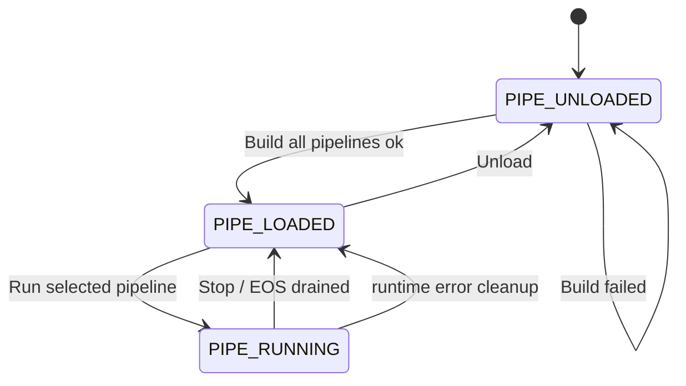
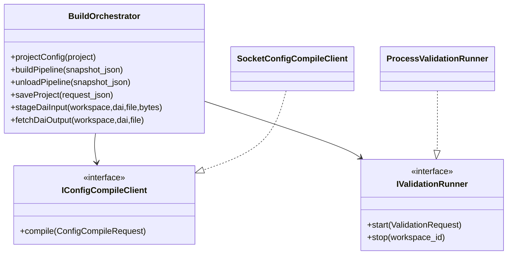
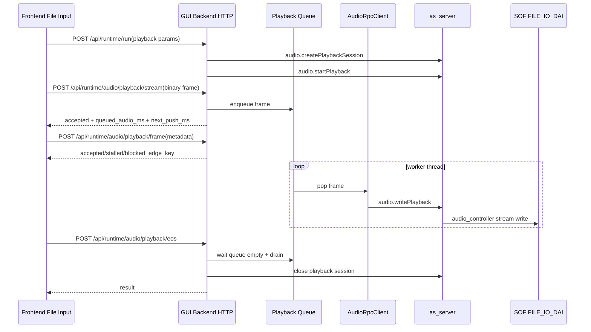
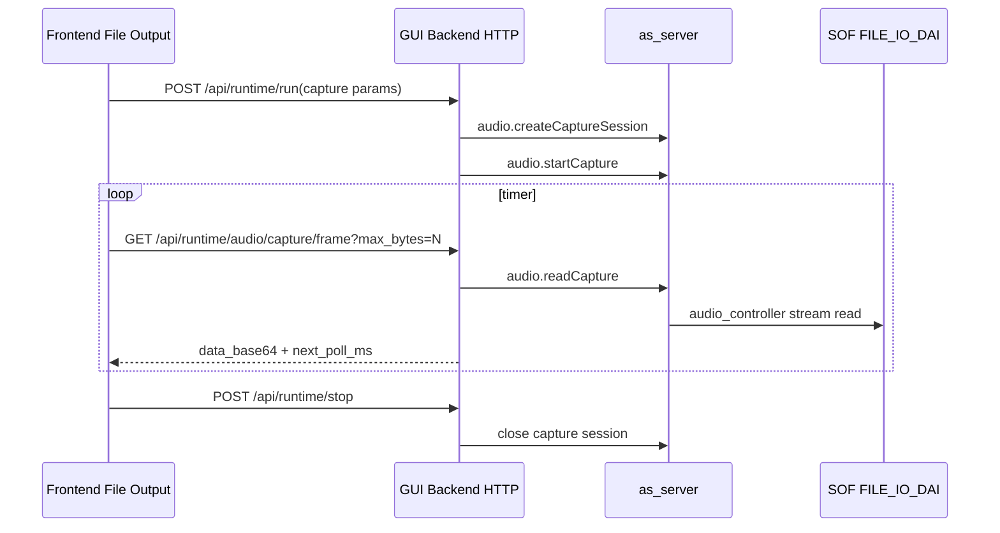
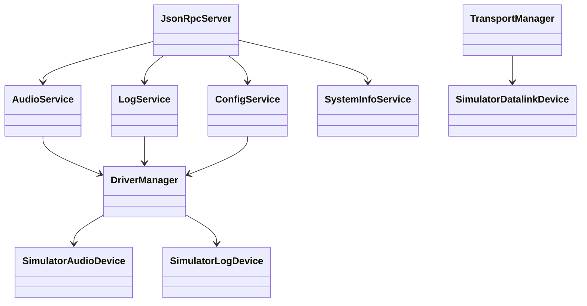
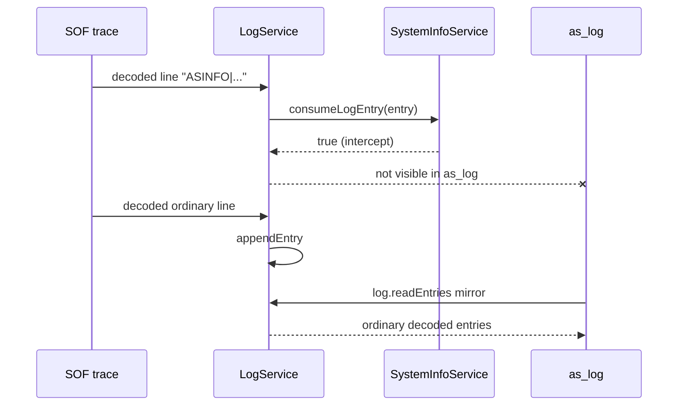
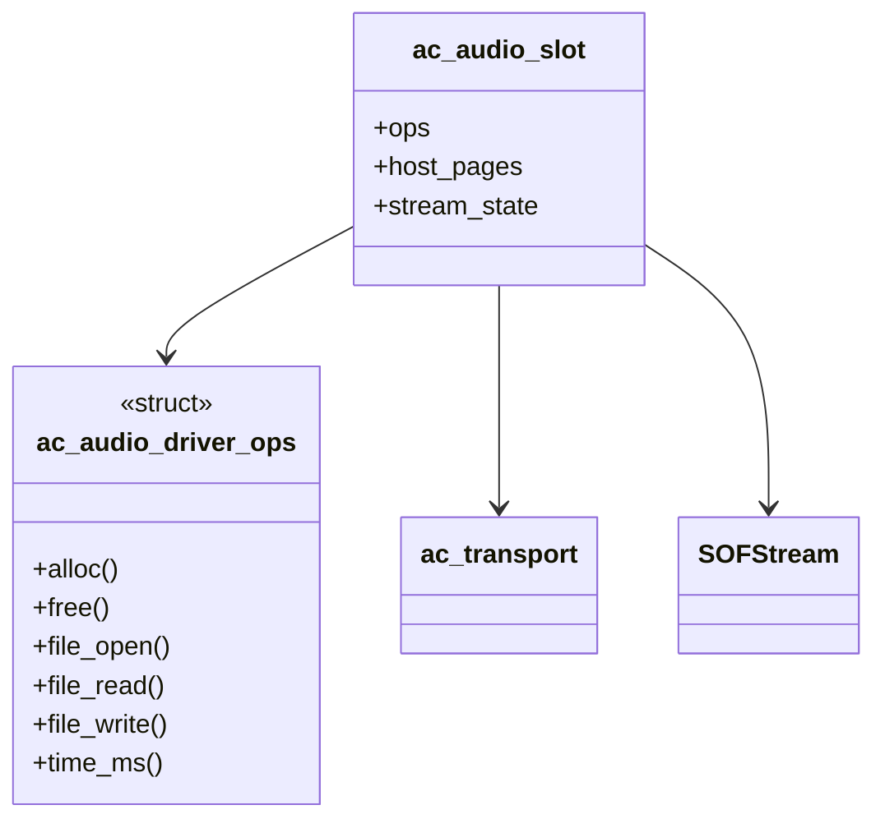

# Audio Studio Framework 设计文档

本文描述当前代码已经落地的 Audio Studio 架构。它不是历史方案汇编，也不再以旧的
`module_instances`、环境变量自动探测或纯 mock runtime 为中心。当前主线是：

- `GUI/frontend` 负责 pipeline layout、Inspector、File Input/Output 和 dashboard。
- `GUI/backend` 负责 HTTP API、workspace JSON、build orchestration、runtime queue 和前端状态语义。
- `as_server` 通过 JSON-RPC 提供 `config.compile`、audio playback/capture、log、System Info 等服务。
- `audio_controller` 是 simulator 内的 C 侧控制面，和系统交互全部走 driver ops，不直接使用 `malloc/free`。
- SOF `audio_studio` 模块周期性输出 `ASINFO|...` trace，供 `SystemInfoService` 解析；这些内部 trace 不进入普通 `as_log` 输出。
- 根 `.vscode` 提供 GUI1 前端、GUI backend、as_server、rv32qemu simulator/QEMU GDB 的组合调试配置。

## 1. 目录与边界

```text
Audio-Studio/
├── GUI/
│   ├── frontend/                 # standalone HTML/CSS/JS UI
│   └── backend/                  # local HTTP server and GUI runtime orchestration
├── server/
│   ├── as_server/                # JSON-RPC server entry
│   ├── framework/
│   │   ├── config/               # product JSON -> tplg compile service
│   │   ├── audio/                # playback/capture RPC services
│   │   ├── log/                  # log sessions, SOF trace decode, ASINFO filter
│   │   ├── system_info/          # ASINFO parser and runtime snapshot
│   │   └── transport/            # logical channels over datalink
│   └── platform/simulator/       # simulator audio/log/datalink devices
├── audio_controller/             # C endpoint used by simulator/SOF tests
├── configs/
│   ├── built-in-algorithm.json   # shared module catalog
│   └── platform/simulator/       # simulator source project JSON
├── plugins/                      # third-party algorithm/module extensions
├── cli/common/                   # as_play/as_record/as_log/as_config shared CLI
└── tests/                        # frontend, backend, system-info, vscode, e2e contracts

sof/
├── src/audio_studio/             # SOF ASINFO producer task
├── src/drivers/file_io/          # FILE_IO DAI DMA support
└── src/platform/rv32_qemu/       # rv32qemu simulator platform glue

application/rv32qemu/
└── sof-build-test.py             # rv32qemu build/test/GUI keep-alive helper

Misc/sof_test/
├── splay-cmds.c                  # host playback baseline test path
└── simple_test/                  # SOF pipeline/test-list fixtures
```

### 1.1 What It Is

Audio Studio 是一个可把产品 JSON 编译成 SOF topology、启动 simulator、通过前端播放/录制 WAV、并展示 DSP runtime 信息的工具链壳层。GUI backend 不重新实现 SOF 或 topology compiler，它把请求转成 `as_server` JSON-RPC、audio_controller 命令和 simulator helper 的组合。

### 1.2 What It Is Not

- 不是纯前端 mock demo。当前 GUI runtime 已经可以走 `as_server + audio_controller + rv32qemu + SOF FILE_IO_DAI`。
- 不是第二套 as_server。GUI backend 只负责浏览器友好的 HTTP/stream API 和 workspace orchestration。
- 不是在 backend 里直接访问平台资源。OS/socket/filesystem/audio/log/datalink 都在 driver/framework 层。
- 不是旧 `rv32qemu` 专属命名架构。平台公共代码以 `simulator` 命名，rv32qemu 是当前一个 simulator 后端。

## 2. Product JSON

当前 JSON 的原则是“简洁、无冗余、不丢 tplg 编译所需信息、不破坏 plugins 扩展”。核心输入是 `configs/platform/simulator/simulator.json`。

### 2.1 顶层 Section

```json
{
  "meta": {},
  "imports": [],
  "resource_catalog": {},
  "module_types": [],
  "pipelines": [],
  "frontend_connections": [],
  "presets": []
}
```

- `imports`：加载共享 catalog，例如 `configs/built-in-algorithm.json`。
- `resource_catalog`：描述 compute/core 等资源。当前 simulator 只需要 `audio_core0`。
- `module_types`：保留给平台私有或三方插件扩展，built-in 模块来自 import catalog。
- `pipelines`：唯一的 SOF graph 描述，`as_config` 只消费这部分和必要 catalog/preset。
- `frontend_connections`：GUI-only runtime/layout 连接，和 `pipelines` 并列；`as_config` 忽略。
- `presets`：参数 preset，包括 `inspector_preset`。

### 2.2 Pipeline Node

旧的 `module_instances` 已取消。node 同时承担“实例”和“布局节点”角色：

```json
{
  "node_id": "DAI_OUT",
  "name": "DAI FILE_IO Playback",
  "module_type": "builtin.dai",
  "params": {
    "dai_type": "file_io_dai",
    "dai_index": 0,
    "link_name": "FILE_IO_PLAYBACK_DAI0",
    "device_id": "FILEIO0",
    "direction": "playback",
    "sample_rate": 48000,
    "channels": 2,
    "sample_bits": 16,
    "tdm_slots": 2,
    "slot_width": 16
  }
}
```

规则：

- `node_id` 在所属 pipeline 内唯一。
- `name` 是 UI 展示名，建议类型名在前，例如 `DAI FILE_IO Playback`、`Vol Capture`。
- `module_type` 指向 catalog 或 plugin module。
- `params` 只能包含对应 module parameter schema 声明过的参数。
- HOST/DAI 的 binding/endpoints 也放入各自 params，不额外创建并行 section。
- pipeline 自身不再声明统一 `format`。多个 HOST/DAI 时，每个节点各自声明能力或配置。

### 2.3 HOST 与 DAI 参数

`builtin.host` 表达 host stream 能力：

```json
{
  "node_id": "HOST_IN",
  "module_type": "builtin.host",
  "params": {
    "stream_name": "as_config_playback",
    "direction": "playback",
    "channels_min": 1,
    "channels_max": 2,
    "sample_bits": [16],
    "sample_rates": [48000]
  }
}
```

HOST 的 `sample_bits/sample_rates` 是能力集合，不是 pipeline 全局固定 format。带 SRC 的 pipeline 可以让 HOST 侧和 DAI 侧的采样率不同。

`builtin.dai` 表达硬件/FILE_IO DAI 配置：

```json
{
  "module_type": "builtin.dai",
  "params": {
    "dai_type": "file_io_dai",
    "dai_index": 1,
    "link_name": "FILE_IO_DSP_FILTER_DAI1",
    "device_id": "FILEIO1",
    "direction": "playback",
    "sample_rate": 48000,
    "channels": 2,
    "sample_bits": 16,
    "tdm_slots": 2,
    "slot_width": 16
  }
}
```

`link_name`、`tdm_slots`、`slot_width` 保留行业通用命名，直接用于 tplg/DAI 描述。

### 2.4 Frontend Connections

`frontend_connections[]` 的结构刻意和 `pipelines[]` 一致：同样是 `pipeline_id`、`nodes[]`、`edges[]`。它描述前端节点和 HOST external port 的连接关系。

```json
{
  "pipeline_id": "PLAYBACK_MAIN",
  "nodes": [
    {
      "node_id": "FILE_IN",
      "name": "File Input Playback",
      "module_type": "builtin.file_input",
      "params": {"enable": true, "file_path": "", "loop": true},
      "ui": {"dx": -185, "dy": 0}
    }
  ],
  "edges": [
    {"from": "FILE_IN:out", "to": "HOST_IN:in"}
  ]
}
```

注意：

- 不构造 `virtual.file_input`，使用真实 catalog type `builtin.file_input`。
- `builtin.file_input/output` 只属于 GUI runtime，不进入 `pipelines[]`，不参与 tplg 编译。
- Build 时 frontend 会按当前 layout 自动更新 `frontend_connections[]`。
- Save 时会 strip 临时 workspace 的 `audio_studio_gui` section，但保留正式 `frontend_connections[]`。

### 2.5 参数 Settable State

参数生命周期只有三态：

```text
PIPE_UNLOADED  # build/load 前可改
PIPE_LOADED    # build/load 后、RUN 前可改
PIPE_RUNNING   # RUN 中可改
```

前端 Inspector 完全依据 `apply.settable_states` 自动置灰。Build 前修改的参数写入临时 workspace JSON 的 `pipelines[].nodes[].params`。RUN 中修改的参数调用 `/api/param/update`，backend 更新 `inspector_preset` 并返回 `control_apply:"pending_as_control"`，为后续 as_control 接入留接口。

## 3. Build / Load / Run 状态机



Build 语义：

- Build 永远按当前 layout 的所有 working groups 一起编译。
- 前端只选中一个 pipeline 时，也不能只让一个 pipeline 变 Loaded。
- 任一 pipeline 编译/安装失败，Build 整体失败。
- Build 成功后所有 pipeline 从 `PIPE_UNLOADED` 同步变为 `PIPE_LOADED`。
- Play/Record 是独立运行，RUN 只针对当前 selected working group。

## 4. GUI Backend

### 4.1 启动参数

backend 不再从环境变量猜路径，统一用 argv/config 注入：

```bash
out/linux/simulator/gui_backend/Debug/audio_studio_gui_server . 8080 \
  --as-server out/linux/simulator/rpc_socket/Debug/as_server \
  --alsatplg third_party/alsatplg/bin/alsatplg \
  --as-server-rpc-mode socket \
  --as-server-host 127.0.0.1 \
  --as-server-port 9900 \
  --validation-python python3 \
  --validation-script ../application/rv32qemu/sof-build-test.py \
  --validation-as-log out/linux/simulator/rpc_socket/Debug/as_log \
  --validation-trace-ldc ../application/rv32qemu/build/sof.ldc \
  --runtime-as-server-host 127.0.0.1 \
  --runtime-as-server-port 9900 \
  --audio-driver-factory simulator
```

`BackendRuntimeConfig` 在 `main.cpp` 里解析，然后注入 `BuildOrchestrator` 和 `GuiRuntimeEngine`。

### 4.2 BuildOrchestrator

GUI Build 的 server 生命周期由 `BuildOrchestrator` 和 `application/rv32qemu/sof-build-test.py` helper 共同管理：

1. Build 前停止旧 helper/session，清理旧 marker 和 test list。
2. 启动 helper；helper 创建 datalink 文件和唯一 `as_server`，写入 `audio_studio_as_server.ready`。
3. backend 通过同一 socket `as_server` 调用 `config.compile`。
4. compile 成功后 backend 写入 `audio_studio_test_list.txt`，helper 再启动 `sof-test-run.py`，执行 `ac_run -> trace on -> pipeinstall -> keep-alive`。
5. pipeinstall 成功后 helper 写入 `audio_studio_validation.ready`，Build 返回 `PIPE_LOADED`，helper/as_server/QEMU/audio_controller session 保持存活。
6. compile/pipeinstall 失败或 Unload 时，backend 停止 helper，并清理本次 build session。



流程：

1. `GET /api/config` 拷贝源 JSON 到 `/tmp/audio-studio-gui-workspaces/...`。
2. 前端提交完整 layout snapshot。
3. backend 合并 `pipelines[]` 与 `frontend_connections[]`，strip 临时 `audio_studio_gui` 后用于 compile。
4. `SocketConfigCompileClient` 调 `as_server config.compile`，默认用 `--rpc-once` 进程模式。
5. compile 成功后生成 SOF test list：`ac_run`、`trace on`、`pipeinstall <tplg>`。
6. `ProcessValidationRunner` 调 `application/rv32qemu/sof-build-test.py --audio-controller-log --gui-keep-alive`。
7. helper 在 `pipeinstall` 成功后写 ready marker；backend 返回 `PIPE_LOADED`。
8. `Unload` 停止 validation 进程组，返回 `PIPE_UNLOADED`。

### 4.3 HTTP API

| Method | Path | 用途 |
|---|---|---|
| GET | `/api/projects` | 列出 `configs/platform/*/*.json` |
| GET | `/api/config?project=simulator/simulator.json` | 创建 workspace copy 并返回 config |
| POST | `/api/pipeline/build` | 全 layout build/load |
| POST | `/api/pipeline/unload` | 停止 keep-alive simulator |
| POST | `/api/runtime/run` | 选中 pipeline RUN，创建 playback/capture session |
| POST | `/api/runtime/audio/playback/stream` | File Input 二进制 PCM 数据面 |
| POST | `/api/runtime/audio/playback/frame` | File Input frame 元信息与 backpressure |
| POST | `/api/runtime/audio/playback/eos` | EOS，drain queue 后关闭 playback |
| GET | `/api/runtime/audio/capture/frame` | File Output 从 as_server capture stream 拉 PCM |
| POST | `/api/runtime/stop` | 停止 selected pipeline runtime |
| POST | `/api/runtime/file-io-dai/input` | 给 FILE_IO_DAI capture/source 阶段 WAV |
| GET | `/api/runtime/file-io-dai/output` | 读取 FILE_IO_DAI playback/sink 输出 WAV |
| GET | `/api/algorithm/cost/live` | PER-ALGORITHM COST |
| GET | `/api/dsp/core/loading` | DSP CORE LOADING |
| GET | `/api/system/health/live` | SYSTEM HEALTH |
| POST | `/api/param/update` | RUN 中参数更新入口 |
| POST | `/api/project/save` | 写回源 JSON，strip `audio_studio_gui` |

### 4.4 Playback Worker



关键点：

- 二进制数据走单独 stream URL；`/playback/frame` 只传元信息。
- backend 入队后立即响应，不阻塞前端 UI。
- `next_push_ms` 根据 queue bytes、sample rate、channels、sample bits 计算。
- 本地 queue 高水位、RPC 未就绪或 100ms 无 dequeue 会返回 stall。
- backend 还会调用 `systemInfo.buffers`，如果某个 SOF buffer 连续 100ms 无 consumed bytes，也返回 `stalled:true` 和 `blocked_edge_key`。
- EOS 后必须等 queue 清空和尾部 drain 完成，再关闭 playback session。

### 4.5 Capture Worker



Capture 不在 backend 内建 queue。前端定时 poll，backend 直接从 as_server 读一帧并返回。

## 5. as_server Framework



### 5.1 ConfigService

`ConfigService` 负责：

- 解析 product JSON 与 module catalog。
- 检查 node params 是否在 module parameter schema 中声明。
- 生成 tplg source。
- 调用 vendored `third_party/alsatplg/bin/alsatplg`。
- decode tplg 并检查错误。
- 生成 HOST/DAI/kcontrol/widget/buffer 名称。

内部 section 名用短 hash，避免 alsatplg 对超长名字截断后冲突。外部可见 widget、BE、DAI 名保持可读。

### 5.2 LogService

`LogService` 是 as_server 全局服务。它可以：

- 创建真实 log session。
- 在 System Info pump 已打开同一 log source 时，给 `as_log` 创建 mirror session，不再抢占底层 log device。
- 解码 SOF raw trace。
- 拦截 `ASINFO|` entry 交给 `SystemInfoService`，并不写入普通 `tail/readEntries`。
- 避免在持有全局 mutex 时因 ASINFO 持续被拦截而一直读取底层设备，保证 `as_log` 不被 System Info pump 饿死。



### 5.3 SystemInfoService

`SystemInfoService` 解析 `ASINFO|type|key=value|...`：

- `heartbeat`：连接状态与 1s 断联检测。
- `core`：DSP core frequency/load。
- `module`：node_id、pipeline、state、core、cpu_percent、memory_bytes、latency_ms。
- `buffer`：from/to、size、avail、produced、consumed、stalled。
- `heap`：category/index/block_size/free_count/total_count/used_bytes/free_bytes。
- `xrun` / `dropout`：系统健康事件。

1s 没有 heartbeat 时，snapshot 变 disconnected，并清空 modules/buffers/heap，避免前端继续展示历史值。

### 5.4 AudioService

`AudioService` 暴露 JSON-RPC playback/capture session。simulator 平台的 audio device 走 `audio_controller` logical channel：

- playback：backend queue -> `audio.writePlayback` -> simulator audio device -> audio_controller -> SOF host pages。
- capture：frontend poll -> `audio.readCapture` -> simulator audio device -> audio_controller -> SOF host pages。

## 6. audio_controller

audio_controller C 层必须遵守两个边界：

- 不直接 `malloc/free`；slot 初始化时从上层传入必要 driver ops。
- 和系统资源交互通过 ops：memory、file、transport、time 等由平台提供。

HOST PTABLE 模式只分配两个 4K pages；`period * period_bytes` 逻辑只保留给非 HOST PTABLE。Playback EOS 后使用 drain flush，保证尾部 PCM 被 FILE_IO_DAI 写出。



## 7. SOF Audio Studio Module

SOF 内 `src/audio_studio` 是一个可 Kconfig 控制的模块。初始化由 platform init 调用。它基于 ll task 每 100ms 输出一次系统信息。

统一前导：

```c
#define AUDIO_STUDIO_INFO_PREFIX "ASINFO|"
```

输出示例：

```text
ASINFO|heartbeat|seq=42|timestamp_ms=123400
ASINFO|core|id=0|freq_mhz=600|load_percent=37.5
ASINFO|module|id=PLAYBACK_MAIN__VOLUME|pipeline=PLAYBACK_MAIN|state=ACTIVE|core=0|cpu_percent=1.2|memory_bytes=4096|latency_ms=0.7
ASINFO|buffer|id=HOST_IN.out->CHREMAP.in|from=HOST_IN.out|to=CHREMAP.in|size_bytes=8192|avail_bytes=2048|produced_bytes=4800|consumed_bytes=4700
ASINFO|heap|category=runtime|index=0|block_size=256|free_count=5|total_count=64|used_bytes=15104|free_bytes=1280
```

已有 SOF 支持不足的信息先用 fake/derived data 打通流程，但 module 工作状态必须尽量从真实 component/pipeline state 获取。buffer produced/consumed 用上一个 100ms interval 的 bytes 表示，前端可据此驱动 blockage/highlight。

## 8. Frontend Runtime

前端保持当前 UI 风格，不额外做 landing page。运行态规则：

- Build 按全部 layout pipelines；Build 按钮 running/building 时不可点。
- RUN 只针对当前 selected pipeline；RUN 后按钮显示 running 并不可重复点。
- File Input 必须选择合法 WAV 后才能 RUN playback。
- File Output 必须选择可写 `.wav` 输出路径后才能 RUN capture。
- FILE_IO_DAI 作为 capture source 时，选择 WAV 后自动解析 sample_rate/channels/sample_bits 并填到 DAI params。
- FILE_IO_DAI 作为 playback sink 时，可在 UI 配置输出规格。
- 参数控件依据 `PIPE_UNLOADED/PIPE_LOADED/PIPE_RUNNING` 自动置灰。
- `PER-ALGORITHM COST`、`DSP CORE LOADING`、`SYSTEM HEALTH` 全部由 backend live API 驱动。
- SYSTEM HEALTH 将 heap_trace_all 风格的 category/index/block_size/free_count/total_count 展开成多行。

## 9. VSCode Debug

根 `.vscode` 提供 full-stack debug：

- GUI1 frontend Chrome。
- GUI backend C++。
- as_server。
- simulator keep-alive。
- QEMU gdbstub + RISC-V gdb attach。

`Audio Studio GUI: Simulator Keep Alive` 不再只是 keep-alive shell，而是能通过 `.vscode/riscv-gdb-wrapper.sh` 连到 QEMU gdbstub。backend 通过 argv 把 `--validation-qemu-gdb-port`、`--validation-qemu-gdb-wait` 传给 `sof-build-test.py`。

实际验证目标：

- QEMU 监听 gdb port。
- RISC-V gdb 能 `target remote`。
- `break main` 可命中 `application/rv32qemu/main.c`。
- GUI build 能在 gdb wait/continue 后返回 `PIPE_LOADED`。

## 10. Test Matrix

关键测试：

```bash
python3 tests/system-info-runtime-contract.test.py
python3 tests/backend-process-lifecycle-contract.test.py
python3 tests/vscode-qemu-debug-contract.test.py
node tests/frontend/gui-runtime-contract.test.mjs
node tests/frontend/parameter-policy.test.mjs
node tests/frontend/pipeline-runtime-build-button.test.mjs
ctest --test-dir out/linux/simulator/gui_backend/Debug --output-on-failure
ctest --test-dir out/linux/simulator/audio_controller/Debug --output-on-failure
ctest --test-dir out/linux/simulator/driver_interface_tests/Debug --output-on-failure
ctest --test-dir out/linux/simulator/rpc_socket/Debug --output-on-failure
python3 tests/gui-simulator-audio-e2e.py --artifacts-dir /tmp/audio-studio-gui-e2e-artifacts
```

VASS/SOF 侧：

```bash
python3 Misc/sof_test/tests/test_audio_studio_info_contract.py
python3 Misc/sof_test/tests/test_splay_host_buffer_contract.py
python3 Misc/sof_test/tests/test_rv32qemu_file_io_capacity_contract.py
python3 application/rv32qemu/sof-build-test.py -t Misc/sof_test/simple_test/tplg-splay-test-lists.txt
python3 application/rv32qemu/sof-build-test.py -t Misc/sof_test/simple_test/rv32qemu-as-log-test-lists.txt --audio-controller-log --as-server Audio-Studio/out/linux/simulator/rpc_socket/Debug/as_server --as-log Audio-Studio/out/linux/simulator/rpc_socket/Debug/as_log --trace-ldc application/rv32qemu/build/sof.ldc
```

## 11. Extension Rules

- 新 module type 优先放入 plugin catalog 或 `module_types[]`，不要恢复 `module_instances`。
- 新参数必须先在 module parameter schema 中声明，再写入 node params。
- 新 frontend-only node 放入 `frontend_connections[]`，不要混进 `pipelines[]`。
- 新 runtime API 优先复用 as_server JSON-RPC，GUI backend 只做浏览器适配。
- 新平台资源放入 driver/framework/platform 层，不在 GUI/backend 写 OS 特判。
- ASINFO 新字段必须更新 SOF producer、SystemInfo parser、backend live controller 和 contract test。
- as_log 必须继续隐藏 ASINFO，普通 firmware log 必须保持可读。
