# Audio Studio Framework 架构设计

版本：1.0
日期：2026-06-29
适用范围：Audio Studio GUI、GUI backend、JSON-RPC、CLI、as_server、framework service、driver abstraction、platform profile、audio_controller、rv32qemu simulator、SOF FILE_IO_DAI、SOF test integration。

本文描述 Audio Studio 稳定框架。它面向读者解释系统由哪些模块组成、每层承担什么职责、模块之间如何调用、数据如何流动、驱动如何选择、simulator 和 SOF test 如何集成，以及添加平台、驱动、RPC、module catalog、telemetry 字段时应落在哪一层。

## 1. 架构总览

Audio Studio 是面向音频固件、音频算法和平台集成的 PC 端配置、控制、调试与观测框架。系统把产品 JSON、GUI pipeline layout、SOF topology 编译、audio playback/capture、firmware log、runtime System Info、audio_controller 协议和 VASS simulator/SOF test 串成一条可验证链路。

核心运行链路：

```text
GUI/frontend
  -> GUI/backend HTTP API
    -> BuildOrchestrator / GuiRuntimeEngine
      -> as_server JSON-RPC
        -> framework/config, framework/audio, framework/log, framework/system_info
          -> DriverManager and selected driver factories
            -> simulator platform data-link/audio/log devices
              -> audio_controller C peer
                -> rv32qemu SOF firmware, FILE_IO_DAI, SOF trace
```

### 1.1 组件分层图

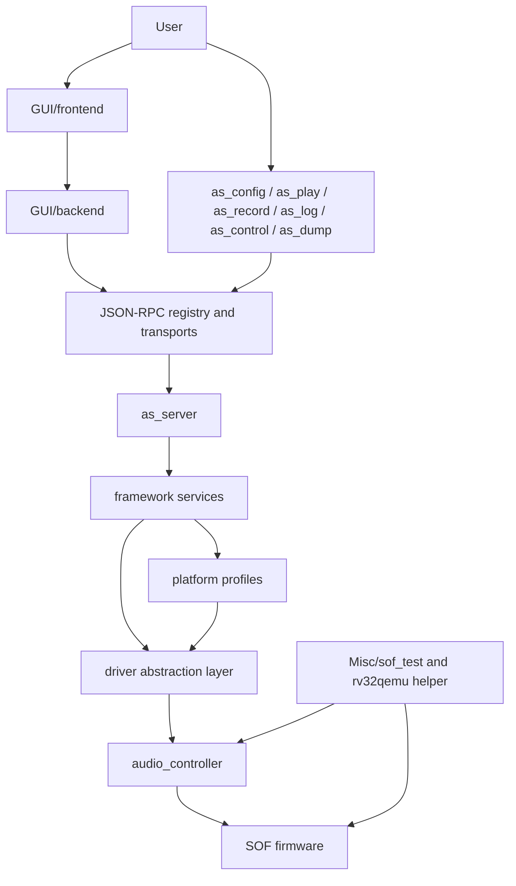
```mermaid
flowchart TB
    User[User]
    FE[GUI/frontend]
    BE[GUI/backend]
    CLI[as_config / as_play / as_record / as_log / as_control / as_dump]
    RPC[JSON-RPC registry and transports]
    Server[as_server]
    Framework[framework services]
    Drivers[driver abstraction layer]
    Platform[platform profiles]
    AC[audio_controller]
    SOF[SOF firmware]
    Test[Misc/sof_test and rv32qemu helper]

    User --> FE
    User --> CLI
    FE --> BE
    BE --> RPC
    CLI --> RPC
    RPC --> Server
    Server --> Framework
    Framework --> Drivers
    Framework --> Platform
    Platform --> Drivers
    Drivers --> AC
    AC --> SOF
    Test --> AC
    Test --> SOF
```

### 1.2 模块职责

| 模块 | 职责 | 主要源码 |
|---|---|---|
| GUI/frontend | pipeline canvas、Inspector、File Input/Output、dashboard、浏览器交互 | `GUI/frontend/index.html`, `GUI/frontend/assets/` |
| GUI/backend | 静态资源托管、HTTP API、workspace copy、build orchestration、runtime queue、System Info dashboard adapter | `GUI/backend/include/audio_studio.hpp`, `GUI/backend/src/*.cpp` |
| CLI | 命令行入口，解析参数并调用 JSON-RPC typed facade | `cli/common/`, `cli/tools/as_*.cpp` |
| RPC | JSON-RPC codec、method registry、socket/pipe transport、stream framing、typed facade | `rpc/include/`, `rpc/src/`, `rpc/api/audio_studio_rpc_api.cpp` |
| as_server | RPC endpoint、framework service 宿主、driver/platform 组合、stream server | `server/as_server/main.cpp` |
| framework | config/audio/control/log/dump/system_info/transport/plugin/session 业务服务 | `server/framework/*` |
| drivers | OS、socket、pipe、filesystem、dynlib、datalink、audio、control、log、dump 抽象和实现 | `drivers/*` |
| platform | simulator、A2 等 profile 的能力声明和 driver 组合 | `server/platform/*` |
| audio_controller | simulator/A2 peer C 实现，解析 topology、处理 transport command、连接 SOF runtime | `audio_controller/*` |
| VASS/SOF test | rv32qemu helper、SOF test-list、FILE_IO DAI、ASINFO trace | `application/rv32qemu/`, `Misc/sof_test/`, `sof/src/audio_studio/`, `sof/src/drivers/file_io/` |

### 1.3 控制面、数据面、观测面

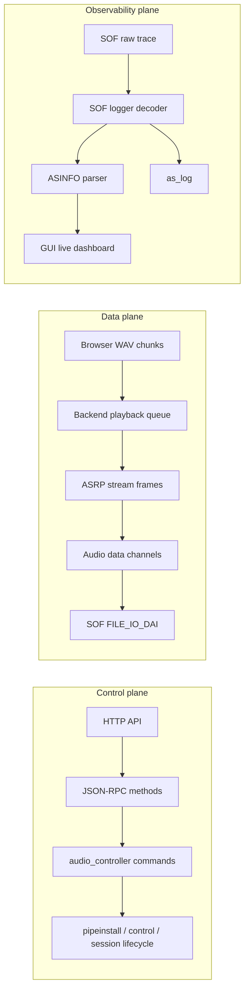
```mermaid
flowchart LR
    subgraph ControlPlane[Control plane]
        HTTP[HTTP API]
        JsonRpc[JSON-RPC methods]
        ACCommand[audio_controller commands]
        Pipeinstall[pipeinstall / control / session lifecycle]
    end

    subgraph DataPlane[Data plane]
        BrowserFile[Browser WAV chunks]
        BackendQueue[Backend playback queue]
        ASRP[ASRP stream frames]
        ACData[Audio data channels]
        FileIO[SOF FILE_IO_DAI]
    end

    subgraph ObservePlane[Observability plane]
        SofTrace[SOF raw trace]
        LogDecode[SOF logger decoder]
        ASINFO[ASINFO parser]
        Dashboard[GUI live dashboard]
        AsLog[as_log]
    end

    HTTP --> JsonRpc --> ACCommand --> Pipeinstall
    BrowserFile --> BackendQueue --> ASRP --> ACData --> FileIO
    SofTrace --> LogDecode --> ASINFO --> Dashboard
    LogDecode --> AsLog
```

控制面承载 build、compile、run、stop、parameter update、log session、system info query。数据面承载 PCM、probe/dump packet、stream payload。观测面承载 SOF trace、ASINFO telemetry、dashboard snapshot 和 CLI log output。三者共享 session identity，但传输通道和 backpressure 策略分开。

### 1.4 进程与部署

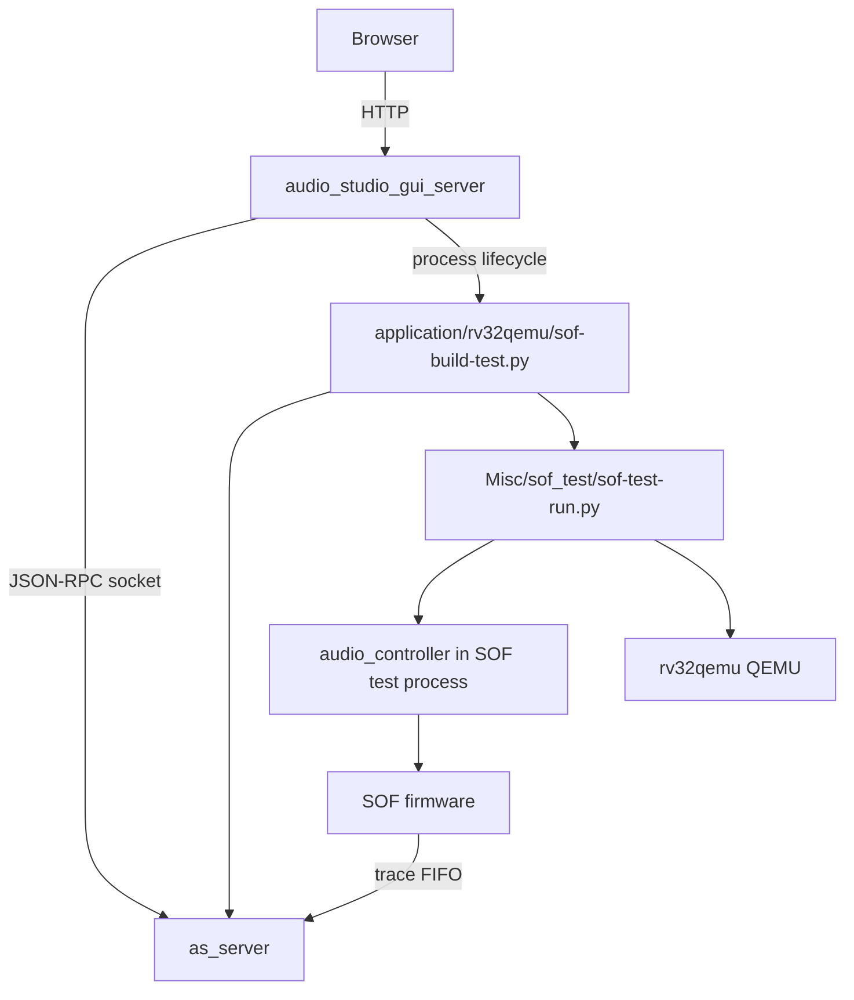
```mermaid
flowchart TB
    Browser[Browser]
    GuiBackend[audio_studio_gui_server]
    AsServer[as_server]
    Helper[application/rv32qemu/sof-build-test.py]
    SofTest[Misc/sof_test/sof-test-run.py]
    Qemu[rv32qemu QEMU]
    Controller[audio_controller in SOF test process]
    Firmware[SOF firmware]

    Browser -- HTTP --> GuiBackend
    GuiBackend -- JSON-RPC socket --> AsServer
    GuiBackend -- process lifecycle --> Helper
    Helper --> AsServer
    Helper --> SofTest
    SofTest --> Controller
    SofTest --> Qemu
    Controller --> Firmware
    Firmware -- trace FIFO --> AsServer
```

GUI backend 和 as_server 是独立进程。GUI backend 用 HTTP 面向浏览器，用 JSON-RPC 面向 as_server，用 helper 管理 simulator session。as_server 通过 driver registry 绑定 socket、pipe、audio、log、datalink 等能力。

## 2. 源码组织与归属

Audio-Studio 仓库的源码按运行层分区。目录名体现 ownership，避免跨层放置业务实现。

```text
Audio-Studio/
  GUI/
    frontend/
    backend/
  cli/
    common/
    tools/
  rpc/
    api/
    include/
    src/
  server/
    as_server/
    framework/
    platform/
    tests/
  drivers/
    audio/ control/ datalink/ dump/ dynlib/ filesystem/ log/ os/ pipe/ socket/
    include/
    src/
  audio_controller/
    include/
    src/
    tests/
  configs/
    built-in-algorithm.json
    platform/a2/A2.json
    platform/simulator/simulator.json
    profile/*.defconfig
  plugins/
  scripts/
  tests/
  third_party/
```

### 2.1 模块归属矩阵

| 能力 | Owner | Consumer | Extension point |
|---|---|---|---|
| Static GUI assets | `GUI/frontend` | Browser, GUI backend static route | frontend asset bundle |
| Browser-facing HTTP | `GUI/backend` | GUI/frontend | HTTP route handler |
| Workspace JSON copy | `GUI/backend` | BuildOrchestrator, Save API | workspace record fields |
| Topology compile | `server/framework/config` | as_server, as_config, GUI build | target generator, module config handler |
| RPC method catalog | `rpc/api/audio_studio_rpc_api.cpp` | as_server, CLI, GUI backend | method spec block |
| Audio stream service | `server/framework/audio` | RPC, CLI, GUI runtime | audio driver factory |
| SOF log decode | `server/framework/log` | as_log, SystemInfoService | log driver factory, decoder options |
| Runtime telemetry | `server/framework/system_info` | GUI dashboard, RPC clients | ASINFO row parser |
| Data-link transport | `server/framework/transport` | simulator audio/log/control/dump drivers | IDataLinkDevice factory |
| OS and host resources | `drivers/*` | framework, platform, CLI | driver factory registration |
| Simulator peer | `audio_controller` | sof_test, simulator platform | driver ops and transport channel handlers |
| SOF runtime info | `sof/src/audio_studio` | LogService, SystemInfoService | ASINFO row schema |

### 2.2 构建期组合

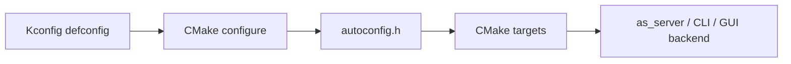
```mermaid
flowchart LR
    Kconfig[Kconfig defconfig]
    CMake[CMake configure]
    Autoconfig[autoconfig.h]
    Targets[CMake targets]
    Binary[as_server / CLI / GUI backend]

    Kconfig --> CMake
    CMake --> Autoconfig
    Autoconfig --> Targets
    Targets --> Binary
```

Kconfig selects platform, RPC transport, framework services, driver modules and CLI tools. CMake consumes generated config and links selected sources. Each module keeps its own `CMakeLists.txt` and `Kconfig`, while top-level CMake files aggregate subdirectories.

## 3. Product JSON 与配置模型

Product JSON is the source for topology compile, GUI layout persistence and runtime parameter policy. Audio Studio uses the same schema shape for simulator and A2 profiles, with profile-specific values in `configs/platform/<profile>/`.

### 3.1 顶层 JSON

```json
{
  "meta": {},
  "imports": [],
  "resource_catalog": {},
  "module_types": [],
  "pipelines": [],
  "frontend_connections": [],
  "presets": []
}
```

| Section | Meaning | Used by |
|---|---|---|
| `meta` | project identity, schema version, UI labels | GUI, compiler report |
| `imports` | shared module catalogs such as `configs/built-in-algorithm.json` | frontend parser, ConfigService |
| `resource_catalog` | core and compute resources used for affinity and metadata | ConfigService, GUI resource panels |
| `module_types` | project-local or plugin module declarations | frontend parser, ConfigService |
| `pipelines` | SOF graph: HOST, processing modules, DAI, edges | ConfigService, pipeinstall |
| `frontend_connections` | GUI-only File Input/Output and external port wiring | GUI frontend/backend runtime |
| `presets` | parameter value sets, including Inspector state | GUI Inspector, ConfigService private data |

### 3.2 Pipeline model

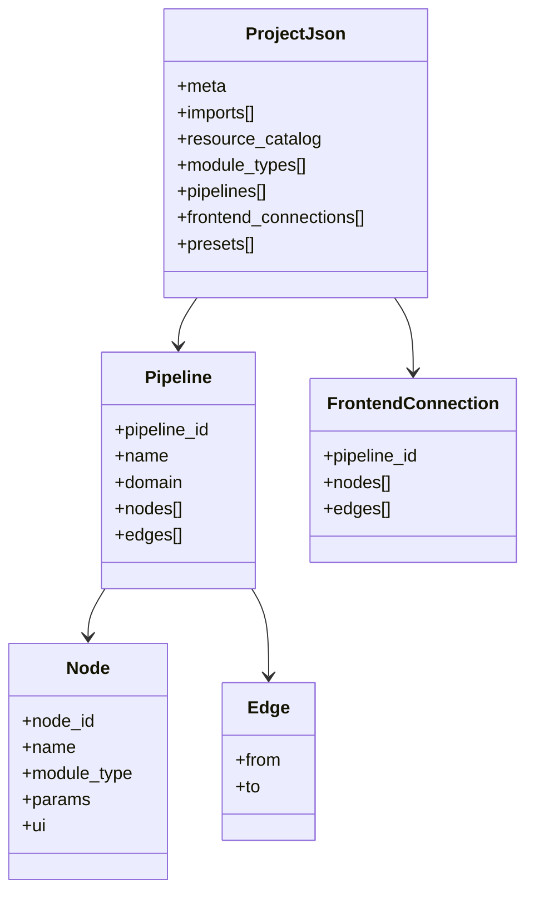
```mermaid
classDiagram
    class ProjectJson {
      +meta
      +imports[]
      +resource_catalog
      +module_types[]
      +pipelines[]
      +frontend_connections[]
      +presets[]
    }
    class Pipeline {
      +pipeline_id
      +name
      +domain
      +nodes[]
      +edges[]
    }
    class Node {
      +node_id
      +name
      +module_type
      +params
      +ui
    }
    class Edge {
      +from
      +to
    }
    class FrontendConnection {
      +pipeline_id
      +nodes[]
      +edges[]
    }
    ProjectJson --> Pipeline
    Pipeline --> Node
    Pipeline --> Edge
    ProjectJson --> FrontendConnection
```

A pipeline node is both an instance and the graph node used by GUI layout. `module_type` references a built-in catalog item or plugin module. HOST and DAI are regular nodes; their endpoint information lives in `params`.

Example HOST node:

```json
{
  "node_id": "HOST_IN",
  "name": "HOST Playback",
  "module_type": "builtin.host",
  "params": {
    "stream_name": "pcm_playback",
    "direction": "playback",
    "channels_min": 1,
    "channels_max": 2,
    "sample_bits": [16],
    "sample_rates": [48000]
  }
}
```

Example DAI node:

```json
{
  "node_id": "DAI_OUT",
  "name": "DAI FILE_IO Playback",
  "module_type": "builtin.dai",
  "params": {
    "dai_type": "file_io_dai",
    "dai_index": 0,
    "link_name": "FILE_IO_PLAYBACK_DAI0",
    "device_id": "FILEIO0",
    "direction": "playback",
    "sample_rate": 48000,
    "channels": 2,
    "sample_bits": 16,
    "tdm_slots": 2,
    "slot_width": 16
  }
}
```

### 3.3 Frontend connections

`frontend_connections[]` stores GUI runtime nodes such as File Input and File Output. These nodes connect to HOST external ports and guide runtime I/O; topology compile consumes `pipelines[]` and leaves frontend-only nodes in the GUI domain.

```json
{
  "pipeline_id": "PLAYBACK_MAIN",
  "nodes": [
    {
      "node_id": "FILE_IN",
      "name": "File Input Playback",
      "module_type": "builtin.file_input",
      "params": {"enable": true, "file_path": "", "loop": true},
      "ui": {"dx": -185, "dy": 0}
    }
  ],
  "edges": [
    {"from": "FILE_IN:out", "to": "HOST_IN:in"}
  ]
}
```

### 3.4 Parameter policy

Parameters are declared in module catalogs and then instantiated through node `params`. The Inspector uses `apply.settable_states` to decide editability.

```text
PIPE_UNLOADED  build/load before topology is installed
PIPE_LOADED    topology installed and pipeline idle
PIPE_RUNNING   selected pipeline running
```

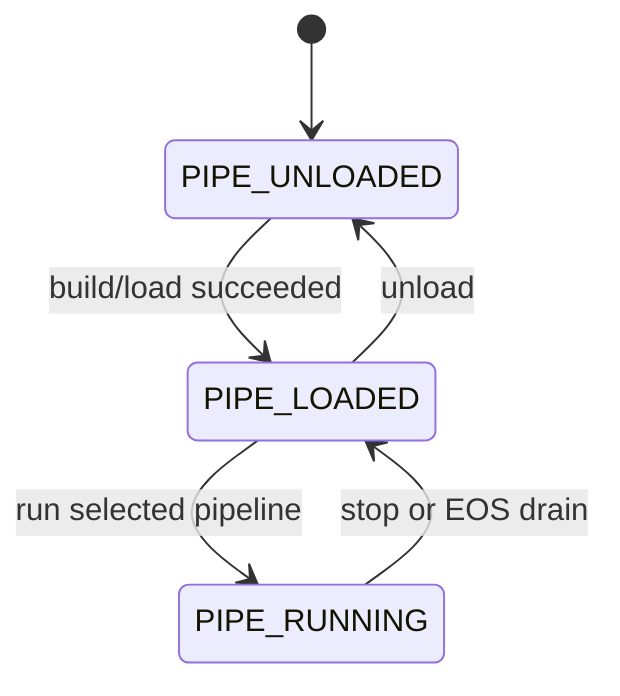
```mermaid
stateDiagram-v2
    [*] --> PIPE_UNLOADED
    PIPE_UNLOADED --> PIPE_LOADED: build/load succeeded
    PIPE_LOADED --> PIPE_RUNNING: run selected pipeline
    PIPE_RUNNING --> PIPE_LOADED: stop or EOS drain
    PIPE_LOADED --> PIPE_UNLOADED: unload
```

`inspector_preset` stores GUI-edited parameter values. A value missing from the preset falls back to module parameter default. Runtime parameter update enters `POST /api/param/update`, updates the workspace preset and routes control application through the control service path.

### 3.5 配置编译流水线

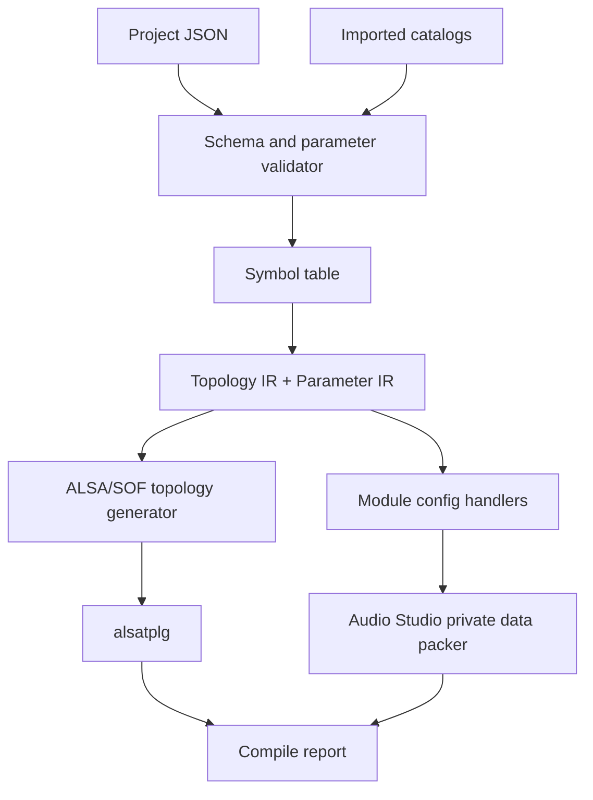
```mermaid
flowchart TB
    Project[Project JSON]
    Catalog[Imported catalogs]
    Validator[Schema and parameter validator]
    Symbols[Symbol table]
    IR[Topology IR + Parameter IR]
    ModuleConfig[Module config handlers]
    Topology[ALSA/SOF topology generator]
    Private[Audio Studio private data packer]
    Alsatplg[alsatplg]
    Report[Compile report]

    Project --> Validator
    Catalog --> Validator
    Validator --> Symbols
    Symbols --> IR
    IR --> ModuleConfig
    ModuleConfig --> Private
    IR --> Topology
    Topology --> Alsatplg
    Alsatplg --> Report
    Private --> Report
```

`ConfigService` loads project JSON, imports catalogs, validates node params, builds an internal IR, calls module config handlers for binary payload, emits topology source, runs the vendored `third_party/alsatplg/bin/alsatplg`, records warnings and returns artifact paths to callers.

### 3.6 KControl and private data

Audio Studio parameters are represented in private data with stable string identities and generated numeric IDs. KControl generation uses parameter type and settable state:

| Parameter class | Topology result | Runtime result |
|---|---|---|
| install-time HOST/DAI fields | topology widget/link/DAI config | encoded in topology/private metadata |
| install-time module config | module private payload | consumed by SOF/audio_controller at load time |
| `PIPE_RUNNING` scalar parameter | ALSA control where platform supports it | routed through control service |
| bytes payload parameter | `SectionControlBytes` where declared runtime-settable | packed by module config handler |
| preset/scene table | Audio Studio private section | selected by GUI/control service when exposed |

The compiler keeps human-readable names in a string table and uses stable hashes/IDs for wire payload. This avoids handwritten parameter IDs in product JSON while keeping debug reports readable.

## 4. GUI frontend

The frontend is a standalone HTML/CSS/JavaScript application. It owns interaction design, pipeline canvas, node placement, Inspector rendering, File Input/Output selection and live dashboard panels. The frontend talks to GUI backend through HTTP; backend responses contain state, workspace updates, runtime feedback and dashboard data.

### 4.1 前端职责图

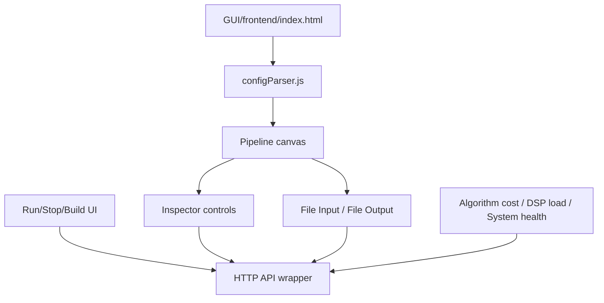
```mermaid
flowchart TB
    Index[GUI/frontend/index.html]
    ConfigParser[configParser.js]
    Canvas[Pipeline canvas]
    Inspector[Inspector controls]
    FileIO[File Input / File Output]
    Runtime[Run/Stop/Build UI]
    Dashboard[Algorithm cost / DSP load / System health]
    BackendApi[HTTP API wrapper]

    Index --> ConfigParser
    ConfigParser --> Canvas
    Canvas --> Inspector
    Canvas --> FileIO
    Runtime --> BackendApi
    Inspector --> BackendApi
    FileIO --> BackendApi
    Dashboard --> BackendApi
```

### 4.2 Project loading

1. The frontend requests `/api/projects` to list available platform JSON files.
2. It opens a project with `/api/config?project=<profile>/<file>.json`.
3. The returned JSON includes workspace identity, project config, catalog imports and restored GUI layout hints.
4. The parser merges built-in catalog, project-local module types and plugin module types.
5. The canvas builds pipeline working groups from `pipelines[]` plus `frontend_connections[]`.

### 4.3 Layout and Inspector rules

- SOF nodes come from `pipelines[].nodes[]`.
- File Input/Output nodes come from `frontend_connections[].nodes[]`.
- Edges preserve endpoint syntax `NODE:port`.
- Inspector controls are generated from module parameter schema.
- `apply.settable_states` drives editability.
- Node position and UI-only state stay in GUI layout fields.
- Save writes product JSON with GUI-only transient session fields stripped.

### 4.4 File Input and File Output

File Input parses browser-selected WAV metadata and streams PCM frames to backend runtime. The project JSON stores file name/path hints and audio format fields, while browser `File` objects stay in frontend memory.

File Output requests capture frames from backend and writes a WAV stream on the browser side. Backend capture does one frame read per poll and returns base64 payload plus timing hints.

### 4.5 Dashboard panels

| Panel | Backend endpoint | Source service |
|---|---|---|
| PER-ALGORITHM COST | `/api/algorithm/cost/live` | `systemInfo.snapshot`, component rows |
| DSP CORE LOADING | `/api/dsp/core/loading` | `systemInfo.snapshot`, core rows |
| SYSTEM HEALTH | `/api/system/health/live` | heap rows, heartbeat, buffer state |

The frontend renders dashboard state from backend JSON. Runtime blocking feedback uses `blocked_edge_key` for GUI edge highlight and `blocked_system_edge_key` for SOF buffer identity.

## 5. GUI backend

GUI backend is the local web process that serves frontend assets, exposes browser-friendly HTTP APIs, manages workspace copies, launches simulator helper sessions and adapts GUI runtime requests to as_server JSON-RPC.

### 5.1 类关系

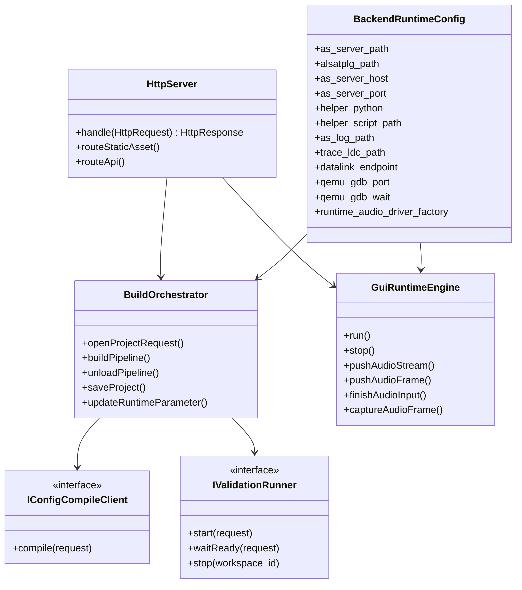
```mermaid
classDiagram
    class HttpServer {
      +handle(HttpRequest) HttpResponse
      +routeStaticAsset()
      +routeApi()
    }
    class BackendRuntimeConfig {
      +as_server_path
      +alsatplg_path
      +as_server_host
      +as_server_port
      +helper_python
      +helper_script_path
      +as_log_path
      +trace_ldc_path
      +datalink_endpoint
      +qemu_gdb_port
      +qemu_gdb_wait
      +runtime_audio_driver_factory
    }
    class BuildOrchestrator {
      +openProjectRequest()
      +buildPipeline()
      +unloadPipeline()
      +saveProject()
      +updateRuntimeParameter()
    }
    class GuiRuntimeEngine {
      +run()
      +stop()
      +pushAudioStream()
      +pushAudioFrame()
      +finishAudioInput()
      +captureAudioFrame()
    }
    class IConfigCompileClient {
      <<interface>>
      +compile(request)
    }
    class IValidationRunner {
      <<interface>>
      +start(request)
      +waitReady(request)
      +stop(workspace_id)
    }

    HttpServer --> BuildOrchestrator
    HttpServer --> GuiRuntimeEngine
    BuildOrchestrator --> IConfigCompileClient
    BuildOrchestrator --> IValidationRunner
    BackendRuntimeConfig --> BuildOrchestrator
    BackendRuntimeConfig --> GuiRuntimeEngine
```

### 5.2 启动参数

GUI backend uses explicit argv/config injection. All external paths and ports enter through `BackendRuntimeConfig`.

```bash
out/linux/simulator/gui_backend/Debug/audio_studio_gui_server . 8080 \
  --as-server out/linux/simulator/rpc_socket/Debug/as_server \
  --alsatplg third_party/alsatplg/bin/alsatplg \
  --as-server-host 127.0.0.1 \
  --as-server-port 9900 \
  --as-server-timeout-ms 5000 \
  --helper-python python3 \
  --helper-script ../application/rv32qemu/sof-build-test.py \
  --as-log out/linux/simulator/rpc_socket/Debug/as_log \
  --trace-ldc ../application/rv32qemu/build/sof.ldc \
  --ready-timeout-ms 120000 \
  --datalink /tmp/audio-studio-gui/as_datalink \
  --audio-driver-factory simulator
```

QEMU debug adds:

```bash
--qemu-gdb-port 1234 --qemu-gdb-wait
```

### 5.3 HTTP API surface

| Method | Path | Handler responsibility |
|---|---|---|
| GET | `/api/projects` | enumerate `configs/platform/*/*.json` |
| GET | `/api/config` | create workspace copy and return project config |
| POST | `/api/pipeline/build` | merge layout snapshot, call `config.compile`, start simulator validation |
| POST | `/api/pipeline/unload` | stop helper/session and reset workspace loaded state |
| POST | `/api/runtime/run` | create playback/capture sessions and enter running state |
| POST | `/api/runtime/audio/playback/stream` | enqueue PCM bytes |
| POST | `/api/runtime/audio/playback/frame` | receive frame metadata and return backpressure |
| POST | `/api/runtime/audio/playback/eos` | drain playback queue and close session |
| GET | `/api/runtime/audio/capture/frame` | read one capture frame from as_server |
| POST | `/api/runtime/stop` | stop selected runtime session |
| POST | `/api/runtime/file-io-dai/input` | stage WAV input for FILE_IO_DAI source |
| GET | `/api/runtime/file-io-dai/output` | fetch FILE_IO_DAI sink output WAV |
| GET | `/api/algorithm/cost/live` | render algorithm cost from SystemInfoService |
| GET | `/api/dsp/core/loading` | render DSP core load from SystemInfoService |
| GET | `/api/system/health/live` | render heartbeat/heap/buffer health |
| POST | `/api/param/update` | update runtime parameter preset and control apply state |
| POST | `/api/project/save` | persist validated project JSON |

### 5.4 Build orchestration 流程

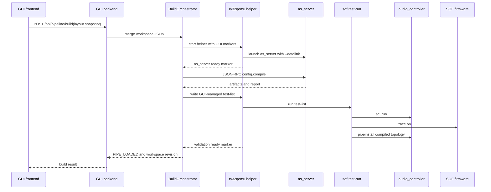
```mermaid
sequenceDiagram
    participant FE as GUI frontend
    participant HTTP as GUI backend
    participant BO as BuildOrchestrator
    participant Helper as rv32qemu helper
    participant AS as as_server
    participant Test as sof-test-run
    participant AC as audio_controller
    participant SOF as SOF firmware

    FE->>HTTP: POST /api/pipeline/build(layout snapshot)
    HTTP->>BO: merge workspace JSON
    BO->>Helper: start helper with GUI markers
    Helper->>AS: launch as_server with --datalink
    Helper-->>BO: as_server ready marker
    BO->>AS: JSON-RPC config.compile
    AS-->>BO: artifacts and report
    BO->>Helper: write GUI-managed test-list
    Helper->>Test: run test-list
    Test->>AC: ac_run
    Test->>SOF: trace on
    Test->>AC: pipeinstall compiled topology
    Helper-->>BO: validation ready marker
    BO-->>HTTP: PIPE_LOADED and workspace revision
    HTTP-->>FE: build result
```

`BuildOrchestrator` owns workspace records. Each record stores source path, workspace copy, output directory, build state, revision and loaded pipeline IDs. Build writes a merged project copy, strips transient GUI session fields for compile, and returns updated pipeline/layout data to frontend.

### 5.5 Playback runtime

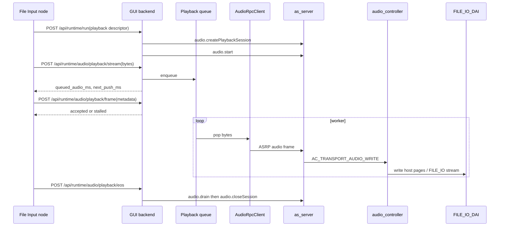
```mermaid
sequenceDiagram
    participant UI as File Input node
    participant HTTP as GUI backend
    participant Q as Playback queue
    participant RPC as AudioRpcClient
    participant AS as as_server
    participant AC as audio_controller
    participant SOF as FILE_IO_DAI

    UI->>HTTP: POST /api/runtime/run(playback descriptor)
    HTTP->>AS: audio.createPlaybackSession
    HTTP->>AS: audio.start
    UI->>HTTP: POST /api/runtime/audio/playback/stream(bytes)
    HTTP->>Q: enqueue
    HTTP-->>UI: queued_audio_ms, next_push_ms
    UI->>HTTP: POST /api/runtime/audio/playback/frame(metadata)
    HTTP-->>UI: accepted or stalled
    loop worker
        Q->>RPC: pop bytes
        RPC->>AS: ASRP audio frame
        AS->>AC: AC_TRANSPORT_AUDIO_WRITE
        AC->>SOF: write host pages / FILE_IO stream
    end
    UI->>HTTP: POST /api/runtime/audio/playback/eos
    HTTP->>AS: audio.drain then audio.closeSession
```

The playback worker decouples browser upload cadence from RPC write latency. Backpressure is derived from queue depth, worker progress and System Info buffer consumption.

### 5.6 Capture runtime

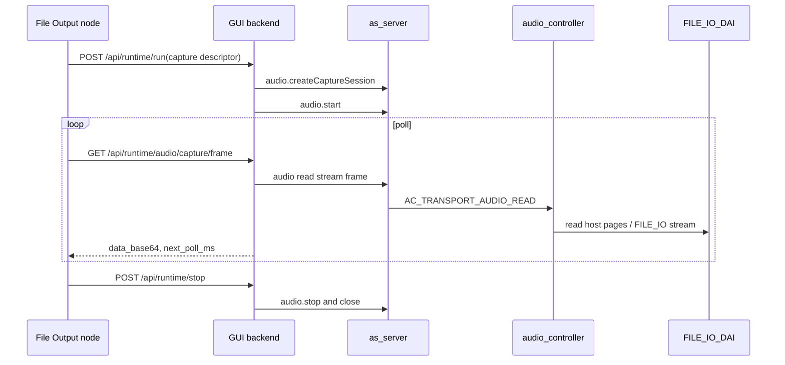
```mermaid
sequenceDiagram
    participant UI as File Output node
    participant HTTP as GUI backend
    participant AS as as_server
    participant AC as audio_controller
    participant SOF as FILE_IO_DAI

    UI->>HTTP: POST /api/runtime/run(capture descriptor)
    HTTP->>AS: audio.createCaptureSession
    HTTP->>AS: audio.start
    loop poll
        UI->>HTTP: GET /api/runtime/audio/capture/frame
        HTTP->>AS: audio read stream frame
        AS->>AC: AC_TRANSPORT_AUDIO_READ
        AC->>SOF: read host pages / FILE_IO stream
        HTTP-->>UI: data_base64, next_poll_ms
    end
    UI->>HTTP: POST /api/runtime/stop
    HTTP->>AS: audio.stop and close
```

Capture uses browser polling and avoids a long-lived backend queue. Timing hints keep browser polling aligned to sample rate and frame size.

### 5.7 System Info 适配器

GUI backend contains small controllers that translate `systemInfo.*` RPC responses into UI-specific JSON. `RpcAlgorithmCostController`, `RpcDspCoreLoadingController` and `RpcSystemHealthController` use a short-lived socket client and return disconnected frames when the RPC client support is absent or as_server is unreachable.

## 6. RPC and CLI

Audio Studio RPC is JSON-RPC 2.0 for control and ASRP binary frames for stream payload. Socket transport is the default for GUI and CLI. Pipe transport is available for constrained or scripted runs.

### 6.1 RPC registry

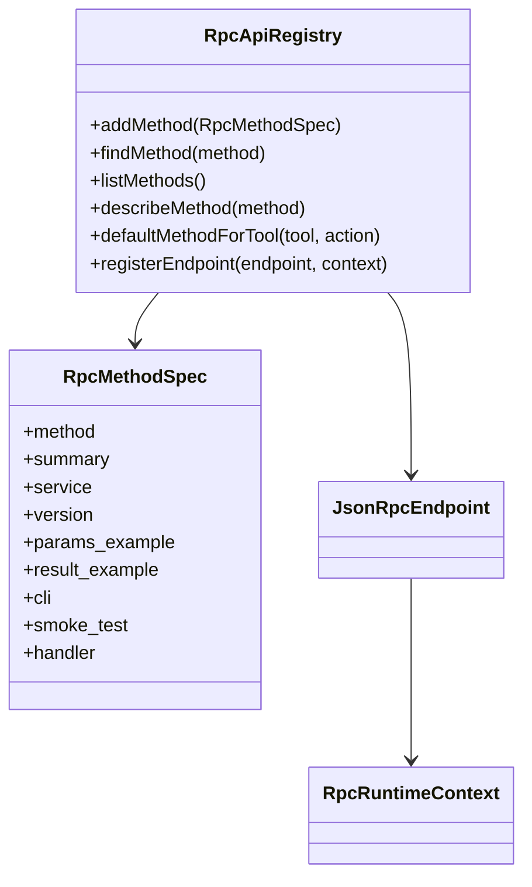
```mermaid
classDiagram
    class RpcApiRegistry {
      +addMethod(RpcMethodSpec)
      +findMethod(method)
      +listMethods()
      +describeMethod(method)
      +defaultMethodForTool(tool, action)
      +registerEndpoint(endpoint, context)
    }
    class RpcMethodSpec {
      +method
      +summary
      +service
      +version
      +params_example
      +result_example
      +cli
      +smoke_test
      +handler
    }
    class JsonRpcEndpoint
    class RpcRuntimeContext

    RpcApiRegistry --> RpcMethodSpec
    RpcApiRegistry --> JsonRpcEndpoint
    JsonRpcEndpoint --> RpcRuntimeContext
```

`rpc/api/audio_studio_rpc_api.cpp` is the method catalog. Each method block binds method name, service name, examples, CLI mapping, smoke test and handler function. `as_server` registers the catalog into a JSON-RPC endpoint at startup.

### 6.2 RPC 方法

| Service | Methods |
|---|---|
| rpc | `rpc.listMethods`, `rpc.describe` |
| config | `config.compile`, `config.listModuleConfigs` |
| audio | `audio.listDevices`, `audio.createPlaybackSession`, `audio.createCaptureSession`, `audio.prepare`, `audio.start`, `audio.drain`, `audio.stop`, `audio.closeSession`, `audio.listSessions`, `audio.getStats` |
| log | `log.createSession`, `log.configureSession`, `log.start`, `log.stop`, `log.closeSession`, `log.getStats`, `log.readEntries`, `log.readRaw` |
| systemInfo | `systemInfo.snapshot`, `systemInfo.components`, `systemInfo.buffers`, `systemInfo.health` |

### 6.3 Typed facade and remote handles

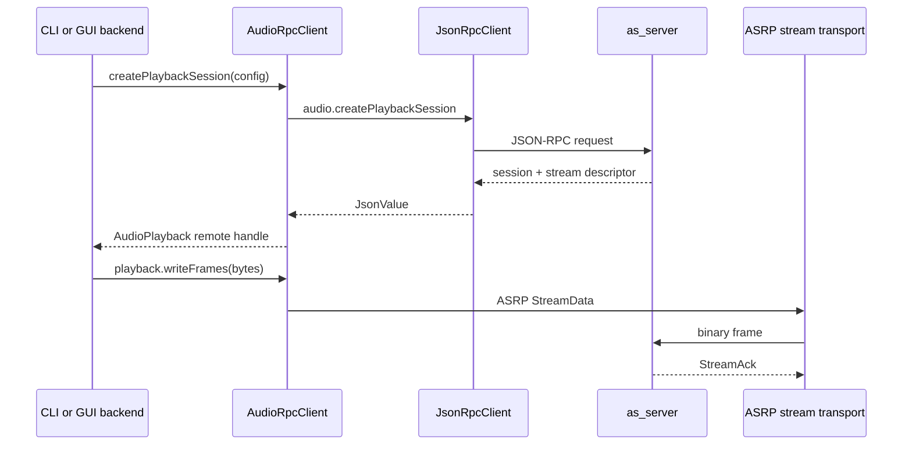
```mermaid
sequenceDiagram
    participant Tool as CLI or GUI backend
    participant Facade as AudioRpcClient
    participant RPC as JsonRpcClient
    participant Server as as_server
    participant Stream as ASRP stream transport

    Tool->>Facade: createPlaybackSession(config)
    Facade->>RPC: audio.createPlaybackSession
    RPC->>Server: JSON-RPC request
    Server-->>RPC: session + stream descriptor
    RPC-->>Facade: JsonValue
    Facade-->>Tool: AudioPlayback remote handle
    Tool->>Facade: playback.writeFrames(bytes)
    Facade->>Stream: ASRP StreamData
    Stream->>Server: binary frame
    Server-->>Stream: StreamAck
```

`AudioPlayback` and `AudioCapture` wrap session ID, numeric stream ID and stream descriptor. Business code calls methods on the handle and lets the facade build RPC params and stream frames.

### 6.4 Stream descriptor

`audio.createPlaybackSession` and `audio.createCaptureSession` return a stream descriptor:

```json
{
  "stream_id": "stream_playback_1",
  "numeric_stream_id": 1,
  "uri": "tcp://127.0.0.1:9900/streams/stream_playback_1",
  "direction": "write",
  "framing": "asrp-v1",
  "payload": "audio/pcm",
  "max_chunk_bytes": 65536,
  "default_timeout_ms": 5000,
  "blocking": true
}
```

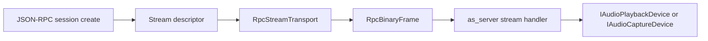
```mermaid
flowchart LR
    JsonRpc[JSON-RPC session create]
    Descriptor[Stream descriptor]
    Client[RpcStreamTransport]
    Frame[RpcBinaryFrame]
    Server[as_server stream handler]
    Driver[IAudioPlaybackDevice or IAudioCaptureDevice]

    JsonRpc --> Descriptor --> Client --> Frame --> Server --> Driver
```

ASRP frames carry service ID, method ID, request ID, numeric session ID, numeric stream ID, sequence, payload type and PCM payload. A write ack reports accepted bytes, queued bytes and credit bytes.

### 6.5 CLI tools

| Tool | 默认 service | 命令用途 |
|---|---|---|
| `as_config` | config | compile project JSON and emit topology artifacts |
| `as_play` | audio | create playback session, stream WAV frames, drain and close |
| `as_record` | audio | create capture session, read frames, write WAV |
| `as_log` | log | create/read log session, decode SOF trace when LDC is supplied |
| `as_control` | control | query or update controls through control service |
| `as_dump` | dump | list dump points and read dump/probe packets |
| `as_rpc` | rpc/debug | call arbitrary registered method |

CLI tools share `cli/common`. Socket transport uses `--host` and `--port`; pipe transport uses request/response FIFO paths. Tool main files stay small and delegate parsing/execution to common code.

## 7. as_server and framework services

`as_server` hosts framework services, initializes selected drivers, configures platform data-link devices, registers RPC methods and serves socket/pipe JSON-RPC requests.

### 7.1 Server 组合

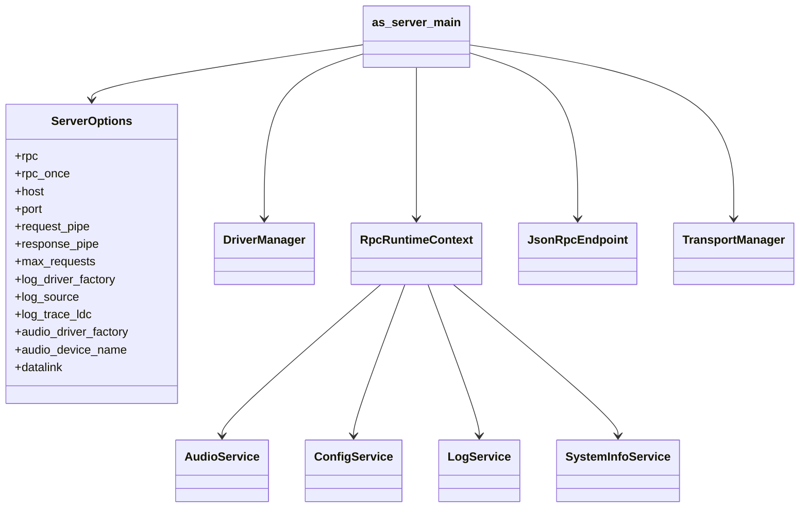
```mermaid
classDiagram
    class ServerOptions {
      +rpc
      +rpc_once
      +host
      +port
      +request_pipe
      +response_pipe
      +max_requests
      +log_driver_factory
      +log_source
      +log_trace_ldc
      +audio_driver_factory
      +audio_device_name
      +datalink
    }
    class as_server_main
    class DriverManager
    class RpcRuntimeContext
    class JsonRpcEndpoint
    class AudioService
    class ConfigService
    class LogService
    class SystemInfoService
    class TransportManager

    as_server_main --> ServerOptions
    as_server_main --> DriverManager
    as_server_main --> RpcRuntimeContext
    as_server_main --> JsonRpcEndpoint
    RpcRuntimeContext --> AudioService
    RpcRuntimeContext --> ConfigService
    RpcRuntimeContext --> LogService
    RpcRuntimeContext --> SystemInfoService
    as_server_main --> TransportManager
```

### 7.2 Runtime context

`RpcRuntimeContext` owns service references used by handlers. It also allocates text and numeric session IDs, maps numeric stream IDs to session IDs and stores stream defaults.

| Field | Purpose |
|---|---|
| `AudioService&` | playback/capture sessions |
| `ConfigService*` | topology compile |
| `LogService*` | log sessions and decode |
| `SystemInfoService*` | telemetry snapshot |
| `RpcStreamDefaults` | stream URI base, host, port, chunk size, timeout |
| session maps | stable mapping between string session IDs and numeric ASRP IDs |

### 7.3 ConfigService

`ConfigService` implements `config.compile`. It handles project input, catalog import, schema validation, module config registry, topology generation, `alsatplg` invocation, decode report and artifact manifest. GUI build, `as_config` and automated tests use the same compiler core.

### 7.4 AudioService

`AudioService` manages playback and capture sessions. Each session has format, device name, driver factory, prepared/running state and device object. The service creates devices through `drivers::audio::AudioDeviceRegistry`.

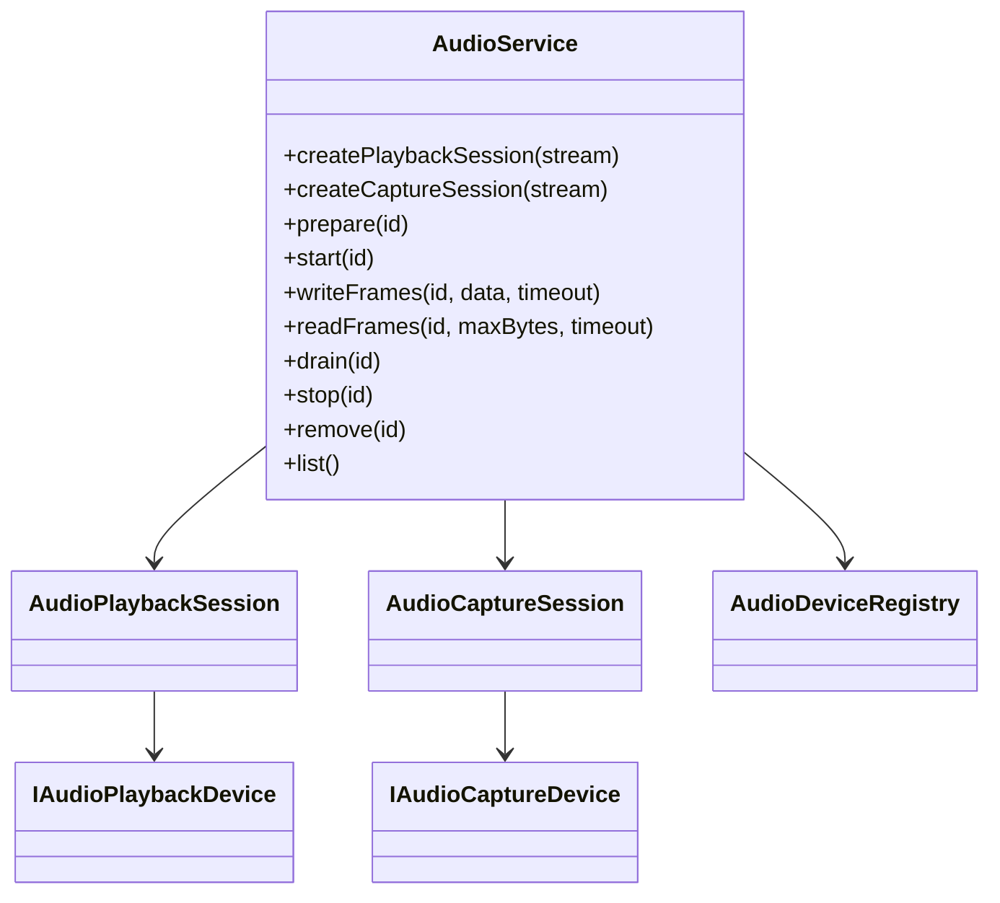
```mermaid
classDiagram
    class AudioService {
      +createPlaybackSession(stream)
      +createCaptureSession(stream)
      +prepare(id)
      +start(id)
      +writeFrames(id, data, timeout)
      +readFrames(id, maxBytes, timeout)
      +drain(id)
      +stop(id)
      +remove(id)
      +list()
    }
    class AudioPlaybackSession
    class AudioCaptureSession
    class IAudioPlaybackDevice
    class IAudioCaptureDevice
    class AudioDeviceRegistry

    AudioService --> AudioPlaybackSession
    AudioService --> AudioCaptureSession
    AudioService --> AudioDeviceRegistry
    AudioPlaybackSession --> IAudioPlaybackDevice
    AudioCaptureSession --> IAudioCaptureDevice
```

### 7.5 LogService

`LogService` manages decoded and raw log sessions. It can read from a host log device, simulator log device or SOF trace source. When a trace LDC is supplied, the SOF logger decoder converts raw trace records into readable strings. An entry interceptor routes `ASINFO|` records into `SystemInfoService`.

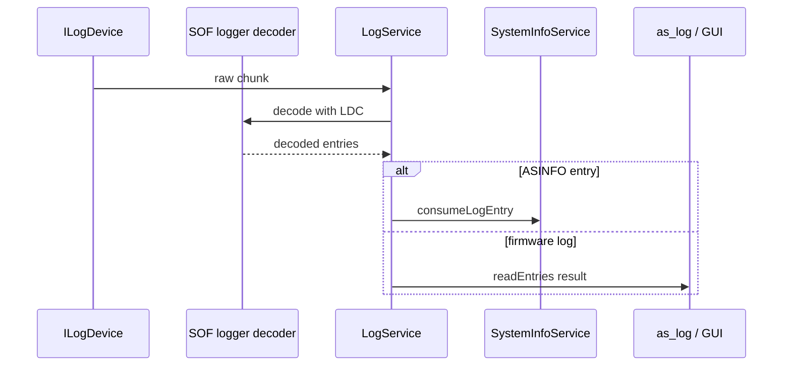
```mermaid
sequenceDiagram
    participant Driver as ILogDevice
    participant Decoder as SOF logger decoder
    participant Log as LogService
    participant Sys as SystemInfoService
    participant Client as as_log / GUI

    Driver->>Log: raw chunk
    Log->>Decoder: decode with LDC
    Decoder-->>Log: decoded entries
    alt ASINFO entry
        Log->>Sys: consumeLogEntry
    else firmware log
        Log->>Client: readEntries result
    end
```

### 7.6 SystemInfoService

`SystemInfoService` parses rows with prefix `ASINFO|`. It stores heartbeat, cores, modules, buffers, pipelines and heap rows. Heartbeat timeout marks the snapshot disconnected and clears runtime rows for dashboard correctness.

| ASINFO type | Fields | GUI use |
|---|---|---|
| heartbeat | `seq`, `timestamp_ms` | connection/running state |
| core | `id`, `freq_mhz`, `load_percent` | DSP core loading |
| module | `id`, `pipeline`, `state`, `core`, CPU/memory/latency | algorithm cost |
| buffer | `id`, `from`, `to`, `size_bytes`, `avail_bytes`, produced/consumed bytes, stalled | graph edge blocking |
| pipeline | `id`, `latency_ms`, `xruns`, `dropouts` | health and diagnostics |
| heap | `category`, `index`, `block_size`, free/total/used/free bytes | system health table |

### 7.7 TransportManager

TransportManager multiplexes logical channels over a selected data-link device. It owns channel state, worker threads, request/reply correlation, retry and timeout behavior.

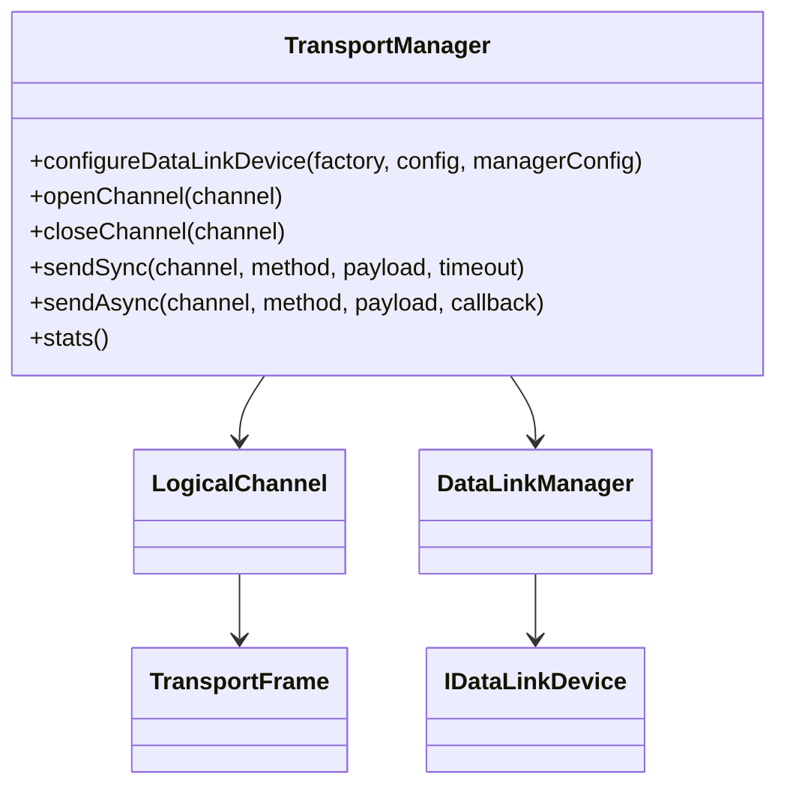
```mermaid
classDiagram
    class TransportManager {
      +configureDataLinkDevice(factory, config, managerConfig)
      +openChannel(channel)
      +closeChannel(channel)
      +sendSync(channel, method, payload, timeout)
      +sendAsync(channel, method, payload, callback)
      +stats()
    }
    class DataLinkManager
    class LogicalChannel
    class TransportFrame
    class IDataLinkDevice

    TransportManager --> LogicalChannel
    TransportManager --> DataLinkManager
    DataLinkManager --> IDataLinkDevice
    LogicalChannel --> TransportFrame
```

Transport frames sit above data-link frames. The data-link layer handles ordered reliable block transfer with ACK, retry, CRC and fragmentation. The transport layer adds logical channel ID, method ID and request identity.

## 8. Driver abstraction layer

Drivers expose host/platform resources through small interfaces and registries. Framework services consume interfaces and factory names, while platform code selects concrete implementations.

### 8.1 DriverManager

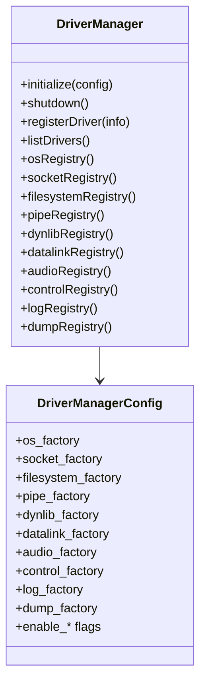
```mermaid
classDiagram
    class DriverManager {
      +initialize(config)
      +shutdown()
      +registerDriver(info)
      +listDrivers()
      +osRegistry()
      +socketRegistry()
      +filesystemRegistry()
      +pipeRegistry()
      +dynlibRegistry()
      +datalinkRegistry()
      +audioRegistry()
      +controlRegistry()
      +logRegistry()
      +dumpRegistry()
    }
    class DriverManagerConfig {
      +os_factory
      +socket_factory
      +filesystem_factory
      +pipe_factory
      +dynlib_factory
      +datalink_factory
      +audio_factory
      +control_factory
      +log_factory
      +dump_factory
      +enable_* flags
    }
    DriverManager --> DriverManagerConfig
```

`DriverManagerConfig` chooses default factory names per category and enables only the driver categories required by the binary. CLI clients usually enable socket or pipe. as_server enables framework-required categories.

### 8.2 Driver 分类

| Category | Interface | Implementations | Typical consumer |
|---|---|---|---|
| os | `IOsDriver` | Linux host, macOS | framework/platform utilities |
| socket | `ISocketDriver` | Linux host, macOS, Windows host | RPC socket transport |
| filesystem | `IFileSystemDriver` | Linux host, macOS | ConfigService, plugin discovery |
| pipe | `IPipeDriver` | Linux FIFO, macOS | RPC pipe transport |
| dynlib | `IDynlibDriver` | Linux host, macOS | plugin manager |
| datalink | `IDataLinkDevice` | Linux host, macOS, simulator pipe | TransportManager |
| audio | `IAudioPlaybackDevice`, `IAudioCaptureDevice` | ALSA, PulseAudio, CoreAudio, WASAPI, simulator | AudioService |
| control | `IControlDevice` | Linux host, macOS, platform-specific | ControlService |
| log | `ILogDevice` | Linux host, macOS, simulator | LogService |
| dump | `IDumpDevice` | Linux host, macOS, platform-specific | DumpService |

### 8.3 Audio driver interface

```mermaid
classDiagram
    class IAudioPlaybackDevice {
      +open(params)
      +prepare(streamParams)
      +start()
      +writeFrame(frame, timeout)
      +drain()
      +stop()
      +close()
      +getStats()
      +getCaps()
    }
    class IAudioCaptureDevice {
      +open(params)
      +prepare(streamParams)
      +start()
      +readFrame(frame, timeout)
      +stop()
      +close()
      +getStats()
      +getCaps()
    }
    class AudioDeviceRegistry {
      +registerPlaybackFactory(factory)
      +registerCaptureFactory(factory)
      +createPlayback(name, params)
      +createCapture(name, params)
    }
    AudioDeviceRegistry --> IAudioPlaybackDevice
    AudioDeviceRegistry --> IAudioCaptureDevice
```

Host playback/capture can use ALSA, PulseAudio, CoreAudio or WASAPI. Simulator playback/capture uses the same interface while mapping frames to audio_controller transport commands.

### 8.4 Data-link and transport driver

```mermaid
sequenceDiagram
    participant Service as Audio/Log/Control driver
    participant TM as TransportManager
    participant DLM as DataLinkManager
    participant DL as IDataLinkDevice
    participant AC as audio_controller

    Service->>TM: sendSync(channel, method, payload)
    TM->>DLM: encode transport frame
    DLM->>DL: writeBlock(fragment)
    DL->>AC: endpoint write
    AC-->>DL: endpoint read response
    DL-->>DLM: readBlock(response)
    DLM-->>TM: decoded frame
    TM-->>Service: method response
```

`IDataLinkDevice` is deliberately block-oriented. Reliability, ordering and channel semantics live above it in DataLinkManager and TransportManager.

### 8.5 OS/filesystem/socket/pipe/dynlib

These drivers isolate host differences:

- OS driver provides threads, mutexes, recursive mutexes, events, semaphores, timers, clock, process launch and system info.
- Socket driver provides TCP client/server sockets used by JSON-RPC socket transport.
- Filesystem driver provides file open/read/write/stat/list primitives used by config, plugin and asset paths.
- Pipe driver provides FIFO or named pipe stream objects used by JSON-RPC pipe transport.
- Dynlib driver provides library open/symbol/close used by plugin loading.

### 8.6 Driver 扩展流程

```mermaid
flowchart TB
    Interface[Existing I*Device or driver interface]
    Factory[Implement factory]
    Registry[Register in module registry]
    Kconfig[Expose implementation switch]
    CMake[Add implementation source]
    Platform[Select factory in profile config]
    Service[Framework service consumes factory]

    Interface --> Factory --> Registry --> Kconfig --> CMake --> Platform --> Service
```

Adding a driver implementation touches the driver module, Kconfig/CMake and the platform or runtime config that selects the factory. Framework services remain bound to interfaces.

## 9. Platform profiles

Platform profiles describe the capabilities and default factory choices for a target environment. `server/platform/core` provides registry support. `server/platform/simulator` registers simulator profile behavior. `server/platform/a2` holds A2 profile skeleton and extensions.

### 9.1 Platform profile model

```mermaid
classDiagram
    class PlatformProfile {
      +id
      +name
      +available
      +capabilities[]
      +default_audio_factory
      +default_log_factory
      +default_datalink_factory
    }
    class PlatformRegistry {
      +registerProfile(profile)
      +find(id)
      +list()
    }
    PlatformRegistry --> PlatformProfile
```

### 9.2 Simulator profile

Simulator profile binds as_server to audio_controller through a data-link endpoint. The server receives `--datalink <endpoint>` and configures `TransportManager::instance()` with `simulator-pipe` data-link. Audio, log and control paths then reuse this single transport manager.

```mermaid
flowchart LR
    AsServer[as_server --datalink endpoint]
    TM[TransportManager]
    Pipe[SimulatorPipeDataLinkDevice]
    AC[audio_controller]
    Log[Simulator log device]
    Audio[Simulator audio device]

    AsServer --> TM
    TM --> Pipe
    Pipe --> AC
    Log --> TM
    Audio --> TM
```

### 9.3 A2 profile

A2 profile uses the same framework contracts with different factory selection. Direct controller mode uses Audio Controller protocol and platform data-link. 7870-style integration uses platform-specific audio/control/log/dump devices where ALSA/tinyalsa/tinymix/debugfs are the integration boundary.

## 10. audio_controller

`audio_controller` is a C peer used by simulator and controller-style platforms. It provides topology loading, pipeline installation, audio playback/capture transport, log readout and common command dispatch. It receives all platform resources through driver ops.

### 10.1 Public API

| API | 用途 |
|---|---|
| `audio_controller_create` / `destroy` | create controller with driver ops |
| `audio_controller_load_topology_buffer` | parse topology payload |
| `audio_controller_install_pipeline` / `install_all` | instantiate SOF pipelines |
| `audio_controller_list_pipelines` | report available pipeline IDs/names |
| `audio_controller_get_summary` | topology parser summary |
| `audio_controller_get_transport_stats` | transport state and packet counters |
| `audio_controller_get_last_error` | human-readable failure reason |

### 10.2 Driver ops

```mermaid
classDiagram
    class audio_controller_driver_ops_t {
      +alloc(user, size, alignment)
      +free(user, ptr)
      +log(user, level, message)
      +thread_create(user, thread, entry, arg)
      +thread_join(user, thread)
      +mutex_create(user, mutex)
      +mutex_lock(user, mutex)
      +mutex_unlock(user, mutex)
      +sleep_ms(user, milliseconds)
      +datalink
      +log_source
    }
    class audio_controller_datalink_device_ops_t {
      +open(user)
      +close(user)
      +read(user, buffer, capacity, actual, timeout)
      +write(user, data, size, timeout)
      +mtu(user)
    }
    class audio_controller_log_source_ops_t {
      +open(user)
      +start(user)
      +read(user, buffer, capacity, actual, timeout)
      +stop(user)
      +close(user)
    }
    audio_controller_driver_ops_t --> audio_controller_datalink_device_ops_t
    audio_controller_driver_ops_t --> audio_controller_log_source_ops_t
```

The ops table makes controller code portable across host simulator, embedded controller firmware and test harnesses. Memory, synchronization, sleep, data-link and log source are injected.

### 10.3 内部模块

| File | Responsibility |
|---|---|
| `ac_audio_controller.c` | controller lifetime and public API glue |
| `ac_topology_parser.c` | parse topology sections, PCMs, DAIs, links, widgets, routes, controls, private blocks |
| `ac_sof_loader.c` | bridge parsed topology into SOF pipeline install path |
| `ac_transport.c` | logical channel worker and command dispatch |
| `ac_datalink.c` | frame fragmentation, ACK/retry/CRC on data-link blocks |
| `ac_audio.c` | audio playback/capture session slots and host pages |
| `ac_log.c` | log channel open/read/close command handling |
| `ac_transport_channel.h` | stable channel and method IDs |

### 10.4 Transport channels

```text
Channel 1  LOG
Channel 2  DUMP
Channel 3  AUDIO_CONTROL
Channel 4..19 AUDIO_DATA streams
```

Audio methods:

```text
OPEN, CONFIG, START, WRITE, READ, DRAIN, STOP, CLOSE
```

Log methods:

```text
OPEN, READ, CLOSE
```

```mermaid
sequenceDiagram
    participant AS as as_server simulator driver
    participant TM as TransportManager
    participant DL as data-link
    participant AC as audio_controller
    participant Slot as audio slot
    participant SOF as SOF stream

    AS->>TM: AUDIO_OPEN
    TM->>DL: channel 3 command
    DL->>AC: dispatch audio open
    AC->>Slot: allocate stream slot
    AS->>TM: AUDIO_WRITE on data channel
    TM->>DL: frame payload
    DL->>AC: audio write command
    AC->>SOF: write host pages
    SOF-->>AC: consumed bytes
    AC-->>AS: ACK accepted bytes
```

### 10.5 Topology installation

```mermaid
sequenceDiagram
    participant Test as sof-test-run pipeinstall
    participant AC as audio_controller
    participant Parser as ac_topology_parser
    participant Loader as ac_sof_loader
    participant SOF as SOF runtime

    Test->>AC: load topology buffer
    AC->>Parser: parse topology sections
    Parser-->>AC: topology summary and graph
    Test->>AC: install pipeline id/name
    AC->>Loader: create SOF pipeline graph
    Loader->>SOF: instantiate components, buffers, routes
    SOF-->>Loader: pipeline handle
    Loader-->>AC: installed pipeline list
```

Topology parser keeps enough metadata for pipeline graph, module/node/edge, controls, private payload and runtime parameter mapping. The loader uses the parsed model to install selected pipelines into SOF runtime.

## 11. Simulator, rv32qemu and SOF test integration

The simulator profile is validated through VASS rv32qemu and SOF test infrastructure. GUI backend triggers the same helper/test-list flow that can be executed from shell.

### 11.1 Helper responsibilities

`application/rv32qemu/sof-build-test.py`:

- locates QEMU and runtime libraries,
- prepares `sof_trace.fifo`,
- prepares data-link endpoint files,
- launches or reuses as_server,
- passes `--datalink` to as_server,
- starts rv32qemu firmware,
- runs SOF test-list through `sof-test-run.py`,
- writes GUI ready markers,
- supports QEMU gdbstub with `--qemu-gdb-port` and `--qemu-gdb-wait`,
- wraps plain test-lists for audio-controller log mode when `ac_run` is absent.

### 11.2 GUI helper lifecycle

```mermaid
stateDiagram-v2
    [*] --> Idle
    Idle --> StartingHelper: GUI build starts helper
    StartingHelper --> AsServerReady: as_server TCP ready + marker
    AsServerReady --> WaitingForTestList: helper waits for GUI-managed test-list
    WaitingForTestList --> RunningSofTest: test-list received
    RunningSofTest --> ValidationReady: pipeinstall marker written
    ValidationReady --> KeepAlive: QEMU, as_server and controller remain resident
    KeepAlive --> Stopping: unload or build restart
    Stopping --> Idle
    StartingHelper --> Failed
    RunningSofTest --> Failed
    Failed --> Stopping
```

### 11.3 SOF test runner

`Misc/sof_test/sof-test-run.py` executes test-list files from a platform directory. It supports metadata comments for generating tone WAV files, prepares platform `test-lists.txt`, runs platform command, tracks WAV activity metrics and archives temporary audio output.

Common test-list commands:

| Command | Meaning |
|---|---|
| `ac_run` | start audio_controller endpoint and bind data-link/log source |
| `trace on` / `trace off` | control SOF trace capture |
| `pipeinstall` | install topology into SOF runtime |
| `piperemove` | remove installed pipeline |
| `splay` / `srecord` | playback/record SOF test paths |
| `scplay` / `screcord` | stream-controller playback/record paths |

### 11.4 SOF FILE_IO_DAI

`sof/src/drivers/file_io/` implements FILE_IO DAI DMA. It bridges SOF DAI semantics to host-provided WAV/file streams. Playback invalidates host buffer cache before reading; capture writes back cache after writing. Runtime format comes from topology and stream parameters.

### 11.5 SOF Audio Studio telemetry

`sof/src/audio_studio/audio_studio.c` emits `ASINFO|` trace rows every 100 ms. It registers buffer transaction callbacks, samples component state, buffer movement, core load, pipeline counters and heap rows.

```mermaid
flowchart TB
    Task[SOF Audio Studio ll task]
    Components[SOF components]
    Buffers[SOF buffers]
    Heap[mm_heap rows]
    Trace[SOF trace]
    Decoder[as_server SOF logger decoder]
    Sys[SystemInfoService]
    GUI[GUI dashboard]

    Task --> Components
    Task --> Buffers
    Task --> Heap
    Components --> Trace
    Buffers --> Trace
    Heap --> Trace
    Trace --> Decoder
    Decoder --> Sys
    Sys --> GUI
```

Example rows:

```text
ASINFO|heartbeat|seq=42|timestamp_ms=123400
ASINFO|core|id=0|freq_mhz=600|load_percent=37
ASINFO|module|id=12|pipeline=3|state=ACTIVE|core=0
ASINFO|buffer|id=5|from=12|to=13|size_bytes=8192|avail_bytes=2048|produced_bytes=4800|consumed_bytes=4700
ASINFO|buffer|id=5|stalled=0
ASINFO|heap|category=runtime|index=0|block_size=256|free_count=5|total_count=64
ASINFO|pipeline|id=3|latency_ms=1|xruns=0|dropouts=0
```

## 12. 端到端流程

### 12.1 GUI build/load flow

```mermaid
sequenceDiagram
    participant Browser
    participant Backend
    participant Workspace
    participant AsServer
    participant Helper
    participant SofTest
    participant Controller

    Browser->>Backend: load project
    Backend->>Workspace: create workspace copy
    Browser->>Backend: build all working groups
    Backend->>Workspace: merge pipelines and frontend_connections
    Backend->>Helper: start simulator session
    Helper-->>Backend: as_server ready
    Backend->>AsServer: config.compile
    AsServer-->>Backend: topology artifacts
    Backend->>Helper: provide test-list
    Helper->>SofTest: run ac_run, trace on, pipeinstall
    SofTest->>Controller: install topology
    Controller-->>SofTest: installed pipeline summary
    Helper-->>Backend: validation ready
    Backend-->>Browser: PIPE_LOADED
```

### 12.2 GUI playback flow

```mermaid
sequenceDiagram
    participant Browser
    participant Backend
    participant AsServer
    participant Transport
    participant Controller
    participant SOF

    Browser->>Backend: run playback pipeline
    Backend->>AsServer: audio.createPlaybackSession
    Backend->>AsServer: audio.start
    loop frames
        Browser->>Backend: PCM chunk
        Backend->>AsServer: ASRP stream frame
        AsServer->>Transport: AC audio write
        Transport->>Controller: data channel frame
        Controller->>SOF: write stream pages
        SOF-->>Controller: consumed
        Controller-->>AsServer: accepted bytes
        Backend-->>Browser: queue/backpressure
    end
    Browser->>Backend: EOS
    Backend->>AsServer: audio.drain + close
```

### 12.3 as_log flow

```mermaid
sequenceDiagram
    participant CLI as as_log
    participant RPC as JsonRpcClient
    participant AS as as_server
    participant Log as LogService
    participant Driver as ILogDevice
    participant Decoder as SOF decoder
    participant Sys as SystemInfoService

    CLI->>RPC: log.createSession
    RPC->>AS: JSON-RPC
    AS->>Log: create session
    Log->>Driver: open log source
    CLI->>RPC: log.readEntries
    Log->>Driver: read raw chunk
    Log->>Decoder: decode
    Decoder-->>Log: entries
    Log->>Sys: consume ASINFO entries
    Log-->>CLI: ordinary firmware entries
```

### 12.4 Parameter update flow

```mermaid
sequenceDiagram
    participant Inspector
    participant Backend
    participant Workspace
    participant Control as ControlService
    participant Driver as IControlDevice

    Inspector->>Backend: POST /api/param/update
    Backend->>Workspace: update inspector_preset
    Backend->>Control: apply value for runtime-capable control
    Control->>Driver: set(selector, value)
    Driver-->>Control: status
    Backend-->>Inspector: applied state and diagnostics
```

### 12.5 Config CLI flow

```mermaid
sequenceDiagram
    participant User
    participant CLI as as_config
    participant Config as ConfigService
    participant Plugin as ModuleConfigRegistry
    participant Tool as alsatplg
    participant Out as output dir

    User->>CLI: as_config --input project.json
    CLI->>Config: compile request
    Config->>Plugin: pack module config bytes
    Config->>Tool: compile topology source
    Tool-->>Config: tplg / decode report
    Config->>Out: write artifacts
    Config-->>CLI: report JSON
```

## 13. 构建、调试与验证

### 13.1 Build profiles

| Profile | Defconfig | 输出形态 |
|---|---|---|
| simulator GUI backend | `configs/profile/gui_backend_defconfig` + `configs/platform/simulator/simulator_defconfig` | `out/linux/simulator/gui_backend/<type>/audio_studio_gui_server` |
| simulator RPC socket | `configs/profile/rpc_socket_defconfig` + simulator platform | `out/linux/simulator/rpc_socket/<type>/as_server`, CLI tools |
| simulator RPC pipe | `configs/profile/rpc_pipe_defconfig` + simulator platform | pipe transport binaries |
| as_config | `configs/profile/as_config_defconfig` | config compiler CLI and service tests |
| driver interface tests | `configs/profile/driver_interface_tests_defconfig` | driver and framework tests |

### 13.2 Debug configuration

VSCode configurations wire GUI frontend, GUI backend, as_server attach, simulator keep-alive and QEMU gdbstub. GUI backend passes QEMU debug settings to helper through `--qemu-gdb-port` and `--qemu-gdb-wait`. as_server debug attaches to the helper-created process so the simulator session uses a single server instance.

### 13.3 Validation matrix

| Scope | Command |
|---|---|
| Document contract | custom Python assertions over `docs/audio_studio_framework_design.md` |
| Whitespace | `git diff --check` |
| Backend CTest | `ctest --test-dir out/linux/simulator/gui_backend/Debug --output-on-failure` |
| RPC socket/pipe | `ctest --test-dir out/linux/simulator/rpc_socket/Debug --output-on-failure` |
| audio_controller | `ctest --test-dir out/linux/simulator/audio_controller/Debug --output-on-failure` |
| Full Audio-Studio regression | `./scripts/run_tests.sh` |
| rv32qemu helper smoke | `python3 application/rv32qemu/sof-build-test.py -t Misc/sof_test/simple_test/rv32qemu-as-log-test-lists.txt --audio-controller-log ...` |
| SOF telemetry contract | `python3 Misc/sof_test/tests/test_audio_studio_info_contract.py` |

## 14. 扩展方式

### 14.1 添加 module type

```mermaid
flowchart TB
    Catalog[Module catalog JSON]
    Frontend[Frontend parser renders controls]
    Handler[Module config handler packs private bytes]
    Config[ConfigService validates and emits IR]
    Topology[Topology/private data artifacts]
    Runtime[Control/audio path consumes metadata]

    Catalog --> Frontend
    Catalog --> Config
    Handler --> Config
    Config --> Topology
    Topology --> Runtime
```

步骤：

1. Add module type schema to built-in catalog or plugin catalog.
2. Declare parameter type, range, enum, default and settable states.
3. Add module config handler when parameters require binary private payload.
4. Add topology generator mapping when the module maps to a SOF component with special section needs.
5. Add frontend rendering tests and config compile tests.

### 14.2 添加 RPC method

1. Add a method block in `rpc/api/audio_studio_rpc_api.cpp`.
2. Bind handler to a framework service through `RpcRuntimeContext`.
3. Add params/result examples and smoke-test params in the method spec.
4. Add CLI binding when a tool uses the method as an action.
5. Add server or CLI tests that call `rpc.describe` and the method itself.

### 14.3 添加 driver implementation

1. Implement the category interface under `drivers/<category>/src/`.
2. Implement the matching factory.
3. Register the factory in the category registry.
4. Add Kconfig implementation switch and CMake source selection.
5. Select factory through `DriverManagerConfig`, platform profile or command-line option.
6. Add interface tests and one service-level test.

### 14.4 添加 platform profile

1. Register profile metadata in `server/platform/<name>`.
2. Select data-link, audio, control, log and dump factory names.
3. Provide profile defconfig under `configs/platform/<name>/`.
4. Add platform project JSON and topology compile fixture.
5. Add one build/load smoke and one runtime smoke.

### 14.5 添加 ASINFO telemetry

1. Emit a stable `ASINFO|type|key=value` row in `sof/src/audio_studio/audio_studio.c`.
2. Parse the row in `SystemInfoService`.
3. Expose the field through `systemInfo.snapshot` or a dedicated method.
4. Map it to GUI backend dashboard output.
5. Add SOF telemetry contract and backend parser tests.

## 15. 实现参考

本章把稳定架构展开为实现级参考，按 service 和 driver 组织，读者可以从高层图直接定位到拥有该行为的 C++ 或 C 模块。

### 15.1 HTTP server routing model

`GUI/backend/src/http_server.cpp` owns browser-facing routing. Static routes serve `GUI/frontend` assets. API routes call controllers and return JSON or binary data. The route layer keeps parsing small: it extracts HTTP method, path, query, headers and body into `HttpRequest`, then dispatches to `BuildOrchestrator`, `GuiRuntimeEngine`, node/parameter controllers or System Info controllers.

```mermaid
flowchart TB
    Socket[HTTP connection]
    Request[HttpRequest]
    Static[Static asset route]
    Api[API route]
    Project[Project/build API]
    Runtime[Runtime audio API]
    Telemetry[System Info API]
    Response[HttpResponse]

    Socket --> Request
    Request --> Static
    Request --> Api
    Api --> Project
    Api --> Runtime
    Api --> Telemetry
    Static --> Response
    Project --> Response
    Runtime --> Response
    Telemetry --> Response
```

Route families:

| Route family | Backing object | Data shape |
|---|---|---|
| `/`, `/GUI/frontend/*`, asset paths | static file resolver | HTML/CSS/JS/PNG |
| `/api/projects`, `/api/config`, `/api/project/save` | `BuildOrchestrator` | JSON |
| `/api/pipeline/build`, `/api/pipeline/unload` | `BuildOrchestrator` + validation runner | JSON |
| `/api/runtime/*` | `GuiRuntimeEngine` | JSON and PCM bytes |
| `/api/algorithm/*`, `/api/dsp/*`, `/api/system/*` | System Info controllers | JSON |

### 15.2 Workspace write model

Build orchestration uses a workspace copy so GUI editing, compiler input and source project persistence stay separated.

```mermaid
flowchart LR
    Source[configs/platform/<profile>/<project>.json]
    Workspace[/tmp/audio-studio-gui-workspaces/<id>]
    All[<profile>_pipeline_all.json]
    Snapshot[GUI layout snapshot]
    Compile[compiler input]
    Save[source JSON write]

    Source --> Workspace
    Workspace --> All
    Snapshot --> All
    All --> Compile
    All --> Save
```

Workspace fields:

| Field | 说明 |
|---|---|
| `workspace_id` | browser session level project handle |
| `project` | profile-relative path such as `simulator/simulator.json` |
| `source_path` | repository project JSON path |
| `workspace_dir` | temporary directory for merged JSON and artifacts |
| `input_path` | compiler input JSON path inside workspace |
| `output_dir` | generated topology, report and staged FILE_IO files |
| `build_ok` | save gate and runtime state source |
| `workspace_revision` | monotonically increasing browser sync token |

### 15.3 Build result contract

Build result JSON 同时返回操作状态和已同步的 workspace 数据：

```json
{
  "ok": true,
  "runtime_state": "PIPE_LOADED",
  "workspace_id": "simulator_1234",
  "workspace_revision": 7,
  "updated_pipelines": [],
  "updated_frontend_connections": [],
  "artifacts": {
    "tplg_path": "/tmp/audio-studio-gui-workspaces/.../simulator.tplg"
  },
  "diagnostics": []
}
```

失败响应保留 workspace identity，并携带 config compile、helper process 或 SOF test output 的 diagnostics。Frontend 状态转换由 `runtime_state` 驱动，详细提示来自 `diagnostics`。

### 15.4 Runtime backpressure model

Playback backpressure combines three signals:

| Signal | Producer | Meaning | GUI response |
|---|---|---|---|
| queue depth | `GuiRuntimeEngine::PlaybackWorker` | browser is pushing faster than as_server writes | delay next frame by `next_push_ms` |
| worker progress | playback worker timestamp | backend worker is blocked or RPC path is unavailable | mark frame stalled |
| SOF buffer consumption | `systemInfo.buffers` | firmware graph is no longer consuming edge data | highlight `blocked_edge_key` |

```mermaid
flowchart TB
    BrowserFrame[Browser PCM frame]
    Queue[Backend queue]
    Worker[Playback worker]
    RpcWrite[AudioRpcClient write]
    SysBuf[systemInfo.buffers]
    Result[Frame response]

    BrowserFrame --> Queue
    Queue --> Worker
    Worker --> RpcWrite
    SysBuf --> Result
    Queue --> Result
    Worker --> Result
```

Frame response fields:

| Field | 说明 |
|---|---|
| `accepted` | backend accepted frame metadata |
| `queued_bytes` | bytes waiting in backend queue |
| `queued_audio_ms` | queue duration estimated from format |
| `next_push_ms` | browser pacing hint |
| `stalled` | queue/RPC/SOF blockage signal |
| `blocked_edge_key` | GUI edge identity |
| `blocked_system_edge_key` | SOF buffer identity |
| `blocking_source` | `queue`, `rpc`, or `system_info` |

### 15.5 JSON-RPC transport stack

```mermaid
flowchart TB
    Json[JSON-RPC payload]
    Framing[Content-Length framing]
    Socket[Socket transport]
    Pipe[Pipe transport]
    Endpoint[JsonRpcEndpoint]
    Handler[RpcMethodSpec handler]

    Json --> Framing
    Framing --> Socket
    Framing --> Pipe
    Socket --> Endpoint
    Pipe --> Endpoint
    Endpoint --> Handler
```

Socket and pipe transports share the same JSON codec. The framing layer uses `Content-Length: <n>\r\n\r\n<payload>` and supports single request, notification, batch request, result and error response. Socket clients reuse a connection for multiple calls in the same client lifecycle.

### 15.6 ASRP binary stream frame

ASRP carries data-plane payload alongside JSON-RPC control sessions.

```mermaid
classDiagram
    class RpcBinaryFrameHeader {
      +version
      +header_size
      +message_type
      +service_id
      +method_id
      +payload_type
      +request_id
      +session_id
      +stream_id
      +sequence
      +flags
      +payload_size
    }
    class RpcBinaryFrame {
      +header
      +payload[]
    }
    class StreamData
    class StreamAck
    RpcBinaryFrame --> RpcBinaryFrameHeader
    StreamData --> RpcBinaryFrame
    StreamAck --> RpcBinaryFrame
```

Playback uses `StreamData` from client to server. Capture uses read request and server data response. Ack payload reports operation result and byte counts. The server maps numeric session/stream IDs back to string session handles through `RpcRuntimeContext`.

### 15.7 Framework service detail

| Service | State | Driver use | RPC surface |
|---|---|---|---|
| `common` | status and service registry | none | internal |
| `session` | named session records | none | internal and tests |
| `config` | compile request/output, module config registry | filesystem, dynlib, alsatplg process through host services | `config.compile`, `config.listModuleConfigs` |
| `audio` | playback/capture session maps | audio registry | `audio.*` |
| `control` | control values and selectors | control registry | control tool path |
| `log` | log sessions, raw/decoded entry buffers | log registry, SOF decoder | `log.*` |
| `dump` | dump session records and raw packets | dump registry | dump tool path |
| `plugin` | plugin descriptors and capabilities | filesystem/dynlib through plugin loader | plugin discovery path |
| `system_info` | heartbeat, core, component, buffer, heap, pipeline snapshot | LogService interceptor | `systemInfo.*` |
| `transport` | logical channel and data-link state | datalink registry | simulator audio/log/control/dump drivers |

### 15.8 Control service model

Control values are typed and selected by profile/device context. A control selector names a device, component, parameter or platform-specific control. Control values support bool, integer, float, enum, bytes and string payloads.

```mermaid
classDiagram
    class ControlSelector {
      +device
      +component
      +parameter
      +profile
    }
    class ControlValue {
      +type
      +bool_value
      +int_value
      +float_value
      +string_value
      +bytes
    }
    class IControlDevice {
      +open(config)
      +list(selector)
      +get(selector)
      +set(selector, value)
      +close()
      +stats()
    }
    class ControlService
    ControlService --> IControlDevice
    IControlDevice --> ControlSelector
    IControlDevice --> ControlValue
```

The GUI runtime parameter path updates `inspector_preset` first and applies through control service when the selected platform exposes a matching control device.

### 15.9 Dump/probe service model

Dump and probe support use SOF probes semantics: enumerate points, create a session, read packets, decode/demux, and write to browser/CLI sinks.

```mermaid
sequenceDiagram
    participant Client as GUI or as_dump
    participant Dump as DumpService
    participant Device as IDumpDevice
    participant Sink as file/waveform/packet sink

    Client->>Dump: listPoints
    Dump->>Device: list points
    Device-->>Dump: point metadata
    Client->>Dump: createSession(points)
    Dump->>Device: start session
    loop read
      Client->>Dump: readStream
      Dump->>Device: read packet
      Dump-->>Sink: raw packet or decoded data
    end
```

Probe point metadata includes point ID, direction, sample format, channel count and stream identity. GUI consumes waveform/meter/spectrum data; CLI can write raw packet or WAV output.

### 15.10 Log decoding internals

SOF logger integration uses C decoder shims built from SOF logger sources. The service stores raw trace bytes and decoded lines separately, then parses special telemetry lines.

```mermaid
flowchart LR
    Raw[raw trace bytes]
    Ldc[LDC dictionary]
    Decoder[sof_logger_decoder_c]
    Lines[decoded lines]
    Filter[LogService filter]
    Entries[ordinary entries]
    Info[ASINFO rows]

    Raw --> Decoder
    Ldc --> Decoder
    Decoder --> Lines
    Lines --> Filter
    Filter --> Entries
    Filter --> Info
```

Session options:

| Option | Purpose |
|---|---|
| `trace_ldc` | SOF dictionary path |
| `raw_trace_path` | raw trace archive path |
| `decoded_trace_path` | decoded text archive path |
| `endpoint`, `rx_path`, `tx_path`, `mtu` | simulator data-link configuration |
| `min_level` | decoded log level filtering |

### 15.11 SystemInfo parser internals

`SystemInfoService::consumeLogEntry` recognizes `ASINFO|` prefix, splits the type and key/value fields, and upserts typed rows. Heap rows are merged by `category/index/block_size`. Buffer rows are merged by edge key. Heartbeat updates connection state and timestamp.

```mermaid
flowchart TB
    Entry[LogEntry]
    Prefix[ASINFO prefix check]
    Type[type token]
    Fields[key=value fields]
    Heartbeat[heartbeat row]
    Core[core row]
    Module[module row]
    Buffer[buffer row]
    Heap[heap row]
    Pipeline[pipeline row]
    Snapshot[SystemInfoSnapshot]

    Entry --> Prefix --> Type --> Fields
    Fields --> Heartbeat --> Snapshot
    Fields --> Core --> Snapshot
    Fields --> Module --> Snapshot
    Fields --> Buffer --> Snapshot
    Fields --> Heap --> Snapshot
    Fields --> Pipeline --> Snapshot
```

Snapshot export preserves arrays for GUI sorting and direct JSON access from RPC clients.

### 15.12 Driver implementation reference

#### OS driver

| Interface member | 原理 |
|---|---|
| thread | long-running framework workers and transport workers use driver-created threads |
| mutex/recursive mutex | framework services avoid direct host primitives outside driver implementation |
| event/semaphore | transport waits and process coordination use host abstraction |
| timer/clock | timestamps and timeouts use a common clock source |
| process | helper/tool invocation goes through platform-capable process APIs where wrapped |
| system | host metadata and environment information |

#### Socket driver

Socket transport uses an `ISocket` abstraction for connect, bind/listen/accept, read, write and close. The Linux/macOS implementations wrap POSIX sockets. Windows implementation wraps Winsock. The JSON-RPC layer sees only `ISocketDriver`.

#### Pipe driver

Pipe transport uses `IPipeStream` objects. POSIX FIFO mode uses one request FIFO and one response FIFO. Duplex behavior is modeled by two unidirectional streams, which keeps blocking behavior explicit.

#### Filesystem driver

Config compile, plugin loading and static asset serving use path operations, file open, read, write, stat and directory enumeration. Platform-specific path behavior is held in driver implementation.

#### Dynlib driver

Plugin manager uses dynlib driver for library open, symbol lookup and close. Plugin ABI can stay stable while OS-specific loading rules live in `drivers/dynlib`.

#### Data-link driver

`IDataLinkDevice` exposes `open`, `close`, `writeBlock`, `readBlock`, `flush`, `isConnected`, `caps` and `name`. Simulator pipe data-link maps endpoint prefix to request/response files and keeps offsets across session lifetime.

#### Audio driver

Host drivers translate `IAudioPlaybackDevice` and `IAudioCaptureDevice` into ALSA/PulseAudio/CoreAudio/WASAPI APIs. Simulator driver translates the same calls into audio_controller transport commands. This keeps AudioService session behavior identical across host and simulator.

#### Control/log/dump drivers

Control drivers expose typed get/set/list. Log drivers expose raw chunk read and decoded entry support through LogService. Dump drivers expose probe point enumeration and packet read. Controller-style implementations reuse TransportManager channels.

### 15.13 Data-link reliability

```mermaid
sequenceDiagram
    participant Host as DataLinkManager host
    participant Device as IDataLinkDevice
    participant Peer as ac_datalink peer

    Host->>Host: split payload into fragments
    Host->>Device: write fragment 0
    Device->>Peer: block
    Peer-->>Device: ACK fragment 0
    Device-->>Host: ACK
    Host->>Device: write fragment 1
    Device->>Peer: block
    Peer-->>Device: ACK fragment 1
    Device-->>Host: ACK
    Host->>Host: assemble response frame
```

Data-link manager owns retries, ACK timeout, CRC and fragment sequencing. Device implementation supplies ordered block IO. This separation lets file-backed simulator endpoints and real transport devices share the reliability algorithm.

### 15.14 audio_controller audio slot design

An audio slot binds a stream ID to SOF host pages, format and lifecycle state.

```mermaid
classDiagram
    class ac_audio_slot {
      +stream_id
      +direction
      +format
      +host_pages
      +running
      +draining
      +stats
    }
    class ac_audio_command {
      +OPEN
      +CONFIG
      +START
      +WRITE
      +READ
      +DRAIN
      +STOP
      +CLOSE
    }
    class sof_stream
    ac_audio_slot --> sof_stream
    ac_audio_command --> ac_audio_slot
```

Playback WRITE uses blocking semantics. The controller writes a whole transport payload into SOF stream pages using available-space checks and bounded polling. Capture READ uses available-byte checks and bounded polling.

### 15.15 audio_controller log channel

```mermaid
sequenceDiagram
    participant AS as as_server LogDevice
    participant TM as TransportManager
    participant AC as audio_controller log handler
    participant Source as log_source ops

    AS->>TM: LOG_OPEN
    TM->>AC: channel 1 open
    AC->>Source: open/start
    AS->>TM: LOG_READ
    TM->>AC: channel 1 read
    AC->>Source: read raw bytes
    Source-->>AC: raw trace chunk
    AC-->>TM: chunk payload
    TM-->>AS: raw bytes
    AS->>TM: LOG_CLOSE
    TM->>AC: channel 1 close
    AC->>Source: stop/close
```

The log channel uses `audio_controller_log_source_ops_t`, so SOF trace FIFO, firmware logger memory or platform-specific sources can be injected without changing log transport command handling.

### 15.16 Topology parser knowledge

`ac_topology_parser.c` reads SOF topology data and records summary counts:

| Summary field | 说明 |
|---|---|
| `abi` | topology ABI version |
| `manifests` | manifest sections |
| `pcms` | PCM declarations |
| `dais` | DAI declarations |
| `links` | DAI links |
| `widgets` | graph widgets/components |
| `routes` | DAPM routes |
| `controls` | control sections |
| `pipelines` | discovered pipeline groups |
| `private_blocks` | Audio Studio private sections |

Pipeline installation maps parsed widgets, routes and private config into SOF runtime objects. The parser keeps Audio Studio metadata available for module/edge/control identity.

### 15.17 Helper marker files

GUI helper mode uses marker files for deterministic orchestration:

| Marker | 写入方 | 读取方 | 说明 |
|---|---|---|---|
| as_server ready marker | `sof-build-test.py` | GUI backend | TCP RPC endpoint accepts connections |
| GUI test-list path | GUI backend | helper | compiled topology path and commands are ready |
| validation ready marker | `sof-test-run.py`/helper path | GUI backend | pipeinstall completed and keep-alive session is usable |

Marker flow keeps build response tied to actual simulator readiness instead of process start alone.

### 15.18 VASS integration boundaries

```mermaid
flowchart TB
    AudioStudio[Audio-Studio]
    App[application/rv32qemu]
    Misc[Misc/sof_test]
    Sof[sof]

    AudioStudio -->|compiled tplg and as_server tools| App
    App -->|run command and helper markers| Misc
    Misc -->|test-list commands| Sof
    Sof -->|trace and FILE_IO_DAI runtime| AudioStudio
```

Audio-Studio owns host tools and config compiler. `application/rv32qemu` owns platform build/run helper. `Misc/sof_test` owns test-list interpretation and command execution. `sof` owns firmware components, FILE_IO DAI and ASINFO producer.

### 15.19 Error model

| Layer | Error shape | Caller behavior |
|---|---|---|
| HTTP | `HttpResponse` with status and JSON body | frontend displays message and keeps workspace state |
| JSON-RPC | JSON-RPC error code/message | CLI/backend maps to diagnostics |
| framework | `framework::Status` | RPC handler converts to JSON-RPC error or result |
| driver | category-specific `framework::Status` alias | service adds session/device context |
| audio_controller | integer return and last-error string | sof_test/helper prints command failure |
| SOF test | process exit and logs | helper/backend diagnostics |

Errors carry component ownership in their message: compile, helper, transport, audio, log, system_info, topology or SOF test.

### 15.20 Documentation maintenance contract

- Architecture statements name the owning module and source path.
- Flow diagrams match executable call paths.
- Extension instructions point to one owner per change.
- Product JSON sections reflect parser/compiler behavior.
- Driver documentation follows interface, factory, registry, implementation, service consumer order.
- Simulator documentation names helper, test runner, data-link endpoint, audio_controller and SOF side together.

## 16. 附录：关键文件索引

| Area | Files |
|---|---|
| GUI backend API | `GUI/backend/include/audio_studio.hpp`, `GUI/backend/src/http_server.cpp` |
| GUI build/runtime | `GUI/backend/src/project_orchestration.cpp`, `GUI/backend/src/main.cpp` |
| GUI dashboard adapters | `GUI/backend/src/system_info_controllers.cpp` |
| RPC method catalog | `rpc/api/audio_studio_rpc_api.cpp` |
| RPC transports | `rpc/src/rpc_socket_transport.cpp`, `rpc/src/rpc_pipe_transport.cpp`, `rpc/src/rpc_server.cpp` |
| Audio facade | `rpc/include/audio_rpc_client.hpp`, `rpc/src/audio_rpc_client.cpp` |
| as_server entry | `server/as_server/main.cpp` |
| Config service | `server/framework/config/include/config_service.hpp`, `server/framework/config/src/` |
| Audio service | `server/framework/audio/include/audio_service.hpp`, `server/framework/audio/src/` |
| Log service | `server/framework/log/include/log_service.hpp`, `server/framework/log/src/` |
| System Info | `server/framework/system_info/include/system_info_service.hpp`, `server/framework/system_info/src/` |
| Transport | `server/framework/transport/include/`, `server/framework/transport/src/` |
| Driver manager | `drivers/include/driver_manager.hpp`, `drivers/src/driver_manager.cpp` |
| Audio controller | `audio_controller/include/audio_controller.h`, `audio_controller/src/*.c` |
| rv32qemu helper | `application/rv32qemu/sof-build-test.py` |
| SOF test runner | `Misc/sof_test/sof-test-run.py` |
| SOF telemetry | `sof/src/audio_studio/audio_studio.c` |
| FILE_IO DAI | `sof/src/drivers/file_io/` |

## 17. 附录：术语表

| Term | 说明 |
|---|---|
| ASRP | Audio Studio RPC binary stream framing used for data-plane payloads |
| ASINFO | SOF trace prefix consumed by SystemInfoService |
| Data-link | Ordered reliable block transport under TransportManager |
| Transport channel | Logical command/data lane over a data-link |
| Frontend connection | GUI-only File Input/Output graph stored beside topology pipelines |
| Inspector preset | GUI parameter value set used for editing and runtime updates |
| Remote handle | C++/JS facade object wrapping a server-side session |
| FILE_IO_DAI | SOF DAI driver that connects host-controlled WAV/file data to SOF pipelines |
| Pipeinstall | SOF test command that loads compiled topology through audio_controller |
